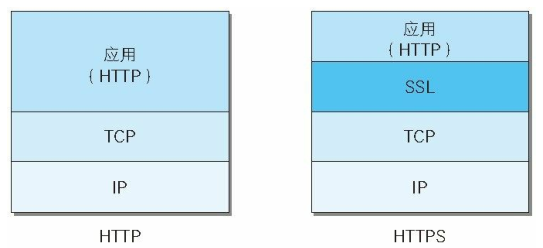
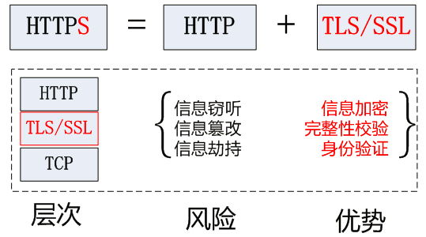
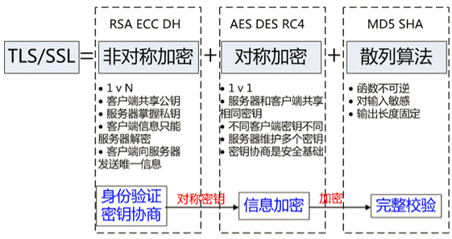
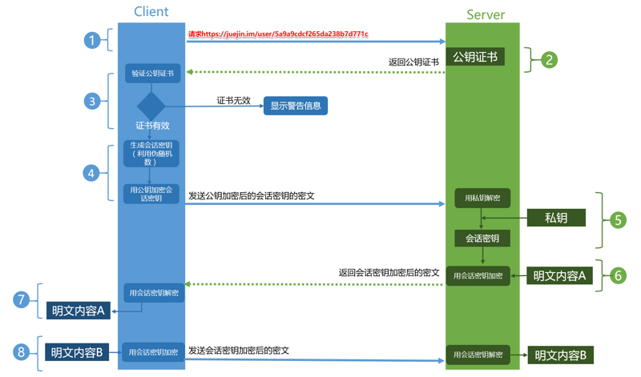
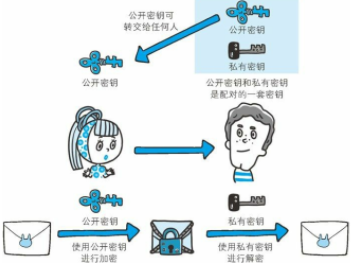
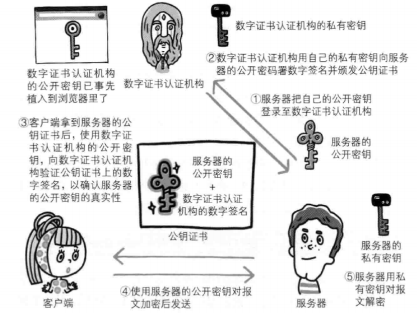
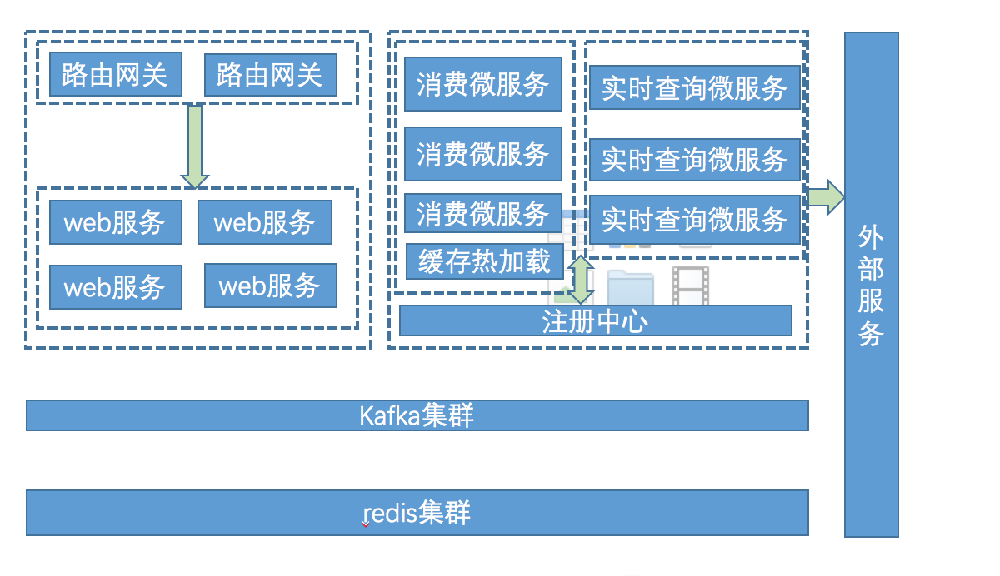
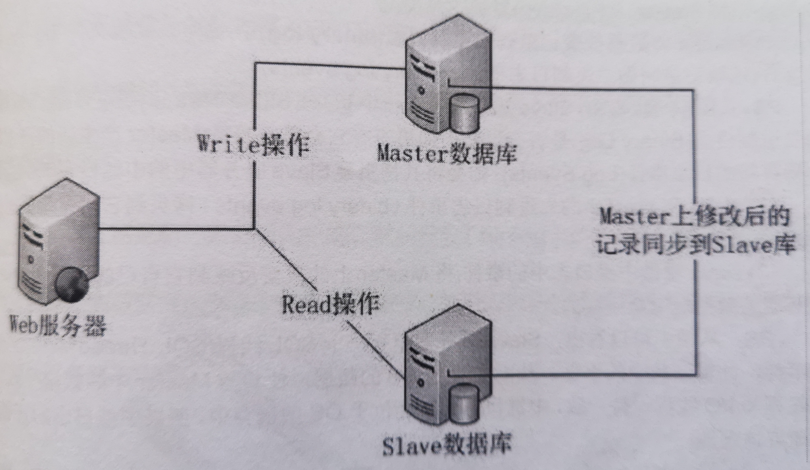

# 一．Java 基础

## 1.final 关键字的作用？ 

被 final 修饰的类不可以被继承，被 final 修饰的方法不可以被重写，被 final 修饰的变量 不可以被改变.如果修饰引用,那么表示引用不可变,引用指向的内容可变.被 final 修饰的 方法,JVM 会尝试将其内联,以提高运行效率，被 final 修饰的常量,在编译阶段会存入常量 池中. 

## 2.abstract class 和 interface 有什么区别? 

声明方法的存在而不去实现它的类被叫做抽象类（abstract class），它用于要创建一个体现某些基本行为的类，并为该类声明方法，但不能在该类中实现该类的情况。不能创建 abstract 类的实例。然而可以创建一个变量，其类型是一个抽象类，并让它指向具体子类 的一个实例。不能有抽象构造函数或抽象静态方法。Abstract 类的子类为它们父类中的所 有抽象方法提供实现，否则它们也是抽象类为。取而代之，在子类中实现该方法。知道其行为的其它类可以在类中实现这些方法。 

接口（interface）是抽象类的变体。在接口中，所有方法都是抽象的。

多继承性可通过实 现这样的接口而获得。接口中的所有方法都是抽象的，没有一个有程序体。接口只可以定义 static final 成员变量。接口的实现与子类相似，除了该实现类不能从接口定义中继承行为。

当类实现特殊接口时，它定义（即将程序体给予）所有这种接口的方法。然后，它可以 在实现了该接口的类的任何对象上调用接口的方法。由于有抽象类，它允许使用接口名作为引用变量的类型。通常的动态联编将生效。引用可以转换到接口类型或从接口类型转换， 

instanceof 运算符可以用来决定某对象的类是否实现了接口 

## 3.Java 集合类：list、set、queue、map、stack 的特点与用法？ 

Map 

Map 是键值对，键 Key 是唯一不能重复的，一个键对应一个值，值可以重复。 

TreeMap 可以保证顺序，HashMap 不保证顺序，即为无序的，Map 中可以将 Key 和 Value 单 

独抽取出来，其中 KeySet()方法可以将所有的 keys 抽取成一个 Set，而 Values()方法可以 

将 map 中所有的 values 抽取成一个集合。 

Set 

不包含重复元素的集合，set 中最多包含一个 null 元素，只能用 Iterator 实现单项遍历， 

Set 中没有同步方法。 

List 

有序的可重复集合，可以在任意位置增加删除元素，用 Iterator 实现单向遍历，也可用 

ListIterator 实现双向遍历。 

Queue 

Queue 遵从先进先出原则，使用时尽量避免 add()和 remove()方法,而是使用 offer()来添加 

元素，使用 poll()来移除元素，它的优点是可以通过返回值来判断是否成功，LinkedList 

实现了 Queue 接口，Queue 通常不允许插入 null 元素。 

Stack 

Stack 遵从后进先出原则，Stack 继承自 Vector，它通过五个操作对类 Vector 进行扩展，

允许将向量视为堆栈，它提供了通常的 push 和 pop 操作，以及取堆栈顶点的 peek()方法、 

测试堆栈是否为空的 empty 方法等。 

用法

如果涉及堆栈，队列等操作，建议使用 List。 

对于快速插入和删除元素的，建议使用 LinkedList。 

如果需要快速随机访问元素的，建议使用 ArrayList。 

## 4.说出 ArrayList,Vector, LinkedList 的存储性能和特性？ 

ArrayList 和 Vector 都是使用数组方式存储数据，此数组元素数大于实际存储的数据以便 

增加和插入元素，它们都允许直接按序号索引元素，但是插入元素要涉及数组元素移动等内 

存操作，所以索引数据快而插入数据慢，Vector 由于使用了 synchronized 方法（线程安全）， 

通常性能上较 ArrayList 差，而 LinkedList 使用双向链表实现存储，按序号索引数据需要 

进行前向或后向遍历，但是插入数据时只需要记录本项的前后项即可，所以插入速度较快。 

## 5.内存泄漏和内存溢出？ 

内存泄漏(memoryleak)，是指应用程序在申请内存后，无法释放已经申请的内存空间，一 

次内存泄漏危害可以忽略，但如果任其发展最终会导致内存溢出（outofmemory）。如读取 

文件后流要进行及时的关闭以及对数据库连接的释放。 

内存溢出(outofmemory)是指应用程序在申请内存时，没有足够的内存空间供其使用。如我 

们在项目中对于大批量数据的导入，采用分批量提交的方式。 

## 6.反射中，Class.forName()和 ClassLoader.loadClass()的区别？ 

Class.forName(className) 方 法 ， 内 部 实 际 调 用 的 方 法 是 

Class.forName(className,true,classloader); 

第 2 个 boolean 参数表示类是否需要初始化， Class.forName(className)默认是需要初始化, 

一旦初始化，就会触发目标对象的 static 块代码执行，static 参数也也会被再次初始 

化 ,ClassLoader.loadClass(className) 方 法 ， 内 部 实 际 调 用 的 方 法 是 

ClassLoader.loadClass(className,false);第 2 个 boolean 参数，表示目标对象是否进行链接， 

false 表示不进行链接，由上面介绍可以，不进行链接意味着不进行包括初始化等一些列步 

骤，那么静态块和静态对象就不会得到执行 

## 7.Int 和 Integer 的区别？ 

Integer 是 int 的包装类型,在拆箱和装箱中,二者自动转换.int 是基本类型,直接存数值; 

而 integer 是对象;用一个引用指向这个对象.由于 Integer 是一个对象,在 JVM 中对象需要 

一定的数据结构进行描述,相比 int 而言,其占用的内存更大一些. 

## 8.String、StringBuilder、StringBuffer 区别？ 

String 

字符串常量 

不可变 

使用字符串拼接时是不同的 2 个空间 

StringBuffer 字符串变量 可变 线程安全 字符串拼接直接在字符串后追加 

StringBuilder 字符串变量 可变 非线程安全 字符串拼接直接在字符串后追加

1.StringBuilder 执行效率高于 StringBuffer 高于 String. 

2.String 是一个常量，是不可变的，所以对于每一次+=赋值都会创建一个新的对象， 

StringBuffer 和 StringBuilder 都是可变的，当进行字符串拼接时采用 append 方 

法，在原来的基础上进行追加，所以性能比 String 要高，又因为 StringBuffer 是 

线程安全的而 StringBuilder 是线程非安全的，所以 StringBuilder 的效率高于 

StringBuffer. 

3.对于大数据量的字符串的拼接，采用 StringBuffer,StringBuilder. 

## 9.Hashtable 和 Hashmap 的区别？ 

1、HashTable 线程安全，HashMap 非线程安全 

2、Hashtable 不允许 null 值(key 和 value 都不可以)，HashMap 允许 null 值(key 和 

value 都可以)。 

3、两者的遍历方式大同小异，Hashtable 仅仅比 HashMap 多一个 elements 方法。 

## 10.说几个常见的编译时异常？ 

SQLException 提供有关数据库访问错误或其他错误的信息的异常。 

IOexception 表示发生了某种 I / O 异常的信号。此类是由失败或中断的 I / O 操作产生的 

一般异常类 

FileNotFoundException 当试图打开指定路径名表示的文件失败时，抛出此异常。 

ClassNotFoundException 找不到具有指定名称的类的定义。 

EOFException 当输入过程中意外到达文件或流的末尾时，抛出此异常。 

## 11.方法重载的规则？ 

方法名一致，参数列表中参数的顺序，类型，个数不同。 

重载与方法的返回值无关，存在于父类和子类，同类中。 

可以抛出不同的异常，可以有不同修饰符。 

## 12.方法重写的规则？ 

参数列表、方法名、返回值类型必须完全一致，构造方法不能被重写；声明为 final 的方法 

不能被重写；声明为 static 的方法不存在重写(重写和多态联合才有意义);访问权限不能比 

父类更低;重写之后的方法不能抛出更宽泛的异常 

## 13.throw 和 throws 的区别? 

throw： 

throw 语句用在方法体内，表示抛出异常，由方法体内的语句处理。throw 是具体向外抛出 

异常的动作，所以它抛出的是一个异常实例，执行 throw 一定是抛出了某种异常。 

throws： 

throws 语句是用在方法声明后面，表示如果抛出异常，由该方法的调用者来进行异常的处 

理。throws 主要是声明这个方法会抛出某种类型的异常，让它的使用者要知道需要捕获的

异常的类型。throws 表示出现异常的一种可能性，并不一定会发生这种异常。 

## 14.抽象类和接口的区别? 

1、接口中所有的方法隐含的都是抽象的。而抽象类则可以同时包含抽象和非抽象的方法。 

2、类可以实现很多个接口，但是只能继承一个抽象类 

3、类如果要实现一个接口，它必须要实现接口声明的所有方法。但是，类可以不实现 

抽象类声明的所有方法，当然，在这种情况下，类也必须得声明成是抽象的。 

4、抽象类可以在不提供接口方法实现的情况下实现接口。 

5、Java 接口中声明的变量默认都是 final 的。抽象类可以包含非 final 的变量。 

6、Java 接口中的成员函数默认是 public 的。抽象类的成员函数可以是 private，protecte 

或者是 public 。 

7、接口是绝对抽象的，不可以被实例化(java 8 已支持在接口中实现默认的方法)。抽象类 

也不可以被实例化，但是，如果它包含 main 方法的话是可以被调用的。 

## 15.Java 的基础类型和字节大小? 

布尔型 boolean 

8 位；字节型 byte 

8 位； 字符型 char 16 位； 

短整型 short 

16 位；整形 int 

32 位； 长整形 

long 

64 位； 

浮点型 

float 

32 位；双精度 double 64 位； 

## 16.四个访问修饰符合访问级别？ 

Protected、 public、没有访问修饰符、private 

## 17.String 和 StringBuffer 的区别? 

String 和 StringBuffer 主要区别是性能:String 是不可变对象,每次对 String 类型进行操 

作都等同于产生了一个新的 String 对象,然后指向新的 String 对象.所以尽量不要对 

String 进行大量的拼接操作,否则会产生很多临时对象,导致 GC 开始工作,影响系统性能. 

StringBuffer 是对象本身操作,而不是产生新的对象,因此在有大量拼接的情况下,我们建 

议使用 StringBuffer(线程安全). 

## 18.HashSet 的底层实现是什么？ 

HashSet 的实现是依赖于 HashMap 的，HashSet 的值都是存储在 HashMap 中的。 

在 HashSet 的构造法中会初始化一个 HashMap 对象，HashSet 不允许值重复。 

因此，HashSet 的值是作为 HashMap 的 key 存储在 HashMap 中的，当存储的值已经存在时返 

回 false。 

## 19.抽象类的意义？ 

抽象类的意义可以用三句话来概括: 

1、为其他子类提供一个公共的类型 

2、封装子类中重复定义的内容

3、定义抽象方法,子类虽然有不同的实现,但是定义时一致的 

## 20.你为什么重写 equals 时必须重写 hashCode 方法？ 

hashCode() 的作用是获取哈希码，也称为散列码；它实际上是返回一个 int 整数。这个哈 

希码的作用是确定该对象在哈希表中的索引位置。如果两个对象相等，则 hashcode 一定也 

是相同的如果两个对象相等,对两个对象分别调用 equals 方法都返回 true 如果两个对象有 

相同的 hashcode 值，它们也不一定是相等的因此，equals 方法被覆盖过，则 hashCode 方 

法也必须被覆盖。 

hashCode()的默认行为是对堆上的对象产生独特值。如果没有重写 hashCode()，则该 class 

的两个对象无论如何都不会相等(即使这两个对象指向相同的数据). 

HashSet 和 TreeSet 有什么区别？ 

HashSet 是由一个 hash 表来实现的，因此，它的元素是无序的。add()，remove()，contains() 

方法的时间复杂度是 O(1)。

TreeSet 是由一个树形的结构来实现的，它里面的元素是有序的。 

因此，add()，remove()，contains()方法的时间复杂度是 O(logn)。 

## 22.强引用和软引用和弱引用以及虚引用？ 

1、强引用 

最普遍的一种引用方式，如 String s = "abc"，变量 s 就是字符串“abc”的强引用，只要 

强引用存在，则垃圾回收器就不会回收这个对象。 

2、软引用(SoftReference) 

用于描述还有用但非必须的对象，如果内存足够，不回收，如果内存不足，则回收。一般用 

于实现内存敏感的高速缓存，软引用可以和引用队列 ReferenceQueue 联合使用，如果软引 

用的对象被垃圾回收，JVM 就会把这个软引用加入到与之关联的引用队列中。 

3、弱引用(WeakReference) 

弱引用和软引用大致相同，弱引用与软引用的区别在于：只具有弱引用的对象拥有更短暂的 

生命周期。在垃圾回收器线程扫描它所管辖的内存区域的过程中，一旦发现了只具有弱引用 

的对象，不管当前内存空间足够与否，都会回收它的内存。 

4、虚引用(PhantomReference) 

就是形同虚设，与其他几种引用都不同，虚引用并不会决定对象的生命周期。如果一个对象 

仅持有虚引用，那么它就和没有任何引用一样，在任何时候都可能被垃圾回收器回收。 虚 

引用主要用来跟踪对象被垃圾回收器回收的活动。 

虚引用与软引用和弱引用的一个区别在于： 

虚引用必须和引用队列 （ReferenceQueue）联合使用。当垃圾回收器准备回收一个对象时， 

如果发现它还有虚引，就会在回收对象的内存之前，把这个虚引用加入到与之关联的引用队 

列中。 

## 23.数组在内存中如何分配? 

当一个对象使用 new 关键字创建的时候，会在堆上分配内存空间，然后才返回到对象的引用。 

这对数组来说也是一样的，因为数组也是一个对象，简单的值类型的数组，每个数组成员是 

一个引用(指针)引用到栈上的空间。

## 24.Java 中怎么创建一个不可变对象？ 

1. 对象的状态在构造函数之后都不能被修改,任何修改应该通过创建一个新对象来实现. 

2. 所有的对象属性应该都设置为 final 

3. 对象创建要正确,例如:对象的应用不能在构造函数中被泄露出去 

4. 对象要设置为 final,确保不要继承的 Class 修改了 immutability 特性 

## 25.Java 中 ++ 操作符是线程安全的吗？ 

不是线程安全的操作。它涉及到多个指令，如读取变量值，增加，然后存储回内存，这个过 

程可能会出现多个线程交差。 

## 26.new 一个对象的过程和 clone 一个对象的过程？ 

new 操作符的本意是分配内存。程序执行到 new 操作符时，首先去看 new 操作符后面的类 

型，因为知道了类型，才能知道要分配多大的内存空间。分配完内存之后，再调用构造函数， 

填充对象的各个域，这一步叫做对象的初始化，构造方法返回后，一个对象创建完毕，可以 

把他的引用（地址）发布到外部，在外部就可以使用这个引用操纵这个对象。 

clone 在第一步是和 new 相似的，都是分配内存，调用 clone 方法时，分配的内存和原对 

象（即调用 clone 方法的对象）相同，然后再使用原对象中对应的各个域，填充新对象的 

域，填充完成之后，clone 方法返回，一个新的相同的对象被创建，同样可以把这个新对象 

的引用发布到外部。 

## 27.Java 中==和 equals()的区别？ 

使用==比较原生类型如：boolean、int、char 等等，使用 equals()比较对象。 

1、==是判断两个变量或实例是不是指向同一个内存空间。equals 是判断两个变量或实例所 

指向的内存空间的值是不是相同。 

2、==是指对内存地址进行比较。equals()是对字符串的内容进行比较。 

3、==指引用是否相同,equals()指的是值是否相同。 

## 28.final、finalize 和 finally 的不同之处？ 

final 用于声明属性，方法和类，分别表示属性不可变，方法不可覆盖，类不可继承。 

finally 是异常处理语句结构的一部分，表示总是执行。 

finalize 是 Object 类的一个方法，在垃圾收集器执行的时候会调用被回收对象的此方法， 

可以覆盖此方法提供垃圾收集时的其他资源回收，例如关闭文件等。 

## 29.Java 的多态表现在哪里? 

多态要有动态绑定，否则就不是多态，方法重载也不是多态（因为方法重载是编译期决定好 

的，没有后期也就是运行期的动态绑定）当满足这三个条件:1、有继承 2、有重写 3、要有 

父类引用指向子类对象 

## 30.静态类型有什么特点？

1、静态的属性：随着类的加载而加载，该属性不在属于某个对象，属于整个类 

2、静态的方法：直接用类名调用，静态方法里不能访问非静态成员变量 

3、静态类：不能直接创建对象，不可被继承 

## 31.Java 创建对象的几种方式？ 

new 创建新对象;通过反射机制;采用 clone 机制;通过序列化机制 

## 32.Object 中有哪些公共方法? 

Object 是所有类的父类，任何类都默认继承 Object clone 保护方法，实现对象的浅复制， 

只有实现了 Cloneable 接口才可以调用该方法，否则抛出 CloneNotSupportedException 异 

常。equals 在 Object 中与==是一样的，子类一般需要重写该方法。hashCode 该方法用于哈 

希查找，重写了 equals 方法一般都要重写 hashCode 方法。这个方法在一些具有哈希功能的 

Collection 中用到。getClass final 方法，获得运行时类型 wait 使当前线程等待该对象的 

锁，当前线程必须是该对象的拥有者，也就是具有该对象的锁。wait()方法一直等待，直到 

获得锁或者被中断。wait(long timeout)设定一个超时间隔，如果在规定时间内没有获得锁 

就返回。 

## 33.&和&&的区别？ 

&是位运算符，表示按位与运算，&&是逻辑运算符，表示逻辑与（and）。 

## 34.在.java 源文件中可以有多个类吗（内部类除外）？ 

一个.java 源文件中可以包括多个类（不是内部类），但是单个文件中只能有一个 public 

类，并且该 public 类必须与文件名相同 

## 35.如何正确的退出多层嵌套循环？ 

1、使用标号和 break; 

2、通过在外层循环中添加标识符 

36.内部类有什么作用？ 

1、内部类可以很好的实现隐藏，一般的非内部类，是不允许有 

private 

与 protected 

权限的，但内部类可以 

2、内部类拥有外围类的所有元素的访问权限 

3、可是实现多重继承 

4、可以避免修改接口而实现同一个类中两种同名方法的调用 

## 37.深拷贝和浅拷贝的区别是什么？ 

浅拷贝:被复制对象的所有变量都含有与原来的对象相同的值,而所有的对其他对象的引用 

仍然指向原来的对象.换言之,浅拷贝仅仅复制所考虑的对象,而不复制它所引用的对象.

深拷贝:被复制对象的所有变量都含有与原来的对象相同的值.而那些引用其他对象的变量 

将指向被复制过的新对象.而不再是原有的那些被引用的对象.换言之.深拷贝把要复制的对 

象所引用的对象都复制了一遍. 

## 38.String 是基本数据类型吗？ 

基本数据类型包括 byte、int、char、long、float、double、boolean 和 short。 

java.lang.String 类是 final 类型的，因此不可以继承这个类、不能修改这个类。为了提 

高效率节省空间，我们应该用 StringBuffer 类 

## 39.static 的用法？ 

Static 可以修饰内部类、方法、变量、代码块;Static 修饰的类是静态内部类;Static 修饰 

的方法是静态方法，表示该方法属于当前类的，而不属于某个对象的，静态方法也不能被重 

写，可以直接使用类名来调用。在 static 方法中不能使用 this 或者 super 关键字。 

Static 修饰变量是静态变量或者叫类变量，静态变量被所有实例所共享，不会依赖于对象。 

静态变量在内存中只有一份拷贝，在 JVM 加载类的时候，只为静态分配一次内存。 

Static 修饰的代码块叫静态代码块，通常用来做程序优化的。静态代码块中的代码在整个 

类加载的时候只会执行一次。静态代码块可以有多个，如果有多个，按照先后顺序依次执行。 

## 40.什么是值传递和引用传递？ 

对象被值传递，意味着传递了对象的一个副本。因此，就算是改变了对象副本，也不会影响 

源对象的值,对象被引用传递，意味着传递的并不是实际的对象，而是对象的引用。因此， 

外部对引用对象所做的改变会反映到所有的对象上。 

## 41.重载和重写的区别？ 

方法的重写 Overriding 和重载 Overloading 是 Java 多态性的不同表现。重写 Overriding 

是父类与子类之间多态性的一种表现，重载 Overloading 是一个类中多态性的一种表现。如 

果在子类中定义某方法与其父类有相同的名称和参数，我们说该方法被重写 (Overriding)。 

子类的对象使用这个方法时，将调用子类中的定义，对它而言，父类中的定义如同被“屏蔽” 

了。如果在一个类中定义了多个同名的方法，它们或有不同的参数个数或有不同的参数类型， 

则称为方法的重载(Overloading)。 

## 43.成员变量和局部变量的区别有哪些？ 

1、从语法形式上，看成员变量是属于类的，而局部变量是在方法中定义的变量或是方法的 

参数；成员变量可以被 public,private,static 等修饰符所修饰，而局部变量不能被访问控 

制修饰符及 static 所修饰；成员变量和局部变量都能被 final 所修饰； 

2、从变量在内存中的存储方式来看，成员变量是对象的一部分，而对象存在于堆内存，局 

部变量存在于栈内存 

3、从变量在内存中的生存时间上看，成员变量是对象的一部分，它随着对象的创建而存在， 

而局部变量随着方法的调用而自动消失。

4、成员变量如果没有被赋初值，则会自动以类型的默认值而赋值（一种情况例外被 final 

修饰但没有被 static 修饰的成员变量必须显示地赋值）；而局部变量则不会自动赋值。 

## 44.静态方法和实例方法有何不同？ 

静态方法和实例方法的区别主要体现在两个方面： 

在外部调用静态方法时，可以使用"类名.方法名"的方式，也可以使用"对象名.方法名"的方 

式。而实例方法只有后面这种方式。也就是说，调用静态方法可以无需创建对象。 

静态方法在访问本类的成员时，只允许访问静态成员（即静态成员变量和静态方法），而不 

允许访问实例成员变量和实例方法；实例方法则无此限制 

## 45.什么是多态？ 

允许不同类的对象对同一消息做出响应。即同一消息可以根据发送对象的不同而采用多种不 

同的行为方式。（发送消息就是函数调用） 

## 46.多态的优点？ 

可替换性（substitutability）。多态对已存在代码具有可替换性。例如，多态对圆 Circle 

类工作，对其他任何圆形几何体，如圆环，也同样工作。 

可扩充性（extensibility）。多态对代码具有可扩充性。增加新的子类不影响已存在类的 

多态性、继承性，以及其他特性的运行和操作。实际上新加子类更容易获得多态功能。 

## 47.多态存在的三个必要条件？ 

要有继承。 

要有方法的重写。 

父类引用指向子类对象（对于父类中定义的方法，如果子类中重写了该方法，那么父类类型 

的引用将会调用子类中的这个方法，这就是动态连接） 

## 48.TreeMap、HashMap、LindedHashMap 的区别？ 

LinkedHashMap 可以保证 HashMap 集合有序。存入的顺序和取出的顺序一致。TreeMap 实现 

SortMap 接口，能够把它保存的记录根据键排序,默认是按键值的升序排序，也可以指定排 

序的比较器，当用 Iterator 遍历 TreeMap 时，得到的记录是排过序的。HashMap 不保证顺 

序，即为无序的，具有很快的访问速度。HashMap 最多只允许一条记录的键为 Null;允许多 

条记录的值为 Null;HashMap 不支持线程的同步。 

## 49.Java（OOP）面向对象的特征有哪些方面？ 

1)抽象：抽象是将一类对象的共同特征总结出来构造类的过程，包括数据抽象和行为抽象两 

方面。抽象只关注对象有哪些属性和行为，并不关注这些行为的细节是什么。 

2)继承：继承是从已有类得到继承信息创建新类的过程。提供继承信息的类被称为父类（超 

类、基类）；得到继承信息的类被称为子类（派生类）。继承让变化中的软件系统有了一定 

的延续性，同时继承也是封装程序中可变因素的重要手段 

3)封装：通常认为封装是把数据和操作数据的方法绑定起来，对数据的访问只能通过已定义 

的接口。面向对象的本质就是将现实世界描绘成一系列完全自治、封闭的对象。我们在类中 

编写的方法就是对实现细节的一种封装；我们编写一个类就是对数据和数据操作的封装。可 

以说，封装就是隐藏一切可隐藏的东西，只向外界提供最简单的编程接口。 

4)多态性：多态性是指允许不同子类型的对象对同一消息作出不同的响应。简单的说就是用 

同样的对象引用调用同样的方法但是做了不同的事情。多态性分为编译时的多态性和运行时 

的多态性。如果将对象的方法视为对象向外界提供的服务，那么运行时的多态性可以解释为： 

当 A 系统访问 B 系统提供的服务时，B 系统有多种提供服务的方式，但一切对 A 系统来说都 

是透明的。方法重载（overload）实现的是编译时的多态性（也称为前绑定），而方法重写 

（override）实现的是运行时的多态性（也称为后绑定）。运行时的多态是面向对象最精髓 

的东西，要实现多态需要做两件事：1. 方法重写（子类继承父类并重写父类中已有的或抽 

象的方法）；2. 对象造型（用父类型引用引用子类型对象，这样同样的引用调用同样的方 

法就会根据子类对象的不同而表现出不同的行为）。 

## 50.列出一些常见的运行时异常？ 

ArithmeticException（算术异常） 

ClassCastException （类转换异常） 

IllegalArgumentException （非法参数异常） 

IndexOutOfBoundsException （下标越界异常） 

NullPointerException （空指针异常） 

SecurityException （安全异常） 

## 51.什么是反射？ 

反射就是动态加载对象，并对对象进行剖析。在运行状态中，对于任意一个类，都能够 

知道这个类的所有属性和方法；对于任意一个对象，都能够调用它的任意一个方法，这种动 

态获取信息以及动态调用对象方法的功能成为 Java 反射机制。 

## 52.反射的作用？ 

1)在运行时判断任意一个对象所属的类 

2)在运行时构造任意一个类的对象 

3)在运行时判断任意一个类所具有的成员变量和方法 

4)在运行时调用任意一个对象的方法 

## 53.获取 class 的三种方式？ 

对象调用 getClass() 方法来获取；类名.class 的方式得到；通过 Class 对象的 forName() 

静态方法来获取 

## 54.break 和 continue 的区别？ 

break 和 continue 都是用来控制循环的语句。break 用于完全结束一个循环，跳出循环体 

执行循环后面的语句。continue 用于跳过本次循环，继续下次循环。

## 55.运行时异常与一般异常有何异同？ 

异常表示程序运行过程中可能出现的非正常状态，运行时异常表示虚拟机的通常操作中可能 

遇到的异常，是一种常见运行错误。java 编译器要求方法必须声明抛出可能发生的非运行 

时异常，但是并不要求必须声明抛出未被捕获的运行时异常。 

## 56.List、Map、Set 三个接口存取元素时，各有什么特点？ 

List 以特定索引来存取元素，可以有重复元素。Set 不能存放重复元素（用对象的 equals() 

方法来区分元素是否重复）。Map 保存键值对（key-value pair）映射，映射关系可以是一 

对一或多对一 

## 57.Collection 和 Collections 的区别？ 

Collection 是集合类的上级接口，继承与他的接口主要有 Set 和 List. 

Collections 是针对集合类的一个帮助类，他提供一系列静态方法实现对各种集合的搜索、 

排序、线程安全化等操作。 

## 58.Error 和 Exception 有什么区别？ 

error 表示恢复不是不可能但很困难的情况下的一种严重问题。比如说内存溢出。不可能指 

望程序能处理这样的情况。exception 表示一种设计或实现问题。也就是说，它表示如果程 

序运行正常，从不会发生的情况。 

## 59.EJB 的生命周期，以及如何管理事务？ 

SessionBean：Stateless Session Bean 的生命周期是由容器决定的，当客户机发出请求要 

建立一个 Bean 的实例时，EJB 容器不一定要创建一个新的 Bean 的实例供客户机调用，而是 

随便找一个现有的实例提供给客户机。当客户机第一次调用一个 Stateful Session Bean 

时，容器必须立即在服务器中创建一个新的 Bean 实例，并关联到客户机上，以后此客户机 

调用 Stateful Session Bean 的方法时容器会把调用分派到与此客户机相关联的 Bean 实例。 

EntityBean：Entity Beans 能存活相对较长的时间，并且状态是持续的。只要数据库中的 

数据存在，Entity beans 就一直存活。而不是按照应用程序或者服务进程来说的。即使 EJB 

容器崩溃了，Entity beans 也是存活的。Entity Beans 生命周期能够被容器或者 Beans 自 

己管理。EJB 通过以下技术管理实务：对象管理组织（OMG）的对象实务服务（OTS），Sun 

Microsystems 的 Transaction Service（JTS）、Java Transaction API（JTA），开发组（X/Open） 

的 XA 接口。 

## 60.Comparable 和 Comparator 接口的区别？ 

Comparable 接口只包含一个 compareTo()方法。这个方法可以个给两个对象排序。具体来说， 

它返回负数，0，正数来表明输入对象小于，等于，大于已经存在的对象。Comparator 接口 

包含 compare()和 equals()两个方法。 

## 61.switch 能否作用在 byte、long、string 上？

switch 可作用在 char、byte、short、int 

switch 可作用于 char、byte、short、int 的包装类上 

switch 不可作用于 long、double、float、boolean，包括他们的包装类 

switch 中可以是字符串类型，String（Java1.7 以后才可以作用在 String 上） 

switch 可以是枚举类型（JDK1.5 之后） 

## 62.jdk 中哪些类是不能继承的？ 

不能继承的是类是那些用 final 关键字修饰的类。一般比较基本的类型或防止扩展类 

无意间破坏原来方法的实现的类型都应该是 final 的，在 jdk 中 

System,String,StringBuffer 等都是基本类型。 

## 63.Set 里的元素是不能重复的，那么用什么方法来区分重复与否呢? 

Set 里的元素是不能重复的，元素重复与否是使用 equals()方法进行判断的。 

equals()和==方法决定引用值是否指向同一对象 equals()在类中被覆盖，为的是当两个分离的 

对象的内容和类型相配的话，返回真值。 

## 64.JDK 和 JRE 的区别是什么？ 

Java 运行时环境(JRE)是将要执行 Java 程序的 Java 虚拟机。它同时也包含了执行 applet 

需要的浏览器插件。Java 开发工具包(JDK)是完整的 Java 软件开发包，包含了 JRE，编译器 

和其他的工具(比如：JavaDoc，Java 调试器)，可以让开发者开发、编译、执行 Java 应用 

程序。 

## 65.是否可以在 static 环境中访问非 static 变量？ 

static 变量在 Java 中是属于类的，它在所有的实例中的值是一样的。当类被 Java 虚拟机 

载入的时候，会对 static 变量进行初始化。如果你的代码尝试不用实例来访问非 static 

的变量，编译器会报错，因为这些变量还没有被创建出来，还没有跟任何实例关联上。 

## 66.Java 支持多继承么？ 

不支持，Java 不支持多继承。每个类都只能继承一个类，但是可以实现多个接口。 

## 67.什么是迭代器(Iterator)？ 

Iterator 接口提供了很多对集合元素进行迭代的方法。每一个集合类都包含了可以返回迭 

代器实例的 

迭代方法。迭代器可以在迭代的过程中删除底层集合的元素。 

克隆(cloning)或者是序列化(serialization)的语义和含义是跟具体的实现相关的。因此， 

应该由集合类的具体实现来决定如何被克隆或者是序列化。 

## 68.Iterator 和 ListIterator 的区别是什么？

下面列出了他们的区别： 

Iterator 可用来遍历 Set 和 List 集合，但是 ListIterator 只能用来遍历 List。 

Iterator 对集合只能是前向遍历，ListIterator 既可以前向也可以后向。 

ListIterator 实现了 Iterator 接口，并包含其他的功能，比如：增加元素，替换元素，获 

取前一个和后一个元素的索引，等等。 

## 69.Enumeration 接口和 Iterator 接口的区别有哪些？ 

Enumeration 速度是 Iterator 的 2 倍，同时占用更少的内存。但是，Iterator 远远比 

Enumeration 安全，因为其他线程不能够修改正在被 iterator 遍历的集合里面的对象。同 

时，Iterator 允许调用者删除底层集合里面的元素，这对 Enumeration 来说是不可能的。 

## 70.List, Set, Map 是否继承自 Collection 接口? 

只有 List 和 Set 接口继承于 Collection 接口，Map 是与 Collection 并列的接口概念 

## 71.字符串常量池到底存在于内存空间的哪里？ 

jdk 6.0 字符串常量池在方法区，方法区的具体体现可以看做是堆中的永久区。 

jdk 7.0 java 虚拟机规范中不再声明方法区，字符串常量池存放在堆空间中 

jdk 8.0 java 虚拟机规范中又声明了元空间，字符串常量池存放在元空间中 

## 72.Java 中的编译期常量是什么？使用它又什么风险？ 

公共静态不可变（public static final ）变量也就是我们所说的编译期常量，这里的 public 可 

选的。实际上这些变量在编译时会被替换掉，因为编译器知道这些变量的值，并且知道这些 

变量在运行时不能改变。这种方式存在的一个问题是你使用了一个内部的或第三方库中的公 

有编译时常量，但是这个值后面被其他人改变了，但是你的客户端仍然在使用老的值，甚至 

你已经部署了一个新的 jar。为了避免这种情况， 当你在更新依赖 JAR 文件时，确保重新 

编译你的程序。 

## 73.用哪两种方式来实现集合的排序？ 

你可以使用有序集合，如 TreeSet 或 TreeMap，你也可以使用有顺序的的集合，如 list，然 

后通过 Collections.sort() 来排序。 

## 74.说出 JDK 1.7 中的三个新特性？ 

虽然 JDK 1.7 不像 JDK 5 和 8 一样的大版本，但是，还是有很多新的特性，如 

try-with-resource 语句，这样你在使用流或者资源的时候，就不需要手动关闭，Java 会自动 

关闭。Fork-Join 池某种程度上实现 Java 版的 Map-reduce。允许 Switch 中有 String 变量 

和文本。菱形操作符(<>)用于类型推断，不再需要在变量声明的右边申明泛型，因此可以写 

出可读写更强、更简洁的代码。另一个值得一提的特性是改善异常处理，如允许在同一个 

catch 块中捕获多个异常。

## 75.说出 5 个 JDK 1.8 引入的新特性？ 

Java 8 在 Java 历史上是一个开创新的版本，下面 JDK 8 中 5 个主要的特性： Lambda 表 

达式，允许像对象一样传递匿名函数 Stream API，充分利用现代多核 CPU，可以写出很简 

洁的代码 Date 与 Time API，最终，有一个稳定、简单的日期和时间库可供你使用 扩展方 

法，现在，接口中可以有静态、默认方法。 重复注解，现在你可以将相同的注解在同一类 

型上使用多次。 

## 76.ArrayList 源码分析？ 

（1）ArrayList 是一种变长的集合类，基于定长数组实现，使用默认构造方法初始化出来的 

容量是 10（1.7 之后都是延迟初始化，即第一次调用 add 方法添加元素的时候才将 

elementData 容量初始化为 10）。 

（2）ArrayList 允许空值和重复元素，当往 ArrayList 中添加的元素数量大于其底层数组容 

量时，其会通过扩容机制重新生成一个更大的数组。ArrayList 扩容的长度是原长度的 1.5 倍 

（3）由于 ArrayList 底层基于数组实现，所以其可以保证在 O(1) 复杂度下完成随机查找操 

作。

（4）ArrayList 是非线程安全类，并发环境下，多个线程同时操作 ArrayList，会引发不可预 

知的异常或错误。 

（5）顺序添加很方便 

（6）删除和插入需要复制数组，性能差（可以使用 LinkindList） 

（7）Integer.MAX_VALUE - 8 ：主要是考虑到不同的 JVM,有的 JVM 会在加入一些数据头,当 

扩容后的容量大于 MAX_ARRAY_SIZE,我们会去比较最小需要容量和 MAX_ARRAY_SIZE 做比较, 

如果比它大, 只能取 Integer.MAX_VALUE,否则是 Integer.MAX_VALUE -8。 这个是从 jdk1.7 开 

始才有的 

## 77.HashMap 源码分析？ 

jdk1.8 之前 list + 链表 

jdk1.8 之后 list + 链表（当链表长度到 8 时，转化为红黑树） 

HashMap 的扩容因子 

默认 0.75，也就是会浪费 1/4 的空间，达到扩容因子时，会将 list 扩容一倍，0.75 是时间与 

空间一个平衡值； 

## 78.ConcurrentHashMap 源码分析？ 

ConcurrentHashMap 所使用的锁分段技术，首先将数据分成一段一段的存储，然后给每一段 

数据配一把锁，当一个线程占用锁访问其中一个段数据的时候，其他段的数据也能被其他线 

程访问。有些方法需要跨段，比如 size()和 containsValue()，它们可能需要锁定整个表而而不 

仅仅是某个段，这需要按顺序锁定所有段，操作完毕后，又按顺序释放所有段的锁。这里“按 

顺序”是很重要的，否则极有可能出现死锁，在 ConcurrentHashMap 内部，段数组是 final 的， 

并且其成员变量实际上也是 final 的，但是，仅仅是将数组声明为 final 的并不保证数组成员 

也是 final 的，这需要实现上的保证。这可以确保不会出现死锁，因为获得锁的顺序是固定 

的。 

ConcurrentHashMap 是由 Segment 数组结构和 HashEntry 数组结构组成。Segment 是一种可 

重入锁 ReentrantLock，在 ConcurrentHashMap 里扮演锁的角色，HashEntry 则用于存储键值 

对数据。一个 ConcurrentHashMap 里包含一个 Segment 数组，Segment 的结构和 HashMap 

类似，是一种数组和链表结构， 一个 Segment 里包含一个 HashEntry 数组，每个 HashEntry 

是一个链表结构的元素，每个 Segment 守护者一个 HashEntry 数组里的元素,当对 HashEntry 

数组的数据进行修改时，必须首先获得它对应的 Segment 锁。 

 

## 79.List和Set比较，各自的子类比较

对比一：Arraylist与LinkedList的比较

 

1、ArrayList是实现了基于动态数组的数据结构,因为地址连续，一旦数据存储好了，查询操作效率会比较高（在内存里是连着放的）。

2、因为地址连续， ArrayList要移动数据,所以插入和删除操作效率比较低。

3、LinkedList基于链表的数据结构,地址是任意的，所以在开辟内存空间的时候不需要等一个连续的地址，对于新增和删除操作add和remove，LinedList比较占优势。

4、因为LinkedList要移动指针,所以查询操作性能比较低。

适用场景分析：

当需要对数据进行对此访问的情况下选用ArrayList，当需要对数据进行多次增加删除修改时采用LinkedList。

对比二：ArrayList与Vector的比较

1、Vector的方法都是同步的，是线程安全的，而ArrayList的方法不是，由于线程的同步必然要影响性能。因此，ArrayList的性能比Vector好。

2、当Vector或ArrayList中的元素超过它的初始大小时，Vector会将它的容量翻倍，而ArrayList只增加50%的大小，这样。ArrayList就有利于节约内存空间。

3、大多数情况不使用Vector，因为性能不好，但是它支持线程的同步，即某一时刻只有一个线程能够写Vector，避免多线程同时写而引起的不一致性。

4、Vector可以设置增长因子，而ArrayList不可以。

适用场景分析：

1、Vector是线程同步的，所以它也是线程安全的，而ArrayList是线程异步的，是不安全的。如果不考虑到线程的安全因素，一般用ArrayList效率比较高。

2、如果集合中的元素的数目大于目前集合数组的长度时，在集合中使用数据量比较大的数据，用Vector有一定的优势。

对比三：HashSet与TreeSet的比较

1.TreeSet 是二叉树实现的，Treeset中的数据是自动排好序的，不允许放入null值 。

2.HashSet 是哈希表实现的，HashSet中的数据是无序的，可以放入null，但只能放入一个null，两者中的值都不能重复，就如数据库中唯一约束 。

3.HashSet要求放入的对象必须实现HashCode()方法，放入的对象，是以hashcode码作为标识的，而具有相同内容的String对象，hashcode是一样，所以放入的内容不能重复。但是同一个类的对象可以放入不同的实例。

适用场景分析：

HashSet是基于Hash算法实现的，其性能通常都优于TreeSet。我们通常都应该使用HashSet，在我们需要排序的功能时，我们才使用TreeSet。

HashMap和ConcurrentHashMap的区别

1、HashMap 不是线程安全的，而 ConcurrentHashMap 是线程安全的。

2、ConcurrentHashMap 采用锁分段技术，将整个 Hash 桶进行了分段 segment，也就是将这个大的数组分成了几个小的片段 segment，而且每个小的片段 segment 上面都有锁存在，那么在插入元素的时候就需要先找到应该插入到哪一个片段 segment，然后再在这个片段上面进行插入，而且这里还需要获取 segment 锁。

3、ConcurrentHashMap 让锁的粒度更精细一些，并发性能更好。

HashTable 和 ConcurrentHashMap 的区别

它们都可以用于多线程的环境，但是当 Hashtable 的大小增加到一定的时候，性能会急剧下降，因为迭代时需要被锁定很长的时间。因为 ConcurrentHashMap 引入了分割（segmentation），不论它变得多么大，仅仅需要锁定 map 的某个部分，而其它的线程不需要等到迭代完成才能访问map。简而言之，在迭代的过程中，ConcurrentHashMap仅仅锁定map的某个部分，而Hashtable则会锁定整个map。

## 80.String,StringBuffer和StringBuilder的区别

1、运行速度，或者说是执行速度，在这方面运行速度快慢为：StringBuilder > StringBuffer > String。

2、线程安全上，StringBuilder是线程不安全的，而StringBuffer是线程安全的。

适用场景分析：

String：适用于少量的字符串操作的情况

StringBuilder：适用于单线程下在字符缓冲区进行大量操作的情况

StringBuffer：适用多线程下在字符缓冲区进行大量操作的情况

## 81.wait和sleep的区别

1、sleep()方法是属于Thread类中的，而wait()方法，则是属于Object类中的。

2、sleep()方法导致了程序暂停执行指定的时间，让出cpu给其他线程，但是他的监控状态依然保持着，当指定的时间到了又会自动恢复运行状态。所以在调用sleep()方法的过程中，线程不会释放对象锁。

调用wait()方法的时候，线程会放弃对象锁，进入等待此对象的等待锁定池，只有针对此对象调用notify()方法后本线程才进入对象锁定池准备获取对象锁进入运行状态。

## 82.JDK 和 JRE 有什么区别？

JDK：Java Development Kit 的简称，java 开发工具包，提供了 java 的开发环境和运行环境。

JRE：Java Runtime Environment 的简称，java 运行环境，为 java 的运行提供了所需环境。

具体来说 JDK 其实包含了 JRE，同时还包含了编译 java 源码的编译器 javac，还包含了很多 java 程序调试和分析的工具。简单来说：如果你需要运行 java 程序，只需安装 JRE 就可以了，如果你需要编写 java 程序，需要安装 JDK。

## 83.== 和 equals 的区别是什么？

== 解读

对于基本类型和引用类型 == 的作用效果是不同的，如下所示：

基本类型：比较的是值是否相同；

引用类型：比较的是引用是否相同；

代码示例：

String x = "string";

String y = "string";

String z = new String("string");

System.out.println(x==y); // true

System.out.println(x==z); // false

System.out.println(x.equals(y)); // true

System.out.println(x.equals(z)); // true

代码解读：因为 x 和 y 指向的是同一个引用，所以 == 也是 true，而 new String()方法则重写开辟了内存空间，所以 == 结果为 false，而 equals 比较的一直是值，所以结果都为 true。

equals 解读

equals 本质上就是 ==，只不过 String 和 Integer 等重写了 equals 方法，把它变成了值比较。看下面的代码就明白了。

首先来看默认情况下 equals 比较一个有相同值的对象，代码如下：

class Cat {

  public Cat(String name) {

​    this.name = name;

  }

  private String name;

  public String getName() {

​    return name;

  }

  public void setName(String name) {

​    this.name = name;

  }

}

Cat c1 = new Cat("王磊");

Cat c2 = new Cat("王磊");

System.out.println(c1.equals(c2)); // false

输出结果出乎我们的意料，竟然是 false？这是怎么回事，看了 equals 源码就知道了，源码如下：

public boolean equals(Object obj) {

  return (this == obj);

}

原来 equals 本质上就是 ==。

那问题来了，两个相同值的 String 对象，为什么返回的是 true？代码如下：

String s1 = new String("老王");

String s2 = new String("老王");

System.out.println(s1.equals(s2)); // true

同样的，当我们进入 String 的 equals 方法，找到了答案，代码如下：

public boolean equals(Object anObject) {

  if (this == anObject) {

​    return true;

  }

  if (anObject instanceof String) {

​    String anotherString = (String)anObject;

​    int n = value.length;

​    if (n == anotherString.value.length) {

​      char v1[] = value;

​      char v2[] = anotherString.value;

​      int i = 0;

​      while (n-- != 0) {

​        if (v1[i] != v2[i])

​          return false;

​        i++;

​      }

​      return true;

​    }

  }

  return false;

}

原来是 String 重写了 Object 的 equals 方法，把引用比较改成了值比较。

总结 ：== 对于基本类型来说是值比较，对于引用类型来说是比较的是引用；而 equals 默认情况下是引用比较，只是很多类重新了 equals 方法，比如 String、Integer 等把它变成了值比较，所以一般情况下 equals 比较的是值是否相等。

## 84.两个对象的 hashCode()相同，则 equals()也一定为 true，对吗？

不对，两个对象的 hashCode()相同，equals()不一定 true。

代码示例：

String str1 = "通话";

String str2 = "重地";

System.out.println(String.format("str1：%d | str2：%d",  str1.hashCode(),str2.hashCode()));

System.out.println(str1.equals(str2));

执行的结果：

str1：1179395 | str2：1179395

false

代码解读：很显然“通话”和“重地”的 hashCode() 相同，然而 equals() 则为 false，因为在散列表中，hashCode()相等即两个键值对的哈希值相等，然而哈希值相等，并不一定能得出键值对相等。

## 85. final 在 java 中有什么作用？

final 修饰的类叫最终类，该类不能被继承。

final 修饰的方法不能被重写。

final 修饰的变量叫常量，常量必须初始化，初始化之后值就不能被修改。

## 86. java 中的 Math.round(-1.5) 等于多少？

等于 -1，因为在数轴上取值时，中间值（0.5）向右取整，所以正 0.5 是往上取整，负 0.5 是直接舍弃。

\84. String 属于基础的数据类型吗？

String 不属于基础类型，基础类型有 8 种：byte、boolean、char、short、int、float、long、double，而 String 属于对象。

## 87. java 中操作字符串都有哪些类？它们之间有什么区别？

操作字符串的类有：String、StringBuffer、StringBuilder。

String 和 StringBuffer、StringBuilder 的区别在于 String 声明的是不可变的对象，每次操作都会生成新的 String 对象，然后将指针指向新的 String 对象，而 StringBuffer、StringBuilder 可以在原有对象的基础上进行操作，所以在经常改变字符串内容的情况下最好不要使用 String。

StringBuffer 和 StringBuilder 最大的区别在于，StringBuffer 是线程安全的，而 StringBuilder 是非线程安全的，但 StringBuilder 的性能却高于 StringBuffer，所以在单线程环境下推荐使用 StringBuilder，多线程环境下推荐使用 StringBuffer。

## 88. String str="i"与 String str=new String("i")一样吗？

不一样，因为内存的分配方式不一样。String str="i"的方式，java 虚拟机会将其分配到常量池中；而 String str=new String("i") 则会被分到堆内存中。

## 89. 如何将字符串反转？

使用 StringBuilder 或者 stringBuffer 的 reverse() 方法。

示例代码：

// StringBuffer reverse

StringBuffer stringBuffer = new StringBuffer();

stringBuffer.append("abcdefg");

System.out.println(stringBuffer.reverse()); // gfedcba

// StringBuilder reverse

StringBuilder stringBuilder = new StringBuilder();

stringBuilder.append("abcdefg");

System.out.println(stringBuilder.reverse()); // gfedcba

\88. String 类的常用方法都有那些？

indexOf()：返回指定字符的索引。

charAt()：返回指定索引处的字符。

replace()：字符串替换。

trim()：去除字符串两端空白。

split()：分割字符串，返回一个分割后的字符串数组。

getBytes()：返回字符串的 byte 类型数组。

length()：返回字符串长度。

toLowerCase()：将字符串转成小写字母。

toUpperCase()：将字符串转成大写字符。

substring()：截取字符串。

equals()：字符串比较。

## 90. 抽象类必须要有抽象方法吗？

不需要，抽象类不一定非要有抽象方法。

示例代码：

abstract class Cat {

  public static void sayHi() {

​    System.out.println("hi~");

  }

}

上面代码，抽象类并没有抽象方法但完全可以正常运行。

## 91. 普通类和抽象类有哪些区别？

普通类不能包含抽象方法，抽象类可以包含抽象方法。

抽象类不能直接实例化，普通类可以直接实例化。

## 92. 抽象类能使用 final 修饰吗？

不能，定义抽象类就是让其他类继承的，如果定义为 final 该类就不能被继承，这样彼此就会产生矛盾，所以 final 不能修饰抽象类，如下图所示，编辑器也会提示错误信息：

## 93. 接口和抽象类有什么区别？

实现：抽象类的子类使用 extends 来继承；接口必须使用 implements 来实现接口。

构造函数：抽象类可以有构造函数；接口不能有。

main 方法：抽象类可以有 main 方法，并且我们能运行它；接口不能有 main 方法。

实现数量：类可以实现很多个接口；但是只能继承一个抽象类。

访问修饰符：接口中的方法默认使用 public 修饰；抽象类中的方法可以是任意访问修饰符。

## 94. Files的常用方法都有哪些？

Files.exists()：检测文件路径是否存在。

Files.createFile()：创建文件。

Files.createDirectory()：创建文件夹。

Files.delete()：删除一个文件或目录。

Files.copy()：复制文件。

Files.move()：移动文件。

Files.size()：查看文件个数。

Files.read()：读取文件。

Files.write()：写入文件。

二、容器

## 95. Collection 和 Collections 有什么区别？

java.util.Collection 是一个集合接口（集合类的一个顶级接口）。它提供了对集合对象进行基本操作的通用接口方法。Collection接口在Java 类库中有很多具体的实现。Collection接口的意义是为各种具体的集合提供了最大化的统一操作方式，其直接继承接口有List与Set。

Collections则是集合类的一个工具类/帮助类，其中提供了一系列静态方法，用于对集合中元素进行排序、搜索以及线程安全等各种操作。

## 96. HashMap 和 Hashtable 有什么区别？

hashMap去掉了HashTable 的contains方法，但是加上了containsValue（）和containsKey（）方法。

hashTable同步的，而HashMap是非同步的，效率上逼hashTable要高。

hashMap允许空键值，而hashTable不允许。

## 97. 如何决定使用 HashMap 还是 TreeMap？

对于在Map中插入、删除和定位元素这类操作，HashMap是最好的选择。然而，假如你需要对一个有序的key集合进行遍历，TreeMap是更好的选择。基于你的collection的大小，也许向HashMap中添加元素会更快，将map换为TreeMap进行有序key的遍历。

## 98. 说一下 HashMap 的实现原理？

HashMap概述： HashMap是基于哈希表的Map接口的非同步实现。此实现提供所有可选的映射操作，并允许使用null值和null键。此类不保证映射的顺序，特别是它不保证该顺序恒久不变。 

HashMap的数据结构： 在java编程语言中，最基本的结构就是两种，一个是数组，另外一个是模拟指针（引用），所有的数据结构都可以用这两个基本结构来构造的，HashMap也不例外。HashMap实际上是一个“链表散列”的数据结构，即数组和链表的结合体。

当我们往Hashmap中put元素时,首先根据key的hashcode重新计算hash值,根绝hash值得到这个元素在数组中的位置(下标),如果该数组在该位置上已经存放了其他元素,那么在这个位置上的元素将以链表的形式存放,新加入的放在链头,最先加入的放入链尾.如果数组中该位置没有元素,就直接将该元素放到数组的该位置上。

需要注意Jdk 1.8中对HashMap的实现做了优化,当链表中的节点数据超过八个之后,该链表会转为红黑树来提高查询效率,从原来的O(n)到O(logn)

## 99. 说一下 HashSet 的实现原理？

HashSet底层由HashMap实现

HashSet的值存放于HashMap的key上

HashMap的value统一为PRESENT

## 100. ArrayList 和 LinkedList 的区别是什么？

最明显的区别是 ArrrayList底层的数据结构是数组，支持随机访问，而 LinkedList 的底层数据结构是双向循环链表，不支持随机访问。使用下标访问一个元素，ArrayList 的时间复杂度是 O(1)，而 LinkedList 是 O(n)。

## 101. 如何实现数组和 List 之间的转换？

List转换成为数组：调用ArrayList的toArray方法。

数组转换成为List：调用Arrays的asList方法。

## 102. ArrayList 和 Vector 的区别是什么？

Vector是同步的，而ArrayList不是。然而，如果你寻求在迭代的时候对列表进行改变，你应该使用CopyOnWriteArrayList。 

ArrayList比Vector快，它因为有同步，不会过载。 

ArrayList更加通用，因为我们可以使用Collections工具类轻易地获取同步列表和只读列表。

## 103. Array 和 ArrayList 有何区别？

Array可以容纳基本类型和对象，而ArrayList只能容纳对象。 

Array是指定大小的，而ArrayList大小是固定的。 

Array没有提供ArrayList那么多功能，比如addAll、removeAll和iterator等。

## 104. 在 Queue 中 poll()和 remove()有什么区别？

poll() 和 remove() 都是从队列中取出一个元素，但是 poll() 在获取元素失败的时候会返回空，但是 remove() 失败的时候会抛出异常。

 

## 105. 哪些集合类是线程安全的？

vector：就比arraylist多了个同步化机制（线程安全），因为效率较低，现在已经不太建议使用。在web应用中，特别是前台页面，往往效率（页面响应速度）是优先考虑的。

statck：堆栈类，先进后出。

hashtable：就比hashmap多了个线程安全。

enumeration：枚举，相当于迭代器。

## 106. 迭代器 Iterator 是什么？

迭代器是一种设计模式，它是一个对象，它可以遍历并选择序列中的对象，而开发人员不需要了解该序列的底层结构。迭代器通常被称为“轻量级”对象，因为创建它的代价小。

 

## 107. Iterator 怎么使用？有什么特点？

Java中的Iterator功能比较简单，并且只能单向移动：

(1) 使用方法iterator()要求容器返回一个Iterator。第一次调用Iterator的next()方法时，它返回序列的第一个元素。注意：iterator()方法是java.lang.Iterable接口,被Collection继承。

(2) 使用next()获得序列中的下一个元素。

(3) 使用hasNext()检查序列中是否还有元素。

(4) 使用remove()将迭代器新返回的元素删除。

Iterator是Java迭代器最简单的实现，为List设计的ListIterator具有更多的功能，它可以从两个方向遍历List，也可以从List中插入和删除元素。

## 108. Iterator 和 ListIterator 有什么区别？

Iterator可用来遍历Set和List集合，但是ListIterator只能用来遍历List。 

Iterator对集合只能是前向遍历，ListIterator既可以前向也可以后向。 

ListIterator实现了Iterator接口，并包含其他的功能，比如：增加元素，替换元素，获取前一个和后一个元素的索引，等等。

## 109，如何编写高质量代码151建议？

答：

一、Java开发中通用的方法和准则

不要在常量和变量中出现易混淆的字母;

莫让常量蜕变成变量;

三元操作符的类型务必一致;

避免带有变长参数的方法重载;

别让null值和空值威胁到变长方法;

覆写变长方法也要循规蹈矩;

警惕字增的陷阱;

不要让旧语法困扰你;

少用静态导入;

不要在本类中覆盖静态导入的变量和方法;

养成良好习惯，显示声明UID;

避免用序列化类在构造函数中为不变量赋值;

避免为final变量复杂赋值;

使用序列化类的私有方法巧妙解决部分属性持久化问题;

break万万不可忘;

易变业务使用脚本语言编写;

慎用动态编译;

避免instantceof非预期结果;

断言对决不是鸡肋;

不要只替换一个类;

二、基本类型

使用偶判断，不用奇判断;

用整数类型处理货币;

不要让类型默默转换;

边界，边界，还是边界;

不要让四舍五入亏了一方;

提防包装类型的null值;

谨慎包装类型的大小比较;

优先使用整型池;

优先选择基本类型;

不要随便设置随机种子;

三、类、对象及方法

在接口中不要存在实现代码;

静态变量一定要先声明后赋值;

不要覆写静态方法;

构造函数尽量简化;

避免在构造函数中初始化其他类;

使用构造代码块精炼程序;

使用静态内部类提供封装性;

使用匿名类的构造函数;

匿名类的构造函数很特殊;

让多重继承成为现实;

让工具类不可实例化;

避免对象的浅拷贝;

推荐使用序列化实现对象的拷贝;

覆写equals方法时不要识别不出自己;

equals应该考虑null值情景;

在equals中使用getClass进行类型判断;

覆写equals方法必须覆写hashCode方法;

推荐覆写toString方法;

使用package-info类为包服务;

不要主动进行垃圾回收;

四、字符串

推荐使用String直接量赋值;

注意方法中传递的参数要求;

正确使用String、StringBuffer、StringBuilder;

注意字符串的位置;

自由选择字符串拼接方法;

推荐在复杂字符串操作中使用正则表达式;

强烈建议使用UTF编码;

对字符串排序持一种宽容的心态;

五、数组和集合

性能考虑，数组是首选;

若有必要，使用变长数组;

警惕数组的浅拷贝;

在明确的场景下，为集合指定初始容量;

多种最值方法，适时选择;

避开基本类型数组转换列表陷阱;

asList方法产生的List对象不可更改;

不同的列表选择不同的遍历方法;

频繁插入和删除时使用LinkedList;

列表相等只需关心元素数据;

推荐使用subList处理局部列表;

生成子表后不要再操作原列表;

使用Comparator进行排序;

不推荐使用binarySearch对列表进行检索;

集合中的元素必须做到compareTo和equals同步;

集合运算时使用更优雅的方式;

使用shuffle大乱列表;

减少HashMap中元素的数量;

集合中的哈希码不要重复;

多线程使用Vector或者HashTable;

非稳定排序推荐使用List;

六、枚举和注解

推荐使用枚举定义常量;

使用构造函数协助描述枚举项;

小心switch带来的空值异常;

在switch的default代码块中增加AssertionError错误;

使用valueOf前必须进行校验;

用枚举实现工厂方法模式更简洁;

枚举项的数量限制在64个以内;

小心注解继承;

枚举和注解结合使用威力更大;

注意@Override不同版本的区别;

七、枚举和注解

Java的泛型是类型擦除的;

不能初始化泛型参数和数组;

强制声明泛型的实际类型;

不同的场景使用不同的泛型通配符;

警惕泛型是不能协变和逆变的;

建议采用的顺序是List<T>、List<?>、List<Object>;

严格限定泛型类型采用多重界限;

数组的真实类型必须是泛型类型的子类型;

注意Class类的特殊性;

适时选择getDeclaredXXX和getXXX;

反射访问属性或方法时将Accessible设置为true;

使用forName动态加载类文件;

动态加载不合适数组;

动态代理可以使代理模式更加灵活;

反射让模板方法模式更强大;

不需要太多关注反射效率;

八、异常

提倡异常封装;

采用异常链传递异常;

受检异常尽可能转化为非受检异常;

不要在finally块中处理返回值;

使用Throwable获取栈信息;

异常只为异常服务;

多使用异常，把性能问题放一边;

九、多线程和并发

不推荐覆写start方法;

启动线程前stop方法是不可靠的;

不使用stop方法停止线程;

线程优先级只使用三个等级;

使用线程异常处理器提升系统可靠性;

volatile不能保证数据同步;

异步运算多考虑使用Callable接口;

优先选择线程池;

适时选择不同的线程池来实现;

Lock与synchronized是不一样的;

预防线程死锁;

适当设置阻塞队列长度;

使用CountDownLatch协调子线程;

CyclicBarrier让多线程齐步走;

# 二．JVM

## **1.Java 的内存划分？** 

程序计数器（PC，Program Counter Register）。在 JVM 规范中，每个线程都有它自己的程 

序计数器，并且任何时间一个线程都只有一个方法在执行，也就是所谓的当前方法。程序计 

数器会存储当前线程正在执行的 Java 方法的 JVM 指令地址；或者，如果是在执行本地方 

法，则是未指定值（undefined）。（唯一不会抛出 OutOfMemoryError） 

第二，Java 虚拟机栈（Java Virtual Machine Stack），早期也叫 Java 栈。每个线程在创建时 

都会创建一个虚拟机栈，其内部保存一个个的栈帧（Stack Frame），对应着一次次的 Java 方 

法调用。 

前面谈程序计数器时，提到了当前方法；同理，在一个时间点，对应的只会有一个活动的栈 

帧，通常叫作当前帧，方法所在的类叫作当前类。如果在该方法中调用了其他方法，对应的 

新的栈帧会被创建出来，成为新的当前帧，一直到它返回结果或者执行结束。JVM 直接对 

Java 栈的操作只有两个，就是对栈帧的压栈和出栈。

 栈帧中存储着局部变量表、操作数（operand）栈、动态链接、方法正常退出或者异常退出 

的定义等。 

第三，堆（Heap），它是 Java 内存管理的核心区域，用来放置 Java 对象实例，几乎所有 

创建的 Java 对象实例都是被直接分配在堆上。堆被所有的线程共享，在虚拟机启动时，我 

们指定的“Xmx”之类参数就是用来指定最大堆空间等指标。 

（ 编译器通过逃逸分析，确定对象是在栈上分配还是在堆上分配） 

理所当然，堆也是垃圾收集器重点照顾的区域，所以堆内空间还会被不同的垃圾收集器进行 

进一步的细分，最有名的就是新生代、老年代的划分。 

第四，方法区（Method Area）。这也是所有线程共享的一块内存区域，用于存储所谓的元 

（Meta）数据，例如类结构信息，以及对应的运行时常量池、字段、方法代码等。 

由于早期的 Hotspot JVM 实现，很多人习惯于将方法区称为永久代（Permanent Generation）。 

Oracle JDK 8 中将永久代移除，同时增加了元数据区（Metaspace）。 

第五，运行时常量池（Run-Time Constant Pool），这是方法区的一部分。如果仔细分析过反 

编译的类文件结构，你能看到版本号、字段、方法、超类、接口等各种信息，还有一项信息 

就是常量池。Java 的常量池可以存放各种常量信息，不管是编译期生成的各种字面量，还 

是需要在运行时决定的符号引用，所以它比一般语言的符号表存储的信息更加宽泛。 

第六，本地方法栈（Native Method Stack）。它和 Java 虚拟机栈是非常相似的，支持对本 

地方法的调用，也是每个线程都会创建一个。在 Oracle Hotspot JVM 中，本地方法栈和 Java 

虚拟机栈是在同一块儿区域，这完全取决于技术实现的决定，并未在规范中强制。 

## **2.什么是 Java 虚拟机？为什么 Java 被称作是无关平台的编程语言？** 

Java 虚拟机是一个可以执行 Java 字节码的虚拟机进程。Java 源文件被编译成能被 Java 虚拟 

机执行的字节码文件。 Java 被设计成允许应用程序可以运行在任意的平台，而不需要程序 

员为每一个平台单独重写或者是重新编译。Java 虚拟机让这个变为可能，因为它知道底层硬 

件平台的指令长度和其他特性。 

## **3.如何判断一个对象应该被回收？** 

1)在 Java 中采取了 可达性分析法 

通过一系列的“GC Roots”对象作为起点进行搜索，如果在“GC Roots”和一个对象之间没 

有可达路径，则称该对象是不可达的，不过要注意的是被判定为不可达的对象不一定就会成 

为可回收对象。被判定为不可达的对象要成为可回收对象必须至少经历两次标记过程，如果 

在这两次标记过程中仍然没有逃脱成为可回收对象的可能性，则基本上就真的成为可回收对 

象了。 

2)虚拟机栈中引用的对象、方法区类静态属性引用的对象、方法区常量池引用的对象、本地 

方法栈 JNI 引用的对象 

## **4.GC 触发的条件?** 

1）程序调用 System.gc 时可以触发；（2）系统自身来决定 GC 触发的时机 

## **5.可以作为 GCRoots 的对象有哪些？** 

虚拟机栈中引用的对象

方法区中类静态属性引用的对象 

方法区中常量引用的对象 

本地方法栈中引用的对象 

## **6.JVM 中一次完整的 GC 流程是怎样的，对象如何晋升到老年代？** 

Java 堆 = 老年代 + 新生代 

新生代 = Eden + S0 + S1 

当 Eden 区的空间满了， Java 虚拟机会触发一次 Minor GC，以收集新生代的垃圾，存活下 

来的对象，则会转移到 Survivor 区。 

大对象（需要大量连续内存空间的 Java 对象，如那种很长的字符串）直接进入老年态； 

如果对象在 Eden 出生，并经过第一次 Minor GC 后仍然存活，并且被 Survivor 容纳的话，年 

龄设为 1，每熬过一次 Minor GC，年龄+1，若年龄超过一定限制（15），则被晋升到老年态。 

即长期存活的对象进入老年态。 

老年代满了而无法容纳更多的对象，Minor GC 之后通常就会进行 Full GC，Full GC 清理整个 

内存堆 – 包括年轻代和年老代。 

Major GC 发生在老年代的 GC，清理老年区，经常会伴随至少一次 Minor GC，比 Minor GC 

慢 10 倍以上。 

## **7.双亲委派模型？** 

双亲委派模型工作过程是： 

如果一个类加载器收到类加载的请求，它首先不会自己去尝试加载这个类，而是把这个请求 

委派给父类加载器完成。每个类加载器都是如此，只有当父加载器在自己的搜索范围内找不 

到指定的类时（即 ClassNotFoundException），子加载器才会尝试自己去加载。 

## **8.为什么需要双亲委派模型？** 

防止内存中出现多份同样的字节码 

## **9.怎么打破双亲委派模型？** 

打破双亲委派机制则不仅要继承 ClassLoader 类，还要重写 loadClass 和 findClass 方法。 

## **10.导致 Full GC 一般有哪些情况？** 

1).新生代设置过小 

一是新生代 GC 次数非常频繁，增大系统消耗；二是导致大对象直接进入旧生代，占据了 

旧生代剩余空间，诱发 Full GC 

2). 新生代设置过大 

一是新生代设置过大会导致旧生代过小（堆总量一定），从而诱发 Full GC；二是新生代 GC 

耗时大幅度增加 

3). Survivor 设置过小 

导致对象从 eden 直接到达旧生代 

4). Survivor 设置过大

导致 eden 过小，增加了 GC 频率 

一般说来新生代占整个堆 1/3 比较合适 

GC 策略的设置方式 

1). 吞吐量优先 可由-XX:GCTimeRatio=n 来设置 

2). 暂停时间优先 可由-XX:MaxGCPauseRatio=n 来设置 

## **11.Minor GC，Full GC 触发条件？** 

Minor GC 触发条件：当 Eden 区满时，触发 Minor GC。 

Full GC 触发条件： 

（1）调用 System.gc 时，系统建议执行 Full GC，但是不必然执行 

（2）老年代空间不足 

（3）方法区空间不足 

（4）通过 Minor GC 后进入老年代的平均大小大于老年代的可用内存 

（5）由 Eden 区、From Space 区向 To Sp3ace 区复制时，对象大小大于 To Space 可存，则把 

该对象转存到老年代，且老年代的可用内存小于该对象大小 

## **12.JVM 性能调优？** 

1、设定堆内存大小 

-Xmx：堆内存最大限制。 

2、设定新生代大小。 新生代不宜太小，否则会有大量对象涌入老年代 

-XX:NewSize：新生代大小 

-XX:NewRatio 新生代和老生代占比 

-XX:SurvivorRatio：伊甸园空间和幸存者空间的占比 

3、设定垃圾回收器 年轻代用 -XX:+UseParNewGC 年老代用-XX:+UseConcMarkSweepGC 

## **13.Java 内存模型？** 

Java 内存模型定义了多线程之间共享变量的可见性以及如何在需要的时候对共享变量进行 

同步。JMM 内部的实现通常是依赖于所谓的内存屏障，通过禁止某些重排序的方式，提供 

内存可见性保证，也就是实现了各种 happen-before 规则。 

与 JVM 内存模型不同。 

Java 内存模型即 Java Memory Model，简称 JMM。JMM 定义了 Java 虚拟机(JVM)在计算机内 

存(RAM)中的工作方式。JVM 是整个计算机虚拟模型，所以 JMM 是隶属于 JVM 的。 

Java 内存模型定义了多线程之间共享变量的可见性以及如何在需要的时候对共享变量进行 

同步。 

Java 线程之间的通信采用的是过共享内存模型，这里提到的共享内存模型指的就是 Java 内 

存模型(简称 JMM)，JMM 决定一个线程对共享变量的写入何时对另一个线程可见。从抽象 

的角度来看，JMM 定义了线程和主内存之间的抽象关系：线程之间的共享变量存储在主内 

存（main memory）中，每个线程都有一个私有的本地内存（local memory），本地内存中 

存储了该线程以读/写共享变量的副本。 

## **14.Java 中堆和栈有什么区别？**

最主要的区别就是栈内存用来存储局部变量和方法调用。 

而堆内存用来存储 Java 中的对象。无论是成员变量，局部变量，还是类变量，它们指向的 

对象都存储在堆内存中。 

独有还是共享 

栈内存归属于单个线程，每个线程都会有一个栈内存，其存储的变量只能在其所属线程中可 

见，即栈内存可以理解成线程的私有内存。 

而堆内存中的对象对所有线程可见。堆内存中的对象可以被所有线程访问。 

异常错误 

如果栈内存没有可用的空间存储方法调用和局部变量，JVM 会抛出 

java.lang.StackOverFlowError。 

而如果是堆内存没有可用的空间存储生成的对象，JVM 会抛出 java.lang.OutOfMemoryError。 

空间大小 

栈的内存要远远小于堆内存，如果你使用递归的话，那么你的栈很快就会充满。如果递归没 

有及时跳出，很可能发生 StackOverFlowError 问题。 

## **15.常见的垃圾回收算法有哪些？简述其原理？** 

GC 最基础的算法有三种： 标记 -清除算法、复制算法、标记-压缩算法，我们常用的垃圾回 

收器一般都采用分代收集算法。 

标记 -清除算法，“标记-清除”（Mark-Sweep）算法，如它的名字一样，算法分为“标记”和“清 

除”两个阶段：首先标记出所有需要回收的对象，在标记完成后统一回收掉所有被标记的对 

象。

复制算法，“复制”（Copying）的收集算法，它将可用内存按容量划分为大小相等的两块， 

每次只使用其中的一块。当这一块的内存用完了，就将还存活着的对象复制到另外一块上面， 

然后再把已使用过的内存空间一次清理掉。 

标记-压缩算法，标记过程仍然与“标记-清除”算法一样，但后续步骤不是直接对可回收对象 

进行清理，而是让所有存活的对象都向一端移动，然后直接清理掉端边界以外的内存 

分代收集算法，“分代收集”（Generational Collection）算法，把 Java 堆分为新生代和老年代， 

这样就可以根据各个年代的特点采用最适当的收集算法。 

## **16.解释栈(stack)、堆(heap)和方法区(method area)的用法？** 

通常我们定义一个基本数据类型的变量，一个对象的引用，还有就是函数调用的现场保存都 

使用 JVM 中的栈空间；而通过 new 关键字和构造器创建的对象则放在堆空间，堆是垃圾收 

集器管理的主要区域，由于现在的垃圾收集器都采用分代收集算法，所以堆空间还可以细分 

为新生代和老生代，再具体一点可以分为 Eden、Survivor（又可分为 From Survivor 和 To 

Survivor）、Tenured；方法区和堆都是各个线程共享的内存区域，用于存储已经被 JVM 加载 

的类信息、常量、静态变量、JIT 编译器编译后的代码等数据；程序中的字面量（literal）如 

直接书写的 100、”hello”和常量都是放在常量池中，常量池是方法区的一部分，。栈空间操 

作起来最快但是栈很小，通常大量的对象都是放在堆空间，栈和堆的大小都可以通过 JVM 

的启动参数来进行调整，栈空间用光了会引发 StackOverflowError，而堆和常量池空间不足 

则会引发 OutOfMemoryError。 

## **17.什么是类的加载?** 

类的加载指的是将类的.class 文件中的二进制数据读入到内存中，将其放在运行时数据区的 

方法区内，然后在堆区创建一个 java.lang.Class 对象，用来封装类在方法区内的数据结构。 

类的加载的最终产品是位于堆区中的 Class 对象，

Class 对象封装了类在方法区内的数据结构， 

并且向 Java 程序员提供了访问方法区内的数据结构的接口。 

## **18.类加载器有哪些?** 

启动类加载器：Bootstrap ClassLoader，负责加载存放在 JDK\jre\lib(JDK 代表 JDK 的安装目录， 

下同)下，或被-Xbootclasspath 参数指定的路径中的，并且能被虚拟机识别的类库 

扩展类加载器：Extension ClassLoader，该加载器由 sun.misc.Launcher$ExtClassLoader 实现， 

它负责加载 DK\jre\lib\ext 目录中，或者由 java.ext.dirs 系统变量指定的路径中的所有类库（如 

javax.*开头的类），开发者可以直接使用扩展类加载器。 

应用程序类加载器：Application ClassLoader，该类加载器由 sun.misc.Launcher$AppClassLoader 

来实现，它负责加载用户类路径（ClassPath）所指定的类，开发者可以直接使用该类加载器 

## **19.Java 对象创建过程?** 

1.JVM 遇到一条新建对象的指令时首先去检查这个指令的参数是否能在常量池中定义到一 

个类的符号引用。然后加载这个类（类加载过程在后边讲） 

2.为对象分配内存。一种办法“指针碰撞”、一种办法“空闲列表”，最终常用的办法“本地线程 

缓冲分配(TLAB)” 

3.将除对象头外的对象内存空间初始化为 0 

4.对对象头进行必要设置 

## **20.Java 中类的生命周期使什么?** 

1、加载，查找并加载类的二进制数据，在 Java 堆中也创建一个 java.lang.Class 类的对象 

2、连接，连接又包含三块内容：验证、准备、初始化。 1）验证，文件格式、元数据、字 

节码、符号引用验证； 2）准备，为类的静态变量分配内存，并将其初始化为默认值； 3） 

解析，把类中的符号引用转换为直接引用 

3、初始化，为类的静态变量赋予正确的初始值 

4、使用，new 出对象程序中使用 

5、卸载，执行垃圾回收 

## **21.都有哪些垃圾回收器?** 

Serial 收集器，串行收集器是最古老，最稳定以及效率高的收集器，可能会产生较长的停顿， 

只使用一个线程去回收。 

ParNew 收集器，ParNew 收集器其实就是 Serial 收集器的多线程版本。 

Parallel 收集器，Parallel Scavenge 收集器类似 ParNew 收集器，Parallel 收集器更关注系统的 

吞吐量。 

Parallel Old 收集器，Parallel Old 是 Parallel Scavenge 收集器的老年代版本，使用多线程和“标 

记－整理”算法 

CMS 收集器，CMS（Concurrent Mark Sweep）收集器是一种以获取最短回收停顿时间为目标 

的收集器。

G1 收集器，G1 (Garbage-First)是一款面向服务器的垃圾收集器,主要针对配备多颗处理器及 

大容量内存的机器. 以极高概率满足 GC 停顿时间要求的同时,还具备高吞吐量性能特征 

## **22.JVM 调优命令？** 

Sun JDK 监控和故障处理命令有 jps jstat jmap jhat jstack jinfo 

1、jps，JVM Process Status Tool,显示指定系统内所有的 HotSpot 虚拟机进程。 

2、jstat，JVM statistics Monitoring 是用于监视虚拟机运行时状态信息的命令，它可以显示出 

虚拟机进程中的类装载、内存、垃圾收集、JIT 编译等运行数据。 

3、jmap，JVM Memory Map 命令用于生成 heap dump 文件 

4、jhat，JVM Heap Analysis Tool 命令是与 jmap 搭配使用，用来分析 jmap 生成的 dump，jhat 

内置了一个微型的 HTTP/HTML 服务器，生成 dump 的分析结果后，可以在浏览器中查看 

5、jstack，用于生成 java 虚拟机当前时刻的线程快照。 

6、jinfo，JVM Configuration info 这个命令作用是实时查看和调整虚拟机运行参数。 

## **23.JVM 调优工具？** 

常用调优工具分为两类,jdk 自带监控工具：jconsole 和 jvisualvm，第三方有：MAT(Memory 

AnalyzerTool)、GChisto。 

1、jconsole，Java Monitoring and Management Console 是从 java5 开始，在 JDK 中自带的 java 

监控和管理控制台，用于对 JVM 中内存，线程和类等的监控 

2、jvisualvm，jdk 自带全能工具，可以分析内存快照、线程快照；监控内存变化、GC 变化 

等。

3、MAT，Memory Analyzer Tool，一个基于 Eclipse 的内存分析工具，是一个快速、功能丰富 

的 Java heap 分析工具，它可以帮助我们查找内存泄漏和减少内存消耗 

4、GChisto，一款专业分析 gc 日志的工具 

## **24.描述一下 JVM 加载 class 文件的原理机制？** 

JVM 中类的装载是由类加载器（ClassLoader）和它的子类来实现的，Java 中的类加载器是一 

个重要的 Java 运行时系统组件，它负责在运行时查找和装入类文件中的类。类的加载是指 

把类的.class 文件中的数据读入到内存中，通常是创建一个字节数组读入.class 文件 

## **25.GC 是什么？为什么要有 GC？** 

GC 是垃圾收集的意思（Gabage Collection）,内存处理是编程人员容易出现问题的地方，忘记 

或者错误的内存回收会 

导致程序或系统的不稳定甚至崩溃，Java 提供的 GC 功能可以自动监测对象是否超过作用域 

从而达到自动回收内存的目的， 

Java 语言没有提供释放已分配内存的显示操作方法。 

## **26.垃圾回收器的基本原理是什么？** 

对于 GC 来说，当程序员创建对象时，GC 就开始监控这个对象的地址、大小以及使用情况。 

通常，GC 采用有向图的方式记录和管理堆(heap)中的所有对象。通过这种方式确定哪些对象

是"可达的"，哪些对象是"不可达的"。当 GC 确定一些对象为"不可达"时，GC 就有责任回收 

这些内存空间。可以。程序员可以手动执行 System.gc()，通知 GC 运行，但是 Java 语言规范 

并不保证 GC 一定会执行。 

## **27.Java 中的引用类型有几种？** 

1、强引用 

如果一个对象具有强引用，它就不会被垃圾回收器回收。即使当前内存空间不足，JVM 

也不会回收它，而是抛出 OutOfMemoryError 错误，使程序异常终止。如果想中断强引用和 

某个对象之间的关联，可以显式地将引用赋值为 null，这样一来的话，JVM 在合适的时间就 

会回收该对象。 

2、软引用 

在使用软引用时，如果内存的空间足够，软引用就能继续被使用，而不会被垃圾回收器 

回收；只有在内存空间不足时，软引用才会被垃圾回收器回收 

3、弱引用 

具有弱引用的对象拥有的生命周期更短暂。因为当 JVM 进行垃圾回收，一旦发现弱引 

用对象，无论当前内存空间是否充足，都会将弱引用回收。不过由于垃圾回收器是一个优先 

级较低的线程，所以并不一定能迅速发现弱引用对象 

4、虚引用 

顾名思义，就是形同虚设，如果一个对象仅持有虚引用，那么它相当于没有引用，在任 

何时候都可能被垃圾回收器回收。 

虚引用必须和引用队列关联使用，当垃圾回收器准备回收一个对象时，如果发现它还有 

虚引用，就会把这个虚引用加入到与之关联的引用队列中。程序可以通过判断引用队列中是 

否已经加入了虚引用，来了解被引用的对象是否将要被垃圾回收。如果程序发现某个虚引用 

已经被加入到引用队列，那么就可以在所引用的对象的内存被回收之前采取必要的行动

28.内存模型以及分区，需要详细到每个区放什么。 

JVM 分为堆区和栈区，还有方法区，初始化的对象放在堆里面，引用放在栈里面， 

class 类信息常量池（static 常量和 static 变量）等放在方法区 

new: 

 方法区：主要是存储类信息，常量池（static 常量和 static 变量），编译后的代码（字 

节码）等数据 

 堆：初始化的对象，成员变量 （那种非 static 的变量），所有的对象实例和数组都要 

在堆上分配 

 栈：栈的结构是栈帧组成的，调用一个方法就压入一帧，帧上面存储局部变量表，操 

作数栈，方法出口等信息，局部变量表存放的是 8 大基础类型加上一个应用类型，所 

以还是一个指向地址的指针 

 本地方法栈：主要为 Native 方法服务 

 程序计数器：记录当前线程执行的行号 

## 29.堆里面的分区：Eden，survival （from+ to），老年代，各自的特点。 

堆里面分为新生代和老生代（java8 取消了永久代，采用了 Metaspace），新生代包 

含 Eden+Survivor 区，survivor 区里面分为 from 和 to 区，内存回收时，如果用的是复 

制算法，从 from 复制到 to，当经过一次或者多次 GC 之后，存活下来的对象会被移动 

到老年区，当 JVM 内存不够用的时候，会触发 Full GC，清理 JVM 老年区 

当新生区满了之后会触发 YGC,先把存活的对象放到其中一个 Survice 

区，然后进行垃圾清理。因为如果仅仅清理需要删除的对象，这样会导致内存碎 

片，因此一般会把 Eden 进行完全的清理，然后整理内存。那么下次 GC 的时候， 

就会使用下一个 Survive，这样循环使用。如果有特别大的对象，新生代放不下， 

就会使用老年代的担保，直接放到老年代里面。因为 JVM 认为，一般大对象的存 

活时间一般比较久远。 

## 30.对象创建方法，对象的内存分配，对象的访问定位。 

new 一个对象 

31. ## GC 的两种判定方法： 

引用计数法：指的是如果某个地方引用了这个对象就+1，如果失效了就-1，当为 0 就 

会回收但是 JVM 没有用这种方式，因为无法判定相互循环引用（A 引用 B,B 引用 A） 

的情况 

引用链法： 通过一种 GC ROOT 的对象（方法区中静态变量引用的对象等-static 变 

量）来判断，如果有一条链能够到达 GC ROOT 就说明，不能到达 GC ROOT 就说明 

可以回收 

## 32.SafePoint 是什么 

比如 GC 的时候必须要等到 Java 线程都进入到 safepoint 的时候 VMThread 才能开始 

执行 GC， 

\1. 循环的末尾 (防止大循环的时候一直不进入 safepoint，而其他线程在等待它进入 

safepoint) 

\2. 方法返回前 

\3. 调用方法的 call 之后 

\4. 抛出异常的位置 

## 33.GC 的三种收集方法：标记清除、标记整理、复制算法的原理与特点，分别用 在什么地方，如果让你优化收集方法，有什么思路？ 

先标记，标记完毕之后再清除，效率不高，会产生碎片复制算法：分为 8：1 的 Eden 区和 survivor 区，就是上面谈到的 YGC 

标记整理：标记完毕之后，让所有存活的对象向一端移动 

## 34.GC 收集器有哪些？CMS 收集器与 G1 收集器的特点。 

并行收集器：串行收集器使用一个单独的线程进行收集，GC 时服务有停顿时间 

串行收集器：次要回收中使用多线程来执行 

CMS 收集器是基于**“****标记****—****清除****”**算法实现的，经过多次标记才会被清除 

G1 从**整体来看是基于****“****标记****—****整理****”**算法实现的收集器，从**局部（两个** **Region** **之间）** 

**上来看是基于****“****复制****”**算法实现的 

## 35.Minor GC 与 Full GC 分别在什么时候发生？ 

新生代内存不够用时候发生 MGC 也叫 YGC，JVM 内存不够的时候发生 FGC 

## 36.几种常用的内存调试工具：jmap、jstack、jconsole、jhat 

jstack 可以看当前栈的情况，jmap 查看内存，jhat 进行 dump 堆的信息 

mat（eclipse 的也要了解一下） 

## 37.类加载的几个过程： 

加载、验证、准备、解析、初始化。然后是使用和卸载了 

通过全限定名来加载生成 class 对象到内存中，然后进行验证这个 class 文件，包括文 

件格式校验、元数据验证，字节码校验等。准备是对这个对象分配内存。解析是将符 

号引用转化为直接引用（指针引用），初始化就是开始执行构造器的代码 

## 38.JVM 内存分哪几个区，每个区的作用是什么?** 

java 虚拟机主要分为以下一个区: 

**方法区：** 

\1. 有时候也成为**永久代**，在该区内很少发生垃圾回收，但是并不代表不发生 GC，在这里 

进行的 GC 主要是对方法区里的常量池和对类型的卸载 

\2. 方法区主要用来存储已被虚拟机加载的类的信息、常量、静态变量和即时编译器编译后 

的代码等数据。 

\3. 该区域是被线程共享的。 

\4. 方法区里有一个运行时常量池，用于存放静态编译产生的字面量和符号引用。该常量池 

具有动态性，也就是说常量并不一定是编译时确定，运行时生成的常量也会存在这个常量 

池中。 

**虚拟机栈:** 

\1. 虚拟机栈也就是我们平常所称的**栈内存**,它为 java 方法服务，每个方法在执行的时候都会创建一个栈帧，用于存储局部变量表、操作数栈、动态链接和方法出口等信息。 

\2. 虚拟机栈是线程私有的，它的生命周期与线程相同。 

\3. 局部变量表里存储的是基本数据类型、returnAddress 类型（指向一条字节码指令的地 

址）和对象引用，这个对象引用有可能是指向对象起始地址的一个指针，也有可能是代表 

对象的句柄或者与对象相关联的位置。局部变量所需的内存空间在编译器间确定 

4.操作数栈的作用主要用来存储运算结果以及运算的操作数，它不同于局部变量表通过索 

引来访问，而是压栈和出栈的方式 

5.每个栈帧都包含一个指向运行时常量池中该栈帧所属方法的引用，持有这个引用是为了 

支持方法调用过程中的动态连接.动态链接就是将常量池中的符号引用在运行期转化为直接 

引用。 

**本地方法栈** 

本地方法栈和虚拟机栈类似，只不过本地方法栈为 Native 方法服务。 

**堆** 

java 堆是所有线程所共享的一块内存，在虚拟机启动时创建，几乎所有的对象实例都在这 

里创建，因此该区域经常发生垃圾回收操作。 

**程序计数器** 

内存空间小，字节码解释器工作时通过改变这个计数值可以选取下一条需要执行的字节码 

指令，分支、循环、跳转、异常处理和线程恢复等功能都需要依赖这个计数器完成。该内 

存区域是唯一一个 java 虚拟机规范没有规定任何 OOM 情况的区域。 

**39.如和判断一个对象是否存活?(或者 GC 对象的判定方** 

**法)**判断一个对象是否存活有两种方法: 

\1. **引用计数法** 

所谓引用计数法就是给每一个对象设置一个引用计数器，每当有一个地方引用这个对象 

时，就将计数器加一，引用失效时，计数器就减一。当一个对象的引用计数器为零时，说 

明此对象没有被引用，也就是“死对象”,将会被垃圾回收. 

引用计数法有一个缺陷就是无法解决循环引用问题，也就是说当对象 A 引用对象 B，对象 

B 又引用者对象 A，那么此时 A,B 对象的引用计数器都不为零，也就造成无法完成垃圾回 

收，所以主流的虚拟机都没有采用这种算法。 

2.**可达性算法**(引用链法) 

该算法的思想是：从一个被称为 **GC Roots** 的对象开始向下搜索，如果一个对象到 GC 

Roots 没有任何引用链相连时，则说明此对象不可用。 

在 java 中可以作为 GC Roots 的对象有以下几种: 

 虚拟机栈中引用的对象 

 方法区类静态属性引用的对象 

 方法区常量池引用的对象 

 本地方法栈 JNI 引用的对象 

虽然这些算法可以判定一个对象是否能被回收，但是当满足上述条件时，一个对象比**不一** 

**定会被回收**。当一个对象不可达 GC Root 时，这个对象并 

**不会立马被回收**，而是出于一个死缓的阶段，若要被真正的回收需要经历两次标记 

如果对象在可达性分析中没有与 GC Root 的引用链，那么此时就会被第一次标记并且进行 

一次筛选，筛选的条件是是否有必要执行 finalize()方法。当对象没有覆盖 finalize()方法或者已被虚拟机调用过，那么就认为是没必要的。 

如果该对象有必要执行 finalize()方法，那么这个对象将会放在一个称为 F-Queue 的对队 

列中，虚拟机会触发一个 Finalize()线程去执行，此线程是低优先级的，并且虚拟机不会承 

诺一直等待它运行完，这是因为如果 finalize()执行缓慢或者发生了死锁，那么就会造成 F

Queue 队列一直等待，造成了内存回收系统的崩溃。GC 对处于 F-Queue 中的对象进行 

第二次被标记，这时，该对象将被移除”即将回收”集合，等待回收。 

## 40.简述 java 垃圾回收机制?** 

在 java 中，程序员是不需要显示的去释放一个对象的内存的，而是由虚拟机自行执行。在 

JVM 中，有一个垃圾回收线程，它是低优先级的，在正常情况下是不会执行的，只有在虚 

拟机空闲或者当前堆内存不足时，才会触发执行，扫面那些没有被任何引用的对象，并将 

它们添加到要回收的集合中，进行回收。 

## **41.java 中垃圾收集的方法有哪些?** 

\1. **标记-清除:** 

这是垃圾收集算法中最基础的，根据名字就可以知道，它的思想就是标记哪些要被 

回收的对象，然后统一回收。这种方法很简单，但是会有两个主要问题：1.效率不 

高，标记和清除的效率都很低；2.会产生大量不连续的内存碎片，导致以后程序在 

分配较大的对象时，由于没有充足的连续内存而提前触发一次 GC 动作。 

\2. **复制算法:** 

为了解决效率问题，复制算法将可用内存按容量划分为相等的两部分，然后每次只 

使用其中的一块，当一块内存用完时，就将还存活的对象复制到第二块内存上，然 

后一次性清楚完第一块内存，再将第二块上的对象复制到第一块。但是这种方式，内存的代价太高，每次基本上都要浪费一般的内存。 

于是将该算法进行了改进，内存区域不再是按照 1：1 去划分，而是将内存划分为 

8:1:1 三部分，较大那份内存交 Eden 区，其余是两块较小的内存区叫 Survior 区。 

每次都会优先使用 Eden 区，若 Eden 区满，就将对象复制到第二块内存区上，然 

后清除 Eden 区，如果此时存活的对象太多，以至于 Survivor 不够时，会将这些对 

象通过分配担保机制复制到老年代中。(java 堆又分为新生代和老年代) 

\3. **标记-整理** 

该算法主要是为了解决标记-清除，产生大量内存碎片的问题；当对象存活率较高 

时，也解决了复制算法的效率问题。它的不同之处就是在清除对象的时候现将可回 

收对象移动到一端，然后清除掉端边界以外的对象，这样就不会产生内存碎片了。 

\4. **分代收集** 

现在的虚拟机垃圾收集大多采用这种方式，它根据对象的生存周期，将堆分为新生 

代和老年代。在新生代中，由于对象生存期短，每次回收都会有大量对象死去，那 

么这时就采用**复制**算法。老年代里的对象存活率较高，没有额外的空间进行分配担 

保，所以可以使用**标记-整理** 或者 **标记-清除**。 

## **42.java 内存模型** 

java 内存模型(JMM)是线程间通信的控制机制.JMM 定义了主内存和线程之间抽象关系。 

线程之间的共享变量存储在主内存（main memory）中，每个线程都有一个私有的本地 

内存（local memory），本地内存中存储了该线程以读/写共享变量的副本。本地内存是 

JMM 的一个抽象概念，并不真实存在。它涵盖了缓存，写缓冲区，寄存器以及其他的硬 

件和编译器优化。Java 内存模型的抽象示意图如下：从上图来看，线程 A 与线程 B 之间如要通信的话，必须要经历下面 2 个步骤： 

\1. 首先，线程 A 把本地内存 A 中更新过的共享变量刷新到主内存中去。 

\2. 然后，线程 B 到主内存中去读取线程 A 之前已更新过的共享变量。 

## **43.java 类加载过程?** 

java 类加载需要经历一下 7 个过程： 

**加载** 

加载时类加载的第一个过程，在这个阶段，将完成一下三件事情： 

\1. 通过一个类的全限定名获取该类的二进制流。 

\2. 将该二进制流中的静态存储结构转化为方法去运行时数据结构。 

\3. 在内存中生成该类的 Class 对象，作为该类的数据访问入口。 

**验证** 

验证的目的是为了确保 Class 文件的字节流中的信息不回危害到虚拟机.在该阶段主要完成 

以下四钟验证: 

\1. 文件格式验证：验证字节流是否符合 Class 文件的规范，如主次版本号是否在当前虚拟 

机范围内，常量池中的常量是否有不被支持的类型. 

\2. 元数据验证:对字节码描述的信息进行语义分析，如这个类是否有父类，是否集成了不 

被继承的类等。 

\3. 字节码验证：是整个验证过程中最复杂的一个阶段，通过验证数据流和控制流的分析， 

确定程序语义是否正确，主要针对方法体的验证。如：方法中的类型转换是否正确，跳转 

指令是否正确等。4. 符号引用验证：这个动作在后面的解析过程中发生，主要是为了确保解析动作能正确执 

行。 

**准备** 

准备阶段是为类的静态变量分配内存并将其初始化为默认值，这些内存都将在方法区中进 

行分配。准备阶段不分配类中的实例变量的内存，实例变量将会在对象实例化时随着对象 

一起分配在 Java 堆中。 

 public static int value=123;*//在准备阶段 value 初始值为 0 。在初始化阶段才会变* 

*为 123 。* 

 1 

 2 

 1 

 2 

**解析** 

该阶段主要完成符号引用到直接引用的转换动作。解析动作并不一定在初始化动作完成之 

前，也有可能在初始化之后。 

**初始化** 

初始化时类加载的最后一步，前面的类加载过程，除了在加载阶段用户应用程序可以通过 

自定义类加载器参与之外，其余动作完全由虚拟机主导和控制。到了初始化阶段，才真正 

开始执行类中定义的 Java 程序代码。 

## **44. 简述 java 类加载机制?**虚拟机把描述类的数据从 Class 文件加载到内存，并对数据进行校验，解析和初始化，最 

终形成可以被虚拟机直接使用的 java 类型。 

## **45. 类加载器双亲委派模型机制？** 

当一个类收到了类加载请求时，不会自己先去加载这个类，而是将其委派给父类，由父类 

去加载，如果此时父类不能加载，反馈给子类，由子类去完成类的加载。 

## **46.什么是类加载器，类加载器有哪些?** 

实现通过类的权限定名获取该类的二进制字节流的代码块叫做类加载器。 

主要有一下四种类加载器: 

\1. 启动类加载器(Bootstrap ClassLoader)用来加载 java 核心类库，无法被 java 程序直接 

引用。 

\2. 扩展类加载器(extensions class loader):它用来加载 Java 的扩展库。Java 虚拟机的 

实现会提供一个扩展库目录。该类加载器在此目录里面查找并加载 Java 类。 

\3. 系统类加载器（system class loader）：它根据 Java 应用的类路径（CLASSPATH） 

来加载 Java 类。一般来说，Java 应用的类都是由它来完成加载的。可以通过 

ClassLoader.getSystemClassLoader()来获取它。 

\4. 用户自定义类加载器，通过继承 java.lang.ClassLoader 类的方式实现。 

## **47.简述 java 内存分配与回收策率以及 Minor GC 和** 

**Major GC** 

\1. 对象优先在堆的 Eden 区分配。 

\2. 大对象直接进入老年代.3. 长期存活的对象将直接进入老年代. 

当 Eden 区没有足够的空间进行分配时，虚拟机会执行一次 Minor GC.Minor Gc 通 

常发生在新生代的 Eden 区，在这个区的对象生存期短，往往发生 Gc 的频率较高， 

回收速度比较快;Full Gc/Major GC 发生在老年代，一般情况下，触发老年代 GC 

的时候不会触发 Minor GC,但是通过配置，可以在 Full GC 之前进行一次 Minor 

GC 这样可以加快老年代的回收速度。

# 三．java IO

## **1. IO 里面的常见类，字节流、字符流、接口、实现类、方法阻塞？** 

输入流就是从外部文件输入到内存，输出流主要是从内存输出到文件。 

IO 里面常见的类，第一印象就只知道 IO 流中有很多类，IO 流主要分为字符流和字节流。字 

符 流 中 有 抽 象 类 InputStream 和 OutputStream ， 它 们 的 子 类 FileInputStream ， 

FileOutputStream,BufferedOutputStream 等。字符流 BufferedReader 和 Writer 等。都实 

现了 Closeable, Flushable, Appendable 这些接口。程序中的输入输出都是以流的形式保 

存的，流中保存的实际上全都是字节文件。 

java 中的阻塞式方法是指在程序调用改方法时，必须等待输入数据可用或者检测到输入结 

束或者抛出异常，否则程序会一直停留在该语句上，不会执行下面的语句。比如 read()和 

readLine()方法。 

## **2.谈谈对 NIO 的认知？** 

对于 NIO，它是非阻塞式，核心类： 

1.Buffer 为所有的原始类型提供 (Buffer)缓存支持。 

2.Charset 字符集编码解码解决方案 

3.Channel 一个新的原始 I/O 抽象，用于读写 Buffer 类型，通道可以认为是一种连接，可 

以是到特定设备，程序或者是网络的连接。 

## **3. 字节流和字符流的区别？** 

字符流和字节流的使用非常相似，但是实际上字节流的操作不会经过缓冲区（内存）而是直 

接操作文本本身的，而字符流的操作会先经过缓冲区（内存）然后通过缓冲区再操作文件 

以字节为单位输入输出数据，字节流按照 8 位传输 

以字符为单位输入输出数据，字符流按照 16 位传输 

## **4.NIO 和传统的 IO 有什么区别？** 

1、传统 IO 一般是一个线程等待连接，连接过来之后分配给 processor 线程，processor 线程 

与通道连接后如果通道没有数据过来就会阻塞（线程被动挂起）不能做别的事情。NIO 则不 

同，首先，在 selector 线程轮询的过程中就已经过滤掉了不感兴趣的事件，其次，在 processor 

处理感兴趣事件的 read 和 write 都是非阻塞操作即直接返回的，线程没有被挂起。 

2、传统 io 的管道是单向的，nio 的管道是双向的。

3、两者都是同步的，也就是 java 程序亲力亲为的去读写数据，不管传统 io 还是 nio 都需要 

read 和 write 方法，这些都是 java 程序调用的而不是系统帮我们调用的，nio2.0 里这点得到 

了改观，即使用异步非阻塞 AsynchronousXXX 四个类来处理。 

## **5.BIO 和 NIO 和 AIO 的区别以及应用场景？** 

同步：java 自己去处理 io。 

异步：java 将 io 交给操作系统去处理，告诉缓存区大小，处理完成回调。 

阻塞：使用阻塞 IO 时，Java 调用会一直阻塞到读写完成才返回。 

非阻塞：使用非阻塞 IO 时，如果不能立马读写，Java 调用会马上返回，当 IO 事件分发器通 

知可读写时在进行读写，不断循环直到读写完成。 

BIO：同步并阻塞，服务器的实现模式是一个连接一个线程，这样的模式很明显的一个缺陷 

是：由于客户端连接数与服务器线程数成正比关系，可能造成不必要的线程开销，严重的还 

将导致服务器内存溢出。当然，这种情况可以通过线程池机制改善，但并不能从本质上消除 

这个弊端。 

NIO：在 JDK1.4 以前，Java 的 IO 模型一直是 BIO，但从 JDK1.4 开始，JDK 引入的新的 IO 模 

型 NIO，它是同步非阻塞的。而服务器的实现模式是多个请求一个线程，即请求会注册到多 

路复用器 Selector 上，多路复用器轮询到连接有 IO 请求时才启动一个线程处理。 

AIO：JDK1.7 发布了 NIO2.0，这就是真正意义上的异步非阻塞，服务器的实现模式为多个有 

效请求一个线程，客户端的 IO 请求都是由 OS 先完成再通知服务器应用去启动线程处理（回 

调）。 

应用场景：并发连接数不多时采用 BIO，因为它编程和调试都非常简单，但如果涉及到高并 

发的情况，应选择 NIO 或 AIO，更好的建议是采用成熟的网络通信框架 Netty。 

## **6.什么是 Java 序列化，如何实现 Java 序列化？** 

序列化就是一种用来处理对象流的机制，将对象的内容进行流化。可以对流化后的对象进行 

读写操作，可以将流化后的对象传输于网络之间。序列化是为了解决在对象流读写操作时所 

引发的问题 

序列化的实现：将需要被序列化的类实现 Serialize 接口，没有需要实现的方法，此接口只是 

为了标注对象可被序列化的，然后使用一个输出流（如：FileOutputStream）来构造一个 

ObjectOutputStream(对象流)对象，再使用 ObjectOutputStream 对象的 write(Object obj)方法 

就可以将参数 obj 的对象写出 

## **7.PrintStream、BufferedWriter、PrintWriter 的比较？** 

PrintStream 类的输出功能非常强大，通常如果需要输出文本内容，都应该将输出流包装成 

PrintStream 后进行输出。它还提供其他两项功能。与其他输出流不同，PrintStream 永远不 

会抛出 IOException；而是，异常情况仅设置可通过 checkError 方法测试的内部标志。另外， 

为了自动刷新，可以创建一个 PrintStream 

2、BufferedWriter:将文本写入字符输出流，缓冲各个字符从而提供单个字符，数组和字符串 

的高效写入。通过 write()方法可以将获取到的字符输出，然后通过 newLine()进行换行操作。 

BufferedWriter 中的字符流必须通过调用 flush 方法才能将其刷出去。并且 BufferedWriter 只 

能对字符流进行操作。如果要对字节流操作，则使用 BufferedInputStream 

3、PrintWriter 的 println 方法自动添加换行，不会抛异常，若关心异常，需要调用 checkError

方法看是否有异常发生，PrintWriter 构造方法可指定参数，实现自动刷新缓存（autoflush） 

## **8.什么是节点流，什么是处理流，各有什么好处，处理流的创建有什么特征？** 

节点流 直接与数据源相连，用于输入或者输出 

处理流：在节点流的基础上对之进行加工，进行一些功能的扩展 

处理流的构造器必须要 传入节点流的子类 

## **9.什么是 IO 流？** 

它是一种数据的流从源头流到目的地。比如文件拷贝，输入流和输出流都包括了。输入流从 

文件中读取数据存储到进程(process)中，输出流从进程中读取数据然后写入到目标文件。 

## **10.有哪些可用的 Filter 流？** 

在 java.io 包中主要由 4 个可用的 filter Stream。两个字节 filter stream，两个字符 filter stream. 

分别是 FilterInputStream, FilterOutputStream, FilterReader and FilterWriter.这些类是抽象类，不 

能被实例化的。 

## **11.Java 中有几种类型的流？** 

按照流的方向：输入流（inputStream）和输出流（outputStream） 

按照实现功能分：节点流（可以从或向一个特定的地方（节点）读写数据。如 FileReader） 

和处理流（是对一个已存在的流的连接和封装，通过所封装的流的功能调用实现数据读写。 

如 BufferedReader。处理流的构造方法总是要带一个其他的流对象做参数。一个流对象经过 

其他流的多次包装，称为流的链接。） 

按照处理数据的单位： 字节流和字符流。字节流继承于 InputStream 和 OutputStream， 字 

符流继承于 InputStreamReader 和 OutputStreamWriter 。 

## **12.如何实现对象克隆？** 

有两种方式： 

1). 实现 Cloneable 接口并重写 Object 类中的 clone()方法； 

2). 实现 Serializable 接口，通过对象的序列化和反序列化实现克隆，可以实现真正的深度克 

隆

## **13.什么是缓冲区？有什么作用？** 

缓冲区就是一段特殊的内存区域，很多情况下当程序需要频繁地操作一个资源（如文件或数 

据库）则性能会很低，所以为了提升性能就可以将一部分数据暂时读写到缓存区，以后直接 

从此区域中读写数据即可，这样就可以显著的提升性能。 

对于 Java 字符流的操作都是在缓冲区操作的，所以如果我们想在字符流操作中主动将缓冲 

区刷新到文件则可以使用 flush() 方法操作。 

## **14.什么是阻塞 IO？什么是非阻塞 IO？**

IO 操作包括：对硬盘的读写、对 socket 的读写以及外设的读写。 

当用户线程发起一个 IO 请求操作（本文以读请求操作为例），内核会去查看要读取的数据 

是否就绪，对于阻塞 IO 来说，如果数据没有就绪，则会一直在那等待，直到数据就绪；对 

于非阻塞 IO 来说，如果数据没有就绪，则会返回一个标志信息告知用户线程当前要读的数 

据没有就绪。当数据就绪之后，便将数据拷贝到用户线程，这样才完成了一个完整的 IO 读 

请求操作，也就是说一个完整的 IO 读请求操作包括两个阶段： 

1）查看数据是否就绪； 

2）进行数据拷贝（内核将数据拷贝到用户线程）。 

那么阻塞（blocking IO）和非阻塞（non-blocking IO）的区别就在于第一个阶段，如果数据没 

有就绪，在查看数据是否就绪的过程中是一直等待，还是直接返回一个标志信息。 

Java 中传统的 IO 都是阻塞 IO，比如通过 socket 来读数据，调用 read()方法之后，如果数据 

没有就绪，当前线程就会一直阻塞在 read 方法调用那里，直到有数据才返回；而如果是非 

阻塞 IO 的话，当数据没有就绪，read()方法应该返回一个标志信息，告知当前线程数据没有 

就绪，而不是一直在那里等待。 

# 四．多线程

## **1.Java 创建线程之后，直接调用 start()方法和 run()的区别?** 

启动一个线程是调用 start()方法，使线程所代表的虚拟处理机处于可运行状态，这意味着它 

可以由 JVM 调度并执行。这并不意味着线程就会立即运行。run()方法可以产生必须退出的 

标志来停止一个线程。 

## **2.线程 B 怎么知道线程 A 修改了变量?** 

volatile 修饰变量 

synchronized 修饰修改变量的方法 

wait/notify 

while 轮询 

## **3.synchronized 和 Volatile、CAS 比较?**

## **4.线程间通信，wait 和 notify 的理解和使用?** 

1 wait 和 notify 必须配合 synchronized 关键字使用。 

2 wait 方法释放锁，notify 方法不释放锁。 

3 还要注意一点 就是涉及到线程之间的通信，就肯定会用到 validate 修饰。 

## **5. 定时线程的使用?** 

1、普通线程死循环 

2、使用定时器 timer 

3、使用定时调度线程池 ScheduledExecutorService 

## **6. 线程同步的方法?** 

wait():使一个线程处于等待状态，并且释放所持有的对象的 lock。 

sleep():使一个正在运行的线程处于睡眠状态，是一个静态方法，调用此方法要捕捉 

InterruptedException 异常。 

notify():唤醒一个处于等待状态的线程，注意的是在调用此方法的时候，并不能确切的唤醒 

某一个等待状态的线程，而是由 JVM 确定唤醒哪个线程，而且不是按优先级。 

notityAll():唤醒所有处入等待状态的线程，注意并不是给所有唤醒线程一个对象的锁，而是 

让它们竞争。 

## **7.进程和线程的区别?** 

1、调度：线程作为调度和分配的基本单位，进程作为拥有资源的基本单位。 

2、并发性：不仅进程之间可以并发执行，同一个进程的多个线程之间也可以并发执行。 

3、拥有资源：进程是拥有资源的一个独立单位，线程不拥有系统资源，但可以访问隶属于 

进程的资源。 

4、系统开销：在创建或撤销进程的时候，由于系统都要为之分配和回收资源，导致系统的 

明显大于创建或撤销线程时的开销。但进程有独立的地址空间，进程崩溃后，在保护模式下 

不会对其他的进程产生影响，而线程只是一个进程中的不同的执行路径。线程有自己的堆栈 

和局部变量，但线程之间没有单独的地址空间，一个线程死掉就等于整个进程死掉，所以多 

进程的程序要比多线程的程序健壮，但是在进程切换时，耗费的资源较大，效率要差些。 

## **8.什么叫线程安全？** 

如果你的代码所在的进程中有多个线程在同时运行，而这些线程可能会同时运行这段代码。 

如果每次运行结果和单线程运行的结果是一样的，而且其他的变量 的值也和预期的是一样 

的，就是线程安全的。一个线程安全的计数器类的同一个实例对象在被多个线程使用的情况 

下也不会出现计算失误。很显然你可以将集合类分 成两组，线程安全和非线程安全的。

## **9.线程的几种状态?** 

1、新建状态(New)：新创建了一个线程对象。 

2、就绪状态(Runnable)：线程对象创建后，其他线程调用了该对象的 start()方法。该状态的 

线程位于“可运行线程池”中，变得可运行，只等待获取 CPU 的使用权。即在就绪状态的进程 

除 CPU 之外，其它的运行所需资源都已全部获得。 

3、运行状态(Running)：就绪状态的线程获取了 CPU，执行程序代码。 

4、阻塞状态(Blocked)：阻塞状态是线程因为某种原因放弃 CPU 使用权，暂时停止运行。直 

到线程进入就绪状态，才有机会转到运行状态。 

阻塞的情况分三种： 

(1)、等待阻塞：运行的线程执行 wait()方法，该线程会释放占用的所有资源，JVM 会把该线 

程放入“等待池”中。进入这个状态后，是不能自动唤醒的，必须依靠其他线程调用 notify() 

或 notifyAll()方法才能被唤醒， 

(2)、同步阻塞：运行的线程在获取对象的同步锁时，若该同步锁被别的线程占用，则 JVM 

会把该线程放入“锁池”中。 

(3)、其他阻塞：运行的线程执行 sleep()或 join()方法，或者发出了 I/O 请求时，JVM 会把该 

线程置为阻塞状态。当 sleep()状态超时、

join()等待线程终止或者超时、或者 I/O 处理完毕时， 

线程重新转入就绪状态。 

5、死亡状态(Dead)：线程执行完了或者因异常退出了 run()方法，该线程结束生命周期。 

## **10.volatile 变量和 atomic 变量有什么不同？** 

volatile 变量和 atomic 变量看起来很像，但功能却不一样。Volatile 变量可以确保先行关系， 

即写操作会发生在后续的读操作之前, 但它并不能保证原子性。例如用 volatile 修饰 count 

变量那么 count++ 操作就不是原子性的。而 AtomicInteger 类提供的 atomic 方法可以让这种 

操作具有原子性如 getAndIncrement()方法会原子性 的进行增量操作把当前值加一，其它数 

据类型和引用变量也可以进行相似操作。 

## **11.Java 中什么是静态条件？** 

竞态条件会导致程序在并发情况下出现一些 bugs。多线程对一些资源的竞争的时候就会产 

生竞态条件，如果首先要执行的程序竞争失败排到后面执行了， 那么整个程序就会出现一 

些不确定的 bugs。这种 bugs 很难发现而且会重复出现，因为线程间的随机竞争。 

## **12.Java 中如何停止一个线程？** 

Java 提供了很丰富的 API 但没有为停止线程提供 API。JDK 1.0 本来有一些像 stop(), suspend() 

和 resume()的控制方法但是由于潜在的死锁威胁因此在后续的 JDK 版本中他们被弃用了， 

之后 Java API 的设计者就没有提供一个兼容且线程安全的方法来停止一个线程。当 run() 或 

者 call() 方法执行完的时候线程会自动结束,如果要手动结束一个线程，你可以用 volatile 布 

尔变量来退出 run()方法的循环或者是取消任务来中断线程。 

## **13.线程池的优点?** 

1）重用存在的线程，减少对象创建销毁的开销。

2）可有效的控制最大并发线程数，提高系统资源的使用率，同时避免过多资源竞争，避免 

堵塞。 

3）提供定时执行、定期执行、单线程、并发数控制等功能。 

## **14.volatile 的理解?** 

volatile 关键字的两层语义 

一旦一个共享变量（类的成员变量、类的静态成员变量）被 volatile 修饰之后，那么就具备 

了两层语义： 

1）保证了不同线程对这个变量进行操作时的可见性，即一个线程修改了某个变量的值，这 

新值对其他线程来说是立即可见的。 

2）禁止进行指令重排序。 

用 volatile 修饰之后，变量的操作： 

第一：使用 volatile 关键字会强制将修改的值立即写入主存； 

第二：使用 volatile 关键字的话，当线程 2 进行修改时，会导致线程 1 的工作内存中缓存变 

量 stop 的缓存行无效（反映到硬件层的话，就是 CPU 的 L1 或者 L2 缓存中对应的缓存行无 

效）； 

第三：由于线程 1 的工作内存中缓存变量 stop 的缓存行无效，所以线程 1 再次读取变量 stop 

的值时会去主存读取。 

## **15. 实现多线程有几种方式?** 

在 语言 层面 有两 种方 式。java.lang.Thread 类 的实 例就 是一 个线 程但 是它 需要 调用 

java.lang.Runnable 接口来执行，由于线程类本身就是调用的 Runnable 接口所以你可以继承 

java.lang.Thread 类或者直接调用 Runnable 接口来重写 run()方法实现线程。 

## **16.Java 中 notify 和 notifyAll 有什么区别？** 

notify()方法不能唤醒某个具体的线程，所以只有一个线程在等 待的时候它才有用武之地。 

而 notifyAll()唤醒所有线程并允许他们争夺锁确保了至少有一个线程能继续运行。 

## **17.什么是乐观锁和悲观锁？** 

1）乐观锁：就像它的名字一样，对于并发间操作产生的线程安全问题持乐观状态，乐观锁 

认为竞争不总是会发生，因此它不需要持有锁，将比较-替换这两个动作作为一个原子操作 

尝试去修改内存中的变量，如果失败则表示发生冲突，那么就应该有相应的重试逻辑。 

2）悲观锁：还是像它的名字一样，对于并发间操作产生的线程安全问题持悲观状态，悲观 

锁认为竞争总是会发生，因此每次对某资源进行操作时，都会持有一个独占的锁，就像 

synchronized，不管三七二十一，直接上了锁就操作资源了。 

## **18.线程的创建方式?** 

方式一：继承 Thread 类 

方式二：实现 Runnable 接口 

方式三：实现 Callable 接口 

方式四：使用线程池的方式 

## **19.线程池的作用?** 

创建线程要花费昂贵的资源和时间，如果任务来了才创建线程那么响应时间会变长，而且一 

个进程能创建的线程数有限。为了避免这些问题，在程序启动的时 候就创建若干线程来响 

应处理，它们被称为线程池，里面的线程叫工作线程。从 JDK1.5 开始，

Java API 提供了 Executor 

框架让你可以创建不同的线程池。比如单线程池，每次处理一个任务；数目固定的线程池或 

者是缓存线程池（一个适合很多生存期短 的任务的程序的可扩展线程池）。 

## **20.wait 和 sleep 的区别?** 

sleep 是线程类（Thread）的方法，导致此线程暂停执行指定时间，给执行机会给其他线程， 

但是监控状态依然保持，到时后会自动恢复。调用 sleep 不会释放对象锁。 

wait 是 Object 类的方法，对此对象调用 wait 方法导致本线程放弃对象锁，进入等待此对象 

的等待锁定池，只有针对此对象发出 notify 方法（或 notifyAll）后本线程才进入对象锁定池 

准备获得对象锁进入运行状态。 

## **21.产生死锁的条件?** 

1、互斥条件：一个资源每次只能被一个进程使用。 

2、请求与保持条件：一个进程因请求资源而阻塞时，对已获得的资源保持不放。 

3、不剥夺条件:进程已获得的资源，在末使用完之前，不能强行剥夺。 

4、循环等待条件:若干进程之间形成一种头尾相接的循环等待资源关系。 

## **22.请写出实现线程安全的几种方式?** 

方式一：使用同步代码块 

方式二：使用同步方法 

方式三：使用 ReentrantLock 

## **23.守护线程是什么？它和非守护线程的区别?** 

程序运行完毕,jvm 会等待非守护线程完成后关闭,但是 jvm 不会等待守护线程.守护线程最典 

型的例子就是 GC 线程. 

## **24.什么是多线程的上下文切换?** 

多线程的上下文切换是指 CPU 控制权由一个已经正在运行的线程切换到另外一个就绪并等 

待获取 CPU 执行权的线程的过程. 

## **25.Callable 和 Runnable 的区别是什么?**

两者都能用来编写多线程,但实现 Callable 接口的任务线程能返回执行结果,而实现 Runnable 

接口的任务线程不能返回结果.Callable通常需要和Future/FutureTask结合使用,用于获取异步 

计算结果. 

## **26.线程阻塞有哪些原因？** 

1、sleep() 允许 指定以毫秒为单位的一段时间作为参数，它使得线程在指定的时间内进入 

阻塞状态，不能得到 CPU 时间，指定的时间一过，线程重新进入可执行状态。典型地，

sleep() 

被用在等待某个资源就绪的情形：测试发现条件不满足后，让线程阻塞一段时间后重新测试， 

直到条件满足为止 

2、suspend() 和 resume() 两个方法配套使用，suspend()使得线程进入阻塞状态，并且不会 

自动恢复，必须其对应的 resume() 被调用，才能使得线程重新进入可执行状态。典型地， 

suspend() 和 resume() 被用在等待另一个线程产生的结果的情形：测试发现结果还没有产 

生后，让线程阻塞，另一个线程产生了结果后，调用 resume() 使其恢复。 

3、yield() 使当前线程放弃当前已经分得的 CPU 时间，但不使当前线程阻塞，即线程仍处于 

可执行状态，随时可能再次分得 CPU 时间。调用 yield() 的效果等价于调度程序认为该线 

程已执行了足够的时间从而转到另一个线程 

4、wait() 和 notify() 两个方法配套使用，wait() 使得线程进入阻塞状态，它有两种形式， 

一种允许 指定以毫秒为单位的一段时间作为参数，另一种没有参数，前者当对应的 notify() 

被调用或者超出指定时间时线程重新进入可执行状态，后者则必须对应的 notify() 被调用. 

## **27.synchronized 和 Lock 的区别?** 

主要相同点：Lock 能完成 synchronized 所实现的所有功能 

主要不同点：Lock 有比 synchronized 更精确的线程语义和更好的性能。synchronized 会自动 

释放锁，而 Lock 一定要求程序员手工释放，并且必须在 finally 从句中释放。 

## **28.ThreadLocal 是什么？有什么作用？** 

ThreadLocal 是一个本地线程副本变量工具类。主要用于将私有线程和该线程存放的副本对 

象做一个映射，各个线程之间的变量互不干扰，在高并发场景下，可以实现无状态的调用， 

特别适用于各个线程依赖不通的变量值完成操作的场景。 

简单说 ThreadLocal 就是一种以空间换时间的做法，在每个 Thread 里面维护了一个以开地址 

法实现的 ThreadLocal.ThreadLocalMap，把数据进行隔离，数据不共享，自然就没有线程安 

全方面的问题了。 

## **29.交互方式分为同步和异步两种?** 

同步交互：指发送一个请求,需要等待返回,然后才能够发送下一个请求，有个等待过程； 

异步交互：指发送一个请求,不需要等待返回,随时可以再发送下一个请求，即不需要等待。 

区别：一个需要等待，一个不需要等待，在部分情况下，我们的项目开发中都会优先选择不 

需要等待的异步交互方式。 

## **30.什么是线程？**

线程是操作系统能够进行运算调度的最小单位，它被包含在进程之中，是进程中的实际运作 

单位。程序员可以通过它进行多处理器编程，你可以使用多线程对 运算密集型任务提速 

## **31.什么是 FutureTask？** 

在 Java 并发程序中 FutureTask 表示一个可以取消的异步运算。它有启动和取消运算、查询 

运算是否完成和取回运算结果等方法。只有当运算完 成的时候结果才能取回，如果运算尚 

未完成 get 方法将会阻塞。一个 FutureTask 对象可以对调用了 Callable 和 Runnable 的对象进 

行包 装，由于 FutureTask 也是调用了 Runnable 接口所以它可以提交给 Executor 来执行。 

## **32.Java 中 interrupted 和 isInterruptedd 方法的区别？** 

interrupted() 和 isInterrupted()的主要区别是前者会将中断状态清除而后者不会。Java 多线程 

的中断机制是用内部标识来实现的，调用 Thread.interrupt()来中断一个线程就会设置中断标 

识为 true。当中断线程调用静态方法 Thread.interrupted()来 检查中断状态时，中断状态会 

被清零。而非静态方法 isInterrupted()用来查询其它线程的中断状态且不会改变中断状态标 

识。简单的说就是任何抛 出 InterruptedException 异常的方法都会将中断状态清零。无论如 

何，一个线程的中断状态有有可能被其它线程调用中断来改变。 

## **33.死锁的原因?** 

1）是多个线程涉及到多个锁，这些锁存在着交叉，所以可能会导致了一个锁依赖的闭环。 

例如：线程在获得了锁 A 并且没有释放的情况下去申请锁 B，这时，另一个线程已经获得了 

锁 B，在释放锁 B 之前又要先获得锁 A，因此闭环发生，陷入死锁循环。 

2）默认的锁申请操作是阻塞的。 

所以要避免死锁，就要在一遇到多个对象锁交叉的情况，就要仔细审查这几个对象的类中的 

所有方法，是否存在着导致锁依赖的环路的可能性。总之是尽量避免在一个同步方法中调用 

其它对象的延时方法和同步方法。 

## **34.什么是自旋** 

很多 synchronized 里面的代码只是一些很简单的代码，执行时间非常快，此时等待的线程都 

加锁可能是一种不太值得的操作，因为线程阻塞涉及到用户态和内核态切换的问题。既然 

synchronized 里面的代码执行得非常快，不妨让等待锁的线程不要被阻塞，而是在 

synchronized 的边界做忙循环，这就是自旋。如果做了多次忙循环发现还没有获得锁，再阻 

塞，这样可能是一种更好的策略。 

## **35.怎么唤醒一个阻塞的线程?** 

如果线程是因为调用了 wait()、sleep()或者 join()方法而导致的阻塞，可以中断线程，并且通 

过抛出 InterruptedException 来唤醒它；如果线程遇到了 IO 阻塞，无能为力，因为 IO 是操作 

系统实现的，Java 代码并没有办法直接接触到操作系统。 

## **36.如果提交任务时，线程池队列已满，这时会发生什么?**

许多程序员会认为该任务会阻塞直到线程池队列有空位。事实上如果一个任务不能被调度执 

行那么 ThreadPoolExecutor’s submit()方法将会抛出一个 RejectedExecutionException 异常。 

## **37.什么是线程局部变量？** 

线程局部变量是局限于线程内部的变量，属于线程自身所有，不在多个线程间共享。Java 提 

供 ThreadLocal 类来支持线程局部变量，是一种实现线程安全的方式。但是在管理环境下（如 

web 服务器）使用线程局部变量的时候要特别小心，在这种情况下，工作线程的生命周期 

比任何应用变量的生命周期都要长。任何线程局部变量一旦在工作完成后没有释放，

Java 应 

用就存在内存泄露的风险。 

## **38.使用 volatile 关键字的场景?** 

synchronized 关键字是防止多个线程同时执行一段代码，那么就会很影响程序执行效率，而 

volatile 关键字在某些情况下性能要优于 synchronized，但是要注意 volatile 关键字是无法替 

代 synchronized 关键字的，因为 volatile 关键字无法保证操作的原子性。通常来说，使用 volatile 

必须具备以下 2 个条件： 

1）对变量的写操作不依赖于当前值 

2）该变量没有包含在具有其他变量的不变式中 

## **39.线程池的工作原理，几个重要参数？** 

ThreadPoolExecutor(intcorePoolSize,intmaximumPoolSize,longkeepAliveTi 

me,TimeUnit unit,BlockingQueue workQueue,ThreadFactory 

threadFactory,RejectedExecutionHandler handler) 

参数说明： 

corePoolSize 核心线程数 

maximumPoolSize 最大线程数，一般大于等于核心线程数 

keepAliveTime 线程存活时间(针对最大线程数大于核心线程数时，非核心线程) 

unit 存活时间单位，和线程存活时间配套使用 

workQueue 任务队列 

threadFactory 创建线程的工程 

handler 拒绝策略 

## **40.线程池的类型?** 

五种线程池： 

ExecutorService threadPool = null; 

threadPool = Executors.newCachedThreadPool();//有缓冲的线程池，线程数 JVM 控制 

threadPool = Executors.newFixedThreadPool(3);//固定大小的线程池 

threadPool = Executors.newScheduledThreadPool(2); 

threadPool = Executors.newSingleThreadExecutor();//单线程的线程池，只有一个线程在工 

作 

threadPool = new ThreadPoolExecutor();//默认线程池，可控制参数比较多

## **41.线程池的阻塞队列有哪些？** 

三种阻塞队列： 

BlockingQueue<Runnable> workQueue = null; 

workQueue = new ArrayBlockingQueue<>(5);//基于数组的先进先出队列，有界 

workQueue = new LinkedBlockingQueue<>();//基于链表的先进先出队列，无界 

workQueue = new SynchronousQueue<>();//无缓冲的等待队列，无界 

## **42.线程池的拒绝策略都有哪些?** 

四种拒绝策略 

等待队列已经排满了，再也塞不下新任务，同时线程池中线程也已经达到 maximumPoolSize 

数量，无法继续为新任务服务，这个时候就需要使用拒绝策略来处理。 

RejectedExecutionHandler rejected = null; 

rejected = new ThreadPoolExecutor.AbortPolicy();//默认，队列满了丢任务抛出异常,直接 

抛出 RejectedExecutionException 异常阻止系统正常运行。 

rejected = new ThreadPoolExecutor.DiscardPolicy();//队列满了丢任务不异常,直接丢弃任 

务，不予任何处理也不抛出异常。如果允许任务丢失，这是最好的一种方案。 

rejected = new ThreadPoolExecutor.DiscardOldestPolicy();//将最早进入队列的任务删，之 

后再尝试加入队列, 抛弃队列中等待最久的任务，然后把当前任务加入队列中尝试再次提交 

当前任务。 

rejected = new ThreadPoolExecutor.CallerRunsPolicy();//如果添加到线程池失败，那么主线 

程会自己去执行该任务,调用者运行”一种调节机制，该策略既不会丢弃任务，也不会抛出异 

常，而是将某些任务回退给调用者，从而降低新任务的流量。 

# 五．spring

##  1**、什么是 **Spring 框架？Spring框架有哪些主要模块？

Spring 框架是一个为 Java 应用程序的开发提供了综合、广泛的基础性支持的 Java 平台。 

Spring 帮助开发者解决了开发中基础性的问题，使得开发人员可以专注于应用程序的开发。 

Spring 框架本身亦是按照设计模式精心打造，这使得我们可以在开发环境中安心的集成 Spring 框 

架，不必担心 Spring 是如何在后台进行工作的。 

Spring 框架至今已集成了 20 多个模块。这些模块主要被分如下图所示的核心容器、数据访问/集 

成,、Web、AOP（面向切面编程）、工具、消息和测试模块。 

## 2、使用 **Spring** **框架能带来哪些好处？** 

下面列举了一些使用 Spring 框架带来的主要好处： 

 Dependency Injection(DI) 方法使得构造器和 JavaBean properties 文件中的依赖关系一 

目了然。 

 与 EJB 容器相比较，IoC 容器更加趋向于轻量级。这样一来 IoC 容器在有限的内存和 CPU 资 

源的情况下进行应用程序的开发和发布就变得十分有利。 

 Spring 并没有闭门造车，Spring 利用了已有的技术比如 ORM 框架、logging 框架、J2EE、Q 

uartz 和 JDK Timer，以及其他视图技术。 

 Spring 框架是按照模块的形式来组织的。由包和类的编号就可以看出其所属的模块，开发者仅 

仅需要选用他们需要的模块即可。 

 要测试一项用 Spring 开发的应用程序十分简单，因为测试相关的环境代码都已经囊括在框架中 

了。更加简单的是，利用 JavaBean 形式的 POJO 类，可以很方便的利用依赖注入来写入测试 

数据。 

 Spring 的 Web 框架亦是一个精心设计的 Web MVC 框架，为开发者们在 web 框架的选择上 

提供了一个除了主流框架比如 Struts、过度设计的、不流行 web 框架的以外的有力选项。 

 Spring 提供了一个便捷的事务管理接口，适用于小型的本地事物处理（比如在单 DB 的环境 

下）和复杂的共同事物处理（比如利用 JTA 的复杂 DB 环境）。 

## 3、什么是控制反转(IOC)？什么是依赖注入？

控制反转是应用于软件工程领域中的，在运行时被装配器对象来绑定耦合对象的一种编程技巧，对 

象之间耦合关系在编译时通常是未知的。在传统的编程方式中，业 务逻辑的流程是由应用程序中的 

早已被设定好关联关系的对象来决定的。在使用控制反转的情况下，业务逻辑的流程是由对象关系图来决定的，该对象关系图由装配 器负责实例化，这种实现方式还可以将对象之间的关联关系的定 

义抽象化。而绑定的过程是通过“依赖注入”实现的。 

控制反转是一种以给予应用程序中目标组件更多控制为目的设计范式，并在我们的实际工作中起到 

了有效的作用。 

依赖注入是在编译阶段尚未知所需的功能是来自哪个的类的情况下，将其他对象所依赖的功能对象 

实例化的模式。这就需要一种机制用来激活相应的组件以提供特定的功能，所以依赖注入是控制反 

转的基础。否则如果在组件不受框架控制的情况下，框架又怎么知道要创建哪个组件？ 

在 Java 中依然注入有以下三种实现方式： 

\1. 构造器注入 

\2. Setter 方法注入 

\3. 接口注入 

## 4、请解释下Spring框架中的 IoC？

Spring 中的 org.springframework.beans 包和 org.springframework.context 包 

构成了 Spring 框架 IoC 容器的基础。 

BeanFactory 接口提供了一个先进的配置机制，使得任何类型的对象的配置成为可能。 

ApplicationContex 接口对 BeanFactory（是一个子接口）进行了扩展，在 BeanFactory 

的基础上添加了其他功能，比如与 Spring 的 AOP 更容易集成，也提供了处理 message resource 

的机制（用于国际化）、事件传播以及应用层的特别配置，比如针对 Web 应用的 

WebApplicationContext。 

org.springframework.beans.factory.BeanFactory 是 Spring IoC 容器的具体实现， 

用来包装和管理前面提到的各种 bean。BeanFactory 接口是 Spring IoC 容器的核心接口。 

IOC:把对象的创建、初始化、销毁交给 spring 来管理，而不是由开发者控制，实现控制反转。 

## 5、BeanFactory **和** ApplicationContext有什么区别?

BeanFactory 可以理解为含有 bean 集合的工厂类。BeanFactory 包含了种 bean 的定义，以便 

在接收到客户端请求时将对应的 bean 实例化。 

BeanFactory 还能在实例化对象的时生成协作类之间的关系。此举将 bean 自身与 bean 客户端的 

配置中解放出来。BeanFactory 还包含 了 bean 生命周期的控制，调用客户端的初始化方法 

（initialization methods）和销毁方法（destruction methods）。 

从表面上看，application context 如同 bean factory 一样具有 bean 定义、bean 关联关系的设 

置，根据请求分发 bean 的功能。但 applicationcontext 在此基础上还提供了其他的功能。 

\1. 提供了支持国际化的文本消息 

\2. 统一的资源文件读取方式 

\3. 已在监听器中注册的 bean 的事件以下是三种较常见的 ApplicationContext 实现方式： 

1、ClassPathXmlApplicationContext：从 classpath 的 XML 配置文件中读取上下文，并生成上 

下文定义。应用程序上下文从程序环境变量中 

ApplicationContext context = new 

ClassPathXmlApplicationContext(“bean.xml”);  

2、FileSystemXmlApplicationContext ：由文件系统中的 XML 配置文件读取上下文。 

ApplicationContext context = new 

FileSystemXmlApplicationContext(“bean.xml”); 

3、XmlWebApplicationContext：由 Web 应用的 XML 文件读取上下文。 

4.AnnotationConfigApplicationContext(基于 Java 配置启动容器) 

## **6**、Spring有几种配置方式？

将 Spring 配置到应用开发中有以下三种方式： 

\1. 基于 XML 的配置 

\2. 基于注解的配置 

\3. 基于 Java 的配置 

## 7、如何用基于 **XML** **配置的方式配置** Spring？

在 Spring 框架中，依赖和服务需要在专门的配置文件来实现，我常用的 XML 格式的配置文件。这 

些配置文件的格式通常用<beans>开头，然后一系列的 bean 定义和专门的应用配置 

选项组成。 

SpringXML 配置的主要目的时候是使所有的 Spring 组件都可以用 xml 文件的形式来进行配置。这 

意味着不会出现其他的 Spring 配置类型（比如声明的方式或基于 Java Class 的配置方式） 

Spring 的 XML 配置方式是使用被 Spring 命名空间的所支持的一系列的 XML 标签来实现的。 

Spring 有以下主要的命名空间：context、beans、jdbc、tx、aop、mvc 和 aso。 

如： 

<beans>  

 <!-- JSON Support -->  

 <bean name="viewResolver" 

class="org.springframework.web.servlet.view.BeanNameViewResolver"/>  

 <bean name="jsonTemplate" 

class="org.springframework.web.servlet.view.json.MappingJackson2JsonV 

iew"/>  

 <bean id="restTemplate" 

class="org.springframework.web.client.RestTemplate"/>  

</beans>  

下面这个 web.xml 仅仅配置了 DispatcherServlet，这件最简单的配置便能满足应用程序配置运 

行时组件的需求。 

<web-app>  

 <display-name>Archetype Created Web Application</display-name>  

 <servlet>  

 <servlet-name>spring</servlet-name>  

 <servlet

class>org.springframework.web.servlet.DispatcherServlet</servlet

class>  

 <load-on-startup>1</load-on-startup>  

 </servlet>  <servlet-mapping>  

 <servlet-name>spring</servlet-name>  

 <url-pattern>/</url-pattern>  

 </servlet-mapping>  

</web-app>  

## **8**、如何用基于Java **配置的方式配置** Spring？

Spring 对 Java 配置的支持是由@Configuration 注解和@Bean 注解来实现的。由@Bean 注解 

的方法将会实例化、配置和初始化一个 新对象，这个对象将由 Spring 的 IoC 容器来管理。 

@Bean 声明所起到的作用与<bean/> 元素类似。被 @Configuration 所注解的类则表示这个类 

的主要目的是作为 bean 定义的资源。被@Configuration 声明的类可以通过在同一个类的 内部调 

用@bean 方法来设置嵌入 bean 的依赖关系。 

最简单的@Configuration 声明类请参考下面的代码： 

@Configuration  

public class AppConfig{  

 @Bean  

 public MyService myService() {  

 return new MyServiceImpl();  

 }  

}  

对于上面的@Beans 配置文件相同的 XML 配置文件如下： 

<beans>  

 <bean id="myService" class="com.somnus.services.MyServiceImpl"/>  

</beans> 

上述配置方式的实例化方式如下：利用 AnnotationConfigApplicationContext 类进行实例化 

public static void main(String[] args) {  

 ApplicationContext ctx = new 

AnnotationConfigApplicationContext(AppConfig.class);  

 MyService myService = ctx.getBean(MyService.class);  

 myService.doStuff(); } 

要使用组件组建扫描，仅需用@Configuration 进行注解即可： 

@Configuration  

@ComponentScan(basePackages = "com.somnus")  

public class AppConfig {  

 ...  

}  

在上面的例子中，com.acme 包首先会被扫到，然后再容器内查找被@Component 声明的类，找 

到后将这些类按照 Sring bean 定义进行注册。 

如果你要在你的 web 应用开发中选用上述的配置的方式的话，需要用 

AnnotationConfigWebApplicationContext 类来读 取配置文件，可以用来配置 Spring 的 

Servlet 监听器 ContextLoaderListener 或者 Spring MVC 的 DispatcherServlet。 

<web-app>  

 <!-- Configure ContextLoaderListener to use 

AnnotationConfigWebApplicationContext  

 instead of the default XmlWebApplicationContext -->  

 <context-param>  

 <param-name>contextClass</param-name>  

 <param-value>  

  

org.springframework.web.context.support.AnnotationConfigWebApplicatio 

nContext  

 </param-value>  

 </context-param>  

  

 <!-- Configuration locations must consist of one or more comma- or 

space-delimited  

 fully-qualified @Configuration classes. Fully-qualified 

packages may also be  

 specified for component-scanning -->  

 <context-param>  

 <param-name>contextConfigLocation</param-name>  

 <param-value>com.howtodoinjava.AppConfig</param-value>  

 </context-param>  

  

 <!-- Bootstrap the root application context as usual using 

ContextLoaderListener -->  <listener>  

 <listener

class>org.springframework.web.context.ContextLoaderListener</listener 

-class>  

 </listener>  

  

 <!-- Declare a Spring MVC DispatcherServlet as usual -->  

 <servlet>  

 <servlet-name>dispatcher</servlet-name>  

 <servlet

class>org.springframework.web.servlet.DispatcherServlet</servlet

class>  

 <!-- Configure DispatcherServlet to use 

AnnotationConfigWebApplicationContext  

 instead of the default XmlWebApplicationContext -->  

 <init-param>  

 <param-name>contextClass</param-name>  

 <param-value>  

  

org.springframework.web.context.support.AnnotationConfigWebApplicatio 

nContext  

 </param-value>  

 </init-param>  

 <!-- Again, config locations must consist of one or more comma

or space-delimited  

 and fully-qualified @Configuration classes -->  

 <init-param>  

 <param-name>contextConfigLocation</param-name>  

 <param-value>com.howtodoinjava.web.MvcConfig</param

value>  

 </init-param>  

 </servlet>  

  

 <!-- map all requests for /app/* to the dispatcher servlet -->  

 <servlet-mapping>  

 <servlet-name>dispatcher</servlet-name>  

 <url-pattern>/app/*</url-pattern>  

 </servlet-mapping>  

</web-app>

##  **9、怎样用注解的方式配置** **Spring？** 

Spring 在 2.5 版本以后开始支持用注解的方式来配置依赖注入。可以用注解的方式来替代 XML 方 

式的 bean 描述，可以将 bean 描述转移到组件类的 内部，只需要在相关类上、方法上或者字段声 

明上使用注解即可。注解注入将会被容器在 XML 注入之前被处理，所以后者会覆盖掉前者对于同一 

个属性的处理结 果。 

注解装配在 Spring 中是默认关闭的。所以需要在 Spring 文件中配置一下才能使用基于注解的装配 

模式。如果你想要在你的应用程序中使用关于注解的方法的话，请参考如下的配置。 

<beans>  

 <context:annotation-config/>  

 <!-- bean definitions go here -->  

</beans>  

在 <context:annotation-config/>标签配置完成以后，就可以用注解的方式在 Spring 中向属 

性、方法和构造方法中自动装配变量。 

下面是几种比较重要的注解类型： 

\1. @Required：该注解应用于设值方法。 

\2. @Autowired：该注解应用于有值设值方法、非设值方法、构造方法和变量。 

\3. @Qualifier：该注解和@Autowired 注解搭配使用，用于消除特定 bean 自动装配的歧义。 

\4. JSR-250 Annotations：Spring 支持基于 JSR-250 注解的以下注解，@Resource、 

@PostConstruct 和 @PreDestroy。 

## **10、请解释 **Spring Bean **的生命周期？** 

Spring Bean 的生命周期简单易懂。在一个 bean 实例被初始化时，需要执行一系列的初始化操作 

以达到可用的状态。同样的，当一个 bean 不在被调用时需要进行相关的析构操作，并从 bean 容 

器中移除。 

Spring bean factory 负责管理在 spring 容器中被创建的 bean 的生命周期。Bean 的生命周期 

由两组回调（call back）方法组成。 

\1. 初始化之后调用的回调方法。 

\2. 销毁之前调用的回调方法。 

Spring 框架提供了以下四种方式来管理 bean 的生命周期事件： 

 InitializingBean 和 DisposableBean 回调接口 

 针对特殊行为的其他 Aware 接口 

 Bean 配置文件中的 Custom init()方法和 destroy()方法 @PostConstruct 和@PreDestroy 注解方式 

使用 customInit()和 customDestroy()方法管理 bean 生命周期的代码样例如 

下： 

<beans>  

 <bean id="demoBean" class="com.somnus.task.DemoBean" init

method="customInit" destroy-method="customDestroy"></bean>  

</beans>  

## 11、Spring Bean **的作用域之间有什么区别？** 

Spring 容器中的 bean 可以分为 5 个范围。所有范围的名称都是自说明的，但是为了避免混淆，还 

是让我们来解释一下： 

\1. singleton：这种 bean 范围是默认的，这种范围确保不管接受到多少个请求，每个容器中只有一个 

bean 的实例，单例的模式由 bean factory 自身来维护。 

\2. prototype：原形范围与单例范围相反，为每一个 bean 请求提供一个实例。 

\3. request：在请求 bean 范围内会每一个来自客户端的网络请求创建一个实例，在请求完成以后， 

bean 会失效并被垃圾回收器回收。 

\4. Session：与请求范围类似，确保每个 session 中有一个 bean 的实例，在 session 过期后，bean 

会随之失效。 

\5. global- session：global-session 和 Portlet 应用相关。当你的应用部署在 Portlet 容器中工作 

时，它包含很多 portlet。如果 你想要声明让所有的 portlet 共用全局的存储变量的话，那么这全 

局变量需要存储在 global-session 中。 

全局作用域与 Servlet 中的 session 作用域效果相同。 

## **12**、什么是 **Spring inner beans**？

在 Spring 框架中，无论何时 bean 被使用时，当仅被调用了一个属性。一个明智的做法是将这个 

bean 声明为内部 bean。内部 bean 可以用 setter 注入“属性”和构造方法注入“构造参数”的方式来 

实现。 

比如，在我们的应用程序中，一个 Customer 类引用了一个 Person 类，我们的要做的是创建一个 

Person 的实例，然后在 Customer 内部使用。 

public class Customer{  

 private Person person;  

 //Setters and Getters }  

public class Person{  

 private String name;  

 private String address;  

 private int age;  

 //Setters and Getters  

}  

内部 bean 的声明方式如下： 

<bean id="CustomerBean" class="com.somnus.common.Customer">  

 <property name="person">  

 <!-- This is inner bean -->  

 <bean class="com.howtodoinjava.common.Person">  

 <property name="name" value="lokesh" />  

 <property name="address" value="India" />  

 <property name="age" value="34" />  

 </bean>  

 </property>  

</bean>  

## **13、**Spring **框架中的单例** **Beans** **是线程安全的么？** 

Spring 框架并没有对单例 bean 进行任何多线程的封装处理。关于单例 bean 的线程安全和并发问 

题需要开发者自行去搞定。但实际上，大部分的 Spring bean 并没有可变的状态(比如 Serview 类 

和 DAO 类)，所以在某种程度上说 Spring 的单例 bean 是线程安全的。如果你的 bean 有多种状 

态的话（比如 View Model 对象），就需要自行保证线程安全。 

最浅显的解决办法就是将多态 bean 的作用域由“singleton”变更为“prototype”。

## 14、请举例说明如何在 **Spring** **中注入一个** **Java Collection？**

 

Spring 提供了以下四种集合类的配置元素： 

 <list> : 该标签用来装配可重复的 list 值。 

 <set> : 该标签用来装配没有重复的 set 值。 

 <map>: 该标签可用来注入键和值可以为任何类型的键值对。 

 <props> : 该标签支持注入键和值都是字符串类型的键值对。 

下面看一下具体的例子： 

<beans>  

 <!-- Definition for javaCollection -->  

 <bean id="javaCollection" class="com.howtodoinjava.JavaCollection">  

 <!-- java.util.List -->  

 <property name="customList">  

 <list>  

 <value>INDIA</value>  

 <value>Pakistan</value>  

 <value>USA</value>  

 <value>UK</value>  

 </list>  

 </property>  

  

 <!-- java.util.Set -->  

 <property name="customSet">  

 <set>  

 <value>INDIA</value>  

 <value>Pakistan</value>  

 <value>USA</value>  

 <value>UK</value>  

 </set>  

 </property>  

  

 <!-- java.util.Map -->  

 <property name="customMap">  

 <map>  

 <entry key="1" value="INDIA"/>  

 <entry key="2" value="Pakistan"/>  

 <entry key="3" value="USA"/>  

 <entry key="4" value="UK"/>  

 </map>  </property>  

  

 <!-- java.util.Properties -->  

 <property name="customProperies">  

 <props>  

 <prop key="admin">admin@nospam.com</prop>  

 <prop key="support">support@nospam.com</prop>  

 </props>  

 </property>  

  

 </bean>  

</beans> 

## **15、如何向 Spring Bean中注入一个** Java.util.Properties？

第一种方法是使用如下面代码所示的<props> 标签： 

<bean id="adminUser" class="com.somnus.common.Customer">  

 <!-- java.util.Properties -->  

 <property name="emails">  

 <props>  

 <prop key="admin">admin@nospam.com</prop>  

 <prop key="support">support@nospam.com</prop>  

 </props>  

 </property>  

</bean>  

也可用”util:”命名空间来从 properties 文件中创建出一个 propertiesbean，然后利用 setter 方 

法注入 bean 的引用。 

## **16**、请解释**Spring Bean** **的自动装配？**

在 Spring 框架中，在配置文件中设定 bean 的依赖关系是一个很好的机制，Spring 容器还可以自 动装配合作关系 bean 之间的关联关系。这意味着 Spring 可以通过向 Bean Factory 中注入的方 

式自动搞定 bean 之间的依赖关系。自动装配可以设置在每个 bean 上，也可以设定在特定的 bean 

上。 

下面的 XML 配置文件表明了如何根据名称将一个 bean 设置为自动装配： 

<bean id="employeeDAO" class="com.howtodoinjava.EmployeeDAOImpl" 

autowire="byName" />  

除了 bean 配置文件中提供的自动装配模式，还可以使用@Autowired 注解来自动装配指定 

的 bean。在使用@Autowired 注解之前需要在按照如下的配置方式在 Spring 配 

置文件进行配置才可以使用。 

<context:annotation-config />  

也可以通过在配置文件中配置 AutowiredAnnotationBeanPostProcessor 达到相同的效 

果。 

<bean class 

="org.springframework.beans.factory.annotation.AutowiredAnnotationBea 

nPostProcessor"/>  

配置好以后就可以使用@Autowired 来标注了。 

@Autowired  

public EmployeeDAOImpl ( EmployeeManager manager ) {  

 this.manager = manager;  

} 

## **17**、请解释自动装配模式的区别？

在 Spring 框架中共有 5 种自动装配，让我们逐一分析。 

\1. no：这是 Spring 框架的默认设置，在该设置下自动装配是关闭的，开发者需要自行在 bean 定义 

中用标签明确的设置依赖关系。 

\2. byName：该选项可以根据 bean 名称设置依赖关系。当向一个 bean 中自动装配一个属性时，容 

器将根据 bean 的名称自动在在配置文件中查询一个匹配的 bean。如果找到的话，就装配这个属 

性，如果没找到的话就报错。 

\3. byType：该选项可以根据 bean 类型设置依赖关系。当向一个 bean 中自动装配一个属性时，容器 

将根据 bean 的类型自动在在配置文件中查询一个匹配的 bean。如果找到的话，就装配这个属性， 

如果没找到的话就报错。 

\4. constructor：造器的自动装配和 byType 模式类似，但是仅仅适用于与有构造器相同参数的 

bean，如果在容器中没有找到与构造器参数类型一致的 bean，那么将会抛出异常。 

\5. autodetect：该模式自动探测使用构造器自动装配或者 byType 自动装配。首先，首先会尝试找合 

适的带参数的构造器，如果找到的话就是用构造器自动装配，如果在 bean 内部没有找到相应的构 

造器或者是无参构造器，容器就会自动选择 byTpe 的自动装配方式。 

## **18**、如何开启基于注解的自动装配？

要使用 @Autowired，需要注册 AutowiredAnnotationBeanPostProcessor，可以 

有以下两种方式来实现： 

1、引入配置文件中的<bean>下引入 <context:annotation-config> 

<beans>  

 <context:annotation-config />  

</beans>  

2、在 bean 配置文件中直接引入 AutowiredAnnotationBeanPostProcessor 

<beans>  

 <bean 

class="org.springframework.beans.factory.annotation.AutowiredAnnotati 

onBeanPostProcessor"/>  

</beans>

## **19**、请举例解释@Required **注解？** 

在产品级别的应用中，IoC 容器可能声明了数十万了 bean，bean 与 bean 之间有着复杂的依赖关 

系。设值注解方法的短板之一就是验证所有的属性是否被注解是一项十分困难的操作。可以通过在 

<bean>中设置“dependency-check”来解决这个问题。 

在应用程序的生命周期中，你可能不大愿意花时间在验证所有 bean 的属性是否按照上下文文件正 

确配置。或者你宁可验证某个 bean 的特定属性是否被正确的设置。即使是用“dependency

check”属性也不能很好的解决这个问题，在这种情况下，你需要使用@Required 注解。 

需要用如下的方式使用来标明 bean 的设值方法。 

public class EmployeeFactoryBean extends AbstractFactoryBean<Object>{  

 private String designation;  

 public String getDesignation() {  

 return designation;  

 }  

 @Required  

 public void setDesignation(String designation) {  

 this.designation = designation;  

 }  

 //more code here  

}  

RequiredAnnotationBeanPostProcessor 是 Spring 中的后置处理用来验证被 

@Required 注解的 bean 属性是否被正确的设置了。在使用 

RequiredAnnotationBeanPostProcesso 来验证 bean 属性之前，首先要在 IoC 容器中对 

其进行注册： 

<bean 

class="org.springframework.beans.factory.annotation.RequiredAnnotatio 

nBeanPostProcessor" /> 但是如果没有属性被用 @Required 注解过的话，后置处理器会抛出一个 

BeanInitializationException 异常。 

## **20**、请举例解释**@Autowired** **注解？** 

@Autowired 注解对自动装配何时何处被实现提供了更多细粒度的控制。@Autowired 注解可 

以像@Required 注解、构造器一样被用于在 bean 的设值方法上自动装配 bean 

的属性，一个参数或者带有任意名称或带有多个参数的方法。 

比如，可以在设值方法上使用@Autowired 注解来替代配置文件中的 <property>元 

素。当 Spring 容器在 setter 方法上找到@Autowired 注解时，会尝试用 byType 

自动装配。 

当然我们也可以在构造方法上使用@Autowired 注解。带有@Autowired 注解的构造方法意味着 

在创建一个 bean 时将会被自动装配，即便在配置文件中使用<constructor-arg> 元素。 

public class TextEditor {  

 private SpellChecker spellChecker;  

 @Autowired  

 public TextEditor(SpellChecker spellChecker){  

 System.out.println("Inside TextEditor constructor." );  

 this.spellChecker = spellChecker;  

 }  

 public void spellCheck(){  

 spellChecker.checkSpelling();  

 }  

}  

下面是没有构造参数的配置方式： 

<beans>  

 <context:annotation-config/>  

 <!-- Definition for textEditor bean without constructor-arg -->  

 <bean id="textEditor" class="com.howtodoinjava.TextEditor"/>  

  

 <!-- Definition for spellChecker bean -->  

 <bean id="spellChecker" class="com.howtodoinjava.SpellChecker"/>  

 </beans>  

## **21**、请举例说明@Qualifier **注解？** 

@Qualifier 注解意味着可以在被标注 bean 的字段上可以自动装配。Qualifier 注 

解可以用来取消 Spring 不能取消的 bean 应用。 

下面的示例将会在 Customer 的 person 属性中自动装配 person 的值。 

public class Customer{  

 @Autowired  

 private Person person;  

}  

下面我们要在配置文件中来配置 Person 类。 

<bean id="customer" class="com.somnus.common.Customer" />  

  

<bean id="personA" class="com.somnus.common.Person" >  

 <property name="name" value="lokesh" />  

</bean>  

  

<bean id="personB" class="com.somnus.common.Person" >  

 <property name="name" value="alex" />  

</bean> Spring 会知道要自动装配哪个 person bean 么？不会的，但是运行上面的示例 

时，会抛出下面的异常： 

Caused by: 

org.springframework.beans.factory.NoSuchBeanDefinitionException:  

 No unique bean of type [com.howtodoinjava.common.Person] is defined:  

 expected single matching bean but found 2: [personA, personB]  

要解决上面的问题，需要使用 @Quanlifier 注解来告诉 Spring 容器要装配哪个 bean： 

public class Customer{  

 @Autowired  

 @Qualifier("personA")  

 private Person person;  

}  

## **22**、构造方法注入和设值注入有什么区别？

请注意以下明显的区别： 

\1. 在设值注入方法支持大部分的依赖注入，如果我们仅需 要注入 int、string 和 long 型的变量，我 

们不要用设值的方法注入。对于基本类型，如果我们没有注入的话，可以为基本类型设置默认值。 

在构造方法 注入不支持大部分的依赖注入，因为在调用构造方法中必须传入正确的构造参数，否则 

的话为报错。 

\2. 设值注入不会重写构造方法的值。如果我们对同一个变量同时使用了构造方法注入又使用了设置方 

法注入的话，那么构造方法将不能覆盖由设值方法注入的值。很明显，因为构造方法尽在对象被创 

建时调用。 

\3. 在使用设值注入时有可能还不能保证某种依赖是否已经被注入，也就是说这时对象的依赖关系有可 

能是不完整的。而在另一种情况下，构造器注入则不允许生成依赖关系不完整的对象。 

\4. 在设值注入时如果对象 A 和对象 B 互相依赖，在创建对象 A 时 Spring 会抛出 

sObjectCurrentlyInCreationException 异常，因为在 B 对象被创建之前 A 对 

象是不能被创建的，反之亦然。所以 Spring 用设值注入的方法解决了循环依赖 

的问题，因对象的设值方法是在对象被创建之前被调用的。 

## **23、Spring **框架中有哪些不同类型的事件？

Spring 的 ApplicationContext 提供了支持事件和代码中监听器的功能。 

我们可以创建 bean 用来监听在 ApplicationContext 中发布的事件。ApplicationEvent 

类和在 ApplicationContext 接口中处理的事件，如果一个 bean 实现了 

ApplicationListener 接口，当一个 ApplicationEvent 被发布以后，bean 会自动被通 

知。 

public class AllApplicationEventListener implements ApplicationListener 

< ApplicationEvent >{  

 @Override  

 public void onApplicationEvent(ApplicationEvent applicationEvent)  

 {  

 //process event  

 }  

}  

Spring 提供了以下 5 中标准的事件： 

\1. 上下文更新事件（ContextRefreshedEvent）：该事件会在 ApplicationContext 被初始化或者 

更新时发布。也可以在调用 ConfigurableApplicationContext 接口中的 refresh()方法时被触 

发。 

\2. 上下文开始事件（ContextStartedEvent）：当容器调用 ConfigurableApplicationContext 的 

Start()方法开始/重新开始容器时触发该事件。 

\3. 上下文停止事件（ContextStoppedEvent）：当容器调用 ConfigurableApplicationContext 的 

Stop()方法停止容器时触发该事件。 

\4. 上下文关闭事件（ContextClosedEvent）：当 ApplicationContext 被关闭时触发该事件。容器 

被关闭时，其管理的所有单例 Bean 都被销毁。 

\5. 请求处理事件（RequestHandledEvent）：在 Web 应用中，当一个 http 请求（request）结束 

触发该事件。 

除了上面介绍的事件以外，还可以通过扩展 ApplicationEvent 类来开发自定义的事件。 

public class CustomApplicationEvent extends ApplicationEvent{  

 public CustomApplicationEvent ( Object source, final String msg ){  

 super(source);  

 System.out.println("Created a Custom event");  

 }  

} 为了监听这个事件，还需要创建一个监听器： 

public class CustomEventListener implements ApplicationListener < 

CustomApplicationEvent >{  

 @Override  

 public void onApplicationEvent(CustomApplicationEvent 

applicationEvent) {  

 //handle event  

 }  

}  

之后通过 applicationContext 接口的 publishEvent()方法来发布自定义事件。 

CustomApplicationEvent customEvent = new 

CustomApplicationEvent(applicationContext, "Test message");  

applicationContext.publishEvent(customEvent);  

## **24**、FileSystemResource **和** **ClassPathResource** **有何区别？** 

在 FileSystemResource 中需要给出 spring-config.xml 文件在你项目中的相对路径或者 

绝对路径。在 ClassPathResource 中 spring 会在 ClassPath 中自动搜寻配置文件，所以要把 

ClassPathResource 文件放在 ClassPath 下。 

如果将 spring-config.xml 保存在了 src 文件夹下的话，只需给出配置文件的名称即可，因为 

src 文件夹是默认。 

简而言之，ClassPathResource 在环境变量中读取配置文件，FileSystemResource 在配置文件 

中读取配置文件。 

## **25、**Spring **框架中都用到了哪些设计模式？** 

Spring 框架中使用到了大量的设计模式，下面列举了比较有代表性的： 

o 代理模式—在 AOP 和 remoting 中被用的比较多。 

o 单例模式—在 spring 配置文件中定义的 bean 默认为单例模式。o 模板方法—用来解决代码重复的问题。比如. RestTemplate, JmsTemplate, JpaTempl 

ate。 

o 前端控制器—Spring 提供了 DispatcherServlet 来对请求进行分发。 

o 视图帮助(View Helper )—Spring 提供了一系列的 JSP 标签，高效宏来辅助将分散的代码 

整合在视图里。 

o 依赖注入—贯穿于 BeanFactory / ApplicationContext 接口的核心理念。 

o 工厂模式—BeanFactory 用来创建对象的实例 

## 26.** **开发中主要使用** **Spring** **的什么技术** **?** 

①. IOC 容器管理各层的组件 

②. 使用 AOP 配置声明式事务 

③. 整合其他框架. 

## **27.** **简述** **AOP** **和** **IOC** **概念** **AOP:** 

Aspect Oriented Program, 面向(方面)切面的编程;Filter(过滤器) 也是一种 AOP. AOP 是一种 

新的方法论, 是对传统 OOP(Object-Oriented Programming, 面向对象编程) 的补充. AOP 的 

主要编程对象是切面(aspect), 而切面模块化横切关注点.可以举例通过事务说明. 

IOC: Invert Of Control, 控制反转. 也成为 DI(依赖注入)其思想是反转 资源获取的方向. 传统 

的资源查找方式要求组件向容器发起请求查找资源.作为 回应, 容器适时的返回资源. 而应用了 

IOC 之后, 则是容器主动地将资源推送 给它所管理的组件,组件所要做的仅是选择一种合适的方式 

来接受资源. 这种行 为也被称为查找的被动形式 

## 28.** **在** **Spring** **中如何配置** **Bean ?** 

Bean 的配置方式: 通过全类名（反射）、通过工厂方法（静态工厂方法 & 实 例工厂方法）、 

FactoryBean 

## 29. IOC** **容器对** **Bean** **的生命周期****:** 

①. 通过构造器或工厂方法创建 Bean 实例 

②. 为 Bean 的属性设置值和对其他 Bean 的引用 

③ . 将 Bean 实 例 传 递 给 Bean 后 置 处 理 器 的 postProcessBeforeInitialization 方 

法

④. 调用 Bean 的初始化方法(init-method)⑤ . 将 Bean 实 例 传 递 给 Bean 后 置 处 理 器 的 postProcessAfterInitialization 方法 

⑦. Bean 可以使用了 

⑧. 当容器关闭时, 调用 Bean 的销毁方法(destroy-method)

## 30.Spring 中 beanFactory 和 ApplicationContext 的联系和区别?** 

BeanFactory 是 spring 中较为原始的 Factory，无法支持 spring 的许多插件，如 AOP 功能、 

Web 应用等。 

ApplicationContext 接口是通过 BeanFactory 接口派生而来的，除了具备 BeanFactory 接口的 

功能外，还具备资源访问、事件传播、国际化消息访问等功能。 

总体区别如下： 

1）使用 ApplicationContext，配置 bean 默认配置是 singleton，无论是否使用，都会被实例化。 

优点是预先加载，缺点是浪费内存； 

2）使用 BeanFactory 实例化对象时，配置的 bean 等到使用的时候才会被实例化。优点是节 

约内存，缺点是速度比较慢，多用于移动设备的开发； 

3）没有特殊要求的情况下，应该使用 ApplicationContext 完成，ApplicationContext 可以实现 

BeanFactory 所有可实现的功能，还具备其他更多的功能。 

## 31.SpringIOC 注入的几种方式?

构造器注入 

set 方法注入 

接口注入 

## **32.拦截器与过滤器的区别?** 

1、拦截器是基于 java 的反射机制的，而过滤器是基于函数回调 

2、拦截器不依赖与 servlet 容器，过滤器依赖与 servlet 容器。 

3、拦截器只能对 action 请求起作用，而过滤器则可以对几乎所有的请求起作用。 

4、拦截器可以访问 action 上下文、值栈里的对象，而过滤器不能访问。 

5、在 action 的生命周期中，拦截器可以多次被调用，而过滤器只能在容器初始化时被调用 

一次

## 33.SpringIOC 是什么?** 

Spring IOC 负责创建对象，管理对象（通过依赖注入（DI），装配对象，配置对象，并且管 

理这些对象的整个生命周期。 

## **34. AOP 有哪些实现方式？** 

实现 AOP 的技术，主要分为两大类： 

静态代理 - 指使用 AOP 框架提供的命令进行编译，从而在编译阶段就可生成 AOP 代理 

类，因此也称为编译时增强； 

编译时编织（特殊编译器实现） 

类加载时编织（特殊的类加载器实现）。 

动态代理 - 在运行时在内存中“临时”生成 AOP 动态代理类，因此也被称为运行时增强。

JDK 动态代理、CGLIB

## **35.Spring bean 的生命周期？** 

1、Spring 容器根据配置中的 bean 定义中实例化 bean。 

2、Spring 使用依赖注入填充所有属性，如 bean 中所定义的配置。 

3、如果 bean 实现 BeanNameAware 接口，则工厂通过传递 bean 的 ID 来调用 

setBeanName()。 

4 、 如 果 bean 实 现 BeanFactoryAware 接 口 ， 工 厂 通 过 传 递 自 身 的 实 例 来 调 用 

setBeanFactory()。 

5、如果存在与 bean 关联的任何 BeanPostProcessors，则调用 preProcessBeforeInitialization() 

方法。 

6、如果为 bean 指定了 init 方法（ <bean> 的 init-method 属性），那么将调用它。 

7 、 最 后 ， 如 果 存 在 与 bean 关 联 的 任 何 BeanPostProcessors ， 则 将 调 用 

postProcessAfterInitialization() 方法。 

8、如果 bean 实现 DisposableBean 接口，当 spring 容器关闭时，会调用 destory()。 

9、如果为 bean 指定了 destroy 方法（ <bean> 的 destroy-method 属性），那么将调用它。

## **36.Spring 框架中都用到了哪些设计模式？** 

代理模式，在 AOP 中被使用最多。 

单例模式，在 Spring 配置文件中定义 bean 的时候默认的是单例模式。 

工厂模式, BeanFactory 用来创建对象的实例。 

模板方法， 用来解决重复性代码。 

前端控制器，Spring 提供了 DispatcherSerclet 来对请求进行分发。 

视图帮助，Spring 提供了一系列的 JSP 标签。 

依赖注入，它是惯穿于 BeanFactory/ApplicationContext 接口的核心理念。 

## **37.Spring 中的事件处理？** 

1、Spring 的核心是 ApplicatonContext,它负责管理 bean 的完整的生命周期。Spring 提供了以 

下 内 置 事 件 ： 

ContextRefreshedEvent ContextStartedEvent ContextStoppedEvent 

ContextClosedEvent RequestHandleEvent 

2、由于 Spring 的事件处理是单线程的，所以如果一个事件被发布，直至并且除非所有的 

接收者得到的该消息，该进程被阻塞并且流程将不会继续。因此，如果事件处理被使用，在 

设计应用程序时应注意。 

3、监听上下文事件 

4、自定义事件 

## **38.使用 Sping 框架的好处是什么？** 

1、简化开发，解耦，集成其它框架。 

2、低侵入式设计，代码污染级别级别。 

3、Spring 的 DI 机制降低了业务对象替换的复杂性，提高了软件之间的解耦。 

4、Spring AOP 支持将一些通用的任务进行集中式的管理，例如：安全，事务，日志等，从 

而使代码能更好的复用。 

## **38.解释 Spring 支持的几种 bean 的作用域？** 

当通过 Spring 容器创建一个 Bean 实例的时候，不仅可以完成 bean 实例的实力化，还可以 

为 bean 指定作用域。Spring bean 元素的支持以下 5 种作用域： 

Singleton：单例模式，在整个 spring IOC 容器中，使用 singleton 定义的 bean 将只有一个实 

例。

Prototype：多例模式，每次通过容器中的 getBean 方法获取 prototype 定义的 beans 时，都 

会产生一个新的 bean 的实例。 

Request：对于每次 Http 请求，使用 request 定义的 bean 都会产生一个新的实例，只有在 

web 应用时候，该作用域才会有效。 

Session：对于每次 Http Session，使用 session 定义的 Bean 都将产生一个新的实例。 

Globalsession：每个全局的 Http Sesisonn，使用 session 定义的本都将产生一个新的实例 

## **39.在 Spring 中如何注入一个 java 集合？** 

Spring 提供理论四种集合类的配置元素：

lt;List&: 该标签用来装配 有重复值的 list 值 

lt;set&: 该标签用来装配没有重复值的 set 值 

lt;map&：该标签科以用来注入键值对 

lt;props&: 该标签用来支持注入键值对和字符串类型键值对。 

## **40.什么是 Spring bean？** 

它们是构成用户应用程序主干的对象。 

Bean 由 Spring IoC 容器管理。 

它们由 Spring IoC 容器实例化，配置，装配和管理。 

Bean 是基于用户提供给容器的配置元数据创建。 

## **41.什么是 spring 自动装配？** 

就是将一个 Bean 注入到其它的 Bean 的 Property 中，默认情况下，容器不会自动装配，需 

要我们手动设定。Spring 可以通过向 Bean Factory 中注入的方式来搞定 bean 之间的依赖关 

系，达到自动装配的目的。 

自动装配建议少用，如果要使用，建议使用 ByName 

## **42.自动装配有哪些方式？** 

1、no - 这是默认设置，表示没有自动装配。应使用显式 bean 引用进行装配。 

2、byName - 它根据 bean 的名称注入对象依赖项。它匹配并装配其属性与 XML 文件中由 

相同名称定义的 bean。 

3、byType - 它根据类型注入对象依赖项。如果属性的类型与 XML 文件中的一个 bean 名 

称匹配，则匹配并装配属性。4、构造函数 - 它通过调用类的构造函数来注入依赖项。它有 

大量的参数。 

5、autodetect - 首先容器尝试通过构造函数使用 autowire 装配，如果不能，则尝试通过 

byType 自动装配。 

## **43.自动装配有什么局限？** 

1、覆盖的可能性 - 您始终可以使用 <constructor-arg> 和 <property> 设置指定依赖项，这将 

覆盖自动装配。 

2、基本元数据类型 - 简单属性（如原数据类型，字符串和类）无法自动装配。 

3、令人困惑的性质 - 总是喜欢使用明确的装配，因为自动装配不太精确。 

## **44.Spring 的重要注解？** 

@Controller - 用于 Spring MVC 项目中的控制器类。 

@Service - 用于服务类。 

@RequestMapping - 用于在控制器处理程序方法中配置 URI 映射。 

@ResponseBody - 用于发送 Object 作为响应，通常用于发送 XML 或 JSON 数据作为响应。 

@PathVariable - 用于将动态值从 URI 映射到处理程序方法参数。 

@Autowired - 用于在 spring bean 中自动装配依赖项。

@Qualifier - 使用 @Autowired 注解，以避免在存在多个 bean 类型实例时出现混淆。 

@Scope - 用于配置 spring bean 的范围。 

@Configuration，@ComponentScan 和 @Bean - 用于基于 java 的配置。 

@Aspect，@Before，@After，@Around，@Pointcut - 用于切面编程（AOP）。 

## **45.@Component, @Controller, @Repository, @Service 有何区别？** 

1、 @Component：这将 java 类标记为 bean。它是任何 Spring 管理组件的通用构造型。 

spring 的组件扫描机制现在可以将其拾取并将其拉入应用程序环境中。 

2、@Controller：这将一个类标记为 Spring Web MVC 控制器。标有它的 Bean 会自动导入 

到 IoC 容器中。 

3、@Service：此注解是组件注解的特化。它不会对 @Component 注解提供任何其他行为。 

您可以在服务层类中使用 @Service 而不是 @Component，因为它以更好的方式指定了意 

图。

4、@Repository：这个注解是具有类似用途和功能的 @Component 注解的特化。它为 DAO 

提供了额外的好处。它将 DAO 导入 IoC 容器，并使未经检查的异常有资格转换为 Spring 

DataAccessException。 

## **46.列举 spring 支持的事务管理类型?** 

Spring 支持两种类型的事务管理： 

程序化事务管理：在此过程中，在编程的帮助下管理事务。它为您提供极大的灵活性，但维 

护起来非常困难。 

声明式事务管理：在此，事务管理与业务代码分离。仅使用注解或基于 XML 的配置来管理 

事务。 

## **47.Spring 框架的事物管理有哪些优点?** 

1、它为不同的事务 API(如 JTA, JDBC, Hibernate, JPA, 和 JDO)提供了统一的编程模型。 

2、它为编程式事务管理提供了一个简单的 API 而非一系列复杂的事务 API(如 JTA). 

3、它支持声明式事务管理。 

4、它可以和 Spring 的多种数据访问技术很好的融合。 

## **48.Spring AOP（面向切面）编程的原理？** 

1、AOP 面向切面编程，它是一种思想。它就是针对业务处理过程中的切面进行提取，以达 

到优化代码的目的，减少重复代码的目的。 就比如，在编写业务逻辑代码的时候，我们习 

惯性的都要写：日志记录，事物控制，以及权限控制等，每一个子模块都要写这些代码，代 

码明显存在重复。这时候，我们运用面向切面的编程思想，采用横切技术，将代码中重复的 

部分，不影响主业务逻辑的部分抽取出来，放在某个地方进行集中式的管理，调用。 形成 

日志切面，事物控制切面，权限控制切面。 这样，我们就只需要关系业务的逻辑处理，即 

提高了工作的效率，又使得代码变的简洁优雅。这就是面向切面的编程思想，它是面向对象 

编程思想的一种扩展。 

2、AOP 的使用场景： 缓存、权限管理、内容传递、错误处理、懒加载、记录跟踪、优化、 

校准、调试、持久化、资源池、同步管理、事物控制等。 AOP 的相关概念： 切面（Aspect）

连接点(JoinPoint) 通知（Advice） 切入点（Pointcut） 代理（Proxy）： 织入（WeaVing） 

3、

Spring AOP 的编程原理？ 代理机制 JDK 的动态代理：只能用于实现了接口的类产生代理。 

Cglib 代理：针对没有实现接口的类产生代理，应用的是底层的字节码增强技术，生成当前 

类的子类对象。 

## **49.什么是控制反转（IOC），什么是依赖注入（DI）？** 

IOC：就是对象之间的依赖关系由容器来创建，对象之间的关系本来是由我们开发者自己创 

建和维护的，在我们使用 Spring 框架后，对象之间的关系由容器来创建和维护，将开发者 

做的事让容器做，这就是控制反转。BeanFactory 接口是 Spring Ioc 容器的核心接口。 

DI：我们在使用 Spring 容器的时候，容器通过调用 set 方法或者是构造器来建立对象之间的 

依赖关系。 

控制反转是目标，依赖注入是我们实现控制反转的一种手段。 

## **50.Spring 运行原理?** 

1、内部最核心的就是 IOC 了，之前是 new 对象，现在可以直接从容器中获取， 动态注入， 

这其实就是利用 java 里的反射。反射其实就是在运行时动态的去创建、调用对象，Spring 

就是在运行时，根据 xml Spring 的配置文件来动态的创建对象，和调用对象里的方法的。 

2、Spring 另一个核心就是 AOP 面向切面编程，可以为某一类对象 进行监督和控制（也就 

是在调用这类对象的具体方法的前后去调用你指定的 模块）从而达到对一个模块扩充的功 

能。这些都是通过配置类达到的。（日志、事务等） 

3、Spring 目的：就是让对象与对象（模块与模块）之间的关系没有通过代码来关联，都是 

通过配置类说明 管理的（Spring 根据这些配置 内部通过反射去动态的组装对象）要记住： 

Spring 是一个容器，凡是在容器里的对象才会有 Spring 所提供的这些服务和功能。 

4、Spring 里用的最经典设计模式：模板方法模式。（有兴趣同学可以了解一下） 、核心容 

器组件是 BeanFactory，它是工厂模式的实现。BeanFactory 使用控制反转（IOC）模式将应用 

程序的配置和依赖性规范与实际的应用程序代码分开。 

## **51.Spring 的事务传播行为？** 

PROPAGATION(蔓延、传播、传输) 

**事务传播行为类型**     **说明**

PROPAGATION_REQUIRED 

如果当前没有事务，就新建一个事务，如果已经存在一个事务 

中，加入到这个事务中。这是默认的事务传播行为 

PROPAGATION_SUPPORTS 

支持当前事务，如果当前没有事务，就以非事务方式执行。 

PROPAGATION_MANDATORY 

使用当前的事务，如果当前没有事务，就抛出异常。 

PROPAGATION_REQUIRES_NEW 

新建事务，如果当前存在事务，把当前事务挂起。（一个新的 

事务将启动，而且如果有一个现有的事务在运行的话，则这个 

方法将在运行期被挂起，直到新的事务提交或者回滚才恢复执 

行。） 

PROPAGATION_NOT_SUPPORTED 

以非事务方式执行操作，如果当前存在事务，就把当前事务挂 

起。 

PROPAGATION_NEVER 

以非事务方式执行，如果当前存在事务，则抛出异常。 

PROPAGATION_NESTED 

如果当前存在事务，则在嵌套事务内执行。如果当前没有事务， 

则执行与 PROPAGATION_REQUIRED 类似的操作。（外层事务抛 

出异常回滚，那么内层事务必须回滚，反之内层事务并不影响 

外层事务）

# 六．springmvc

## 1、什么是 SpringMvc？ 

答：SpringMvc 是 spring 的一个模块，基于 MVC 的一个框架，无需中间整合层来整合。 

## 2、Spring MVC 的优点： 

答： 

1）它是基于组件技术的.全部的应用对象,无论控制器和视图,还是业务对象之类的都是 java 

组件.并且和 Spring 提供的其他基础结构紧密集成. 

2）不依赖于 Servlet API(目标虽是如此,但是在实现的时候确实是依赖于 Servlet 的) 

3）可以任意使用各种视图技术,而不仅仅局限于 JSP 

4）支持各种请求资源的映射策略 

5）它应是易于扩展的 

## 3、SpringMVC 工作原理？ 

答： 

1）客户端发送请求到 DispatcherServlet 

2）DispatcherServlet 查询 handlerMapping 找到处理请求的 Controller 

3）Controller 调用业务逻辑后，返回 ModelAndView 

4）DispatcherServlet 查询 ModelAndView，找到指定视图 

5）视图将结果返回到客户端 

## 4、SpringMVC 流程？ 

答： 

1）用户发送请求至前端控制器 DispatcherServlet。 

2）DispatcherServlet 收到请求调用 HandlerMapping 处理器映射器。 

3）处理器映射器找到具体的处理器(可以根据 xml 配置、注解进行查找)，生成处理器对象 

及处理器拦截器(如果有则生成)一并返回给 DispatcherServlet。 

4）DispatcherServlet 调用 HandlerAdapter 处理器适配器。 

5）HandlerAdapter 经过适配调用具体的处理器(Controller，也叫后端控制器)。 

6）Controller 执行完成返回 ModelAndView。7）HandlerAdapter 将 controller 执行结果 ModelAndView 返回给 DispatcherServlet。 

8）DispatcherServlet 将 ModelAndView 传给 ViewReslover 视图解析器。 

9）ViewReslover 解析后返回具体 View。 

10）DispatcherServlet 根据 View 进行渲染视图（即将模型数据填充至视图中）。 

11）DispatcherServlet 响应用户。 

## 6、SpringMvc 的控制器是不是单例模式,如果是,有什么问题,怎么解决？ 

答：是单例模式,所以在多线程访问的时候有线程安全问题,不要用同步,会影响性能的,解决 

方案是在控制器里面不能写字段。 

## 7、如果你也用过 struts2.简单介绍下 springMVC 和 struts2 的区别有哪些? 

答： 

1）springmvc 的入口是一个 servlet 即前端控制器，而 struts2 入口是一个 filter 过虑器。 

2）springmvc 是基于方法开发(一个 url 对应一个方法)，请求参数传递到方法的形参，可以 

设计为单例或多例(建议单例)，struts2 是基于类开发，传递参数是通过类的属性，只能设 

计为多例。 

3）Struts 采用值栈存储请求和响应的数据，通过 OGNL 存取数据，springmvc 通过参数解 

析器是将 request 请求内容解析，并给方法形参赋值，将数据和视图封装成 ModelAndView 

对象，最后又将 ModelAndView 中的模型数据通过 reques 域传输到页面。Jsp 视图解析器默 

认使用 jstl。 

## 8、SpingMvc 中的控制器的注解一般用那个,有没有别的注解可以替代？ 

答：一般用@Conntroller 注解,表示是表现层,不能用用别的注解代替。 

## 9、 @RequestMapping 注解用在类上面有什么作用？ 

答：是一个用来处理请求地址映射的注解，可用于类或方法上。用于类上，表示类中的所 

有响应请求的方法都是以该地址作为父路径。 

## 10、怎么样把某个请求映射到特定的方法上面？ 

答：直接在方法上面加上注解@RequestMapping,并且在这个注解里面写上要拦截的路径 

## 11、如果在拦截请求中,我想拦截 get 方式提交的方法,怎么配置？ 

答：可以在@RequestMapping 注解里面加上 method=RequestMethod.GET 

## 12、怎么样在方法里面得到 Request,或者 Session？ 

答：直接在方法的形参中声明 request,SpringMvc 就自动把 request 对象传入 

## 13、我想在拦截的方法里面得到从前台传入的参数,怎么得到？ 

答：直接在形参里面声明这个参数就可以,但必须名字和传过来的参数一样 

## 14、如果前台有很多个参数传入,并且这些参数都是一个对象的,那么怎么样快速得到这个对 

象？答：直接在方法中声明这个对象,SpringMvc 就自动会把属性赋值到这个对象里面。 

## 15、SpringMvc 中函数的返回值是什么？ 

答：返回值可以有很多类型,有 String, ModelAndView,当一般用 String 比较好。 

## 16、SpringMVC 怎么样设定重定向和转发的？ 

答：在返回值前面加"forward:"就可以让结果转发,譬如"forward:user.do?name=method4" 在 

返回值前面加"redirect:"就可以让返回值重定向,譬如"redirect:http://www.baidu.com" 

## 17、SpringMvc 用什么对象从后台向前台传递数据的？ 

答：通过 ModelMap 对象,可以在这个对象里面用 put 方法,把对象加到里面,前台就可以通 

过 el 表达式拿到。 

## 18、SpringMvc 中有个类把视图和数据都合并的一起的,叫什么？ 

答：叫 ModelAndView。 

## 19、怎么样把 ModelMap 里面的数据放入 Session 里面？ 

答：可以在类上面加上@SessionAttributes 注解,里面包含的字符串就是要放入 session 里面 

的 key 

## 20、SpringMvc 怎么和 AJAX 相互调用的？ 

答： 

通过 Jackson 框架就可以把 Java 里面的对象直接转化成 Js 可以识别的 Json 对象。 

具体步骤如下 ： 

1）加入 Jackson.jar 

2）在配置文件中配置 json 的映射 

3）在接受 Ajax 方法里面可以直接返回 Object,List 等,但方法前面要加上@ResponseBody 

注解 

## 21、当一个方法向 AJAX 返回特殊对象,譬如 Object,List 等,需要做什么处理？ 

答：要加上@ResponseBody 注解 

## 22、SpringMvc 里面拦截器是怎么写的 

答：有两种写法,一种是实现接口,另外一种是继承适配器类,然后在 SpringMvc 的配置文件中 

配置拦截器即可： 

<!-- 配置 SpringMvc 的拦截器 --> 

<mvc:interceptors>  

 <!-- 配置一个拦截器的 Bean 就可以了 默认是对所有请求都拦截 -->  

 <bean id="myInterceptor" class="com.et.action.MyHandlerInterceptor"></bean>  

 <!-- 只针对部分请求拦截 -->  

 <mvc:interceptor>  

 

<mvc:mapping path="/modelMap.do" />  

 

<bean class="com.et.action.MyHandlerInterceptorAdapter" />  

 </mvc:interceptor> 

</mvc:interceptors>

## 23、讲下 SpringMvc 的执行流程 

答：系统启动的时候根据配置文件创建 spring 的容器, 首先是发送 http 请求到核心控制器 

disPatherServlet，spring 容器通过映射器去寻找业务控制器，使用适配器找到相应的业务 

类，在进业务类时进行数据封装，在封装前可能会涉及到类型转换，执行完业务类后使用 

ModelAndView 进行视图转发，数据放在 model 中，用 map 传递数据进行页面显示。

# 七．Mybatis

## 0、一次sql执行流程? 

一次SQL的执行流程:

1、通过 getMapper方法得到动态代理工厂 Mapper pr。 xyFactory,通过new Instance的方式得到动态代理对象 MapperPr。x

2、 Mapper Proxy重写了 invoke方法,对 execute方法进行加强,然后调用了excuteFor Many,进而调用 sql Session中的 selectList方法

3、先走 cachingExcutor里面的 query方法,是否有二级缓存,如果没有好像要委托一级缓存(不太记得了),然后执行另一个 query方法;

4、最后执行 query的是 simp leExcutor;到了 simp leExcotor类里面statementHandler出现了

5、在 simp leExcuto这个类里面, statementHandler调用 prepare()获取个 statement,调用 parameter ize()设置S0L参数值。

6、接下来进入到 RoutingStatement这个类,将 statement强转成prepareStatement,然后执行查询操作。交给 ResultHandler处理

7、调用 hand le ResultSet方法对结果集封装。

一次SQL的执行流程:

1通过 getMappe方法得到动态代理对象 MapperProxy,代理了我们自己写的 Mapper接口【JDK动态代理方式】2动态代理对象选择执行Sq| Session的对应方法

3 sEssion内部通过 Executor去执行处理SQL

4 Executor内部会先调用 StatementHandle的 prepare0方法预编译SQL语句,同时设置一些基本运行参数

5然后调用 Statementhandler的 parameterize方法启用 ParameterHandler设置参数,完成预编译

6.然后调用 StatementHandler的 execute方法执行sql

7然后在 Statementhandle内部调用 Result setHandler封装结果返回给调用者

## 1、什么是 MyBatis? 

答:

1、Mybatis 是一个半 ORM（对象关系映射）框架，它内部封装了 JDBC，开发时

只需要关注 SQL 语句本身，不需要花费精力去处理加载驱动、创建连接、创建

statement 等繁杂的过程。程序员直接编写原生态 sql，可以严格控制 sql 执行性

能，灵活度高。

2、MyBatis 可以使用 XML 或注解来配置和映射原生信息，将 POJO 映射成数

据库中的记录，避免了几乎所有的 JDBC 代码和手动设置参数以及获取结果集。

3、通过 xml 文件或注解的方式将要执行的各种 statement 配置起来，并通过

java 对象和 statement 中 sql 的动态参数进行映射生成最终执行的 sql 语句，最

后由 mybatis 框架执行 sql 并将结果映射为 java 对象并返回。（从执行 sql 到返

回 result 的过程）.

 

##  2、讲下 MyBatis 的缓存

 答:MyBatis 的缓存分为一级缓存和二级缓存,一级缓存放在 session 里面,默认就有,二级缓 存放在它的命名空间里,默认是不打开的,使用二级缓存属性类需要实现 Serializable 序列化 接口(可用来保存对象的状态),可在它的映射文件中配置<cache/>

1）一级缓存: 基于 PerpetualCache 的 HashMap 本地缓存，其存储作用域为

Session，当 Session flush 或 close 之后，该 Session 中的所有 Cache 就

将清空，默认打开一级缓存。

2）二级缓存与一级缓存其机制相同，默认也是采用 PerpetualCache，HashMap

存储，不同在于其存储作用域为 Mapper(Namespace)，并且可自定义存储源，

如 Ehcache。默认不打开二级缓存，要开启二级缓存.

使用二级缓存属性类需要实现 Serializable 序列化接口(可用来保存对象的状态),可在它的映射文件中配置 ；

对于缓存数据更新机制，当某一个作用域(一级缓存 Session/二级缓存

Namespaces)的进行了 C/U/D 操作后，默认该作用域下所有 select 中的缓存将

被 clear。

## 3、Mybatis 是如何进行分页的?分页插件的原理是什么? 

答:

1)Mybatis 使用 RowBounds 对象进行分页，也可以直接编写 sql 实现分页，也可以使用 Mybatis 的分页插件。

2)分页插件的原理:实现 Mybatis 提供的接口，实现自定义插件，在插件的拦截方法内拦 截待执行的 sql，然后重写 sql。

举例:select * from student，拦截 sql 后重写为:select t.* from (select * from student)t limit 0，10

Mybatis 使用 RowBounds 对象进行分页，它是针对 ResultSet 结果集执行的内

存分页，而非物理分页。

可以在 sql 内直接书写带有物理分页的参数来完成物理分页功能，也可以使用分页插件来完成物理分页。

分页插件的基本原理是使用 Mybatis 提供的插件接口，实现自定义插件.

在插件的拦截方法内拦截待执行的 sql，然后重写 sql，根据 dialect 方言，添加对应的物理分页语句和物理分页参数.

## 4、简述 Mybatis 的插件运行原理，以及如何编写一个插件? 

答:

1)Mybatis 仅可以编写针对 ParameterHandler、ResultSetHandler、StatementHandler、 Executor 这 4 种接口的插件，Mybatis 通过动态代理，为需要拦截的接口生成代理对象以实 现接口方法拦截功能，每当执行这 4 种接口对象的方法时，就会进入拦截方法，具体就是 InvocationHandler 的 invoke()方法，当然，只会拦截那些你指定需要拦截的方法。

2)实现 Mybatis 的 Interceptor 接口并复写 intercept()方法，然后在给插件编写注解，指定 要拦截哪一个接口的哪些方法即可，记住，别忘了在配置文件中配置你编写的插件。

## 5、Mybatis 动态 sql 是做什么的?都有哪些动态 sql?能简述一下动态 sql 的执行原理不? 

答:

1)Mybatis 动态 sql 可以让我们在 Xml 映射文件内，以标签的形式编写动态 sql，完成逻辑 判断和动态拼接 sql 的功能。

2)Mybatis 提供了 9 种动态 sql 标签: trim|where|set|foreach|if|choose|when|otherwise|bind。

3)其执行原理为，使用 OGNL 从 sql 参数对象中计算表达式的值，根据表达式的值动态拼 接 sql，以此来完成动态 sql 的功能。

## 6、#{}和${}的区别是什么? 

答:

1)#{}是预编译处理，${}是字符串替换。 

2)Mybatis 在处理#{}时，会将 sql 中的#{}替换为?号，调用 PreparedStatement 的 set 方法

来赋值; 

3)Mybatis 在处理时，就是把{}替换成变量的值。 

4)使用#{}可以有效的防止 SQL 注入，提高系统安全性。

## 7、为什么说 Mybatis 是半自动 ORM 映射工具?它与全自动的区别在哪里? 

答:Hibernate 属于全自动 ORM 映射工具，使用 Hibernate 查询关联对象或者关联集合对象 时，可以根据对象关系模型直接获取，所以它是全自动的。而 Mybatis 在查询关联对象或 关联集合对象时，需要手动编写 sql 来完成，所以，称之为半自动 ORM 映射工具。 

## 8、Mybatis 是否支持延迟加载?如果支持，它的实现原理是什么? 

答:

1)Mybatis 仅支持 association 关联对象和 collection 关联集合对象的延迟加载，association 指的就是一对一，collection 指的就是一对多查询。在 Mybatis 配置文件中，可以配置是否 启用延迟加载 lazyLoadingEnabled=true|false。

2)它的原理是，使用 CGLIB 创建目标对象的代理对象，当调用目标方法时，进入拦截器方 法，比如调用 a.getB().getName()，拦截器 invoke()方法发现 a.getB()是 null 值，那么就会单 独发送事先保存好的查询关联 B 对象的 sql，把 B 查询上来，然后调用 a.setB(b)，于是 a 的 对象 b 属性就有值了，接着完成 a.getB().getName()方法的调用。这就是延迟加载的基本原 理。

## 9、MyBatis 与 Hibernate 有哪些不同?

 答:

1)Mybatis 和 hibernate 不同，它不完全是一个 ORM 框架，因为 MyBatis 需要程序员自己 编写 Sql 语句，不过 mybatis 可以通过 XML 或注解方式灵活配置要运行的 sql 语句，并将 java 对象和 sql 语句映射生成最终执行的 sql，最后将 sql 执行的结果再映射生成 java 对 象。

2)Mybatis 学习门槛低，简单易学，程序员直接编写原生态 sql，可严格控制 sql 执行性 能，灵活度高，非常适合对关系数据模型要求不高的软件开发，例如互联网软件、企业运 营类软件等，因为这类软件需求变化频繁，一但需求变化要求成果输出迅速。但是灵活的 前提是 mybatis 无法做到数据库无关性，如果需要实现支持多种数据库的软件则需要自定 义多套 sql 映射文件，工作量大。

3)Hibernate 对象/关系映射能力强，数据库无关性好，对于关系模型要求高的软件(例如 需求固定的定制化软件)如果用 hibernate 开发可以节省很多代码，提高效率。但是 Hibernate 的缺点是学习门槛高，要精通门槛更高，而且怎么设计 O/R 映射，在性能和对象

模型之间如何权衡，以及怎样用好 Hibernate 需要具有很强的经验和能力才行。 总之，按照用户的需求在有限的资源环境下只要能做出维护性、扩展性良好的软件架构都

是好架构，所以框架只有适合才是最好。

## 10、MyBatis 的好处是什么? 

答:

1)MyBatis 把 sql 语句从 Java 源程序中独立出来，放在单独的 XML 文件中编写，给程序的 维护带来了很大便利。

2)MyBatis 封装了底层 JDBC API 的调用细节，并能自动将结果集转换成 Java Bean 对象， 大大简化了 Java 数据库编程的重复工作。

3)因为 MyBatis 需要程序员自己去编写 sql 语句，程序员可以结合数据库自身的特点灵活 控制 sql 语句，因此能够实现比 Hibernate 等全自动 orm 框架更高的查询效率，能够完成复 杂查询。

## 11、简述 Mybatis 的 Xml 映射文件和 Mybatis 内部数据结构之间的映射关系? 

答:Mybatis 将所有 Xml 配置信息都封装到 All-In-One 重量级对象 Configuration 内部。在 Xml 映射文件中，<parameterMap>标签会被解析为 ParameterMap 对象，其每个子元素会 被解析为 ParameterMapping 对象。<resultMap>标签会被解析为 ResultMap 对象，其每个子 元素会被解析为 ResultMapping 对象。每一个<select>、<insert>、<update>、<delete>标签 均会被解析为 MappedStatement 对象，标签内的 sql 会被解析为 BoundSql 对象。 

## 12、什么是 MyBatis 的接口绑定,有什么好处? 

答:接口映射就是在 MyBatis 中任意定义接口,然后把接口里面的方法和 SQL 语句绑定,我们 直接调用接口方法就可以,这样比起原来了 SqlSession 提供的方法我们可以有更加灵活的选 择和设置. 

## 13、接口绑定有几种实现方式,分别是怎么实现的? 

答:接口绑定有两种实现方式,一种是通过注解绑定,就是在接口的方法上面加上 @Select@Update 等注解里面包含 Sql 语句来绑定,另外一种就是通过 xml 里面写 SQL 来绑 定,在这种情况下,要指定 xml 映射文件里面的 namespace 必须为接口的全路径名. 

## 14、什么情况下用注解绑定,什么情况下用 xml 绑定? 

答:当 Sql 语句比较简单时候,用注解绑定;当 SQL 语句比较复杂时候,用 xml 绑定,一般用 xml 绑定的比较多 

## 15、MyBatis 实现一对一有几种方式?具体怎么操作的? 

答:有联合查询和嵌套查询,联合查询是几个表联合查询,只查询一次,通过在 resultMap 里面 配置 association 节点配置一对一的类就可以完成;嵌套查询是先查一个表,根据这个表里面 的结果的外键 id,去再另外一个表里面查询数据,也是通过 association 配置,但另外一个表的 查询通过 select 属性配置。 

## 16、Mybatis 能执行一对一、一对多的关联查询吗?都有哪些实现方式，以及它们之间的区 别? 

答:能，Mybatis 不仅可以执行一对一、一对多的关联查询，还可以执行多对一，多对多的 关联查询，多对一查询，其实就是一对一查询，只需要把 selectOne()修改为 selectList()即可;多对多查询，其实就是一对多查询，只需要把 selectOne()修改selectList()即可。

关联对象查询，有两种实现方式，一种是单独发送一个 sql 去查询关联对象，赋给主对 象，然后返回主对象。另一种是使用嵌套查询，嵌套查询的含义为使用 join 查询，一部分 列是 A 对象的属性值，另外一部分列是关联对象 B 的属性值，好处是只发一个 sql 查询， 就可以把主对象和其关联对象查出来。

## 17、MyBatis 里面的动态 Sql 是怎么设定的?用什么语法? 

答:MyBatis 里面的动态 Sql 一般是通过 if 节点来实现,通过 OGNL 语法来实现,但是如果要 写的完整,必须配合 where,trim 节点,where 节点是判断包含节点有内容就插入 where,否则不 插入,trim 节点是用来判断如果动态语句是以 and 或 or 开始,那么会自动把这个 and 或者 or 取掉。 

## 18、Mybatis 是如何将 sql 执行结果封装为目标对象并返回的?都有哪些映射形式? 

答:

第一种是使用<resultMap>标签，逐一定义列名和对象属性名之间的映射关系。

第二种是使用 sql 列的别名功能，将列别名书写为对象属性名，比如 T_NAME AS NAME，对 象属性名一般是 name，小写，但是列名不区分大小写，Mybatis 会忽略列名大小写，智能 找到与之对应对象属性名，你甚至可以写成 T_NAME AS NaMe，Mybatis 一样可以正常工 作。

有了列名与属性名的映射关系后，Mybatis 通过反射创建对象，同时使用反射给对象的属性 逐一赋值并返回，那些找不到映射关系的属性，是无法完成赋值的。

## 19、Xml 映射文件中，除了常见的 select|insert|updae|delete 标签之外，还有哪些标签? 

答:还有很多其他的标签，<resultMap>、<parameterMap>、<sql>、<include>、 <selectKey>，加上动态 sql 的 9 个标签， trim|where|set|foreach|if|choose|when|otherwise|bind 等，其中<sql>为 sql 片段标签，通 过<include>标签引入 sql 片段，<selectKey>为不支持自增的主键生成策略标签。 

## 20、当实体类中的属性名和表中的字段名不一样，如果将查询的结果封装到指定 pojo? 

答:

1)通过在查询的 sql 语句中定义字段名的别名。 

2)通过<resultMap>来映射字段名和实体类属性名的一一对应的关系。

## 21、模糊查询 like 语句该怎么写 

答:

1)在 java 中拼接通配符，通过#{}赋值 

2)在 Sql 语句中拼接通配符 (不安全 会引起 Sql 注入)

## 22、通常一个 Xml 映射文件，都会写一个 Dao 接口与之对应, Dao 的工作原理，是否可以重 载? 

答:不能重载，因为通过 Dao 寻找 Xml 对应的 sql 的时候全限名+方法名的保存和寻找策 略。接口工作原理为 jdk 动态代理原理，运行时会为 dao 生成 proxy，代理对象会拦截接口 方法，去执行对应的 sql 返回数据。

## 23、Mybatis 映射文件中，如果 A 标签通过 include 引用了 B 标签的内容，请问，B 标签能 否定义在 A 标签的后面，还是说必须定义在 A 标签的前面? 

答:虽然 Mybatis 解析 Xml 映射文件是按照顺序解析的，但是，被引用的 B 标签依然可以 定义在任何地方，Mybatis 都可以正确识别。原理是，Mybatis 解析 A 标签，发现 A 标签引 用了 B 标签，但是 B 标签尚未解析到，尚不存在，此时，Mybatis 会将 A 标签标记为未解 析状态，然后继续解析余下的标签，包含 B 标签，待所有标签解析完毕，Mybatis 会重新 解析那些被标记为未解析的标签，此时再解析 A 标签时，B 标签已经存在，A 标签也就可 以正常解析完成了。

## 24、Mybatis 的 Xml 映射文件中，不同的 Xml 映射文件，id 是否可以重复? 

答:不同的 Xml 映射文件，如果配置了 namespace，那么 id 可以重复;如果没有配置 namespace，那么 id 不能重复;毕竟 namespace 不是必须的，只是最佳实践而已。原因就 是 namespace+id 是作为 Map<String, MappedStatement>的 key 使用的，如果没有 namespace，就剩下 id，那么，id 重复会导致数据互相覆盖。有了 namespace，自然 id 就 可以重复，namespace 不同，namespace+id 自然也就不同。 

## 25、Mybatis 中如何执行批处理? 

答:使用 BatchExecutor 完成批处理。 

## 26、Mybatis 都有哪些 Executor 执行器?

它们之间的区别是什么? 答:Mybatis 有三种基本的 Executor 执行器，SimpleExecutor、ReuseExecutor、 BatchExecutor。1)SimpleExecutor:每执行一次 update 或 select，就开启一个 Statement 对 象，用完立刻关闭 Statement 对象。2)ReuseExecutor:执行 update 或 select，以 sql 作为 key 查找 Statement 对象，存在就使用，不存在就创建，用完后，不关闭 Statement 对象， 而是放置于 Map3)BatchExecutor:完成批处理。 

## 27、Mybatis 中如何指定使用哪一种 Executor 执行器? 

答:在 Mybatis 配置文件中，可以指定默认的 ExecutorType 执行器类型，也可以手动给 DefaultSqlSessionFactory 的创建 SqlSession 的方法传递 ExecutorType 类型参数。 

## 28、Mybatis 执行批量插入，能返回数据库主键列表吗? 

答:能，JDBC 都能，Mybatis 当然也能。 

## 29、Mybatis 是否可以映射 Enum 枚举类? 

答:Mybatis 可以映射枚举类，不单可以映射枚举类，Mybatis 可以映射任何对象到表的一 列上。映射方式为自定义一个 TypeHandler，实现 TypeHandler 的 setParameter()和 getResult()接口方法。TypeHandler 有两个作用，一是完成从 javaType 至 jdbcType 的转换， 二是完成 jdbcType 至 javaType 的转换，体现为 setParameter()和 getResult()两个方法，分别 代表设置 sql 问号占位符参数和获取列查询结果。

##  30、如何获取自动生成的(主)键值? 

答:配置文件设置 usegeneratedkeys 为 true 

## 31、在 mapper 中如何传递多个参数? 

答:

1)直接在方法中传递参数，xml 文件用#{0} #{1}来获取

2)使用 @param 注解:这样可以直接在 xml 文件中通过#{name}来获取 

## 32、resultType resultMap 的区别?

答:

1)类的名字和数据库相同时，可以直接设置 resultType 参数为 Pojo 类

2)若不同，需要设置 resultMap 将结果名字和 Pojo 名字进行转换

## 33、使用 MyBatis 的 mapper 接口调用时有哪些要求?

答:

类型相同

1)Mapper 接口方法名和 mapper.xml 中定义的每个 sql 的 id 相同 

2)Mapper 接口方法的输入参数类型和 mapper.xml 中定义的每个 sql的 parameterType 的 的类型相同

3)Mapper 接口方法的输出参数类型和 mapper.xml 中定义的每个 sql 的 resultType 的类型相同

 4)Mapper.xml 文件中的 namespace 即是 mapper 接口的类路径。

## 34、Mybatis 比 IBatis 比较大的几个改进是什么? 

答:

1)有接口绑定,包括注解绑定 sql 和 xml 绑定 Sql 

2)动态 sql 由原来的节点配置变成 OGNL 表达式 

3) 在一对一,一对多的时候引进了association,在一对多的时候引入了 collection 节点,不过都是在 resultMap 里面配置 

## 35、IBatis 和 MyBatis 在核心处理类分别叫什么?

答:IBatis 里面的核心处理类交 SqlMapClient,MyBatis 里面的核心处理类叫做 SqlSession。 

## 36、IBatis 和 MyBatis 在细节上的不同有哪些?

答: 1)在 sql 里面变量命名有原来的#变量# 变成了#{变量} 

2)原来的$变量$变成了${变量} 

3)原来在 sql 节点里面的 class 都换名字交 type 

4)原来的queryForObject queryForList 变成了selectOne selectList

5)原来的别名设置在映射文件里面放在了核心配置文件里

# 八．Mysql

# 九．NoSql

# 十．springboot

# 十一．spring cloud

# 十二．dubbo

# 十三．Zookeeper

# 十四．消息队列

# 十五．设计模式

## **1. 说一下你熟悉的设计模式？** 

单例模式：保证被创建一次，节省系统开销。 

工厂模式（简单工厂、抽象工厂）：解耦代码。 

观察者模式：定义了对象之间的一对多的依赖，这样一来，当一个对象改变时，它的所有的 

依赖者都会收到通知并自动更新。 

外观模式：提供一个统一的接口，用来访问子系统中的一群接口，外观定义了一个高层的接 

口，让子系统更容易使用。 

模版方法模式：定义了一个算法的骨架，而将一些步骤延迟到子类中，模版方法使得子类可 

以在不改变算法结构的情况下，重新定义算法的步骤。 

状态模式：允许对象在内部状态改变时改变它的行为，对象看起来好像修改了它的类。 

## **2. 简单工厂和抽象工厂的区别?** 

简单工厂：用来生产同一等级结构中的任意产品，对于增加新的产品，无能为力。 

工厂方法：用来生产同一等级结构中的固定产品，支持增加任意产品。 

抽象工厂：用来生产不同产品族的全部产品，对于增加新的产品，无能为力；支持增加产品 

族。

## **3.设计模式的优点?** 

设计模式可在多个项目中重用。 

设计模式提供了一个帮助定义系统架构的解决方案。 

设计模式吸收了软件工程的经验。 

设计模式为应用程序的设计提供了透明性。 

设计模式是被实践证明切实有效的，由于它们是建立在专家软件开发人员的知识和经验 

之上的。 

## **4.设计模式的六大基本原则?** 

(1)单一原则(Single Responsibility Principle)：一个类只负责一项职责，尽量做到类的只有一个 

行为原因引起变化； 

(2)里氏替换原则（LSP liskov substitution principle）：子类可以扩展父类的功能，但不能改变 

原有父类的功能； 

(3)依赖倒置原则（dependence inversion principle）：面向接口编程； 

(4)接口隔离（interface segregation principle）：建立单一接口； 

(5)迪米特原则（law of demeter LOD）：最少知道原则，尽量降低类与类之间的耦合； 

(6)开闭原则（open closed principle）：用抽象构建架构，用实现扩展原则； 

## **5.单例模式？** 

单例就是该类只能返回一个实例。 

单例所具备的特点： 

1.私有化的构造函数 

2.私有的静态的全局变量 

3.公有的静态的方法 

单例分为懒汉式、饿汉式和双层锁式 

饿汉式: 

public class Singleton1 { 

private Singleton1() {}; 

private static Singleton1 single = new Singleton1(); 

public static Singleton1 getInstance() { 

return single; 

} 

} 

懒汉式： 

public class Singleton2 { 

private Singleton2() {} 

private static Singleton2 single=null; 

public tatic Singleton2 getInstance() { 

if (single == null) { 

single = new Singleton2(); 

} 

return single; 

} 

} 

线程安全： 

public class Singleton3 { 

private Singleton3() {} 

private static Singleton3 single ; 

public static Singleton3 getInstance() { 

if(null == single){ 

synchronized(single ){ 

if(null == single){ 

single = new Singleton3(); 

} 

} 

}

return single; 

} 

} 

## **6.设计模式的分类？** 

\1. 根据目的来分 

根据模式是用来完成什么工作来划分，这种方式可分为创建型模式、结构型模式和行为型模 

式 3 种。 

创建型模式：用于描述“怎样创建对象”，它的主要特点是“将对象的创建与使用分离”。 

GoF 中提供了单例、原型、工厂方法、抽象工厂、建造者等 5 种创建型模式。 

结构型模式：用于描述如何将类或对象按某种布局组成更大的结构，GoF 中提供了代 

理、适配器、桥接、装饰、外观、享元、组合等 7 种结构型模式。 

行为型模式：用于描述类或对象之间怎样相互协作共同完成单个对象都无法单独完成的 

任务，以及怎样分配职责。GoF 中提供了模板方法、策略、命令、职责链、状态、观察者、 

中介者、迭代器、访问者、备忘录、解释器等 11 种行为型模式。 

\2. 根据作用范围来分 

根据模式是主要用于类上还是主要用于对象上来分，这种方式可分为类模式和对象模式两 

种。

类模式：用于处理类与子类之间的关系，这些关系通过继承来建立，是静态的，在编译 

时刻便确定下来了。GoF 中的工厂方法、（类）适配器、模板方法、解释器属于该模式。 

对象模式：用于处理对象之间的关系，这些关系可以通过组合或聚合来实现，在运行时 

刻是可以变化的，更具动态性。GoF 中除了以上 4 种，其他的都是对象模式。 

## **7.23 种设计模式的具体的每种模式的功能？**

单例（Singleton）模式：某个类只能生成一个实例，该类提供了一个全局访问点供外部获取 

该实例，其拓展是有限多例模式。 

原型（Prototype）模式：将一个对象作为原型，通过对其进行复制而克隆出多个和原型 

类似的新实例。 

工厂方法（Factory Method）模式：定义一个用于创建产品的接口，由子类决定生产什 

么产品。

抽象工厂（AbstractFactory）模式：提供一个创建产品族的接口，其每个子类可以生产 

一系列相关的产品。 

建造者（Builder）模式：将一个复杂对象分解成多个相对简单的部分，然后根据不同需 

要分别创建它们，最后构建成该复杂对象。 

代理（Proxy）模式：为某对象提供一种代理以控制对该对象的访问。即客户端通过代 

理间接地访问该对象，从而限制、增强或修改该对象的一些特性。 

适配器（Adapter）模式：将一个类的接口转换成客户希望的另外一个接口，使得原本 

由于接口不兼容而不能一起工作的那些类能一起工作。 

桥接（Bridge）模式：将抽象与实现分离，使它们可以独立变化。它是用组合关系代替 

继承关系来实现，从而降低了抽象和实现这两个可变维度的耦合度。 

装饰（Decorator）模式：动态的给对象增加一些职责，即增加其额外的功能。 

外观（Facade）模式：为多个复杂的子系统提供一个一致的接口，使这些子系统更加容 

易被访问。 

享元（Flyweight）模式：运用共享技术来有效地支持大量细粒度对象的复用。 

组合（Composite）模式：将对象组合成树状层次结构，使用户对单个对象和组合对象 

具有一致的访问性。 

模板方法（TemplateMethod）模式：定义一个操作中的算法骨架，而将算法的一些步骤 

延迟到子类中，使得子类可以不改变该算法结构的情况下重定义该算法的某些特定步骤。 

策略（Strategy）模式：定义了一系列算法，并将每个算法封装起来，使它们可以相互 

替换，且算法的改变不会影响使用算法的客户。 

命令（Command）模式：将一个请求封装为一个对象，使发出请求的责任和执行请求 

的责任分割开。 

职责链（Chain of Responsibility）模式：把请求从链中的一个对象传到下一个对象，直 

到请求被响应为止。通过这种方式去除对象之间的耦合。 

状态（State）模式：允许一个对象在其内部状态发生改变时改变其行为能力。 

观察者（Observer）模式：多个对象间存在一对多关系，当一个对象发生改变时，把这 

种改变通知给其他多个对象，从而影响其他对象的行为。 

中介者（Mediator）模式：定义一个中介对象来简化原有对象之间的交互关系，降低系 

统中对象间的耦合度，使原有对象之间不必相互了解。 

迭代器（Iterator）模式：提供一种方法来顺序访问聚合对象中的一系列数据，而不暴 

露聚合对象的内部表示。 

访问者（Visitor）模式：在不改变集合元素的前提下，为一个集合中的每个元素提供多 

种访问方式，即每个元素有多个访问者对象访问。 

备忘录（Memento）模式：在不破坏封装性的前提下，获取并保存一个对象的内部状态， 

以便以后恢复它。 

解释器（Interpreter）模式：提供如何定义语言的文法，以及对语言句子的解释方法， 

即解释器。 

**7. UML 是什么？** 

统一建模语言（Unified Modeling Language，UML）是用来设计软件蓝图的可视化建模语言， 

1997 年被国际对象管理组织（OMG）采纳为面向对象的建模语言的国际标准。它的特点是 

简单、统一、图形化、能表达软件设计中的动态与静态信息。 

统一建模语言能为软件开发的所有阶段提供模型化和可视化支持。而且融入了软件工程领域 

的新思想、新方法和新技术，使软件设计人员沟通更简明，进一步缩短了设计时间，减少开 

发成本。它的应用领域很宽，不仅适合于一般系统的开发，而且适合于并行与分布式系统的 

建模。 

UML 从目标系统的不同角度出发，定义了用例图、类图、对象图、状态图、活动图、时序 

图、协作图、构件图、部署图等 9 种图。 

## **8. 桥接模式是什么？** 

桥接（Bridge）模式的定义如下：将抽象与实现分离，使它们可以独立变化。它是用组合关 

系代替继承关系来实现，从而降低了抽象和实现这两个可变维度的耦合度。 

桥接（Bridge）模式的优点是： 

由于抽象与实现分离，所以扩展能力强； 

其实现细节对客户透明。 

缺点是：由于聚合关系建立在抽象层，要求开发者针对抽象化进行设计与编程，这增加了系 

统的理解与设计难度 

类适配器： 

对象适配器：

## 9.策略模式是什么？ 

策略（Strategy）模式的定义：该模式定义了一系列算法，并将每个算法封装起来，使它们 

可以相互替换，且算法的变化不会影响使用算法的客户。策略模式属于对象行为模式，它通 

过对算法进行封装，把使用算法的责任和算法的实现分割开来，并委派给不同的对象对这些 

算法进行管理。 

策略模式的主要优点如下 

多重条件语句不易维护，而使用策略模式可以避免使用多重条件语句。 

策略模式提供了一系列的可供重用的算法族，恰当使用继承可以把算法族的公共代码转 

移到父类里面，从而避免重复的代码。 

策略模式可以提供相同行为的不同实现，客户可以根据不同时间或空间要求选择不同 

的。

策略模式提供了对开闭原则的完美支持，可以在不修改原代码的情况下，灵活增加新算 

法。

策略模式把算法的使用放到环境类中，而算法的实现移到具体策略类中，实现了二者的 

分离。 

其主要缺点如下 

客户端必须理解所有策略算法的区别，以便适时选择恰当的算法类。 

策略模式造成很多的策略类 

# 十六．分布式微服务

# 十七．java Web

## **1. session 和 cookie 的区别？** 

session 是存储在服务器端，cookie 是存储在客户端的，所以安全来讲 session 的安全性要比 

cookie 高，然后我们获取 session 里的信息是通过存放在会话 cookie 里的 sessionid 获取的。 

又由于 session 是存放在服务器的内存中，所以 session 里的东西不断增加会造成服务器的负 

担，所以会把很重要的信息存储在 session 中，而把一些次要东西存储在客户端的 cookie 里， 

然后 cookie 确切的说分为两大类分为会话 cookie 和持久化 cookie，会话 cookie 确切的说是， 

存放在客户端浏览器的内存中,所以说他的生命周期和浏览器是一致的，浏览器关了会话 

cookie 也就消失了，然而持久化 cookie 是存放在客户端硬盘中，而持久化 cookie 的生命周 

期就是我们在设置 cookie 时候设置的那个保存时间，然后我们考虑一问题当浏览器关闭时 

session 会不会丢失，从上面叙述分析 session 的信息是通过会话 cookie 的 sessionid 获取的， 

当浏览器关闭的时候会话 cookie 消失所以我们的 sessionid 也就消失了，但是 session 的信息 

还存在服务器端，这时我们只是查不到所谓的 session 但它并不是不存在。那么，session 在 

什么情况下丢失，就是在服务器关闭的时候，或者是 session 过期(默认时间是 30 分钟)，再 

或 者 调 用 了 invalidate() 的 或 者 是 我 们 想 要 session 中 的 某 一 条 数 据 消 失 调 用 

session.removeAttribute()方法，然后 session 在什么时候被创建呢，确切的说是通过调用 

getsession()来创建，这就是 session 与 cookie 的区别. 

## **2、session 和 cookie 联系？** 

session 是通过 cookie 来工作的 session 和 cookie 之间是通过$_COOKIE['PHPSESSID']来联系的， 

通过$_COOKIE['PHPSESSID']可以知道 session 的 id，从而获取到其他的信息。 

在购物网站中通常将用户加入购物车的商品联通 session_id 记录到数据库中，当用户再次访 

问是，通过 sessionid 就可以查找到用户上次加入购物车的商品。因为 sessionid 是唯一的， 

记录到数据库中就可以根据这个查找了。 

## **3. servlet 的生命周期？** 

Servlet 生命周期可以分成四个阶段：加载和实例化、初始化、服务、销毁。 

当客户第一次请求时，首先判断是否存在 Servlet 对象，若不存在，则由 Web 容器创建 

对象，而后调用 init()方法对其初始化，此初始化方法在整个 Servlet 生命周期中只调用一次。 

完成 Servlet 对象的创建和实例化之后，Web 容器会调用 Servlet 对象的 service()方法来 

处理请求。 

当 Web 容器关闭或者 Servlet 对象要从容器中被删除时，会自动调用 destory()方法。 

## **4. 什么是 webservice？** 

从表面上看，WebService 就是一个应用程序向外界暴露出一个能通过 Web 进行调用的 API， 

也就是说能用编程的方法通过 Web 来调用这个应用程序。我们把调用这个 WebService 的应 

用程序叫做客户端，而把提供这个 WebService 的应用程序叫做服务端。从深层次看， 

WebService 是建立可互操作的分布式应用程序的新平台，是一个平台，是一套标准。它定义 

了应用程序如何在 Web 上实现互操作性，你可以用任何你喜欢的语言，在任何你喜欢的平 

台上写 Web service ，只要我们可以通过 Web service 标准对这些服务进行查询和访问。 

## **5. jsp 和 servlet 的区别、共同点、各自应用的范围？** 

JSP 是 Servlet 技术的扩展，本质上就是 Servlet 的简易方式。

JSP 编译后是“类 servlet”。Servlet 

和 JSP 最主要的不同点在于，Servlet 的应用逻辑是在 Java 文件中，并且完全从表示层中的 

HTML 里分离开来。而 JSP 的情况是 Java 和 HTML 可以组合成一个扩展名为.jsp 的文件。JSP 

侧重于视图，Servlet 主要用于控制逻辑。在 struts 框架中,JSP 位于 MVC 设计模式的视图层, 

而 Servlet 位于控制层. 

## **6.转发（forward）和重定向（redirect）的区别？** 

\1. 从地址栏显示来说 

forward是服务器请求资源,服务器直接访问目标地址的URL,把那个URL的响应内容读取过来, 

然后把这些内容再发给浏览器.浏览器根本不知道服务器发送的内容从哪里来的,所以它的地 

址栏还是原来的地址. 

redirect 是服务端根据逻辑,发送一个状态码,告诉浏览器重新去请求那个地址.所以地址栏显 

示的是新的 URL. 

\2. 从数据共享来说 

forward:转发页面和转发到的页面可以共享 request 里面的数据. 

redirect:不能共享数据. 

\3. 从运用地方来说 

forward:一般用于用户登陆的时候,根据角色转发到相应的模块. 

redirect:一般用于用户注销登陆时返回主页面和跳转到其它的网站等 

\4. 从效率来说 

forward:高. 

redirect:低. 

## **7.request.getAttribute()和 request.getParameter()有何区别？** 

1、request.getParameter()取得是通过容器的实现来取得通过类似 post，get 等方式传入的数

据。

2、request.setAttribute()和 getAttribute()只是在 web 容器内部流转，仅仅是请求处理阶段。 

3、getAttribute 是返回对象,getParameter 返回字符串 

4、getAttribute()一向是和 setAttribute()一起使用的，只有先用 setAttribute()设置之后，才能 

够通过 getAttribute()来获得值，它们传递的是 Object 类型的数据。而且必须在同一个 request 

对象中使用才有效。,而 getParameter()是接收表单的 get 或者 post 提交过来的参数 

## **8.jsp 静态包含和动态包含的区别？** 

1.两者格式不同，静态包含：<%@ include file="文件" %>，而动态包含：<jsp : include page = " 

文件" />。 

2.包含时间不同，静态包含是先将几个文件合并，然后再被编译，缺点就是如果含有相同的 

标签，会出错。动态包含是页面被请求时编译，将结果放在一个页面。 

3.生成的文件不同，静态包含会生成一个包含页面名字的 servlet 和 class 文件；而动态包含 

会各自生成对应的 servlet 和 class 文件 

4.传递参数不同，动态包含能够传递参数，而静态包含不能 

## **9.MVC 的各个部分都有哪些技术来实现？如何实现？** 

MVC 是 Model－View－Controller 的简写。

"Model" 代表的是应用的业务逻辑（通过 JavaBean， 

EJB 组件实现）， "View" 是应用的表示面（由 JSP 页面产生），"Controller" 是提供应用的 

处理过程控制（一般是一个 Servlet），通过这种设计模型把应用逻辑，处理过程和显示 

逻辑分成不同的组件实现。这些组件可以进行交互和重用。 

## **10.jsp 有哪些内置对象？作用分别是什么？** 

JSP 有 9 个内置对象： 

request：封装客户端的请求，其中包含来自 GET 或 POST 请求的参数； 

response：封装服务器对客户端的响应； 

pageContext：通过该对象可以获取其他对象； 

session：封装用户会话的对象； 

application：封装服务器运行环境的对象； 

out：输出服务器响应的输出流对象； 

config：Web 应用的配置对象； 

page：JSP 页面本身（相当于 Java 程序中的 this）； 

exception：封装页面抛出异常的对象。 

## **11.Http 请求的 get 和 post 方法的区别。** 

1、Get 是向服务器发索取数据的一种请求，而 Post 是向服务器提交数据的一种请求 

2、Get 是获取信息，而不是修改信息，类似数据库查询功能一样，数据不会被修改 

3、Get 请求的参数会跟在 url 后进行传递，请求的数据会附在 URL 之后，以?分割 URL 和传 

输数据，参数之间以&相连,％XX 中的 XX 为该符号以 16 进制表示的 ASCII，如果数据是英文 

字母/数字，原样发送，如果是空格，转换为+，如果是中文/其他字符，则直接把字符串用

BASE64 加密。 

4、Get 传输的数据有大小限制，因为 GET 是通过 URL 提交数据，那么 GET 可提交的数据量 

就跟 URL 的长度有直接关系了，不同的浏览器对 URL 的长度的限制是不同的。 

5、GET 请求的数据会被浏览器缓存起来，用户名和密码将明文出现在 URL 上，其他人可以 

查到历史浏览记录，数据不太安全。 

在服务器端，用 Request.QueryString 来获取 Get 方式提交来的数据 

Post 请求则作为 http 消息的实际内容发送给 web 服务器，数据放置在 HTML Header 内提交， 

Post 没有限制提交的数据。Post 比 Get 安全，当数据是中文或者不敏感的数据，则用 get， 

因为使用 get，参数会显示在地址，对于敏感数据和不是中文字符的数据，则用 post。 

6、POST 表示可能修改变服务器上的资源的请求，在服务器端，用 Post 方式提交的数据只 

能用 Request.Form 来获取。 

## **12.tomcat 容器是如何创建 servlet 类实例？用到了什么原理？** 

当容器启动时，会读取在 webapps 目录下所有的 web 应用中的 web.xml 文件，然后对 xml 

文件进行解析，并读取 servlet 注册信息。然后，将每个应用中注册的 servlet 类都进行加载， 

并通过反射的方式实例化。（有时候也是在第一次请求时实例化） 

在 servlet 注册时加上<load-on-startup>1</load-on-startup>如果为正数，则在一开始就实 

例化，如果不写或为负数，则第一次请求实例化。 

## **13.JDBC 访问数据库的基本步骤是什么？** 

第一步：Class.forName()加载数据库连接驱动； 

第二步：DriverManager.getConnection()获取数据连接对象; 

第三步：根据 SQL 获取 sql 会话对象，有 2 种方式 Statement、PreparedStatement ; 

第四步：执行 SQL，执行 SQL 前如果有参数值就设置参数值 setXXX(); 

第五步：处理结果集； 

第六步：关闭结果集、关闭会话、关闭连接。 

## **14.为什么要使用 PreparedStatement？** 

PreparedStatement 接口继承 Statement，PreparedStatement 实例包含已编译的 SQL 语句，所 

以其执行速度要快于 Statement 对象。 

作为 Statement 的子类， PreparedStatement 继承了 Statement 的所有功能。三种方法 

execute、 executeQuery 和 executeUpdate 已被更改以使之不再需要参数。 

在 JDBC 应用中，多数情况下使用 PreparedStatement，原因如下： 

代码的可读性和可维护性。Statement 需要不断地拼接，而 PreparedStatement 不会。 

PreparedStatement 尽最大可能提高性能。DB 有缓存机制，相同的预编译语句再次被调用 

不会再次需要编译。 

最重要的一点是极大地提高了安全性。Statement 容易被 SQL 注入，而 PreparedStatement 

传入的内容不会和 sql 语句发生任何匹配关系。 

## **15.数据库连接池的原理。为什么要使用连接池？** 

1、数据库连接是一件费时的操作，连接池可以使多个操作共享一个连接。 

2、数据库连接池的基本思想就是为数据库连接建立一个“缓冲池”。预先在缓冲池中放入一 

定数量的连接，当需要建立数据库连接时，只需从“缓冲池”中取出一个，使用完毕之后再放 

回去。我们可以通过设定连接池最大连接数来防止系统无尽的与数据库连接。更为重要的是 

我们可以通过连接池的管理机制监视数据库的连接的数量、使用情况，为系统开发，测试及 

性能调整提供依据。 

3、使用连接池是为了提高对数据库连接资源的管理 

## **16.execute，executeQuery，executeUpdate 的区别是什么？** 

1、Statement 的 execute(String query)方法用来执行任意的 SQL 查询，如果查询的结果是一个 

ResultSet，这个方法就返回 true。如果结果不是 ResultSet，比如 insert 或者 update 查询，它 

就 会 返 回 false 。 我 们 可 以 通 过 它 的 getResultSet 方 法 来 获 取 ResultSet ， 或 者 通 过 

getUpdateCount()方法来获取更新的记录条数。 

2、Statement 的 executeQuery(String query)接口用来执行 select 查询，并且返回 ResultSet。 

即使查询不到记录返回的 ResultSet 也不会为 null。我们通常使用 executeQuery 来执行查询 

语句，这样的话如果传进来的是 insert 或者 update 语句的话，它会抛出错误信息为 

“executeQuery method can not be used for update”的 java.util.SQLException。 , 

3、Statement 的 executeUpdate(String query)方法用来执行 insert 或者 update/delete（DML） 

语句，或者 什么也不返回，对于 DDL 语句，返回值是 int 类型，如果是 DML 语句的话，它 

就是更新的条数，如果是 DDL 的话，就返回 0。 

只有当你不确定是什么语句的时候才应该使用 execute()方法，否则应该使用 

executeQuery 或者 executeUpdate 方法。 

## **17.JDBC 的 ResultSet 是什么？** 

在查询数据库后会返回一个 ResultSet，它就像是查询结果集的一张数据表。 

ResultSet 对象维护了一个游标，指向当前的数据行。开始的时候这个游标指向的是第一 

行。如果调用了 ResultSet 的 next()方法游标会下移一行，如果没有更多的数据了，next()方 

法会返回 false。可以在 for 循环中用它来遍历数据集。 

默认的 ResultSet 是不能更新的，游标也只能往下移。也就是说你只能从第一行到最后 

一行遍历一遍。不过也可以创建可以回滚或者可更新的 ResultSet 

当生成 ResultSet 的 Statement 对象要关闭或者重新执行或是获取下一个 ResultSet 的时 

候，ResultSet 对象也会自动关闭。 

可以通过 ResultSet 的 getter 方法，传入列名或者从 1 开始的序号来获取列数据。 

## **18.什么是 Servlet？** 

Servlet 是使用 Java Servlet 应用程序接口（API）及相关类和方法的 Java 程序，所有的 Servlet 

都必须要实现的核心接口是 javax.servlet.servlet。每一个 servlet 都必须要直接或者间接实现 

这个接口，或者继承 javax.servlet.GenericServlet 或 javax.servlet.HTTPServlet。 

Servlet 主要用于处理客户端传来的 HTTP 请求，并返回一个响应。 

## **19.doGet 和 doPost 方法有什么区别？**

doGet：GET 方法会把名值对追加在请求的 URL 后面。因为 URL 对字符数目有限制，进而限 

制了用在客户端请求的参数值的数目。并且请求中的参数值是可见的，因此，敏感信息不能 

用这种方式传递。 

doPOST：POST 方法通过把请求参数值放在请求体中来克服 GET 方法的限制，因此，可以发 

送的参数的数目是没有限制的。最后，通过 POST 请求传递的敏感信息对外部客户端是不可 

见的。 

## **20.JSP 有哪些动作？分别是什么？** 

JSP 共有以下 6 种基本动作 

jsp:include：在页面被请求的时候引入一个文件。 

jsp:useBean：寻找或者实例化一个 JavaBean。 

jsp:setProperty：设置 JavaBean 的属性。 

jsp:getProperty：输出某个 JavaBean 的属性。 

jsp:forward：把请求转到一个新的页面。 

jsp:plugin：根据浏览器类型为 Java 插件生成 OBJECT 或 EMBED 标记 

## **21.JSP 常用的指令？** 

page：针对当前页面的指令。 

include：包含另一个页面 

taglib：定义和访问自定义标签 

## **22.页面间对象传递的方法？** 

request、session、application、cookie 

## **23.JSP 中动态 INCLUDE 与静态 INCLUDE 的区别？** 

动态 include 用于 jsp：include 动作实现<jsp：include page = “include.jsp” flush = “true”/>它总 

是会检查所含文件的变化，适用于包含动态页面，并且可以带参数。 

静态include用include伪码实现，不会检查所含文件的变化，适用于包含静态页面<%@include 

file=“include.html”%>. 

## **24.JSP 的四大范围？** 

JSP 中的四种作用域包括 page、request、session 和 application，具体来说： 

page 代表与一个页面相关的对象和属性。 

request 代表与 Web 客户机发出的一个请求相关的对象和属性。一个请求可能跨越多个页面， 

涉及多个 Web 组件；需要在页面显示的临时数据可以置于此作用域。 

session 代表与某个用户与服务器建立的一次会话相关的对象和属性。跟某个用户相关的数 

据应该放在用户自己的 session 中。 

application 代表与整个 Web 应用程序相关的对象和属性，它实质上是跨越整个 Web 应用程 

序，包括多个页面、请求和会话的一个全局作用域。

## **25.BS 与 CS 的联系与区别？** 

１．硬件环境不同: 

C/S 一般建立在专用的网络上, 小范围里的网络环境, 局域网之间再通过专门服务器提 

供连接和数据交换服务. 

B/S 建立在广域网之上的, 不必是专门的网络硬件环境,例与电话上网, 租用设备. 信息 

自己管理. 有比 C/S 更强的适应范围, 一般只要有操作系统和浏览器就行 ２．对安全要求不 

同 

C/S 一般面向相对固定的用户群, 对信息安全的控制能力很强. 一般高度机密的信息系 

统采用 C/S 结构适宜. 可以通过 B/S 发布部分可公开信息. 

B/S 建立在广域网之上, 对安全的控制能力相对弱, 可能面向不可知的用户。３．对程 

序架构不同 

C/S 程序可以更加注重流程, 可以对权限多层次校验, 对系统运行速度可以较少考虑. 

B/S 对安全以及访问速度的多重的考虑, 建立在需要更加优化的基础之上. 比 C/S 有更 

高的要求 B/S 结构的程序架构是发展的趋势, 从 MS 的.Net 系列的 BizTalk 2000 Exchange 

2000 等, 全面支持网络的构件搭建的系统. SUN 和 IBM 推的 JavaBean 构件技术等,使 B/S 更 

加成熟. ４．软件重用不同 

C/S 程序可以不可避免的整体性考虑, 构件的重用性不如在 B/S 要求下的构件的重用性 

好. 

B/S 对的多重结构,要求构件相对独立的功能. 能够相对较好的重用.就入买来的餐桌可 

以再利用,而不是做在墙上的石头桌子 ５．系统维护不同 

C/S 程序由于整体性, 必须整体考察, 处理出现的问题以及系统升级. 升级难. 可能是 

再做一个全新的系统 

B/S 构件组成,方面构件个别的更换,实现系统的无缝升级. 系统维护开销减到最小.用户 

从网上自己下载安装就可以实现升级. ６．处理问题不同 

C/S 程序可以处理用户面固定, 并且在相同区域, 安全要求高需求, 与操作系统相关. 

应该都是相同的系统 

B/S 建立在广域网上, 面向不同的用户群, 分散地域, 这是C/S无法作到的. 与操作系统 

平台关系最小. ７．用户接口不同 

C/S 多是建立的 Window 平台上,表现方法有限,对程序员普遍要求较高 

B/S 建立在浏览器上, 有更加丰富和生动的表现方式与用户交流. 并且大部分难度减低, 

减低开发成本. ８．信息流不同 

C/S 程序一般是典型的中央集权的机械式处理, 交互性相对低 

B/S 信息流向可变化, B-B B-C B-G 等信息、流向的变化, 更像交易中心。 

## **26.说出 Servlet 的生命周期，并说出 Servlet 和 CGI 的区别?** 

Web 容器加载 Servlet 并将其实例化后，Servlet 生命周期开始，容器运行其 init 方法进行 

Servlet 的初始化，请求到达时运行其 service 方法，service 方法自动派遣运行与请求对应的 

doXXX 方法（doGet，doPost）等，当服务器决定将实例销毁的时候调用其 destroy 方法。 

与 cgi 的区别在于 servlet 处于服务器进程中，它通过多线程方式运行其 service 方法，一个 

实例可以服务于多个请求，并且其实例一般不会销毁，而 CGI 对每个请求都产生新的进程， 

服务完成后就销毁，所以效率上低于 servlet。

## **27.如何防止表单重复提交？** 

针对于重复提交的整体解决方案： 

1.用 redirect（重定向）来解决重复提交的问题 

2.点击一次之后，按钮失效 

3.通过 loading(Loading 原理是在点击提交时，生成 Loading 样式，在提交完成之后隐藏该样 

式) 

4.自定义重复提交过滤器 

## **28.request 作用？** 

1、获取请求参数 getParameter() 

2、获取当前 Web 应用的虚拟路径 getContextPath 

3、转发 getRequestDispatcher(路径).forward(request,response); 

4、它还是一个域对象 

## **29.get 请求中文乱码？** 

1、乱码的根本原因： 

浏览器的编码方式 UTF-8 和 服务器的解码方式 ISO-859-1 不一样 

2、解决方法： 

1)第一种方式 使用 URLEncoder 和 URLDecoder 两个类 编解码。先以 iso-8895-1 进行 

编码，然后再以 utf-8 进行解码 

2)第二种方式 使用 String 类的方法进行编解码 

3)第三种方式 更改 server.xml 配置文件。 

GET 请求是在 URL 地址栏中传递请求参数的，它会被 Tomcat 服务器自动解码，而 Tomcat 

服务器默认的字符集也是 ISO-8859-1， 

所以我们需要修改 Tomcat 服务器的字符集为 UTF-8。 

## **30.post 请求中文乱码问题？** 

1、post 请求方式乱码的原因是：因为 post 是以二进制流的形式发送到的服务器。服务器收 

到数据后。默认以 iso-8859-1 进行编码。 

2、post 请求乱码解决，只需要在获取请求参数之前调用 

request.setCharacterEncoding("UTF-8"); 方法设置字符集 即可。 

## **31.响应乱码？** 

1、原因： 

由服务器编码，默认使用 ISO-8859-1 进行编码 

由浏览器解码，默认使用 GBK 进行解码 

2、解决方案 

方法 1：设置响应头 

response.setHeader("Content-Type","text/html;charset=utf-8"); 

方法 2：设置响应的内容类型

response.setContentType("text/html;charset=utf-8"); 

通过这种方式可以在响应头中告诉浏览器响应体的编码方式是 UTF-8；同时服务器也会 

采用该字符集进行编码 

但需要注意的是，两种方法一定要在 response.getWriter()之前进行。 

## **32.Cookie 对象的缺陷？** 

1、Cookie 是明文的，不安全 

2、不同的浏览器对 Cookie 对象的数量和大小有限制 

3、Cookie 对象携带过多费流量 

4、Cookie 对象中的 value 值只能是字符串，不能放对象 

网络中传递数据只能是字符串 

## **33.Session 的运行机制？** 

1、在服务器端创建 Session 对象，该对象有一个全球唯一的 ID 

2、在创建 Session 对象的同时创建一个特殊的 Cookie 对象，该 Cookie 对象的名字是 

JSESSIONID，该 Cookie 对象的 value 值是 Session 对象的那个全球唯一的 ID，并且会将这个 

特殊的 Cookie 对象携带发送给浏览器 

3、以后浏览器再发送请求就会携带这个特殊的 Cookie 对象 

4、服务器根据这个特殊的 Cookie 对象的 value 值在服务器中寻找对应的 Session 对象，以此 

来区分不同的用户 

## **34.钝化和活化？** 

1、Session 与 session 域中的对象一起从内存中被序列化到硬盘上的过程我们称为钝化。服 

务器关闭时会发生钝化。 

2、Session 与 session 域中的对象一起从硬盘上反序列化到内存中的过程我们称为活化。服 

务器再次开启时会发生活化。 

3、要保证 session 域中的对象能和 Session 一起被钝化和活化，必须保证对象对应的类实现 

Serializable 接口 

## **35.Filter 的工作原理？** 

Filter 接口中有一个 doFilter 方法，当我们编写好 Filter，并配置对哪个 web 资源进行拦截后， 

WEB 服务器每次在调用 web 资源的 service 方法之前， 

都会先调用一下 filter 的 doFilter 方法，因此，在该方法内编写代码可达到如下目的： 

调用目标资源之前，让一段代码执行。 

是否调用目标资源（即是否让用户访问 web 资源）。 

调用目标资源之后，让一段代码执行。 

web 服务器在调用 doFilter 方法时，会传递一个 filterChain 对象进来，filterChain 对象是 

filter 接口中最重要的一个对象，它也提供了一个 

doFilter 方法，开发人员可以根据需求决定是否调用此方法，调用该方法，则 web 服务器就 

会调用 web 资源的 service 方法，即 web 资源就会被访问， 

否则 web 资源不会被访问

## **36. Filter 链是什么？** 

在一个 web 应用中，可以开发编写多个 Filter，这些 Filter 组合起来称之为一个 Filter 链。web 

服务器根据 Filter 在 web.xml 文件中的注册顺序， 

决定先调用哪个 Filter，当第一个 Filter 的 doFilter 方法被调用时，web 服务器会创建一个代 

表 Filter 链的 FilterChain 对象传递给该方法。在 doFilter 

方法中，开发人员如果调用了FilterChain对象的doFilter方法，则web服务器会检查FilterChain 

对象中是否还有 filter，如果有，则调用第 2 个 filter， 

如果没有，则调用目标资源。 

## **37. 监听器类型？** 

按监听的对象划分：servlet2.4 规范定义的事件有三种： 

1.用于监听应用程序环境对象（ServletContext）的事件监听器 

2.用于监听用户会话对象（HttpSession）的事件监听器 

3.用于监听请求消息对象（ServletRequest）的事件监听器 

按监听的事件类项划分 

1.用于监听域对象自身的创建和销毁的事件监听器 

2.用于监听域对象中的属性的增加和删除的事件监听器 

3.用于监听绑定到 HttpSession 域中的某个对象的状态的事件监听器 

在一个 web 应用程序的整个运行周期内，web 容器会创建和销毁三个重要的对象， 

ServletContext，HttpSession,ServletRequest。 

## **38.Servlet Filter Listener 启动顺序？** 

启动的顺序为 listener->Filter->servlet. 

简单记为：理(Listener)发(Filter)师(servlet). 

执行的顺序不会因为三个标签在配置文件中的先后顺序而改变。

# 十八．网络通信

## **1.http 协议的状态码有哪些？含义是什么？** 

200 OK 客户端请求成功 

301Moved Permanently（永久移除)，请求的 URL 已移走。Response 中应该包含一个 Location 

URL，说明资源现在所处的位置 

302found 重定向 

400Bad Request 客户端请求有语法错误，不能被服务器所理解

401Unauthorized 请求未经授权，这个状态代码必须和 WWW-Authenticate 报头域一起使用 

403 Forbidden 服务器收到请求，但是拒绝提供服务 

404 Not Found 请求资源不存在，eg：输入了错误的 URL 

500 Internal Server Error 服务器发生不可预期的错误 

503 Server Unavailable 服务器当前不能处理客户端的请求，一段时间后可能恢复正常 

## **2.Http 的请求报文组成?** 

请求行： 

1、是请求方法，GET 和 POST 是最常见的 HTTP 方法，除此以外还包括 DELETE、HEAD、OPTIONS、 

PUT、TRACE。 

2、为请求对应的 URL 地址，它和报文头的 Host 属性组成完整的请求 URL。 

3、是协议名称及版本号。 

请求头：

是 HTTP 的报文头，报文头包含若干个属性，格式为“属性名:属性值”，服务端据此获取 

客户端的信息。 

与缓存相关的规则信息，均包含在 header 中 

请求体：

是报文体，它将一个页面表单中的组件值通过 param1=value1¶m2=value2 的键值对 

形式编码成一个格式化串，它承载多个请求参数的数据。不但报文体可以传递请求参数，请 

求 URL 也可以通过类似于“/chapter15/user.html? param1=value1¶m2=value2”的方式传递 

请求参数。 

## **3.一次完整的 Http 请求是怎样的？** 

域名解析 --> 发起 TCP 的 3 次握手 --> 建立 TCP 连接后发起 http 请求 --> 服务器响应 

http 请求，浏览器得到 html 代码 --> 浏览器解析 html 代码，并请求 html 代码中的资源（如 

js、css、图片等） --> 浏览器对页面进行渲染呈现给用户 

## **4.Tcp 和 Udp 的区别？** 

1.基于连接与无连接； 

2.对系统资源的要求（TCP 较多，UDP 少）； 

3.UDP 程序结构较简单； 

4.流模式与数据报模式 ； 

5.TCP 保证数据正确性，UDP 可能丢包，TCP 保证数据顺序，UDP 不保证。 

## **5.SSL 协议的三个特性** 

私密性：在握手协议定义了会话密钥后，所有的消息都被加密。 

确认性：尽管会话的客户端认证是可选的，但是服务器端始终是被认证的。 

可靠性：传送的消息包括消息完整性检查。 

## **6.TCP 的三次握手与四次挥手**

第一次握手：建立连接时，客户端发送 syn 包（syn=x）到服务器，并进入 SYN_SENT 状 

态，等待服务器确认；SYN：同步序列编号（Synchronize Sequence Numbers）。 

第二次握手：服务器收到 syn 包，必须确认客户的 SYN（ack=x+1），同时自己也发送一 

个 SYN 包（syn=y），即 SYN+ACK 包，此时服务器进入 SYN_RECV 状态； 

第三次握手：客户端收到服务器的 SYN+ACK 包，向服务器发送确认包 ACK(ack=y+1）， 

此包发送完毕，客户端和服务器进入 ESTABLISHED（TCP 连接成功）状态，完成三次握手。 

1）客户端进程发出连接释放报文，并且停止发送数据。释放数据报文首部，FIN=1，其 

序列号为 seq=u（等于前面已经传送过来的数据的最后一个字节的序号加 1），此时，客户 

端进入 FIN-WAIT-1（终止等待 1）状态。 TCP 规定，FIN 报文段即使不携带数据，也要消耗 

一个序号。 

2）服务器收到连接释放报文，发出确认报文，ACK=1，ack=u+1，并且带上自己的序列 

号 seq=v，此时，服务端就进入了 CLOSE-WAIT（关闭等待）状态。TCP 服务器通知高层的应 

用进程，客户端向服务器的方向就释放了，这时候处于半关闭状态，即客户端已经没有数据 

要发送了，但是服务器若发送数据，客户端依然要接受。这个状态还要持续一段时间，也就 

是整个 CLOSE-WAIT 状态持续的时间。 

3）客户端收到服务器的确认请求后，此时，客户端就进入 FIN-WAIT-2（终止等待 2） 

状态，等待服务器发送连接释放报文（在这之前还需要接受服务器发送的最后的数据）。 

4）服务器将最后的数据发送完毕后，就向客户端发送连接释放报文，FIN=1，ack=u+1， 

由于在半关闭状态，服务器很可能又发送了一些数据，假定此时的序列号为 seq=w，此时， 

服务器就进入了 LAST-ACK（最后确认）状态，等待客户端的确认。 

5）客户端收到服务器的连接释放报文后，必须发出确认，ACK=1，ack=w+1，而自己的 

序列号是 seq=u+1，此时，客户端就进入了 TIME-WAIT（时间等待）状态。注意此时 TCP 连 

接还没有释放，必须经过 2∗ ∗ MSL（最长报文段寿命）的时间后，当客户端撤销相应的 TCB 

后，才进入 CLOSED 状态。 

6）服务器只要收到了客户端发出的确认，立即进入 CLOSED 状态。同样，撤销 TCB 后， 

就结束了这次的 TCP 连接。可以看到，服务器结束 TCP 连接的时间要比客户端早一些。 

## **7.为什么连接的时候是三次握手，关闭的时候却是四次握手？** 

因为当 Server 端收到 Client 端的 SYN 连接请求报文后，可以直接发送 SYN+ACK 报文。 

其中 ACK 报文是用来应答的，SYN 报文是用来同步的。但是关闭连接时，当 Server 端收到 

FIN 报文时，很可能并不会立即关闭 SOCKET，所以只能先回复一个 ACK 报文，告诉 Client 

端，"你发的 FIN 报文我收到了"。只有等到我 Server 端所有的报文都发送完了，我才能发送 

FIN 报文，因此不能一起发送。故需要四步握手。 

## **8.如果已经建立了连接，但是客户端突然出现故障了怎么办？** 

TCP 还设有一个保活计时器，显然，客户端如果出现故障，服务器不能一直等下去，白 

白浪费资源。服务器每收到一次客户端的请求后都会重新复位这个计时器，时间通常是设置 

为 2 小时，若两小时还没有收到客户端的任何数据，服务器就会发送一个探测报文段，以后 

每隔 75 秒钟发送一次。若一连发送 10 个探测报文仍然没反应，服务器就认为客户端出了故 

障，接着就关闭连接。 

## **9.http 中重定向和请求转发的区别？**

本质区别：转发是服务器行为，重定向是客户端行为。 

重定向特点：两次请求，浏览器地址发生变化，可以访问自己 web 之外的资源，传输 

的数据会丢失。 

请求转发特点：一次强求，浏览器地址不变，访问的是自己本身的 web 资源，传输的 

数据不会丢失。 

## **10.GET 和 POST 的区别？** 

1、GET 请求的数据会附在 URL 之后（就是把数据放置在 HTTP 协议头中），以?分割 URL 

和传输数据，参数之间以&相连，如：login.action?name=zhagnsan&password=123456。POST 

把提交的数据则放置在是 HTTP 包的包体中。 

2、GET 方式提交的数据最多只能是 1024 字节，理论上 POST 没有限制，可传较大量的 

数据。其实这样说是错误的，不准确的：“GET 方式提交的数据最多只能是 1024 字节"，因 

为 GET 是通过 URL 提交数据，那么 GET 可提交的数据量就跟 URL 的长度有直接关系了。而 

实际上，URL 不存在参数上限的问题，HTTP 协议规范没有对 URL 长度进行限制。这个限制 

是特定的浏览器及服务器对它的限制。IE 对 URL 长度的限制是 2083 字节(2K+35)。对于其他 

浏览器，如 Netscape、FireFox 等，理论上没有长度限制，其限制取决于操作系统的支持 

3、POST 的安全性要比 GET 的安全性高。注意：这里所说的安全性和上面 GET 提到的 

“安全”不是同个概念。上面“安全”的含义仅仅是不作数据修改，而这里安全的含义是真 

正的 Security 的含义，比如：通过 GET 提交数据，用户名和密码将明文出现在 URL 上，因 

为登录页面有可能被浏览器缓存，其他人查看浏览器的历史纪录，那么别人就可以拿到你的 

账号和密码了，除此之外，使用 GET 提交数据还可能会造成 Cross-site request forgery 攻击。 

4、Get 是向服务器发索取数据的一种请求，而 Post 是向服务器提交数据的一种请求， 

在 FORM（表单）中，Method 默认为"GET"，实质上 GET 和 POST 只是发送机制不同，并不 

是一个取一个发。 

## **6. Http 与 Https 的区别** 

1、HTTP 的 URL 以 http:// 开头，而 HTTPS 的 URL 以 https:// 开头 

2、HTTP 是不安全的，而 HTTPS 是安全的 

3、HTTP 标准端口是 80 ，而 HTTPS 的标准端口是 443 

4、在 OSI 网络模型中，HTTP 工作于应用层，而 HTTPS 的安全传输机制工作在传输层 

5、HTTP 无法加密，而 HTTPS 对传输的数据进行加密 

6、HTTP 无需证书，而 HTTPS 需要 CA 机构 wosign 的颁发的 SSL 证书 

## **12.什么是 Http 协议无状态协议?怎么解决 Http 协议无状态协议?** 

无状态协议对于事务处理没有记忆能力。缺少状态意味着如果后续处理需要前面的信息 

也就是说，当客户端一次 HTTP 请求完成以后，客户端再发送一次 HTTP 请求，HTTP 并不知 

道当前客户端是一个”老用户“。 

可以使用 Cookie 来解决无状态的问题，Cookie 就相当于一个通行证，第一次访问的时 

候给客户端发送一个 Cookie，当客户端再次来的时候，拿着 Cookie(通行证)，那么服务器就 

知道这个是”老用户“。 

## **13.HTTPS 工作原理** 

一、首先 HTTP 请求服务端生成证书，客户端对证书的有效期、合法性、域名是否与请 

求的域名一致、证书的公钥（RSA 加密）等进行校验； 

二、客户端如果校验通过后，就根据证书的公钥的有效， 生成随机数，随机数使用公 

钥进行加密（RSA 加密）； 

三、消息体产生的后，对它的摘要进行 MD5（或者 SHA1）算法加密，此时就得到了 RSA 

签名；

四、发送给服务端，此时只有服务端（RSA 私钥）能解密。 

五、解密得到的随机数，再用 AES 加密，作为密钥（此时的密钥只有客户端和服务端知 

道）。 

# 十九. **并发与性能调优**

## **1. 每秒钟 5k 个请求，查询手机号的笔试题，设计算法?请求再多，比如 5w，如** 

**何设计整个系统?** 

设计出每秒并 5K 的一个系统，根据网上的这个题目做以下梳理，众所周知一个良好的架构 

需要考虑它的高可用和可伸缩，需要做服务的熔断、降级、隔离等等 

架构设计原理： 

1、路由网关-流量分发入口，不承载具体业务，简单点可以使用 nginx，如果是微服务可以 

使用 zuul 等（支持请求的分发、限流、下游依赖的发现，可以结合 docker 实现服务下游的 

web 服务自动伸缩），如果采用 nginx 完成不了下游的伸缩发现，但是基本的限流和分发可 

以解决 

2、web 服务-可以水平扩展，通过 cache 加速，查询手机号码号段对应的地区，对于缓存未 

命中的号段，直接丢入 kafka 队列，实时返回 client 端查询中的状态 

3、消费微服务-完成 kafka 队列的消费，根据 kafka topic 的 partition 个数也可以实现水平扩 

展，负责把发送号段的查询请求至实时查询微服务，保存至 cache 

4、实时查询微服务-因为是无状态服务，根据业务负载也可以实现水平扩展，且仅负责对外 

部运营商的查询，根据外部供应商的接口能力，也可以通过 hystrix 把该服务 export 出的接 

口做限流和熔断，这样影响面就不会波及外部合作伙伴 

5、缓存预热服务-为提升体验，减少发出查询请求后的刷新等待时间，在服务发布前，可以 

预先把一批号段通过请求实时查询微服务，并先保存起来 

总结 如上设计：缓存读取不会形成瓶颈，队列生产不会形成瓶颈，唯一形成瓶颈的点有可能发生 

在外部运营商接口，因此我们会对实时查询服务做限流和熔断，所以不会压垮运营商，但是 

用户端的体验就糟些了，所以我们需要把缓存预热的功夫做足，改善体验。上面的设计在不 

同场景下需要进行微调，基本思想不会发生大的变化，把请求异步化，一天吃不成胖子，就 

分多天吃，就是这个意思，当然还考察了服务的隔离、降级、可伸缩的特性！

## **2. 高并发情况下，我们系统是如何支撑大量的请求的？** 

1、尽量使用缓存技术， 

包括用户缓存，信息缓存还有静态页面缓存，多花点内存来做缓存，可以大大减少与数据库 

的交互次数和 tomcat 执行次数，减少不变的数据重复在 tomcat 和数据库中获取的次数。 

2、同步转异步， 

对于一些不需要即时结果的操作，可以使用 MQ 消息机制，达到同步转异步的效果，如秒杀 

系统，正常流程：先点击秒杀，然后往服务器发送请求，在页面等待响应，这样融入大量请 

求，服务器压力会特别大，搞不好服务器就会宕机。使用 MQ 消息队列实现异步的步骤为： 

点击秒杀，返回请稍后查看结果，请求去 MQ 队列中排队，等排队执行完成后返回给用户信 

息。这样就可以大大减少服务器的压力，提升用户体验度。 

3、合并多个同类型请求为一个请求， 

使用 SpringCloud 的 Hystrix 技术来实现。在服务提供者提供了返回单个对象和多个对象的接 

口，并且单个对象的查询并发数很高，服务提供者负载较高的时候，我们就可以使用请求合 

并来降低服务提供者的负载。 

4、数据库方面， 

搭建数据库集群，网站一般读的多写的少，可以按照网站的统计数据来找到一个合适的平衡 

点，来搭建主从数据库服务，可以实现一主多从，或者多主多从，来减轻单个数据库的压力。 

可以按照每台数据库服务器的硬件条件，合理分配权重，配合 Mycat 达到负载均衡。 

5、高质量代码， 

合理的使用循环和递归，不要为了速度丢了内存，也不要为内存丢了速度，要看业务场景， 

来合理使用。减少自动处理逻辑，比如字符串拼接，每次拼接都会创建一个字符串放入常量 

池，这里可以按照业务场景来使用 StringBuilder 或者 StringBuffer 来进行字符串拼接，能手 

动处理就手动处理，代码中所有的临时对象，用完之后都赋值为 Null，这样可以减少 GC 的 

重复排查，效率就会有所提升。所有的资源用完都要回收，如：IO、数据库连接对象等，因 

为这些资源对 GC 不是特别友好。减少代码调用链，尽量不要让代码调用链超过 10，远程方 

法调用没事。提供过滤能力，把每个过滤器写的详细一点，把耦合度高的数据放入到同一个 

过滤器中，如果第一个过滤器没有通过那么后面的过滤器不执行，相对的业务也就不执行了， 

效率也就提升了。 

6、网络优化， 

外网转内网，内网转局域网，外网转 VPN。配合公司内的网络运维人员，进行网络网段的切 

换，尽量让服务器群处于内网，或者局域网中，提供访问速度。服务器之间的通讯如果都是 

局域网内进行的，那么可想而知，访问速度肯定有所提升。

7、中间件处理 

搭建 Tomcat 集群，通过 Nginx 代理 Tomcat 服务器做负载均衡，对每个 Tomcat 的调优，合 

理设置设置 Tomcat 的最大连接数，因为 Tomcat 的默认最大并发数为 200。适当的加大 Tomcat 

的内存和最多线程数，设置 JVM 的处置大小为服务器可用内存的最大值的 80%。关闭 DNS 

查询，开启 gzip 压缩。 

搭建 MQ 集群，高并发的时候一个 MQ 来处理队列根本不够用，这时可以搭建集群来处理。 

增加 Nginx 的内存，加大 Nginx 缓存数据的范围。服务器操作系统都用 64 位的，因为 32 位 

的系统最大内存只能有 4G 

图片服务器分离，搭建 vsftpd 服务器来存储图片数据，通过 Nginx 代理 vsftpd 存放路径就可 

以直接访问到图片，这样响应到页面的只是超链接，并不是图片，这样页面的响应会得到大 

大的提升。 

## **3. 集群如何同步会话状态？** 

利用 Redis 同步 session 

Redis 可以做分布式，正式因为这个功能他才可以用来做 session 同步。他可以把 web 服务 

器中的内存组合起来，形成一个“内存池”，不管是哪个服务器产生的 session 都可以存放于 

这个内存池中，其它的都可以使用。 

以这种方式来同步 session，不会加大数据库的负担，安全性比 cookie 要大大提高，把 session 

放到内存中，这样比从文件读取也要快很多。 

## **4. 负载均衡的原理？** 

网站访问量已经越来越大，响应速度越来越慢。 

考虑： 

Scale Up（也就是 Scale vertically）纵向扩展，向上扩展：机器硬件升级，增加配置，如添加 

CPU、内存。（往往需要购置新机器）–>旧机器不能利用上。 

Scale Out（也就是 Scale horizontally）横向扩展，向外扩展：向原有的 web、邮件系统添加 

一个新机器。–>旧机器仍然可以发挥作用。 

负载均衡技术为 scale out 服务。 

Nginx 负载均衡器的特点是： 

1. 工作在网络的 7 层之上，可以针对 http 应用做一些分流的策略，比如针对域名、目录结 

构；

2. Nginx 安装和配置比较简单，测试起来比较方便； 

3. 也可以承担高的负载压力且稳定，一般能支撑超过上万次的并发； 

4. Nginx 可以通过端口检测到服务器内部的故障，比如根据服务器处理网页返回的状态码、 

超时等等，并且会把返回错误的请求重新提交到另一个节点，不过其中缺点就是不支持 url 

来检测； 

5. Nginx 对请求的异步处理可以帮助节点服务器减轻负载； 

6. Nginx 能支持 http 和 Email，这样就在适用范围上面小很多； 

7. 默认有三种调度算法: 轮询、weight 以及 ip_hash（可以解决会话保持的问题），还可以 

支持第三方的 fair 和 url_hash 等调度算法；

## **5. 怎么提高并发量，请列举你所知道的方案？** 

HTML 静态化 模板引擎 

图片服务器分离 Nginx 

数据库集群、库表散列 数据分片 Mycat 

缓存 基于 Redis 

镜像是大型网站常采用的提高性能和数据安全性的方式 

负载均衡 

CDN 加速技术 

## **6. 系统2的用户量有多少？多用户并发访问时如何解决？** 

分布式是以缩短单个任务的执行时间来提升效率的，而集群则是通过提高单位时间内执行的 

任务数来提升效率。 

集群主要分为：高可用集群(High Availability Cluster)，负载均衡集群(Load Balance Cluster， 

nginx 即可实现)，科学计算集群(High Performance Computing Cluster)。 

分布式是指将不同的业务分布在不同的地方；而集群指的是将几台服务器集中在一起，实现 

同一业务。分布式中的每一个节点，都可以做集群。 而集群并不一定就是分布式的。 

采用微服务架构，使用技术 Spring Cloud 的一站式解决方案 

## **7. 如果有一个特别大的访问量，到数据库上，怎么做优化？** 

1. SQL 语句的优化处理 通过慢查询确认执行效率低下的 SQL 语句，进行拆解和索引的控制 

2. 为数据库搭建集群，实现主从复制 

3. 实现数据库的读写分离 

4. 实现数据的分片处理 

5. 采用数据库中间件 Mycat 

## **8. 大面积并发，在不增加服务器，如何解决服务器响应不及时问题？** 

衡量服务器的并发能力 

1.吞吐率 

吞吐率，单位时间里服务器处理的最大请求数，单位 req/s 

2.压力测试 

使用 Jmeter，压力测试中关心的时间又细分以下 2 种: 

用户平均请求等待时间（这里暂不把数据在网络的传输时间，还有用户 PC 本地的计算时间 

计算入内） 

服务器平均请求处理时间 

提高服务器的并发能力 

1.提高 CPU 并发计算能力 

2.考虑减少内存分配和释放 

3.考虑使用持久连接 

4.改进 I/O 模型 

5.Sendfile Linux 提供 sendfile()系统调用，可以讲磁盘文件的特定部分直接传送到代表客户端 

的 socket 描述符，加快了静态文件的请求速度，同时减少 CPU 和内存的开销。 

6.内存映射

