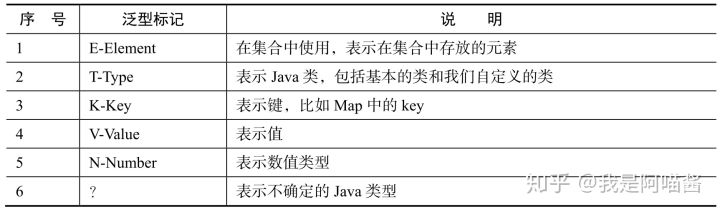
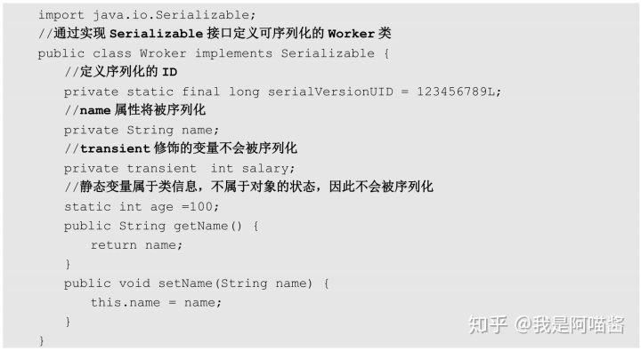

------

# 二 Java基础(异常+反射+注解+内部类+泛型+序列化)

## **2.3 异常分类及处理**

### **异常定义：**

在方法正常执行时，通过抛异常退出方法。在异常中封装了错误信息和原因。调用方可以根据该异常选择处理或者继续往下抛。

### **异常分类：**

Throwable是所有Error和Exception父类。

常见Error有AWTError、ThreadDeath。

Exception可以分为RuntimeException和CheckedExcption。


**Error**

出现通常因为系统内部错误或者资源耗尽。Java不能处理Error。

**Excption**

分为运行异常与检查异常

RuntimeException：指Java运行期间抛出的异常。可以被捕获并处理。常见的有空指针异常、类强转异常、数组越界异常。

CheckedException：指编译阶段对程序的检查。要求对程序可能出现的异常通过try catch捕获处理。常见的包括IO异常、SQL异常、ClassNotFound异常。**对于这种异常， JAVA 编译器强制要求我们必需对出现的这些异常进行 catch 。所以，面对这种异常不管我们是否愿意，只能自己去写一大堆 catch 块去处理可能的异常。**

#### Java 异常类层次结构图


在 Java 中，所有的异常都有一个共同的祖先 java.lang 包中的 **Throwable 类**。Throwable： 有两个重要的子类：**Exception（异常）** 和 **Error（错误）** ，二者都是 Java 异常处理的重要子类，各自都包含大量子类。

**Error（错误）: 是程序无法处理的错误**，表示运行应用程序中较严重问题。大多数错误与代码编写者执行的操作无关，而表示代码运行时 JVM（Java 虚拟机）出现的问题。例如，Java 虚拟机运行错误（Virtual MachineError），当 JVM 不再有继续执行操作所需的内存资源时，将出现 OutOfMemoryError。这些异常发生时，Java 虚拟机（JVM）一般会选择线程终止。

这些错误表示故障发生于虚拟机自身、或者发生在虚拟机试图执行应用时，如 Java 虚拟机运行错误（Virtual MachineError）、类定义错误（NoClassDefFoundError）等。这些错误是不可查的，因为它们在应用程序的控制和处理能力之外，而且绝大多数是程序运行时不允许出现的状况。对于设计合理的应用程序来说，即使确实发生了错误，本质上也不应该试图去处理它所引起的异常状况。在 Java 中，错误通过 Error 的子类描述。

**Exception（异常）:是程序本身可以处理的异常**。Exception 类有一个重要的子类 **RuntimeException**。RuntimeException 异常由 Java 虚拟机抛出。**NullPointerException**（要访问的变量没有引用任何对象时，抛出该异常）、**ArithmeticException**（算术运算异常，一个整数除以 0 时，抛出该异常）和 **ArrayIndexOutOfBoundsException** （下标越界异常）。

**注意：异常和错误的区别：异常能被程序本身处理，错误是无法处理。**

#### Throwable 类常用方法

- **public string getMessage()**:返回异常发生时的简要描述
- **public string toString()**:返回异常发生时的详细信息
- **public string getLocalizedMessage()**:返回异常对象的本地化信息。使用 Throwable 的子类覆盖这个方法，可以生成本地化信息。如果子类没有覆盖该方法，则该方法返回的信息与 getMessage（）返回的结果相同
- **public void printStackTrace()**:在控制台上打印 Throwable 对象封装的异常信息

**异常处理方式：**

- 抛出异常

  throws用于方法定义上，可能抛出的异常

  throw 作用在方法内，表示明确抛出一个异常

- 捕获异常

  通过try catch捕获和处理异常

#### 异常处理总结

- **try 块：** 用于捕获异常。其后可接零个或多个 catch 块，如果没有 catch 块，则必须跟一个 finally 块。
- **catch 块：** 用于处理 try 捕获到的异常。
- **finally 块：** 无论是否捕获或处理异常，finally 块里的语句都会被执行。当在 try 块或 catch 块中遇到 return
  语句时，finally 语句块将在方法返回之前被执行。

**在以下 4 种特殊情况下，finally 块不会被执行：**

1. 在 finally 语句块第一行发生了异常。 因为在其他行，finally 块还是会得到执行
2. 在前面的代码中用了 System.exit(int)已退出程序。 exit 是带参函数 ；若该语句在异常语句之后，finally 会执行
3. 程序所在的线程死亡。
4. 关闭 CPU。

**注意：** 当 try 语句和 finally 语句中都有 return 语句时，在方法返回之前，finally 语句的内容将被执行，并且 finally 语句的返回值将会覆盖原始的返回值。如下：

```java
    public static int f(int value) {
        try {
            return value * value;
        } finally {
            if (value == 2) {
                return 0;
            }
        }
    }
```

如果调用 `f(2)`，返回值将是 0，因为 finally 语句的返回值覆盖了 try 语句块的返回值。


## **2.4.反射机制**

### **动态语言的概念**

动态语言指在运行时可以改变结构的语言，比如新的属性、方法的增加、删除。

- JS、Ruby、Python属于动态语言。
- C、C++属于非动态语言。
- Java属于半动态。


### **反射机制的概念**

JAVA反射机制是在运行状态中，对于任意一个类，都能够知道这个类的所有属性和方法，并能任意调用。对于任 意一个对象，都能够调用它的任意方法和属性；这种动态获取信息以及动态调用对象方法的功能称为java语言的反射机制。


### **反射的应用**

Java对象分为编译时类型与运行时类型。

编译时指声明对象的类型。

运行类型指为对象赋值的类型。无法在编译时获取对象真实信息，只能通过反射获取。这是反射的核心。

在日常的第三方应用开发过程中，经常会遇到某个类的某个成员变量、方法或是属性是私有的或是只对系统应用开放，这时候就可以利用Java的反射机制通过反射来获取所需的私有成员或是方法。当然，也不是所有的都适合反射，之前就遇到一个案例，通过反射得到的结果与预期不符。阅读源码发现，经过层层调用后在最终返回结果的地方对应用的权限进行了校验，对于没有权限的应用返回值是没有意义的 缺省值，否则返回实际值起到保护用户的隐私目的。


### **Java反射API**

反射机制的相关类

与Java反射相关的类如下：

常用API

- Class类：代表类的实体，在运行的Java应用程序中表示类和接口，用于获取类的属性、方法信息
- Filed类：代表类的成员变量（成员变量也称为类的属性），用于获取和设置类中属性值
- Method类：代表类的方法，用于获取方法的描述信息和执行某个方法
- Constructor类：代表类的构造方法

### **反射步骤**

- **1.获取想要操作类的Class对象**
- **2.调用Class对象类中的定义方法**
- **3.使用反射API获取并调用类属性和方法信息**

#### **如何获取一个Class类** 

``` java
Class clazz = Class.forName("xxx"); 
Class clazz = 对象.getClass(); 
Class clazz = 类.class
```

如果想通过反射去访问一个类的信息包括方法和字段信息。都需要先获取一个Class对象。

#### **创建对象的两个方法**

使用Class对象的newInstance方法，要求对应类有无参构造方法

通过Class对象的Constructor对象的newInstance方法创建Class对应类实例

#### **Method的invoke方法**

动态调用类对象的方法。

步骤：获取对象的Method，并调用Method的invoke方法。

**Class类** 

Class代表类的实体，在运行的Java应用程序中表示类和接口。在这个类中提供了很多有用的方法，这里对它们简单的分类介绍。

- **获得类相关的方法**

| 方法                      | 用途                                                   |
| ------------------------- | ------------------------------------------------------ |
| asSubclass(Class clazz)   | 把传递的类的对象转换成代表其子类的对象                 |
| Cast                      | 把对象转换成代表类或是接口的对象                       |
| getClassLoader()          | 获得类的加载器                                         |
| getClasses()              | 返回一个数组，数组中包含该类中所有公共类和接口类的对象 |
| getDeclaredClasses()      | 返回一个数组，数组中包含该类中所有类和接口类的对象     |
| forName(String className) | 根据类名返回类的对象                                   |
| getName()                 | 获得类的完整路径名字                                   |
| newInstance()             | 创建类的实例                                           |
| getPackage()              | 获得类的包                                             |
| getSimpleName()           | 获得类的名字                                           |
| getSuperclass()           | 获得当前类继承的父类的名字                             |
| getInterfaces()           | 获得当前类实现的类或是接口                             |

- **获得类中属性相关的方法**

| 方法                          | 用途                   |
| ----------------------------- | ---------------------- |
| getField(String name)         | 获得某个公有的属性对象 |
| getFields()                   | 获得所有公有的属性对象 |
| getDeclaredField(String name) | 获得某个属性对象       |
| getDeclaredFields()           | 获得所有属性对象       |

- **获得类中注解相关的方法**

| 方法                                         | 用途                                   |
| -------------------------------------------- | -------------------------------------- |
| getAnnotation(Class annotationClass)         | 返回该类中与参数类型匹配的公有注解对象 |
| getAnnotations()                             | 返回该类所有的公有注解对象             |
| getDeclaredAnnotation(Class annotationClass) | 返回该类中与参数类型匹配的所有注解对象 |
| getDeclaredAnnotations()                     | 返回该类所有的注解对象                 |

- **获得类中构造器相关的方法**

| 方法                                               | 用途                                   |
| -------------------------------------------------- | -------------------------------------- |
| getConstructor(Class...<?> parameterTypes)         | 获得该类中与参数类型匹配的公有构造方法 |
| getConstructors()                                  | 获得该类的所有公有构造方法             |
| getDeclaredConstructor(Class...<?> parameterTypes) | 获得该类中与参数类型匹配的构造方法     |
| getDeclaredConstructors()                          | 获得该类所有构造方法                   |

- **获得类中方法相关的方法**

| 方法                                                       | 用途                   |
| ---------------------------------------------------------- | ---------------------- |
| getMethod(String name, Class...<?> parameterTypes)         | 获得该类某个公有的方法 |
| getMethods()                                               | 获得该类所有公有的方法 |
| getDeclaredMethod(String name, Class...<?> parameterTypes) | 获得该类某个方法       |
| getDeclaredMethods()                                       | 获得该类所有方法       |

- **类中其他重要的方法**

| 方法                                                         | 用途                             |
| ------------------------------------------------------------ | -------------------------------- |
| isAnnotation()                                               | 如果是注解类型则返回true         |
| isAnnotationPresent(Class<? extends Annotation> annotationClass) | 如果是指定类型注解类型则返回true |
| isAnonymousClass()                                           | 如果是匿名类则返回true           |
| isArray()                                                    | 如果是一个数组类则返回true       |
| isEnum()                                                     | 如果是枚举类则返回true           |
| isInstance(Object obj)                                       | 如果obj是该类的实例则返回 true   |
| isInterface()                                                | 如果是接口类则返回true           |
| isLocalClass()                                               | 如果是局部类则返回true           |
| isMemberClass()                                              | 如果是内部类则返回true           |

**Field类**

Field代表类的成员变量（成员变量也称为类的属性）。

| 方法                          | 用途                    |
| ----------------------------- | ----------------------- |
| equals(Object obj)            | 属性与obj相等则返回true |
| get(Object obj)               | 获得obj中对应的属性值   |
| set(Object obj, Object value) | 设置obj中对应属性值     |

**Method类**

Method代表类的方法。

| 方法                               | 用途                                     |
| ---------------------------------- | ---------------------------------------- |
| invoke(Object obj, Object... args) | 传递object对象及参数调用该对象对应的方法 |

**Constructor类**
Constructor代表类的构造方法。

| 方法                            | 用途                       |
| ------------------------------- | -------------------------- |
| newInstance(Object... initargs) | 根据传递的参数创建类的对象 |

**示例**

为了演示反射的使用，首先构造一个与书籍相关的model——Book.java，然后通过反射方法示例 创建对象、反射私有构造方法、反射私有属性、反射私有方法，最后给出两个比较复杂的反射示 例——获得当前ZenMode和关机Shutdown。 

**被反射类Book.java**

``` java
public class Book {

    private final static String TAG = "BookTag";
    private String name;
    private String author;

    @Override
    public String toString() {
        return "Book{" + "name='" + name + '\'' + ", author='" + author + '\'' + '}';
    }

    public Book() {
    }

    private Book(String name, String author) {
        this.name = name;
        this.author = author;
    }

    public String getName() {
        return name;
    }

    public void setName(String name) {
        this.name = name;
    }

    public String getAuthor() {
        return author;
    }

    public void setAuthor(String author) {
        this.author = author;
    }

    private String declaredMethod(int index) {
        String string = null;
        switch (index) {
            case 0:
                string = "I am declaredMethod 1 !";
                break;
            case 1:
                string = "I am declaredMethod 2 !";
                break;
            default:
                string = "I am declaredMethod 1 !";
        }
        return string;
    }
}
```

**反射逻辑封装在ReflectClass.java**

``` java
@Slf4j
public class ReflectClass {

    private final static String TAG = "james.log.ReflectClass";

    // 创建对象
    public static void reflectNewInstance() {
        try {
            Class<?> classBook = Class.forName("com.james.reflectdemo.Book");
            Object objectBook = classBook.newInstance();
            Book book = (Book) objectBook;
            book.setName("湖人总冠军");
            book.setAuthor("老詹");
            log.info(TAG, "reflectNewInstance book = " + book.toString());
        } catch (Exception ex) {
            ex.printStackTrace();
        }
    }

    // 反射私有的构造方法
    public static void reflectPrivateConstructor() {
        try {

            Class<?> classBook = Class.forName("com.james.reflectdemo.Book");
            Constructor<?> declaredConstructorBook = classBook.getDeclaredConstructor(String.class, String.class);
            declaredConstructorBook.setAccessible(true);
            Object objectBook = declaredConstructorBook.newInstance("开课吧总 冠军", "小詹");
            Book book = (Book) objectBook;
            log.info(TAG, "reflectPrivateConstructor book = " + book.toString());
        } catch (Exception ex) {
            ex.printStackTrace();
        }
    }

    // 反射私有属性
    public static void reflectPrivateField() {
        try {
            Class<?> classBook = Class.forName("com.james.reflectdemo.Book");
            Object objectBook = classBook.newInstance();
            Field fieldTag = classBook.getDeclaredField("TAG");
            fieldTag.setAccessible(true);
            String tag = (String) fieldTag.get(objectBook);
            log.info(TAG, "reflectPrivateField tag = " + tag);
        } catch (Exception ex) {
            ex.printStackTrace();
        }
    }

    // 反射私有方法
    public static void reflectPrivateMethod() {
        try {
            Class<?> classBook = Class.forName("com.james.reflectdemo.Book");
            Method methodBook = classBook.getDeclaredMethod("declaredMethod", int.class);
            methodBook.setAccessible(true);
            Object objectBook = classBook.newInstance();
            String string = (String) methodBook.invoke(objectBook, 0);
            log.info(TAG, "reflectPrivateMethod string = " + string);
        } catch (Exception ex) {
            ex.printStackTrace();
        }
    }
}
```


## **4.注解**

### **注解的概念**

一个接口，Java提供设置程序中元素的关联信息和元数据的方法。


### **标准元注解**

@Target：

说明注解修饰对象的范围。可用于包、类、类成员、方法参数和本地变量。

target类型。


@Retention：

定义注解保留级别，即被描述注解在什么级别有效。

SOURCE：源文件有效

CLASS：Class文件中有效

RUNTIME：运行时有效


@Documented：

表示这个注解应该被javadoc工具记录


@Inherited：

标记注解，表明被标注的类是被继承的。

一个被@Inherited修饰的注解修饰一个类，表明这个注解将对该类的子类生效。

### 综合示例: JDBC


## **5.内部类**

### **静态内部类**

定义在类内部的静态类。

静态内部类可以访问外部类的静态变量与方法。

静态内部类中可以定义静态变量、方法、构造方法。

静态内部类通过 “外部类.静态内部类” 方式调用。


### **成员内部类**

定义在类内部的非静态类。

成员内部类中不能定义静态方法和变量（final修饰的）除外。因为成员内部类时非静态的。


### **局部内部类**

定义在类方法中的类。


### **匿名内部类**

匿名内部类指通过继承一个类或者实现一个接口定义的类。

匿名内部类没有class修饰，因为匿名内部类直接使用new 生成对象引用。


## **6.泛型**

本质是参数化类型，提供了编译时的安全检测。

### **泛型标记E、T、K、V、N、？**





对泛型上限的限定 <? extends T>

对泛型下限的限定 <? super T>

### **泛型方法**

指将方法参数类型定义为泛型，以便接收不同类型参数。比如常见的main方法。

```java
 public static void main(String args[]) {
     
 }
```

### **泛型类**

指在类定义时在类定义了泛型，以便类使用时根据不同参数类型实例化。

```java
 public class Result<T> {
     public T data;
 }
```

## **7.序列化**

Java对象在内存中创建，如果想持久化Java对象到磁盘，需要使用序列化。

除了持久化对象，还用在RPC调用和网络传输中。

### **Java序列化API的使用**

Java序列化API为对象序列化提供了标准机制，有一下注意事项：

- 实现序列化，只要实现java.io.Serializable接口即可
- 序列化与反序列化要保持序列化的ID一致
- 序列化不保存静态变量
- 需要序列化父类的变量，父类也要实现Serializable接口
- 使用Transient关键字可以防止变量被序列化。





### **序列化与反序列化**


## **8.总结**

