# 第4章 数据结构

常用数据结构

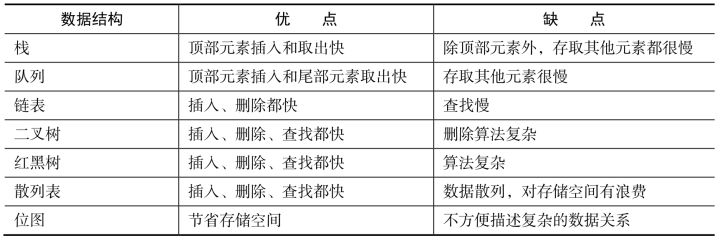

#### java常见数据结构的时间复杂度

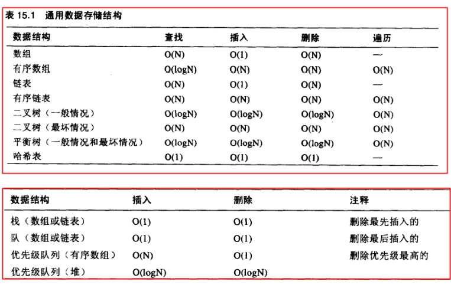

## **1.栈**

图示

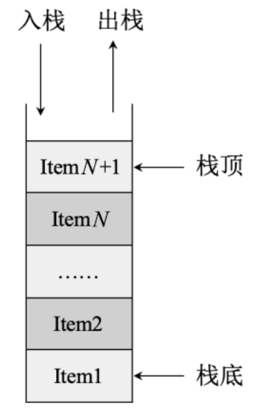

核心方法

◎ push()：向栈中压入一个数据，先入栈的数据在最下边。

◎ pop()：弹出栈顶数据，即移除栈顶数据。

◎ peek()：返回当前的栈顶数据。

栈结构

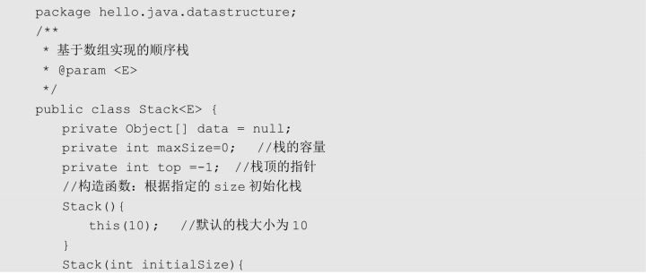

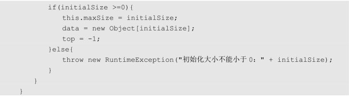

入栈

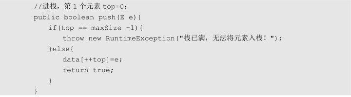

出栈

查找元素

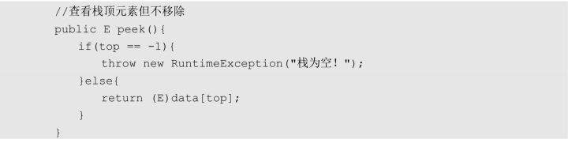

## **2.队列**

FIFO-first in first out 线性表

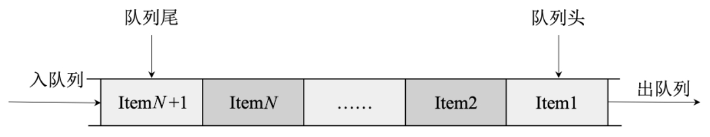

**核心方法：**

◎ add()：向队列的尾部加入一个元素（入队），先入队列的元素在最前边。

◎ poll()：删除队列头部的元素（出队）。

◎ peek()：取出队列头部的元素。

队列结构

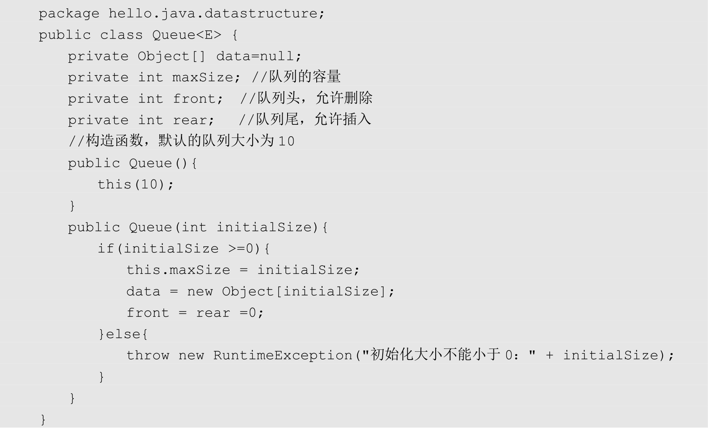

入队

出队

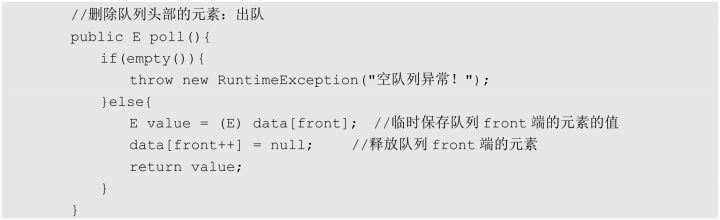

查对头

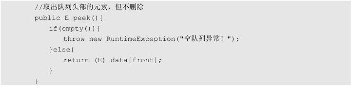

## **3.链表**

链表有 3 种：单向链表、双向链表及循环链表。

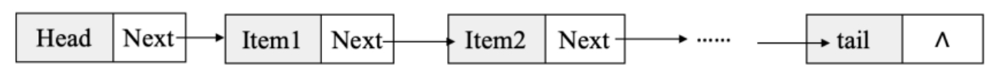

### **3.1.单链表**

链接方向单向，访问链表时要从头部开始顺序读取。

一个单向链表的节点（Node）可分为两部分：第 1 部分为数据区（data），用于保存节点的数据信息；第 2 部分为指针区，用于存储下一个节点的地址，最后一个节点的指针指向 null。

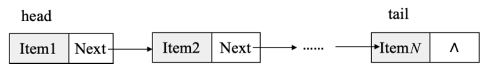

**单链表操作**

查找

插入

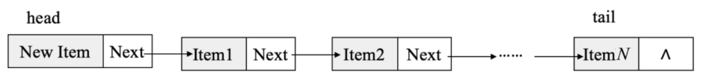

删除

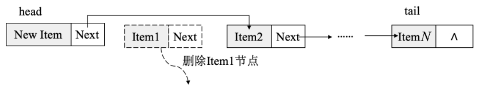

单链表结构

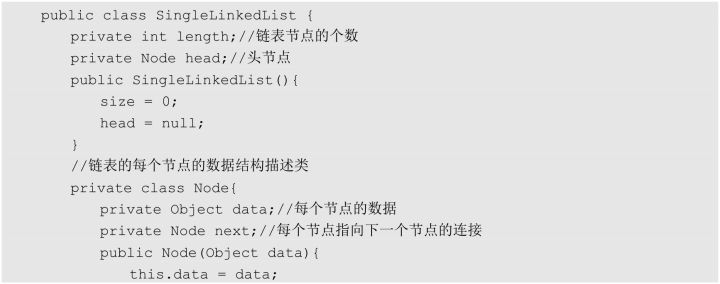

插入

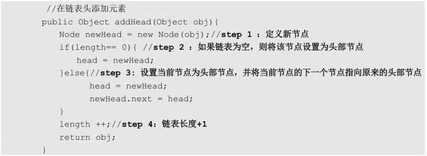

删除

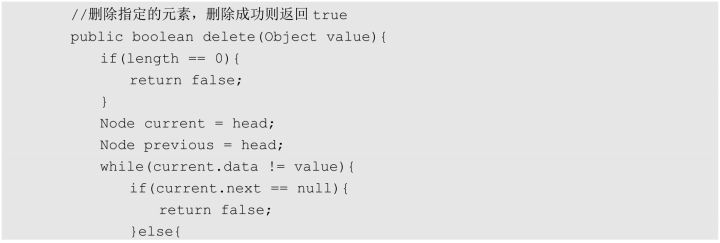

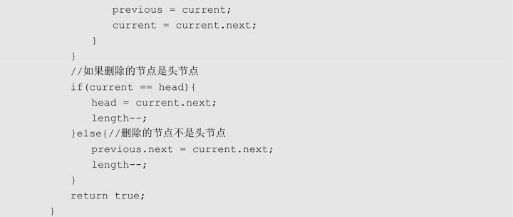

查询

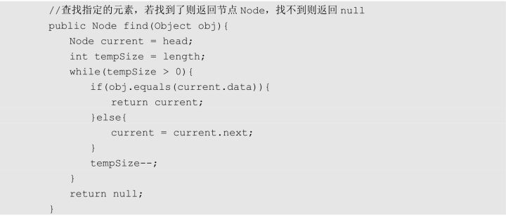

### **3.2.双向链表**

每个数据节点中都有两个指针，分别指向其直接后继和直接前驱节点。

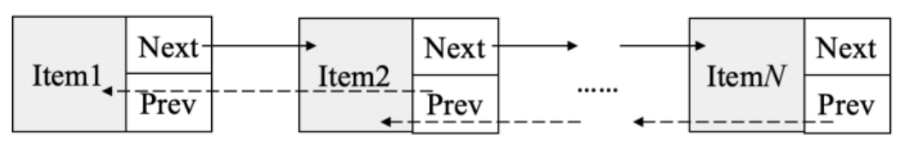

结构

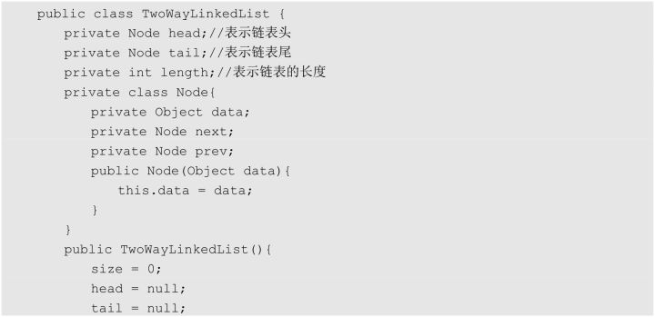

头部增加节点

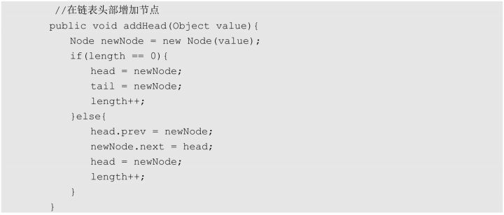

尾部增加节点

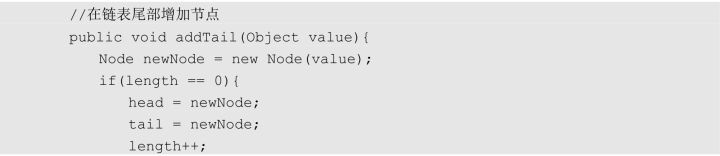

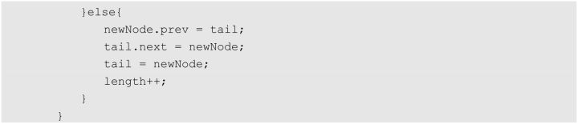

删除头节点

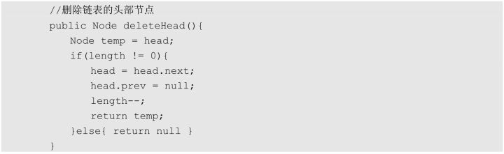

删除尾节点

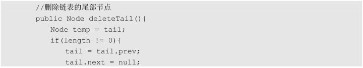

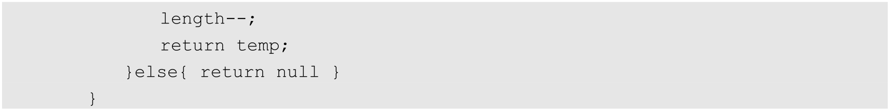

### **3.3.循环链表**

表中最后一个节点的指针域指向头节点，整个链表形成一个环。

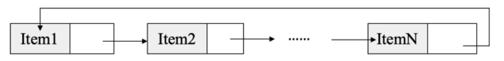

## **4.哈希表**

根据数据的关键码值（Key-Value 对）对数据进行存取的数据结构。

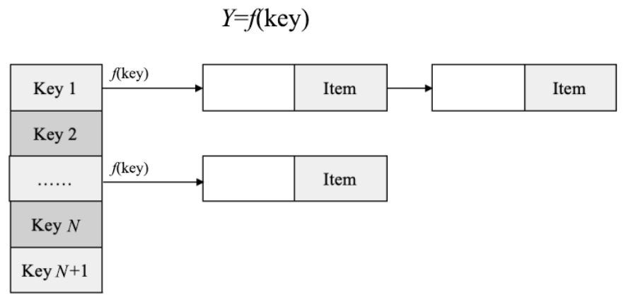

### **4.1.计算散列算法**

◎ 直接定址法：取关键字或关键字的某个线性函数值为散列地址，即 *h*（key）= key 或*h*（key）=a×key+b，其中 a 和 b 为常数。

◎ 平方取值法：取关键字平方后的中间几位为散列地址。

◎ 折叠法：将关键字分割成位数相同的几部分，然后取这几部分的叠加和作为散列地址。

◎ 除留余数法：取关键字被某个不大于散列表长度 *m*的数 p 除后所得的余数为散列地址，即*h*(key)=key/p (p≤*m*)。

◎ 随机数法：选择一个随机函数，取关键字的随机函数值作为其散列地址，即*h*(key)=random(key)。

◎ Java HashCode 实现：在 Java 中计算 HashCode 的公式为 *f*(key) = s[0] × 31n-1+s[1] × 31n-2 +...+*s*[*n*-1]。具体实现如下：

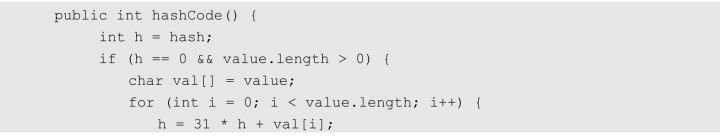

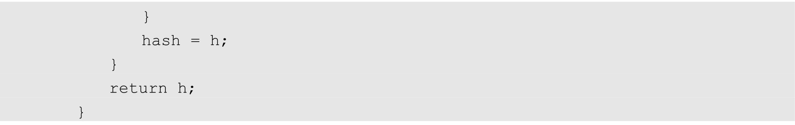

### **4.2.Hash应用**

◎ 信息安全：Hash 主要被用于信息安全领域的加密算法中

◎ 快速查找：散列表，又叫作散列，是一种更加快捷的查找技术。

## **5.二叉查找树**

满足以下条件的树：

◎ 若左子树不空，则左子树上所有节点的值均小于它的根节点的值；

◎ 若右子树不空，则右子树上所有节点的值均大于或等于它的根节点的值；

◎ 左、右子树也分别为二叉排序树。

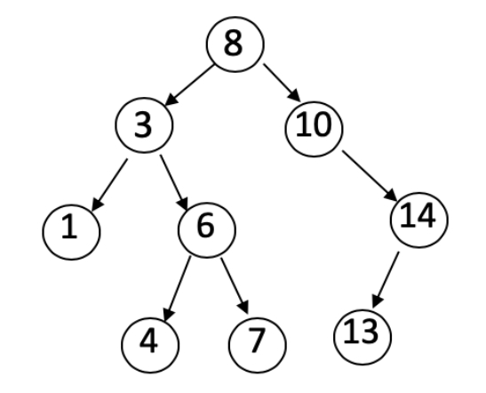

### **5.1.插入**

（1）将待插入的新节点与当前节点进行比较，如果两个节点的值相同，则表示新节点已经存在于二叉排序树中，直接返回 false。

（2）将待插入的新节点与当前节点进行比较，如果待插入的新节点的值小于当前节点的值，则在当前节点的左子树中寻找，直到左子树为空，则当前节点为要找的父节点，将新节点插入当前节点的左子树即可。

（3）将待插入的新节点与当前节点进行比较，如果待插入的新节点的值大于当前节点的值，则在当前节点的右子树中寻找，直到右子树为空，则当前节点为要找的父节点，将新节点插入当前节点的右子树即可。

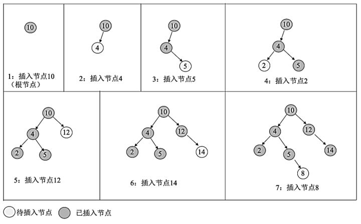

### **5.2.删除**

删除操作主要分为三种情况：待删除的节点没有子节点；待删除的节点只有一个子节点；待删除的节点有两个子节点。

（1）在待删除的节点没有子节点时，直接删除该节点，即在其父节点中将其对应的子节点置空即可。要删除的节点 14 没有子节点，则直接将其删除即可。

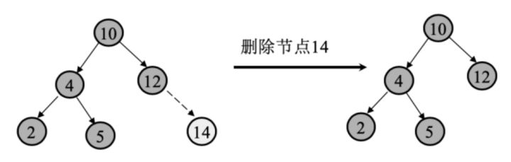

（2）在待删除的节点只有一个子节点时，使用子节点替换当前节点，然后删除该节点即可。要删除的节点 5 有一个子节点 8，则使用子节点 8 替换需要删除的节点 5，然后删除节点 5 的数据即可。

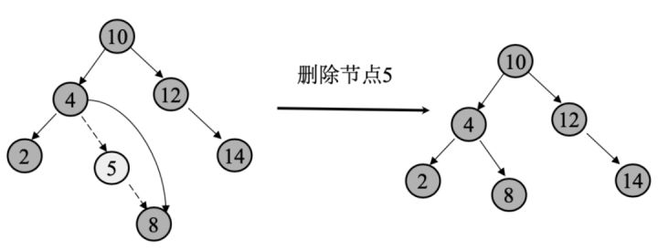

（3）在待删除的节点有两个子节点时，首先查找该节点的替换节点（替换节点为左子树中的最大节点或者右子树中的最小节点），然后替换待删除的节点为替换节点，最后删除替换节点。要删除的节点 4 有两个子节点，其左子树最小的节点为 2，其右子树最小的节点为 5，因此有两种结果。

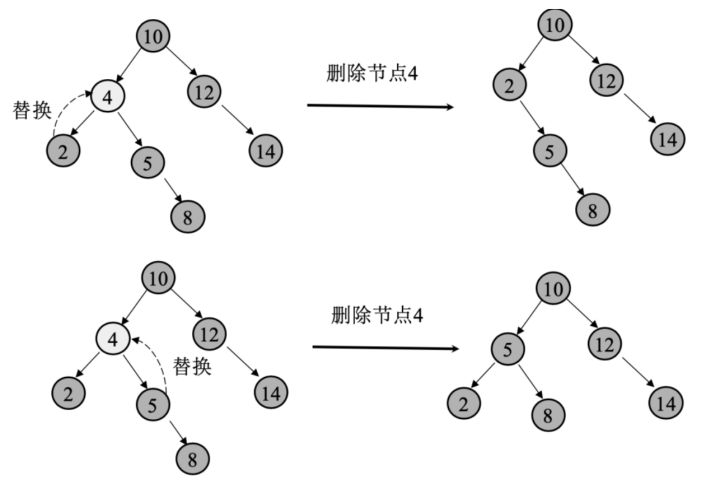

### **5.3.查找**

接近二分查找法。将要查找的数据与根节点的值进行比较，如果相等就返回，如果小于就到左子树中递归查找，如果大于就到右子树中递归查找。

### **5.4.实现**

结构

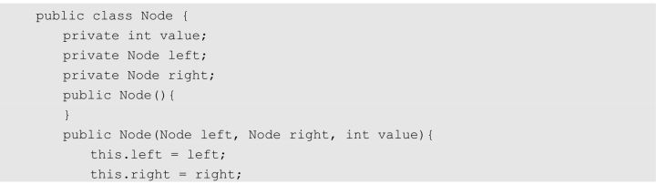

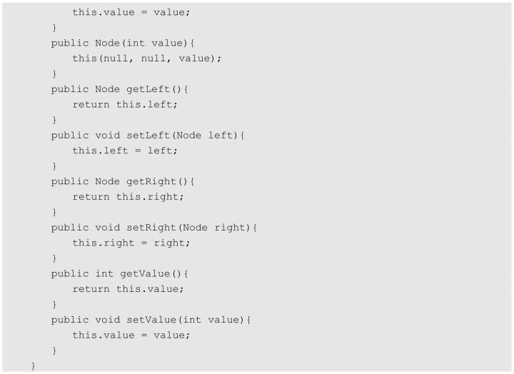

插入

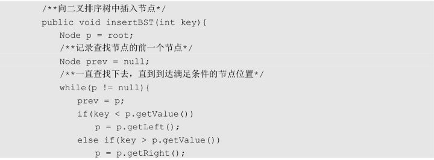

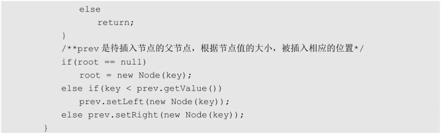

删除

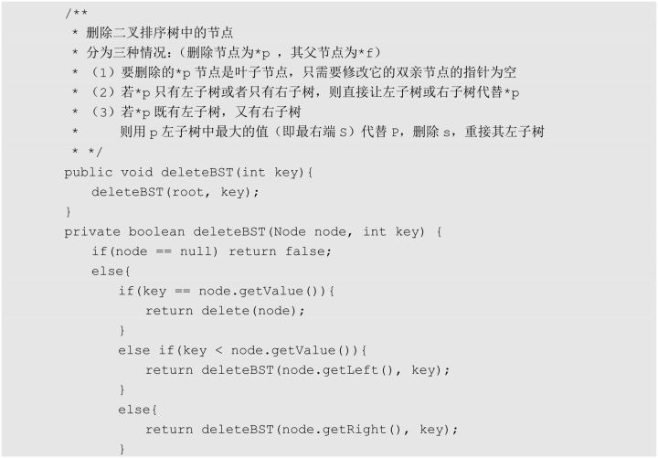

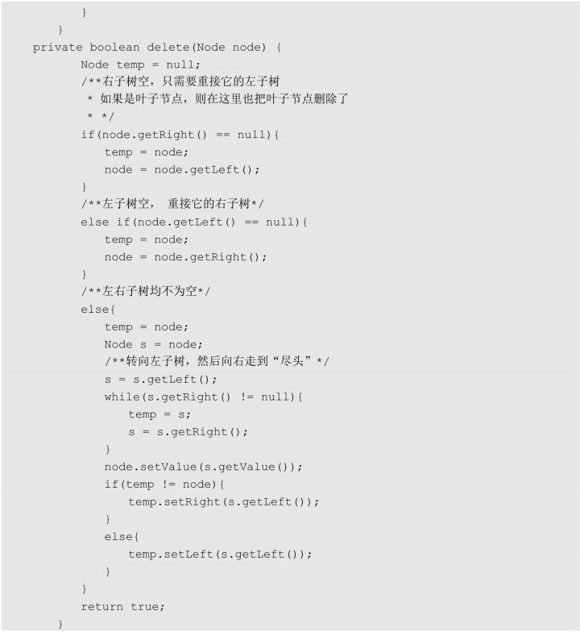

查询

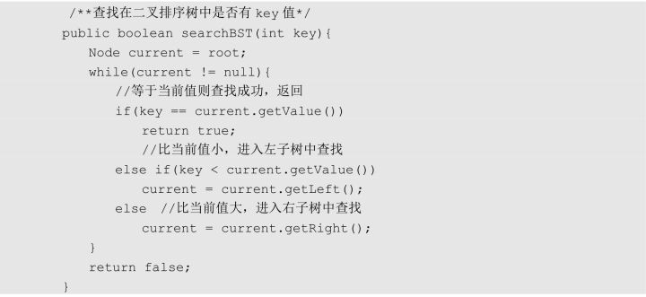

## **6.红黑树**

自平衡的二叉查找树。在红黑树的每个节点上都多出一个存储位表示节点的颜色，颜色只能是红或者黑。

### **6.1.特性**

◎ 每个节点或者是黑色的，或者是红色的。

◎ 根节点是黑色的。

◎ 每个叶子节点（NIL）都是黑色的。

◎ 如果一个节点是红色的，则它的子节点必须是黑色的。

◎ 从一个节点到该节点的子孙节点的所有路径上都包含相同数量的黑色节点。

结构

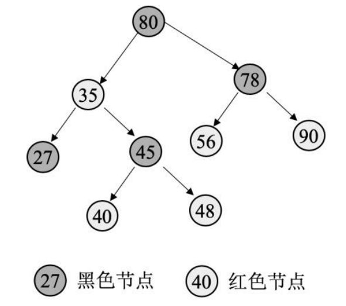

### **6.2.左旋**

对 a 节点进行左旋，指将 a 节点的右子节点设为 a 节点的父节点，即将 a 节点变成一个左节点。因此左旋意味着被旋转的节点将变成一个左节点

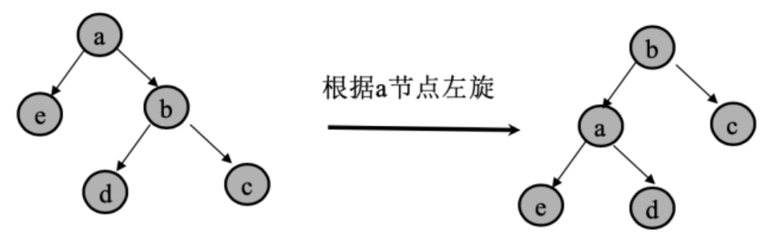

### **6.3.右旋**

对 b 节点进行右旋，指将 b 节点的左子节点设为 b 节点的父节点，即将 b 节点设为一个右节点。因此右旋意味着被旋转的节点将变成一个右节点

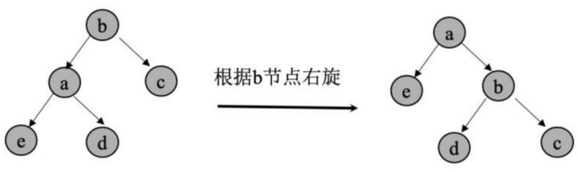

### **6.4.添加**

分为 3 步：① 将红黑树看作一颗二叉查找树，并以二叉树的插入规则插入新节点；② 将插入的节点涂为「红色」或「黑色」；③ 通过左旋、右旋或着色操作，使之重新成为一颗红黑树。

### **6.5.删除**

分为两步：① 将红黑树看作一颗二叉查找树，根据二叉查找树的删除规则删除节点；② 通过左旋、旋转、重新着色操作进行树修正，使之重新成为一棵红黑树

## **7.图**

图是由有穷非空集合的顶点和顶点之间的边组成的集合，通常表示为 G（V,E），其中 G 表示一个图，V 是图 G 中顶点的集合，E 是图 G 中边的集合。

### **7.1.无向图**

从顶点 V*i*到 V*j*的边没有方向，则称这条边为无向边。顶点和无向边组成的图为无向图

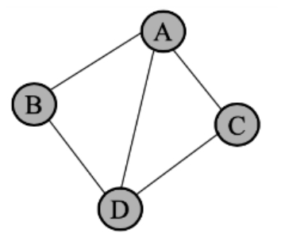

从顶点 V*i*到 V*j*的边有方向，则称这条边为有向边，也叫作弧，用有序偶 <V*i*,V*j*> 来表示有向边，V*i*叫作弧尾，V*j*叫作弧头。由顶点和有向边组成的图叫作有向图。

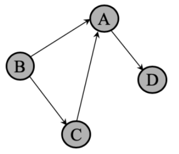

### **7.2.存储结构：邻接矩阵**

图的邻接矩阵的存储方式是基于两个数组来表示图的数据结构并存储图中的数据。一个一维数组存储图中的顶点信息，一个二维数组（叫作邻接矩阵）存储图中的边或弧的信息。设图 G 有*n*个顶点，则邻接矩阵是一个*n*×*n*的方阵

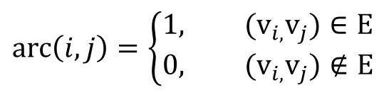

**1. 无向图的邻接矩阵**

在无向图的邻接矩阵中，如果 <V*i*,V*j*> 的交点为 1，则表示两个顶点连通，为 0 则不连通。在无向图的邻接矩阵中，主对角元素都为 0，也就是说顶点自身没有连通关系

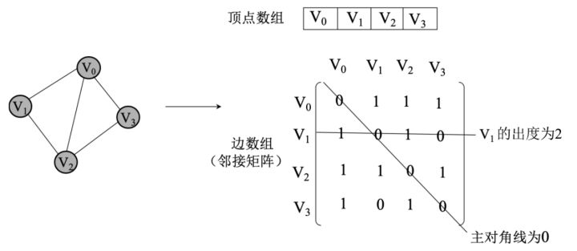

**2.有向图的邻接矩阵**

在有向图的邻接矩阵中，如果 <V*i*,V*j*> 的交点为 1，则表示从 V*i*到 V*j*存在弧（但从 V*j*到 V*i*是否存在弧不确定），为 0 则表示从 V*i*到 V*j*不存在弧；同样，在有向图的邻接矩阵中主对角元素都为 0，也就是说从顶点到自身没有弧。需要注意的是，有向图的连接是有方向的，V1的出度为 2（从 V1出发的边有两条），表示从 V1顶点出发的边有两条，V3的出度为 0，表示没有从 V3出发的边。

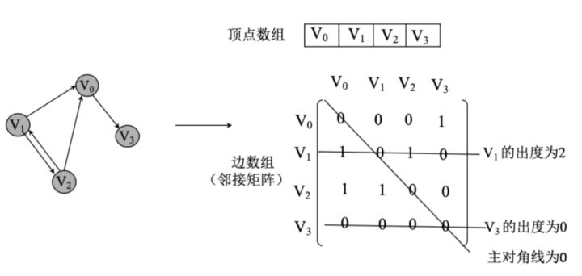

**3. 带权重图的邻接矩阵**

有些图的每条边上都带有权重，如果要将这些权值保存下来，则可以采用权值代替矩阵中的 0、1，在权值不存在的元素之间用 ∞ 表示

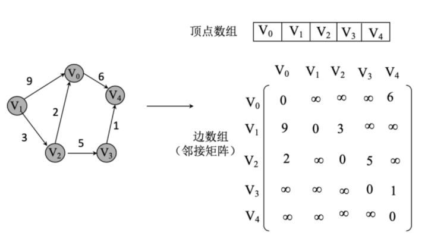

### **7.3.存储结构：邻接矩阵**

数组与链表相结合的存储方法叫作邻接表。

**1. 无向图的邻接表结构**

顶点是通过一个头节点类型的一维数组保存的，其中每个头节点的第 1 个弧都指向第 1 条依附在该顶点上的边的信息，邻接域表示该边的另一个顶点在顶点数组中的下标，下一个弧指向下一条依附在该顶点上的边的信息。

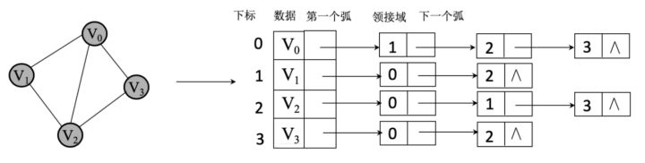

**2. 带权值的网图连接表结构**

对于带权值的图，在节点定义中再增加一个权重值 weight 的数据域，存储权值信息即可

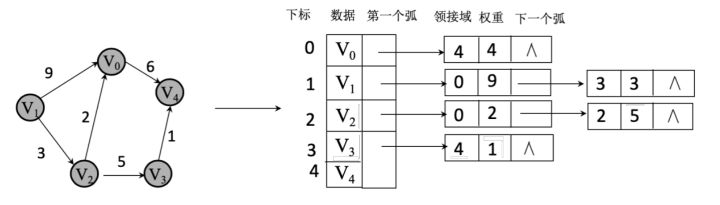

### **7.4.图的遍历**

图的遍历指从图中某一顶点出发访遍图中的每个顶点，且使每一个顶点仅被访问一次。图的遍历分为广度优先遍历和深度优先遍历

**1. 广度优先遍历**

假设从图中某个顶点 V 出发，在访问了 V 之后依次访问 V 的各个未曾访问过的邻接点，然后分别从这些邻接点出发依次访问它们的邻接点，并使先被访问的顶点的邻接点先于后被访问的顶点的邻接点被访问，直到图中所有已被访问的顶点的邻接点都被访问；若此时图中尚有顶点未被访问，则另选图中未曾被访问的一个顶点作为起始点重复上述过程，直至图中所有顶点均被访问。

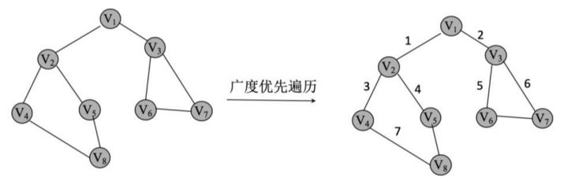

**2. 深度优先遍历**

假设从图中的某个顶点 V 出发，在访问 V 节点后依次从 V 未被访问的邻接点出发以深度优先的原则遍历图，直到图中所有和 V 节点路径连通的顶点都被访问；若此时图中尚有顶点未被访问，则另选一个未曾访问的顶点作为起始点重复上述过程，直至图中所有节点都被访问。

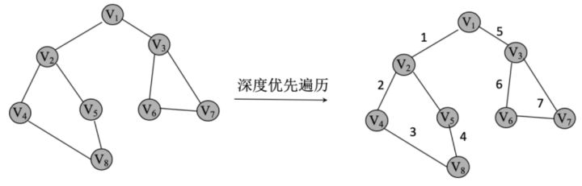

## **8.位图**

基于数组实现，将数组中的每个元素都看作一系列二进制数，所有元素一起组成更大的二进制集合，这样就可以大大节省空间。

### **8.1.位图的数据结构**

位图在内部维护了一个*M*×*N*维的数组 char[M][N]，在这个数组里面每个字节占 8 位，因此可以存储 *M*×*N*×8 个数据。假如要存储的数据范围为 0～15，则只需使用 M=1，N=2 的数据进行存储

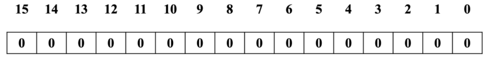

在我们要存储的数据为{1,3,6,10,15}时，只需将有数据的位设置为 1，表示该位存在数据，将其他位设置为 0

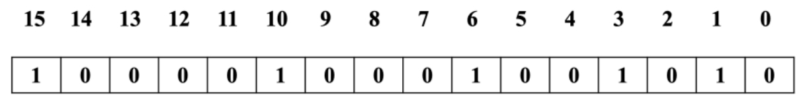

### **8.2.实现**

结构

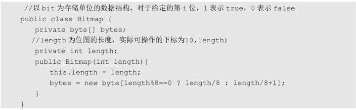

查询

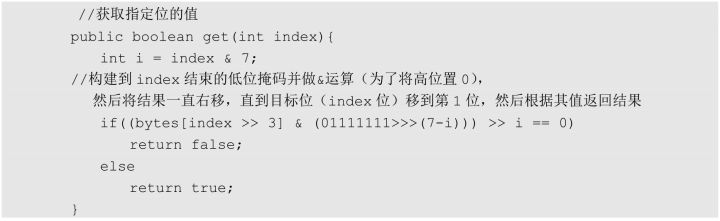

修改

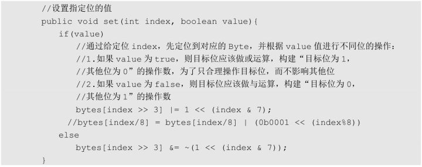

## **9.总结**

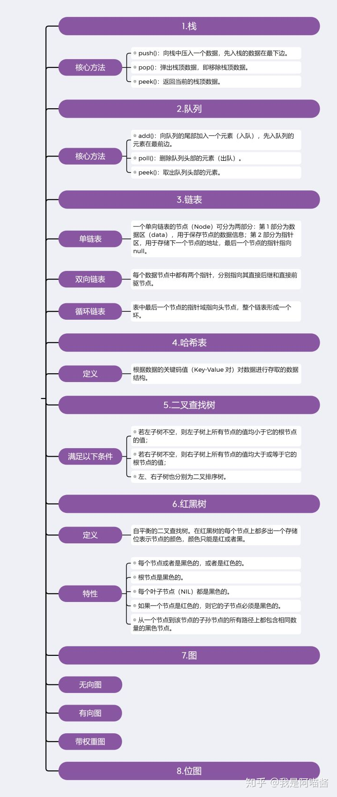