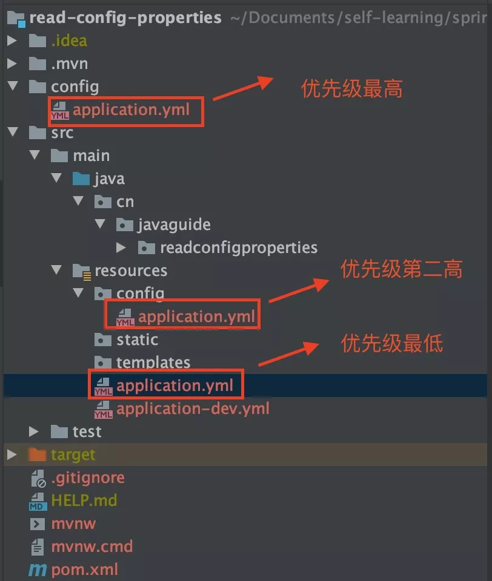

# SpringBoot常用注解

### 1. `@SpringBootApplication`

我们可以把 `@SpringBootApplication`看作是 `@Configuration`、`@EnableAutoConfiguration`、`@ComponentScan` 注解的集合。

- `@EnableAutoConfiguration`：启用 SpringBoot 的自动配置机制

- `@ComponentScan`： 扫描被`@Component` (`@Service`,`@Controller`)注解的 bean，注解默认会扫描该类所在的包下所有的类。

- `@Configuration`：允许在 Spring 上下文中注册额外的 bean 或导入其他配置类

  

### 2. Spring Bean 相关

#### 2.1. `@Autowired`

自动导入对象到类中，被注入进的类同样要被 Spring 容器管理比如：Service 类注入到 Controller 类中。

#### 2.2. `Component`,`@Repository`,`@Service`, `@Controller`

我们一般使用 `@Autowired` 注解让 Spring 容器帮我们自动装配 bean。要想把类标识成可用于 `@Autowired` 注解自动装配的 bean 的类,可以采用以下注解实现：

- `@Component` ：通用的注解，可标注任意类为 `Spring` 组件。如果一个 Bean 不知道属于哪个层，可以使用`@Component` 注解标注。
- `@Repository` : 对应持久层即 Dao 层，主要用于数据库相关操作。
- `@Service` : 对应服务层，主要涉及一些复杂的逻辑，需要用到 Dao 层。
- `@Controller` : 对应 Spring MVC 控制层，主要用户接受用户请求并调用 Service 层返回数据给前端页面。

注：以上的功能一样，只是标注有意义。

#### 2.3. `@RestController`

`@RestController`注解是`@Controller和`@`ResponseBody`的合集,表示这是个控制器 bean,并且是将函数的返回值直 接填入 HTTP 响应体中,是 REST 风格的控制器。

#### 2.4. `@Scope`

**四种常见的 Spring Bean 的作用域：**

- singleton : 唯一 bean 实例，Spring 中的 bean 默认都是单例的。（默认）
- prototype : 每次请求都会创建一个新的 bean 实例。
- request : 每一次 HTTP 请求都会产生一个新的 bean，该 bean 仅在当前 HTTP request 内有效。
- session : 每一次 HTTP 请求都会产生一个新的 bean，该 bean 仅在当前 HTTP session 内有效。

#### 2.5. `@Configuration`

一般用来声明配置类，可以使用 `@Component`注解替代，不过使用`Configuration`注解声明配置类更加语义化。


### 3. 处理常见的 HTTP 请求类型

```
@GetMapping("/users")
@RequestMapping(value="/users",method=RequestMethod.GET)
复制代码
```

- **GET** ：请求从服务器获取特定资源。举个例子：`GET /users`（获取所有学生）

- **POST** ：在服务器上创建一个新的资源。举个例子：`POST /users`（创建学生）

- **PUT** ：更新服务器上的资源（客户端提供更新后的整个资源）。举个例子：`PUT /users/12`（更新编号为 12 的学生）

- **DELETE** ：从服务器删除特定的资源。举个例子：`DELETE /users/12`（删除编号为 12 的学生）

- **PATCH** ：更新服务器上的资源（客户端提供更改的属性，可以看做作是部分更新）

  

### 4. 前后端传值

#### 4.1. `@PathVariable` 和 `@RequestParam`

`@PathVariable`用于获取路径参数，`@RequestParam`用于获取查询参数。

#### 4.2. `@RequestBody`

用于读取 Request 请求（可能是 POST,PUT,DELETE,GET 请求）的 body 部分并且**Content-Type 为 application/json** 格式的数据，接收到数据之后会自动将数据绑定到 Java 对象上去。系统会使用`HttpMessageConverter`或者自定义的`HttpMessageConverter`将请求的 body 中的 json 字符串转换为 java 对象。

**一个请求方法只可以有一个`@RequestBody`，但是可以有多个`@RequestParam`和`@PathVariable`**。


### 5. 读取配置信息

#### 5.1. `@value`

使用 `@Value("${property}")` 读取比较简单的配置信息：

#### 5.2. `@ConfigurationProperties`

通过`@ConfigurationProperties`读取配置信息并与 bean 绑定。

#### 5.3. `PropertySource`

`@PropertySource`读取指定 properties 文件

注：读取配置文件的优先级





### 6. 参数校验

#### 6.1. 一些常用的字段验证的注解

- `@NotEmpty` 被注释的字符串的不能为 null 也不能为空
- `@NotBlank` 被注释的字符串非 null，并且必须包含一个非空白字符
- `@Null` 被注释的元素必须为 null
- `@NotNull` 被注释的元素必须不为 null
- `@AssertTrue` 被注释的元素必须为 true
- `@AssertFalse` 被注释的元素必须为 false
- `@Pattern(regex=,flag=)`被注释的元素必须符合指定的正则表达式
- `@Email` 被注释的元素必须是 Email 格式。
- `@Min(value)`被注释的元素必须是一个数字，其值必须大于等于指定的最小值
- `@Max(value)`被注释的元素必须是一个数字，其值必须小于等于指定的最大值
- `@DecimalMin(value)`被注释的元素必须是一个数字，其值必须大于等于指定的最小值
- `@DecimalMax(value)` 被注释的元素必须是一个数字，其值必须小于等于指定的最大值
- `@Size(max=, min=)`被注释的元素的大小必须在指定的范围内
- `@Digits (integer, fraction)`被注释的元素必须是一个数字，其值必须在可接受的范围内
- `@Past`被注释的元素必须是一个过去的日期
- `@Future` 被注释的元素必须是一个将来的日期

#### 6.2. 验证请求体(RequestBody)

我们在需要验证的参数上加上了`@Valid`注解，如果失败，它将抛出`MethodArgumentNotValidException`

#### 6.3. 验证请求参数(Path Variables 和 Request Parameters)

**一定一定不要忘记在类上加上 `@Validated` 注解了，这个参数可以告诉 Spring 去校验方法参数。**


### 7. 全局处理 Controller 层异常

**相关注解：**

1. `@ControllerAdvice` :注解定义全局异常处理类

2. `@ExceptionHandler` :注解声明异常处理方法

   

### 8. JPA 相关

#### 8.1. 创建表

`@Entity`声明一个类对应一个数据库实体。

`@Table` 设置表名

#### 8.2. 创建主键

`@Id` ：声明一个字段为主键。

使用`@Id`声明之后，我们还需要定义主键的生成策略。我们可以使用 `@GeneratedValue` 指定主键生成策略。

```java
 /**
     * 使用一个特定的数据库表格来保存主键
     * 持久化引擎通过关系数据库的一张特定的表格来生成主键,
     */
    TABLE,

    /**
     *在某些数据库中,不支持主键自增长,比如Oracle、PostgreSQL其提供了一种叫做"序列(sequence)"的机制生成主键
     */
    SEQUENCE,

    /**
     * 主键自增长
     */
    IDENTITY,

    /**
     *把主键生成策略交给持久化引擎(persistence engine),
     *持久化引擎会根据数据库在以上三种主键生成 策略中选择其中一种
     */
    AUTO(默认)
复制代码
```

#### 8.3. 设置字段类型

`@Column` 声明字段。

#### 8.4. 指定不持久化特定字段

`@Transient` ：声明不需要与数据库映射的字段，在保存的时候不需要保存进数据库 。

#### 8.5. 声明大字段

`@Lob`:声明某个字段为大字段。

#### 8.6. 创建枚举类型的字段

可以使用枚举类型的字段，不过枚举字段要用`@Enumerated`注解修饰。

#### 8.7. 删除/修改数据

`@Modifying` 注解提示 JPA 该操作是修改操作,注意还要配合`@Transactional`注解使用。

#### 8.8. 关联关系

- `@OneToOne` 声明一对一关系

- `@OneToMany` 声明一对多关系

- `@ManyToOne`声明多对一关系

- `MangToMang`声明多对多关系

  

### 9. 事务 `@Transactional`

在要开启事务的方法上使用`@Transactional`注解即可!

#### tips：事务失效的情况：

1、@Transactional 应用在非 public 修饰的方法上

2、@Transactional 注解属性 propagation 设置错误，若是错误的配置以下三种 propagation，事务将不会发生回滚。

```
TransactionDefinition.PROPAGATION_SUPPORTS
TransactionDefinition.PROPAGATION_NOT_SUPPORTED
TransactionDefinition.PROPAGATION_NEVER
```

3、@Transactional 注解属性 rollbackFor 设置错误

Spring默认 未检查`unchecked`异常（继承自 `RuntimeException` 的异常）或者 `Error`才回滚事务

4、同一个类中方法调用，导致@Transactional失效

比如有一个类Test，它的A方法调用本类的方法B（不论方法B是用public还是private修饰），但方法A没有声明注解事务，而B方法有。则外部调用方法A之后，方法B的事务是不会起作用的。

5、异常被你的 catch“吃了”导致@Transactional失效

6、数据库引擎不支持事务（myisam）


### 10. json 数据处理

#### 10.1. 过滤 json 数据

**`@JsonIgnoreProperties` 作用在类上用于过滤掉特定字段不返回或者不解析。**

**`@JsonIgnore`一般用于类的属性上，作用和上面的`@JsonIgnoreProperties` 一样。**

#### 10.2. 格式化 json 数据

`@JsonFormat`一般用来格式化 json 数据。

#### 10.3. 扁平化对象

使用`@JsonUnwrapped`


### 11. 测试相关

**`@ActiveProfiles`一般作用于测试类上， 用于声明生效的 Spring 配置文件。**

**`@Test`声明一个方法为测试方法**

**`@Transactional`被声明的测试方法的数据会回滚，避免污染测试数据。**

**`@WithMockUser` Spring Security 提供的，用来模拟一个真实用户，并且可以赋予权限。**