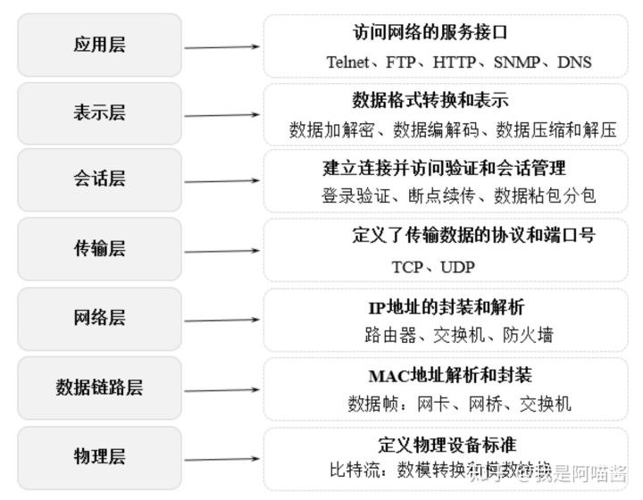

# ff第6章 网络与负载均衡

## **1.网络**

### **1.1.OSI七层模型**

从下到上主要包括物理层、数据链路层、网络层、传输层、会话层、表示层和应用层

**层作用**物理层发送端将1、0转化为电流强弱，到目的后将电流强弱转化为1、0数据链路层对数据包的MAC地址进行解析和封装网络层对数据包的IP 地址进行解析和封装传输层定义传输数据的协议和端口号会话层建立连接和管理会话表示层对接收数据进行解释、加密、解密、压缩、解压应用层具体应用：FTP、Telnet、HTTP、DNS、SNMP

### **1.2.TCP/IP四层模型**

网络接口层、网络层、传输层和应用层

**层作用**网络接口层定义主机间网络连通协议：Echernet、FDDI、ATM。。。网络层用于数据传输、路由和地址解析传输层是发送端和目标端对等实体可以基于会话通信应用层定义具体应用层协议：Telnet、FTP、SMTP、DNS、NNTP、HTTP。。。

### **1.3.TCP三握四挥**

### **TCP数据包结构**

**名称作用**源端口号（16 位）标识源主机的一个应用进程（连同源主机的 IP 地址）。目的端口号（16 位）：标识目的主机的一个应用进程（连同目的主机的 IP 地址）。IP 报头中的源主机 IP 地址、目的主机的 IP 地址和源端口、目的端口确定了唯一一条 TCP 连接。顺序号 seq（32 位）：标识从 TCP 源端向 TCP 目的端发送的数据字节流，表示这个报文段中的第 1 个数据字节的顺序号。确认号 ack（32 位）：存储发送确认的一端所期望收到的下一个顺序号。确认序号是上次已成功收到的数据字节顺序号加 1。只有 ACK 标志为 1 时确认序号字段才有效。TCP 为应用层提供全双工服务，这意味着数据能在两个方向上独立进行传输。因此，连接的每一端都必须保持每个方向上的传输数据顺序号。TCP 报头长度（4 位）存储报头中头部数据的长度，实际上指明了数据从哪里开始。需要这个值是因为任选字段的长度是可变的，该字段占 4bit，因此 TCP 最多有 60 字节的首部，但没有任选字段，正常的长度是 20 字节。保留位（6 位）：数据保留位，目前必须被设置为 0。控制位（control flags：6 位）：在 TCP 报头中有 6 个标志比特，它们中的多个可被同时设置为 1，如下图窗口大小（16 位）：数据字节数，表示从确认号开始，本报文的源方可以接收的字节数，即源方接收窗口的大小。窗口大小是 16bit 的字段，因而窗口最大为 65535 字节。校验和（16 位）：此校验和是对整个的 TCP 报文段，包括 TCP 头部和 TCP 数据，以 16 位字符计算所得的。紧急指针（16 位）：只有在 URG 标志置为 1 时紧急指针才有效，这时告诉 TCP 该条数据需要紧急发送。选项：最常见的可选字段是最长报文大小数据：TCP 报文段中的数据部分是可选的。在一个连接建立和一个连接终止时，双方交换的报文段仅有 TCP 首部。

### **TCP的三次握手**

（1）客户端发送 SYN（seq=x）报文给服务器端，进入 SYN_SEND 状态。

（2）服务器端收到 SYN 报文，回应一个 SYN（seq =y）和 ACK（ack=x+1）报文，进入 SYN_RECV 状态。

（3）客户端收到服务器端的 SYN 报文，回应一个 ACK（ack=y+1）报文，进入 Established 状态。

### **TCP的四次挥手**

（1）客户端应用进程调用断开连接的请求，向服务器端发送一个终止标志位 FIN=1，seq=u 的消息，表示在客户端关闭链路前要发送的数据已经安全发送完毕，可以开始关闭链路操作，并请求服务器端确认关闭客户端到服务器的链路操作。此时客户端处于 FIN-WAIT-1 状态。

（2）服务器在收到这个 FIN 消息后返回一个 ACK=1，ack=u+1，seq=v 的消息给客户端，表示接收到客户端断开链路的操作请求，这时 TCP 服务器端进程通知高层应用进程释放客户端到服务器端的链路，服务器处于 CLOSE-WAIT 状态，即半关闭状态。客户端在收到消息后处于 FIN-WAIT-2 状态。

（3）服务器端将关闭链路前需要发送给客户端的消息发送给客户端，在等待该数据发送完成后，发送一个终止标志位 FIN=1，ACK=1，seq=w，ack=u+1 的消息给客户端，表示关闭链路前服务器需要向客户端发送的消息已经发送完毕，请求客户端确认关闭从服务器到客户端的链路操作，此时服务器端处于 LAST-ACK 状态，等待客户端最终断开链路。

（4）客户端在接收到这个最终 FIN 消息后，发送一个 ACK=1，seq=u+1，ack=w+1 的消息给服务器端，表示接收到服务器端的断开连接请求并准备断开服务器端到客户端的链路。此时客户端处于 TIM-WAIT 状态，TCP 连接还没有释放，然后经过等待计时器（2MSL）设置的时间后，客户端将进入 CLOSE 状态。

### **1.4.HTTP原理**

HTTP 是一个无状态的协议，无状态指在客户端（Web 浏览器）和服务器之间不需要建立持久的连接，在一个客户端向服务器端发出请求且服务器收到该请求并返回响应（response）后，本次通信结束，HTTP 连接将被关闭，服务器不保留连接的相关信息。

HTTP 遵循请求（Request）/应答（Response）模型，客户端向服务器发送请求，服务器处理请求并返回适当的应答。

### **HTTP传输流程**

传输流程：地址解析、封装 HTTP 数据包、封装 TCP 包、建立 TCP 连接、客户端发送请求、服务端响应、服务端关闭 TCP 连接，具体流程如下。

（1）地址解析：地址解析通过域名系统 DNS 解析服务器域名从而获得主机的 IP 地址。例如，用客户端的浏览器请求 [http://localhost.com:8080/index.htm](https://link.zhihu.com/?target=http%3A//localhost.com%3A8080/index.htm)，则可从中分解出协议名、主机名、端口、对象路径等部分结果如下。

◎ 协议名：HTTP。

◎ 主机名：http://localhost.com。

◎ 端口：8080。

◎ 对象路径：/index.htm。

（2）封装 HTTP 数据包：解析协议名、主机名、端口、对象路径等并结合本机自己的信息封装成一个 HTTP 请求数据包。

（3）封装 TCP 包：将 HTTP 请求数据包进一步封装成 TCP 数据包。

（4）建立 TCP 连接：基于 TCP 的三次握手机制建立 TCP 连接。

（5）客户端发送请求：在建立连接后，客户端发送一个请求给服务器。

（6）服务器响应：服务器在接收到请求后，结合业务逻辑进行数据处理，然后向客户端返回相应的响应信息。在响应信息中包含状态行、协议版本号、成功或错误的代码、消息体等内容。

（7）服务器关闭 TCP 连接：服务器在向浏览器发送请求响应数据后关闭 TCP 连接。但如果浏览器或者服务器在消息头中加入了 Connection: keep-alive，则 TCP 连接在请求响应数据发送后仍然保持连接状态，在下一次请求中浏览器可以继续使用相同的连接发送请求。采用 keep-alive 方式不但减少了请求响应的时间，还节约了网络带宽和系统资源。

### **状态码**

一般「20x」格式的状态码表示成功，「30x」格式的状态码表示网络重定向，「40x」格式的状态码表示客户端请求错误，「50x」格式的状态码表示服务器错误。

### **HTTPS**

在 HTTP 的基础上加入了 SSL 协议，SSL 依靠证书来验证服务器的身份，并对浏览器和服务器之间的通信进行数据加密，以保障数据传输的安全性，其端口一般是 443。

**加密流程：**

（1）发起请求：客户端在通过 TCP 和服务器建立连接之后（443 端口），发出一个请求证书的消息给服务器，在该请求消息里包含自己可实现的算法列表和其他需要的消息。

（2）证书返回：服务器端在收到消息后回应客户端并返回证书，在证书中包含服务器信息、域名、申请证书的公司、公钥、数据加密算法等。

（3）证书验证：客户端在收到证书后，判断证书签发机构是否正确，并使用该签发机构的公钥确认签名是否有效，客户端还会确保在证书中列出的域名就是它正在连接的域名。如果客户端确认证书有效，则生成对称密钥，并使用公钥将对称密钥加密。

（4）密钥交换：客户端将加密后的对称密钥发送给服务器，服务器在接收到对称密钥后使用私钥解密。

（5）数据传输：经过上述步骤，客户端和服务器就完成了密钥对的交换，在之后的数据传输过程中，客户端和服务端就可以基于对称加密（加密和解密使用相同密钥的加密算法）对数据加密后在网络上传输，保证了网络数据传输的安全性。

### **CDN原理**

CDN（Content Delivery Network，内容分发网络）指基于部署在各地的机房服务器，通过中心平台的负载均衡、内容分发、调度的能力，使用户就近获取所需内容，降低网络延迟，提升用户访问的响应速度和体验度。

**CDN 的关键技术**

◎ 内容发布：借助建立索引、缓存、流分裂、组播等技术，将内容发布到网络上距离用户最近的中心机房。

◎ 内容路由：通过内容路由器中的重定向（DNS）机制，在多个中心机房的服务器上负载均衡用户的请求，使用户从最近的中心机房获取数据。

◎ 内容交换：根据内容的可用性、服务器的可用性及用户的背景，在缓存服务器上利用应用层交换、流分裂、重定向等技术，智能地平衡负载流量。

◎ 性能管理：通过内部和外部监控系统，获取网络部件的信息，测量内容发布的端到端性能（包丢失、延时、平均带宽、启动时间、帧速率等），保证网络处于最佳运行状态。

**CDN 的主要特点**

◎ 本地缓存（Cache）加速：将用户经常访问的数据（尤其静态数据）缓存在本地，以提升系统的响应速度和稳定性。

◎ 镜像服务：消除不同运营商之间的网络差异，实现跨运营商的网络加速，保证不同运营商网络中的用户都能得到良好的网络体验。

◎ 远程加速：利用 DNS 负载均衡技术为用户选择服务质量最优的服务器，加快用户远程访问的速度。

◎ 带宽优化：自动生成服务器的远程镜像缓存服务器，远程用户在访问时从就近的缓存服务器上读取数据，减少远程访问的带宽，分担网络流量，并降低原站点的 We b 服务器负载等。

◎ 集群抗攻击：通过网络安全技术和 CDN 之间的智能冗余机制，可以有效减少网络攻击对网站的影响。

**3.内容分发系统**

将用户请求的数据分发到就近的各个中心机房，以保障为用户提供快速、高效的内容服务。缓存的内容包括静态图片、视频、文本、用户最近访问的 JSON 数据等。缓存的技术包括内存环境、分布式缓存、本地文件缓存等。缓存的策略主要考虑缓存更新、缓存淘汰机制。

**4.负载均衡系统**

负载均衡系统是整个 CDN 系统的核心，负载均衡根据当前网络的流量分布、各中心机房服务器的负载和用户请求的特点将用户的请求负载到不同的中心机房或不同的服务器上，以保障用户内容访问的流畅性。负载均衡系统包括全局负载均衡（GSLB）和本地负载均衡（SLB）。

◎ 全局负载均衡主要指跨机房的负载均衡，通过 DNS 解析或者应用层重定向技术将用户的请求负载到就近的中心机房上。

◎ 本地负载均衡主要指机房内部的负载均衡，一般通过缓存服务器，基于 LVS、Nginx、服务网关等技术实现用户访问的负载。

**5.管理系统**

管理系统分为运营管理和网络管理子系统。网络管理系统主要对整个 CDN 网络资源的运行状态进行实时监控和管理。运营管理指对 CDN 日常运维业务的管理，包括用户管理、资源管理、流量计费和流量限流等。

## **2.负载均衡**

常用的负载均衡有四层负载均衡和七层负载均衡。

### **2.1.四层负载均衡与七层负载均衡对比**

四层负载均衡基于 IP 和端口的方式实现网络的负载均衡，具体实现为对外提供一个虚拟 IP 和端口接收所有用户的请求，然后根据负载均衡配置和负载均衡策略将请求发送给真实的服务器。

七层负载均衡基于 URL 等资源来实现应用层基于内容的负载均衡，具体实现为通过虚拟的 URL 或主机名接收所有用户的请求，然后将请求发送给真实的服务器。

四层负载均衡和七层负载均衡的最大差别是：四层负载均衡只能针对 IP 地址和端口上的数据做统一的分发，而七层负载均衡能根据消息的内容做更加详细的有针对性的负载均衡。

我们通常使用 LVS 等技术实现基于 Socket 的四层负载均衡，使用 Nginx 等技术实现基于内容分发的七层负载均衡，比如将以「/user/***」开头的 URL 请求负载到单点登录服务器，而将以「/business/***」开头的 URL 请求负载到具体的业务服务器

**1.四层负载均衡**

四层负载均衡主要通过修改报文中的目标地址和端口来实现报文的分发和负载均衡。以 TCP 为例，负载均衡设备在接收到第 1 个来自客户端的 SYN 请求后，会根据负载均衡配置和负载均衡策略选择一个最佳的服务器，并将报文中的目标 IP 地址修改为该服务器的 IP 直接转发给该服务器。TCP 连接的建立（即三次握手过程）是在客户端和服务器端之间完成的，负载均衡设备只起到路由器的转发功能。

四层负载均衡常用的软硬件如下。

◎ F5：硬件负载均衡器，功能完备，价格昂贵。

◎ LVS：基于 IP+ 端口实现的四层负载软件，常和 Keepalive 配合使用。

◎ Nginx：同时实现四层负载和七层负载均衡，带缓存功能，可基于正则表达式灵活转发。

**2.七层负载均衡**

七层负载均衡又叫作「内容负载均衡」，主要通过解析报文中真正有意义的应用层内容，并根据负载均衡配置和负载均衡策略选择一个最佳的服务器响应用户的请求。

七层应用负载可以使整个网络更智能化，七层负载均衡根据不同的数据类型将数据存储在不同的服务器上来提高网络整体的负载能力。比如将客户端的基本信息存储在内存较大的缓存服务器上，将文件信息存储在磁盘空间较大的文件服务器上，将图片视频存储在网络 I/O 能力较强的流媒体服务器上。在接收到不同的客户端的请求时从不同的服务器上获取数据并将其返回给客户端，提高客户端的访问效率。

七层负载均衡常用的软件如下。

◎ HAProxy：支持七层代理、会话保持、标记、路径转移等。

◎ Nginx：同时实现四层负载和七层负载均衡，在 HTTP 和 Mail 协议上功能比较好，性能与 HAProxy 差不多。

◎ Apache：使用简单，性能较差。

### **2.2.负载均衡算法**

常用的负载均衡算法有：轮询均衡（Round Robin）、权重轮询均衡（Weighted Round Robin）、随机均衡（Random）、权重随机均衡（Weighted Random）、响应速度均衡（Response Time）、最少连接数均衡（Least Connection）、处理能力均衡、DNS 响应均衡（Flash DNS）、散列算法均衡、IP 地址散列、URL 散列。

**算法解释1. 轮询均衡（Round Robin）**轮询均衡指将客户端请求轮流分配到 1 至 *N*台服务器上，每台服务器均被均等地分配一定数量的客户端请求。**2. 权重轮询均衡（Weighted Round Robin）**权重轮询均衡指根据每台服务器的不同配置及服务能力，为每台服务器都设置不同的权重值，然后按照设置的权重值轮询地将请求分配到不同的服务器上。**3. 随机均衡（Random）**随机均衡指将来自网络的请求随机分配给内部的多台服务器，不考虑服务器的配置和负载情况。**4. 权重随机均衡（Weighted Random）**类似于权重轮询算法，只是在分配请求时不再轮询发送，而是随机选择某个权重的服务器发送。**5.响应速度均衡（Response Time）**根据服务器设备响应速度的不同将客户端请求发送到响应速度最快的服务器上。**6. 最少连接数均衡（Least Connection）**在负载均衡器内部记录当前每台服务器正在处理的连接数量，在有新的请求时，将该请求分配给连接数最少的服务器。**7. 处理能力均衡**将服务请求分配给内部负荷最轻的服务器，负荷是根据服务器的 CPU 型号、CPU 数量、内存大小及当前连接数等换算而成的。**8. DNS 响应均衡（Flash DNS）**在分布在不同中心机房的负载均衡设备都收到同一个客户端的域名解析请求时，所有负载均衡设备均解析此域名并将解析后的服务器 IP 地址返回给客户端，客户端向收到第一个域名解析后的 IP 地址发起请求服务，而忽略其他负载均衡设备的响应。这种均衡算法适用于全局负载均衡的场景。**9.散列算法均衡**通过一致性散列算法和虚拟节点技术将相同参数的请求总是发送到同一台服务器，该服务器将长期、稳定地为某些客户端提供服务。**10. IP 地址散列**IP 地址散列指在负载均衡器内部维护了不同链接上客户端和服务器的 IP 对应关系表，将来自同一客户端的请求统一转发给相同的服务器。**11. URL 散列**通过管理客户端请求 URL 信息的散列表，将相同 URL 的请求转发给同一台服务器。

### **2.3.LVS原理运用**

LVS（Linux Virtual Server）是一个虚拟的服务器集群系统，采用 IP 负载均衡技术将请求均衡地转移到不同的服务器上执行，且通过调度器自动屏蔽故障服务器，从而将一组服务器构成一个高性能、高可用的虚拟服务器。

**1.LVS 的原理**

LVS 由前端的负载均衡器（Load Balancer，LB）和后端的真实服务器（Real Server，RS）群组成，在真实服务器间可通过局域网或广域网连接。

实现 LVS 的核心组件有负载均衡调度器、服务器池和共享存储。

◎ 负载均衡调度器（Load Balancer/Director）：是整个集群对外提供服务的入口，通过对外提供一个虚拟 IP 来接收客户端请求。在客户端将请求发送到该虚拟 IP 后，负载均衡调度器会负责将请求按照负载均衡策略发送到一组具体的服务器上。

◎ 服务器池（Server Pool）：服务器池是一组真正处理客户端请求的真实服务器，具体执行的服务有 WEB、MAIL、FTP 和 DNS 等。

◎ 共享存储（Shared Storage）：为服务器池提供一个共享的存储区，使得服务器池拥有相同的内容，提供相同的服务。

LVS 技术中常用的一些名词

**2.LVS 数据转发**

LVS 的数据转发流程是 LVS 设计的核心部分

（1）PREROUTING 链接收用户请求：客户端向 PREROUTING 链发送请求。

（2）INPUT 链转发：在 PREROUTING 链通过 RouteTable 列表发现请求数据包的目的地址是本机时，将数据包发送给 INPUT 链。

（3）IPVS 检查：IPVS 检查 INPUT 链上的数据包，如果数据包中的目的地址和端口不在规则列表中，则将该数据包发送到用户空间的 ipvsadm。ipvsadm 主要用于用户定义和管理集群。

（4）POSTROUTING 链转发：如果数据包里面的目的地址和端口都在规则里面，那么将该数据包中的目的地址修改为事先定义好的真实服务器地址，通过 FORWARD 将数据发送到 POSTROUTING 链。

（5）真实服务器转发：POSTROUTING 链根据数据包中的目的地址将数据包转发到真实服务器。

### **2.4.Nginx反向代理与负载均衡**

一般的负载均衡软件如 LVS 实现的功能只是对请求数据包的转发和传递。

反向代理服务器在接收到用户的访问请求后，会代理用户重新向节点服务器（We b 服务器、文件服务器、视频服务器）发起请求，反向代理服务器和节点服务器做具体的数据交互，最后把数据返回给客户端用户。

**1.upstream_module**

ngx_http_upstream_module 是 Nginx 的负载均衡模块，可以实现网站的负载均衡功能即节点的健康检查。upstream 模块允许 Nginx 定义一组或多组节点服务器，在使用时可通过 proxy_pass 代理方式把网站的请求发送到事先定义好的对应 Upstream 组的名字上。具体的 upstream 定义如下：

如上代码定义了名为 restLVSServer 的 upstream，并在其中定义了 3 个服务地址，在用户请求 restLVSServer 服务时，Nginx 会根据权重将请求转发到具体的服务器。常用的 upstream 配置如下。

◎ weight：服务器权重。

◎ max_fails：Nginx 尝试连接后端服务器的最大失败次数，如果失败时大于 max_fails，则认为该服务器不可用。

◎ fail_timeout：max_fails 和 fail_timeout 一般会关联使用，如果某台服务器在 fail_timeout 时间内出现了 max_fails 次连接失败，那么 Nginx 会认为其已经挂掉，从而在 fail_timeout 时间内不再去请求它，fail_timeout 默认是 10s，max_fails 默认是 1，即在默认情况下只要发生错误就认为服务器挂了，如果将 max_fails 设置为 0，则表示取消这项检查。

◎ backup：表示当前服务器是备用服务器，只有其他非 backup 后端服务器都挂掉或很忙时，才会分配请求给它。

◎ down：标志服务器永远不可用。

**2.proxy_pass**

proxy_pass 指令属于 ngx_http_proxy_module 模块，此模块可以将请求转发到另一台服务器，在实际的反向代理工作中，会通过 location 功能匹配指定的 URI，然后把接收到的服务匹配 URI 的请求通过 proxy_pass 抛给定义好的 upstream 节点池。具体的 proxy_pass 定义如下：

如上代码定义了一个 download 的反向代理，在客户端请求/download 时，Nginx 会将具体的请求转发给 proxy_pass 配置的地址处理请求，这里配置的地址是 [http://192.168.1.13:9000/download/vedio/](https://link.zhihu.com/?target=http%3A//192.168.1.13%3A9000/download/vedio/)。常用的 proxy_pass 配置如下

## **3.总结**

