# 第8章 分布式缓存的原理及应用

## **o1.分布式缓存介绍**

将频繁访问的热数据缓存到内存中，提高访问时间，降低数据库负载。

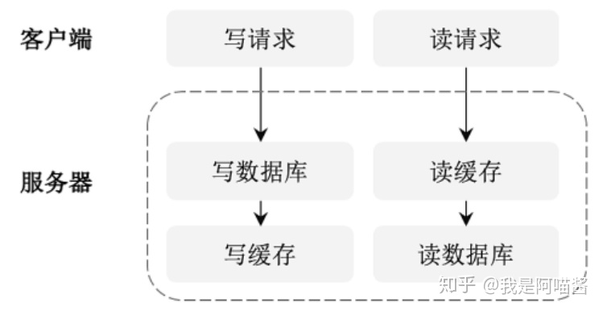

**微服务架构**下需要**分布式缓存**来实现**跨服务的缓存系统。**

用户访问的数据库是被部署在多个服务器节点的集群数据库，

缓存是被部署在多个服务器节点的分布式缓存，同时缓存之间有数据备份，在一个节点出问题后，分布式缓存会将用户的请求转发到其他备份节点以保障业务的正常运行。

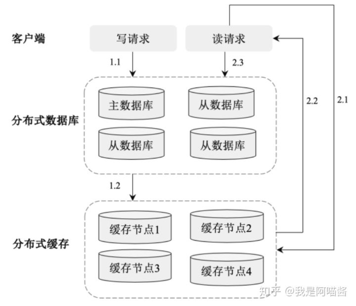

## **2.Ehcache原理及应用**

基于 Java 实现的一套简单、高效、线程安全的缓存管理类库。

**特点**是快速、轻量、可伸缩、操作灵活、支持持久化等。

### **2.1.原理**

内部采用多线程实现，采用 LinkedHashMap 存储元素，同时支持将数据持久化到物理磁盘上。

**1.Ehcache 的特点**

（1）快速

（2）轻量

（3）可伸缩

（4）操作灵活

（5）支持多种淘汰算法

（6）支持持久化

**2.Ehcache 的架构**

架构上由 Cache Replication、In-Process API 和 Core 组成。

- Cache Replication 存储缓存副本；
- In-Process API 封装操作缓存数据的 API，包括 Hibernate API、JMX API、Servlet Cacheing Filter API 等；
- Core 是 Ehcache 的核心部分，包括用于管理缓存的 CacheManger、用于存储缓存的 Store 和用于操作缓存的 Cache API 等；
- NetWork APIs 提供 RESTful API、SOAP API 等 Web API 接口。

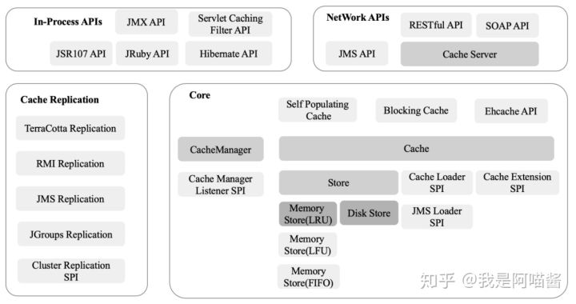

**3.Ehcache 的存储方式**

Ehcache 的存储方式包括堆存储、堆外存储和磁盘存储。

**（1）堆存储：**将缓存数据存储在 Java 堆内存中，其**特点是存取速度快，但容量有限。**

**（2）堆外存储：**基于 NIO 的 DirectByteBuffers 实现，将缓存数据存储在堆外内存上。其**特点是比磁盘存取速度快，而且不受 GC 的影响**，可以保证响应时间的稳定性，在内存分配上开销比堆内存大，而且要求必须以字节数组方式存储，因此对象必须在存储过程中进行序列化，对读取操作则进行反序列化，数据存取速度比堆内存慢一个数量级。

**（3）磁盘存储：**将数据存储在磁盘上，保障服务重启后内存数据能够重新从磁盘上加载，其**读取效率最低**，是内存数据持久化的一种方式。

**4.Ehcache 的扩展模块**

Ehcache 是开放的缓存系统，除自身的实现外还有其他扩展模型，这些扩展模型是相互独立的库，每个都为 Ehcache 添加新的功能

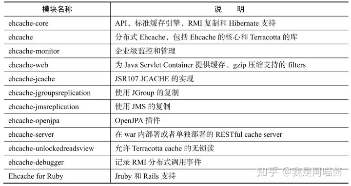

### **2.2.应用**

在 Spring Boot 中使用 Ehcache 组件比较简单，分为引入 jar 包、配置 ehcache.xml 和使用 Ehcache 缓存。

**（1）引入 jar 包。**按照如下代码在 Spring Boot 项目中引入 ehcache-3.7.0 的 jar 包依赖：

**（2）设置 ehcache.xml。**在项目 resource 的目录下新建 ehcache.xml 配置文件，并加入以下配置：

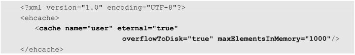

以上代码在 ehcache.xml 配置文件中声明了一个名称为 user 的缓存，其中 eternal=true 表示缓存对象永不过期，maxElementsInMemory 表示内存中该 Cache 可存储最大的数据量，overflowToDisk=true 表示在内存缓存的对象数量达到了 maxElementsInMemory 界限后，会把溢出的对象写到磁盘缓存中。注意：如果需要将缓存的对象写入磁盘中，则该对象必须实现了 Serializable 接口。

**（3）使用 Ehcache 缓存：**

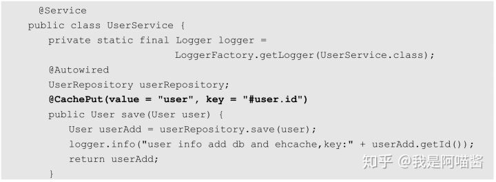

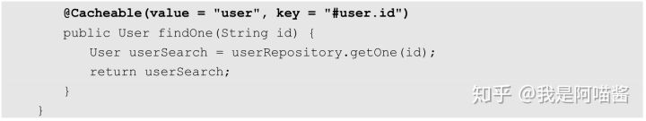

以上代码定义了名为 UserService 的类，同时定义了保存用户数据的方法 save()和查找用户数据的方法 findOne()，并分别在方法上通过@Cacheable（value = 「user」，key =「#user.id」）开启 Ehcache 缓存。

## **3.Redis原理及应用**

开源（BSD 许可证）的内存中的数据结构存储系统，可以用作**数据库、缓存和消息中间件**，支持多种类型的数据结构。

Redis 内置了**复制、Lua 脚本、LRU 驱动事件、事务和不同级别的磁盘持久化**，并通过 Redis 哨兵（Sentinel）模式和集群模式（Cluster）提供高可用性（High Availability）。

### **3.1.原理**

丰富的数据类型，还支持分布式事务、数据分片、数据持久化等功能

**1.Redis 的数据类型**

支持 String、Hash、List、Set、ZSet、Bitmap、HyperLogLog 和 Geospatial 这 8 种数据类型。

（1）String：基本类型，一个 key 对应一个 value。最大能存储 512MB 数据。Redis 的 String 数据类型支持丰富的操作命令

（2）Hash：Redis Hash 是一个键值（key->value）对集合。操作如表下

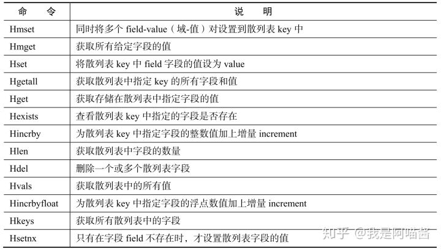

（3）List：简单的字符串列表，按照插入顺序排序。我们可以添加一个元素到列表的头部（左边）或者尾部（右边）。列表最多可存储 231-1（4 294 967 295≈4 亿多）个元素。

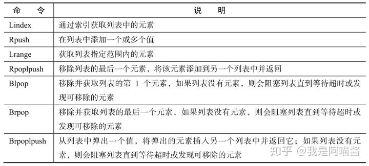

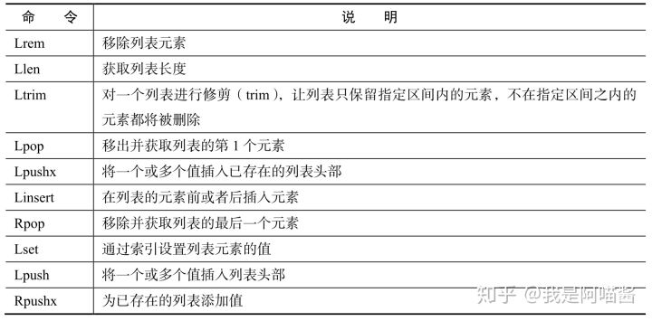

（4）Set：String 类型的无序集合。集合是通过散列表实现的，所以添加、删除、查找的复杂度都是 O(1)。

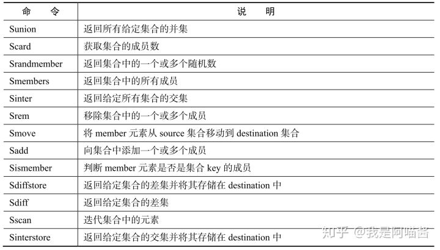

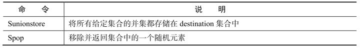

（5）ZSet：和 Set 一样也是 String 类型元素的集合，且不允许有重复的成员，不同的是，每个元素都会关联一个 double 类型的分数。Redis 正是通过分数来为集合中的成员进行从小到大的排序的。

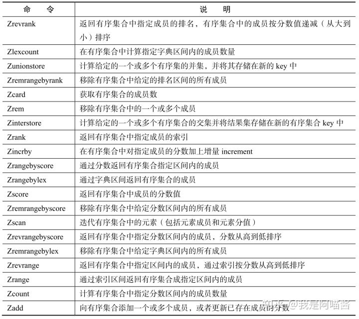

（6）Bitmap：通过操作二进制位记录数据

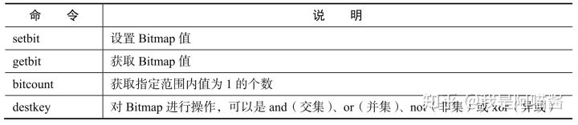

（7）HyperLogLog：被用于估计一个 Set 中元素数量的概率性的数据结构

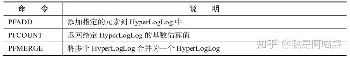

（8）Geospatial：用于地理空间关系计算

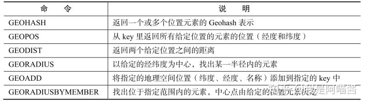

**2.Redis 管道**

**Redis基于TCP 。**

在客户端向服务器发送一个查询请求后，需要监听 Socket 的返回，该监听过程一直阻塞，直到服务器有结果返回。

集群部署在多个服务器上的，所以请求/响应模型在每次请求时都要跨网络在不同的服务器之间传输数据，这样每次查询都存在一定的网络延迟（服务器之间的网络延迟一般在 20ms 左右）。

由于服务器一般采用多线程处理业务，并且内存操作效率很高，所以如果一次请求延迟 20ms，则多次请求的网络延迟会不断累加。

在分布式环境下，Redis 的**性能瓶颈**主要体现在**网络延迟上**。Redis 请求/响应模型的数据请求、响应流程如下图

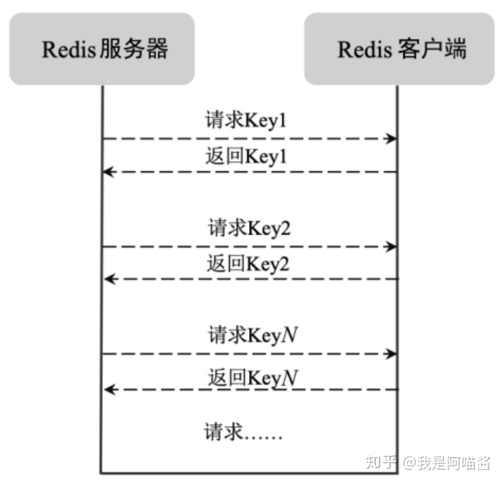

**Redis 的管道技术**指在服务端未响应时，客户端可以继续向服务端发送请求，并最终一次性读取所有服务端的响应。

管道技术能减少客户端和服务器交互的次数，将客户端的请求批量发送给服务器，服务器针对批量数据分别查询并统一回复，能显著提高 Redis 的性能。

管道模型的数据请求流程如下图

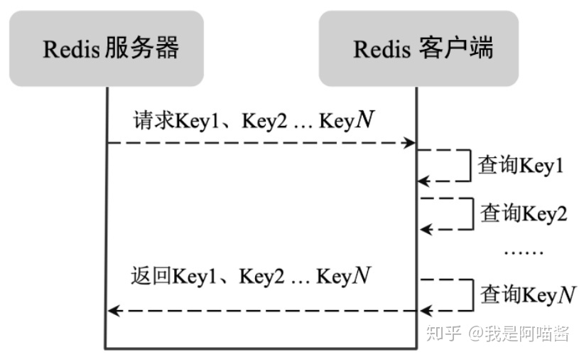

Redis 管道技术基于 Spring Boot 的使用如下：

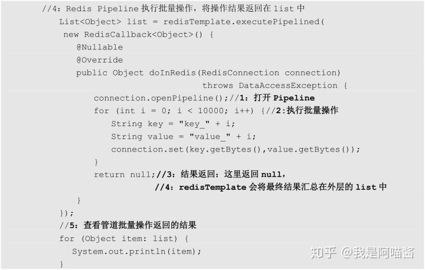

以上代码使用 redisTemplate.executePipelined()在 Spring Boot 中实现了基于 Redis 的管道操作。

具体的步骤为：

- 新建 RedisCallback 对象并覆写 doInRedis()；
- 在 doInRedis()中通过 connection.openPipeline()开启 Pipeline 操作；
- 在 for 循环中批量进行 Redis 数据写操作；最终将批量操作结果返回。

**3.Redis 的事务**

**支持分布式环境下的事务操作**，其事务可以一次执行多个命令，事务中的所有命令都会序列化地顺序执行。事务在执行过程中，不会被其他客户端发送来的命令请求打断。服务器在执行完事务中的所有命令之后，才会继续处理其他客户端的其他命令。Redis 的事务操作分为开启事务、命令入队列、执行事务三个阶段。Redis 的事务执行流程如下

（1）事务开启：客户端执行 Multi 命令开启事务。

（2）提交请求：客户端提交命令到事务。

（3）任务入队列：Redis 将客户端请求放入事务队列中等待执行。

（4）入队状态反馈：服务器返回 QURUD，表示命令已被放入事务队列。

（5）执行命令：客户端通过 Exec 执行事务。

（6）事务执行错误：在 Redis 事务中如果某条命令执行错误，则其他命令会继续执行，不会回滚。可以通过 Watch 监控事务执行的状态并处理命令执行错误的异常情况。

（7）执行结果反馈：服务器向客户端返回事务执行的结果。

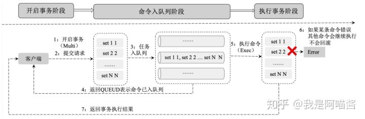

Redis 事务的相关命令 Multi、Exec、Discard、Watch 和 Unwatch

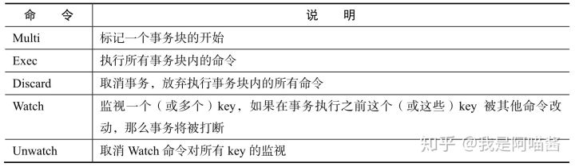

Redis 事务基于 Spring Boot 的使用如下：

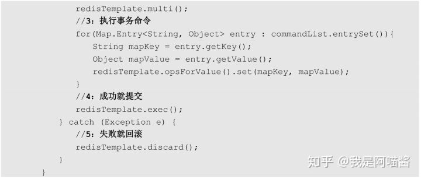

以上代码定义了名为 transactionSet()的 Redis 事务操作方法，该方法接收事务命令 commandList 并以事务命令列表在一个事务中执行。

具体步骤为：

- 开启事务权限
- 开启事务
- 执行事务命令
- 提供事务
- 回滚事务

**4.Redis 发布、订阅**

Redis 发布、订阅是一种消息通信模式：

发送者（Pub）向频道（Channel）发送消息，订阅者（Sub）接收频道上的消息。

Redis 客户端可以订阅任意数量的频道，发送者也可以向任意频道发送数据。

下图展示了 1 个发送者（pub1）、1 个频道（channe0）和 3 个订阅者（sub1、sub2、sub3）的关系。

由于 3 个订阅者 sub1、sub2、sub3 都订阅了频道 channel0，在发送者 pub1 向频道 channel0 发送一条消息后，这条消息就会被发送给订阅它的三个客户端。

常用消息订阅与发布命令

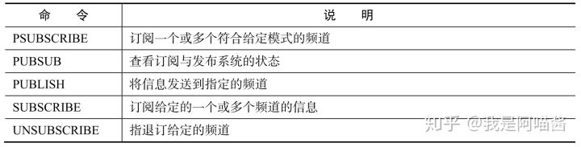

**5.Redis 集群数据复制的原理**

Redis 提供了复制功能，可以实现在主数据库（Master）中的数据更新后，自动将更新的数据同步到从数据库（Slave）。一个主数据库可以拥有多个从数据库，而一个从数据库只能拥有一个主数据库。

Redis 的主从数据复制原理如下

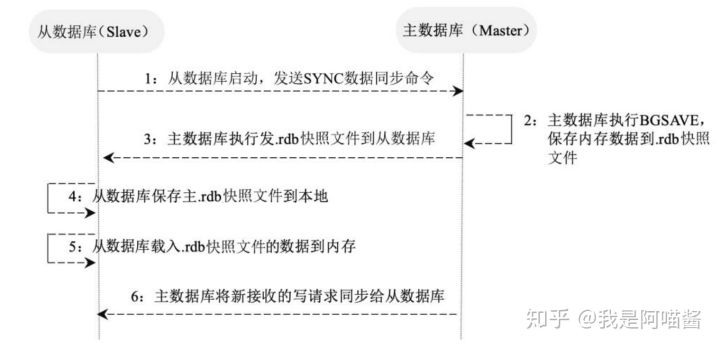

（1）一个从数据库在启动后，会向主数据库发送 SYNC 命令。

（2）主数据库在接收到 SYNC 命令后会开始在后台保存快照（即 RDB 持久化的过程），并将保存快照期间接收到的命令缓存起来。在该持久化过程中会生成一个.rdb 快照文件。

（3）在主数据库快照执行完成后，Redis 会将快照文件和所有缓存的命令以.rdb 快照文件的形式发送给从数据库。

（4）从数据库收到主数据库的.rdb 快照文件后，载入该快照文件到本地。

（5）从数据库执行载入后的.rdb 快照文件，将数据写入内存中。以上过程被称为复制初始化。

（6）在复制初始化结束后，主数据库在每次收到写命令时都会将命令同步给从数据库，从而保证主从数据库的数据一致。

在 Redis 中开启复制功能时需要在从数据库配置文件中加入如下配置，对主数据库无须进行任何配置：

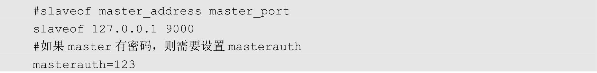

在上述配置中，slaveof 后面的配置分别为主数据库的 IP 地址和端口，在主数据库开启了密码认证后需要将 masterauth 设置为主数据库的密码，在配置完成后重启 Redis，主数据库上的数据就会同步到从数据库上。

**6.Redis 的持久化**

支持 **RDB** 和 **AOF** 两种持久化

（1）**RDB**（Redis DataBase）：RDB 在指定的时间间隔内对数据进行快照存储。RDB 的**特点**在于：文件格式紧凑，方便进行数据传输和数据恢复；在保存.rdb 快照文件时父进程会 fork 出一个子进程，由子进程完成具体的持久化工作，所以可以**最大化 Redis 的性能**；同时，与 AOF 相比，在**恢复大的数据集时会更快一些**。

（2）**AOF**（Append Of Flie）：AOF 记录对服务器的每次写操作，在 Redis 重启时会重放这些命令来恢复原数据。AOF 命令以 Redis 协议追加和保存每次写操作到文件末尾，Redis 还能对 AOF 文件进行后台重写，使得 AOF 文件的体积不至于过大。AOF 的**特点**有：**可以使用不同的 fsync 策略**（无 fsync、每秒 fsync、每次写的时候 fsync），只有某些操作追加命令到文件中，操作效率高；同时，**AOF 文件是日志的格式，更容易被操作**。

**7.Redis 的集群模式及工作原理**

三种集群模式：**主从模式**、**主从模式**和**集群模式**。

（1）**主从模式**：所有的写请求都被发送到主数据库上，再由主数据库将数据同步到从数据库上。主数据库主要用于执行写操作和数据同步，从数据库主要用于执行读操作缓解系统的读压力。

Redis 的一个主库可以拥有多个从库，从库还可以作为其他数据库的主库。Master 的从库有 Slave-0 和 Slave-1，同时 Slave-1 作为 Slave-1-0 和 Slave-1-1 的主库。

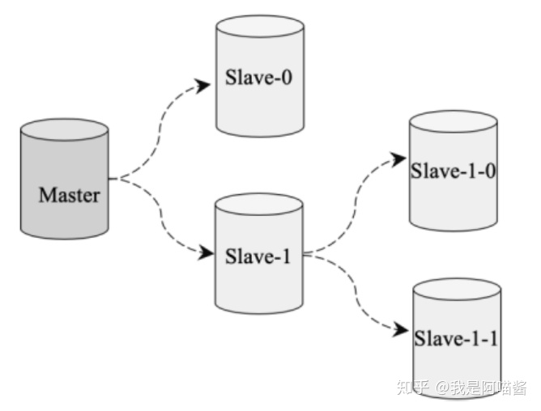

（2）**哨兵模式**：在主从模式上添加了一个哨兵的角色来监控集群的运行状态。哨兵通过发送命令让 Redis 服务器返回其运行状态。哨兵是一个独立运行的进程，在监测到 Master 宕机时会自动将 Slave 切换成 Master，然后通过发布与订阅模式通知其他从服务器修改配置文件，完成主备热切。

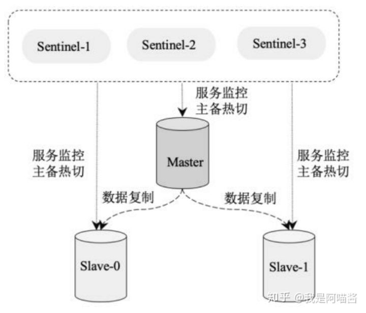

（3）**集群模式**：Redis 集群实现了在多个 Redis 节点之间进行数据分片和数据复制。基于 Redis 集群的数据自动分片能力，我们能够方便地对 Redis 集群进行横向扩展，以提高 Redis 集群的吞吐量。基于 Redis 集群的数据复制能力，在集群中的一部分节点失效或者无法进行通信时，Redis 仍然可以基于副本数据对外提供服务，这提高了集群的可用性。Redis 的集群模式

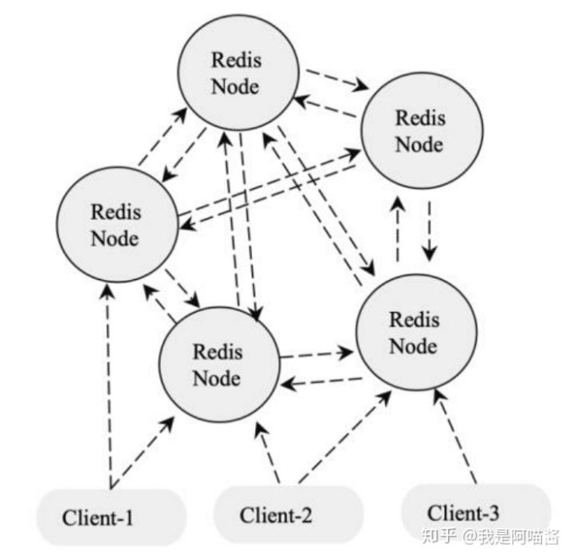

**Redis 集群遵循原则：**

- 所有 Redis 节点彼此都通过 PING-PONG 机制互联，内部使用二进制协议优化传输速度和带宽。
- 在集群中超过半数的节点检测到某个节点 Fail 后将该节点设置为 Fail 状态。
- 客户端与 Redis 节点直连，客户端连接集群中任何一个可用节点即可对集群进行操作。
- Redis-Cluster 把所有的物理节点都映射到 0～16383 的 slot（槽）上，Cluster 负责维护每个节点上数据槽的分配。Redis 的具体数据分配策略为：在 Redis 集群中内置了 16384 个散列槽；在需要在 Redis 集群中放置一个 Key-Value 时，Redis 会先对 Key 使用 CRC16 算法算出一个结果，然后把结果对 16384 求余数，这样每个 Key 都会对应一个编号为 0～16383 的散列槽；Redis 会根据节点的数量大致均等地将散列槽映射到不同的节点。

### **3.2.应用**

**1.安装 Redis**

分为 Redis **单机版**、 **主从模式版**、 **哨兵模式版**和 **集群模式版**。

下面介绍 **Redis 集群模式**的安装，该模式也是最复杂的一种模式。其他 Redis 模式的安装请参考官网。

（1）下载 Redis 软件。执行以下命令从官网下载稳定版本的 Redis 并解压：

（2）编译和安装。执行以下命令进入 Redis 的安装目录编译和安装 Redis：

（3）创建 Redis 节点。执行以下命令在 Redis 根目录下创建节点目录：

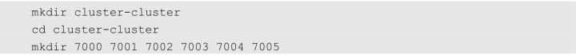

以上命令分别建立了 7000、7001、7002、7003、7004、7005 共 6 个目录，用于存放 6 个节点的配置文件信息。将 redis.conf 文件分别复制到 7000、7001、7002、7003、7004、7005 目录下，并修改端口号和 cluster-config-file。

（4）配置 Redis 集群。分别修改 7000、7001、7002、7003、7004、7005 目录下的 redis.conf 配置文件：

在以上配置中，port 用于指定 Redis 服务端口，cluster-enabled 用于设置 Redis 为集群模式，cluster-config-file 用于设置集群配置文件。

（5）启动节点。执行以下命令分别启动 6 个节点：

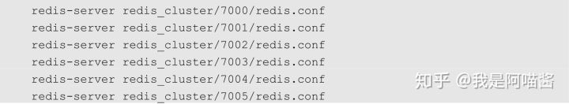

（6）创建集群。执行以下命令创建集群：

以上命令中：

- cluster 表示该命令是集群相关的命令；
- create 表示创建一个集群，create 后面的参数为参与集群创建的节点；
- cluster-replicas 表示集群中的副本数。在创建集群的过程中命令行会列出集群的配置让我们确认，确认时输入 yes 即可。

这样便在一个服务器上安装了一个 Reds 集群，在该集群中共有 6 个节点，节点的 IP 地址为 127.0.0.1，节点的端口号分别为 7000、7001、7002、7003、7004 和 7005。

**2.应用 Redis SpringBoot**

在 Spring Boot 中使用 Redis 的步骤为：引入 jar 包、配置 application.properties，以及配置和使用 RedisTemplate，如下所述。

（1）引入 jar 包。按照如下代码在 Spring Boot 项目中加入 Redis 的 jar 包依赖：

（2）配置 application.properties：在 resource 目录的 application.properties 加入以下 Redis 配置：

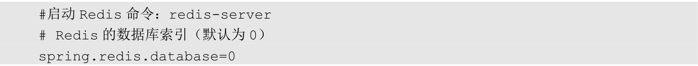

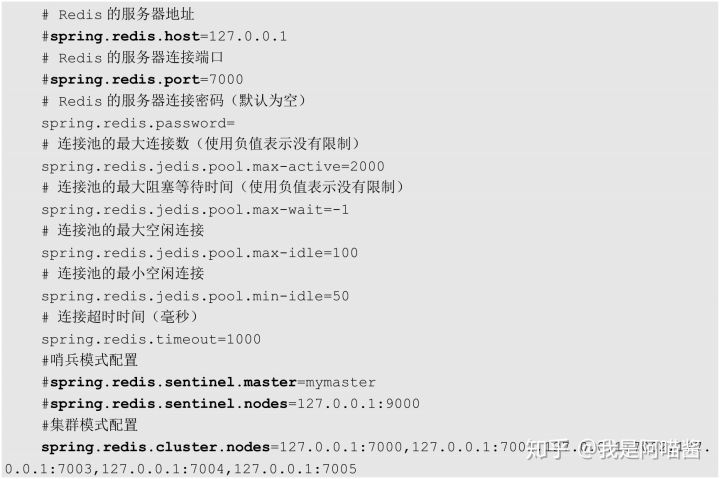

以上配置中，

- spring.redis.cluster.nodes 为 Redis 集群节点的服务地址，在多个服务地址之间使用逗号隔开；
- spring.redis.password 为 Redis 服务密码，如果没有密码，则将其设置为空即可。

需要注意的是，以上是集群模式下的 Redis 配置，如果 Redis 是主从模式，则将 spring.redis.cluster.nodes 地址修改为主从节点的服务地址即可；如果是哨兵模式，则注释掉 spring.redis.cluster.nodes 配置，在 spring.redis.sentinel.master 和 spring.redis.sentinel.nodes 中分别配置哨兵的名称和哨兵的节点即可；如果是单机模式，则注释掉 spring.redis.sentinel.nodes 的配置，通过 spring.redis.host 配置 Redis 服务的地址，并通过 spring.redis.port 配置 Redis 服务的端口即可。

（3）配置 RedisTemplate。Spring Boot 默认配置了 RedisTemplate，在应用时注入、使用即可，也可以创建自定义的 RedisTemplate。

以上代码定义了 RedisConfig 类，并通过@Configuration 开启配置文件注解，通过@AutoConfigureAfter 配置自动注解类。在 RedisConfig 类中定义了 RedisTemplate 用于对 Redis 数据库进行操作。

（4）使用 RedisTemplate。新建测试类，并在测试类中加入以下测试代码：

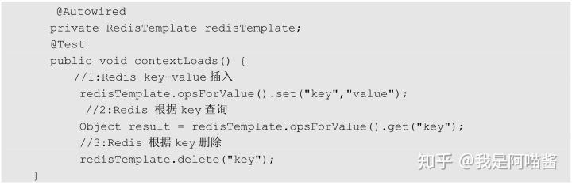

RedisTemplate 基于 Jedis 对 Redis 数据库的操作进行了二次封装，使得操作 Redis 数据库更加方便。以上代码在测试类中依赖注入了 RedisTemplate，并通过 redisTemplate. opsForValue()实现了对 Redis 数据的插入、查询和删除操作。

## **4.分布式缓存设计核心问题**

### **4.1.缓存预热**

在用户请求数据前预先将数据加载到缓存系统中，用户查询事先被预热的缓存数据，以提高系统查询效率。

有**系统启动加载**、**定时加载**等方式。

### **4.2.缓存更新**

缓存更新指在数据发生变化后及时将变化后的数据更新到缓存中。更新策略有 4 种。

- 定时更新：定时将底层数据库内的数据更新到缓存中，方法简单，适合需要缓存的数据量不是很大的应用场景。
- 过期更新：定时将缓存中**过期的数据更新为最新数据**并**更新缓存的过期时间**。
- 写请求更新：在用户有写请求时先写数据库同时更新缓存，这适用于用户对缓存数据和数据库的数据有实时强一致性要求的情况。
- 读请求更新：在用户有读请求时，先判断该请求数据的缓存是否存在或过期，如果不存在或已过期，则进行底层数据库查询并将查询结果更新到缓存中，同时将查询结果返回给用户。

### **4.3.缓存淘汰策略**

**数据过多时需要使用某种淘汰算法决定淘汰哪些数据。**常用淘汰算法：

- FIFO（First In First Out，**先进先出**）：判断被存储的时间，离目前最远的数据优先被淘汰。
- LRU（Least Recently Used，**最近最少使用**）：判断缓存最近被使用的时间，距离当前时间最远的数据优先被淘汰。
- LFU（Least Frequently Used，**最不经常使用**）：在一段时间内，被使用次数最少的缓存优先被淘汰。

### **4.4.缓存雪崩**

在**同一时刻大量缓存失效**，导致大量原本应该访问缓存的请求都去查询数据库，而对数据库造成巨大压力，严重的话会导致数据库宕机，形成一系列连锁反应，使系统崩溃。一般有3 种处理方法。

- 请求加锁：对于并**发量不是很多**的应用，使用请求加锁排队的方案防止过多请求数据库。
- 失效更新：**为每一个缓存数据都增加过期标记**来记录缓存数据是否失效，如果缓存标记失效，则更新数据缓存。
- 设置不同的失效时间：**为不同的数据设置不同的缓存失效时间**，防止在同一时刻有大量的数据失效。

### **4.5.缓存穿透**

缓存穿透指由于缓存**系统故障**或者用户**频繁查询系统中不存在的数据**，而这时请求穿过缓存不断被发送到数据库，导致数据库过载，进而引发一连串并发问题。

常用的解决策略。

- **布隆过滤器**：指**将所有可能存在的数据都映射到一个足够大的 Bitmap 中**，在用户发起请求时首先**经过布隆过滤器的拦截**，一个一定不存在的数据会被这个布隆过滤器拦截，从而避免对底层存储系统带来查询上的压力。
- **cache null 策略**：指**如果一个查询返回的结果为 null（可能是数据不存在，也可能是系统故障），我们仍然缓存这个 null 结果**，但它的过期时间会很短，通常不超过 5 分钟；在用户再次请求该数据时直接返回 null，而不会继续访问数据库，从而有效保障数据库的安全。其实 cache null 策略的核心原理是：在缓存中记录一个短暂的（数据过期时间内）数据在系统中是否存在的状态，如果不存在，则直接返回 null，不再查询数据库，从而避免缓存穿透到数据库上。

### **4.6.缓存降级**

缓存降级指**由于访问量剧增导致服务出现问题**（如响应时间慢或不响应）时，**优先保障核心业务**的运行，**减少或关闭非核心业务**对资源的使用。常见的服务降级策略如下。

- **写降级**：在写请求增大时，可以只进行 Cache 的更新，然后将数据异步更新到数据库中，保证最终一致性即可，即将写请求从数据库降级为 Cache。
- **读降级**：在数据库服务负载过高或数据库系统故障时，可以只对 Cache 进行读取并将结果返回给用户，在数据库服务正常后再去查询数据库，即将读请求从数据库降级为 Cache。这种方式适用于对数据实时性要求不高的场景，保障了在系统发生故障的情况下用户依然能够访问到数据，只是访问到的数据相对有延迟。

## **5.总结**

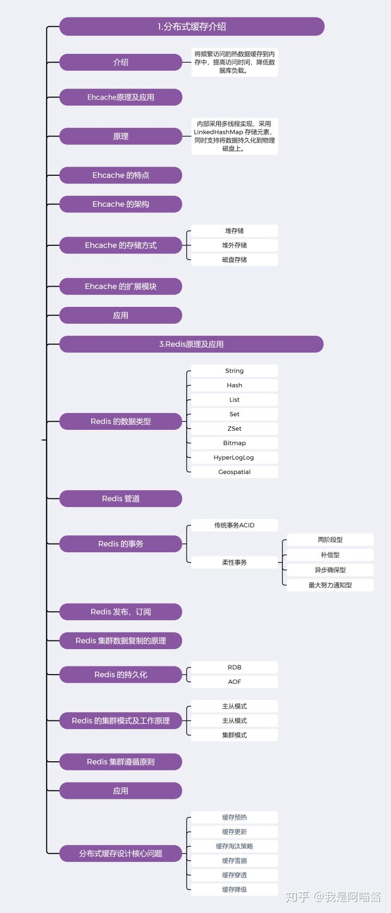