# **第一章 JVM**

### **1.JVM运行机制**

**JVM定义：**

运行Java字节码的虚拟机。

**Java运行过程：**

- **Java源文件**(.java)被**编译器**编译成**字节码**(.class)文件
- **JVM**将**字节码**编译成对应操作系统的**机器码**
- **机器码**调用对应系统的**本地方法库**执行相应方法

**JVM包括：**

- 类加载子系统 Class Loader SubSystem
- 运行时数据区 Runtime Data Area
- 执行引擎
- 本地接口库 Native Interface Library （本地接口库通过调用本地方法库与OS交互

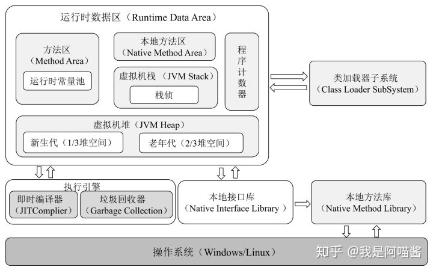

**上图中：**

- **类加载器子系统**将.Class文件加载到JVM中

- **运行时数据区**存储JVM运行时产生的数据

- **执行引擎**包括

- - **即时编译器**：将.Class编译成机器码
  - **垃圾回收器**：回收不再使用的对象

- **本地方法库**调用OS本地方法库完成指令操作

### **2.JVM线程**

**JVM后台运行线程：**

- **虚拟机线程 JVM Thread**

- - 在JVM到达安全点（SafePoint）时出现

- **周期性任务线程**

- - 通过 **定时器** 来调度 线程，实现周期性任务执行

- **GC线程**

- - 用于垃圾回收

- **编译器线程**

- - 将.Class动态编译成机器码

- **信号分发线程**

- - 接收发送给JVM的信号并调用JVM

### **3.JVM内存区域**

**JVM内存分为：**

- **线程私有区域**

- - 程序计数器
  - 虚拟机栈
  - 本地方法区

- **线程共享区域**

- - 堆
  - 方法区

- **直接内存**

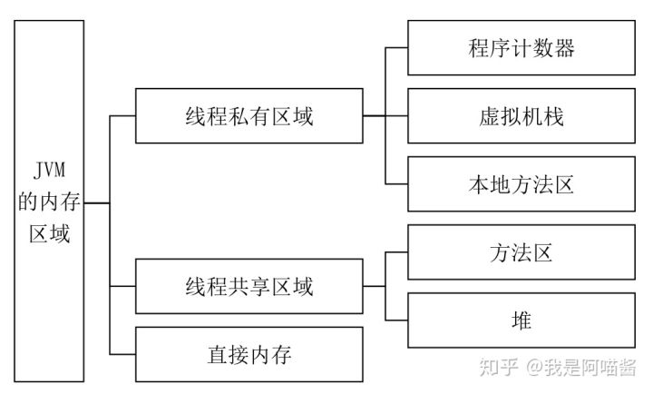

上图中：

- **线程私有区域：**

- - 生命周期与线程相同，同生共死。

- **线程共享区域：**

- - 与JVM同生共死。

- **直接内存：**

- - 又称堆外内存。
  - JDK的NIO就是基于堆外内存实现。
  - Java进程可以通过堆外内存技术避免在Java堆与Native来回复制数据带来资源浪费与性能损耗。
  - 因此在高并发场景广泛使用（Netty、Flink、HBase、Hadoop

### **3.1 程序计数器**

**程序计数器：**

- 用于存储当前线程执行的字节码**行号指示器**
- 属于**线程私有**内存区域，唯一**没有内存溢出**（OOM）问题的区域

### **3.2.JVM栈**

**JVM栈：**

- 描述方法执行过程的内存模型
- 在当前栈帧中存储局部变量表、操作数栈、动态链接、返回地址等信息

**栈帧：**

- 存储部分运行数据及数据结构
- 处理**动态链接**方法**返回值**和**异常分派**
- 记录方法执行过程。
- 方法执行时JVM会创建对应的栈帧。
- 方法执行和返回对应栈帧在JVM栈中的入栈与出栈。

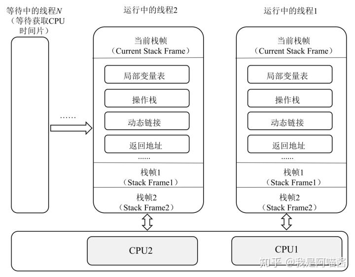

上图：

- 线程1在CPU1执行
- 线程2在CPU2执行
- 线程N在等待获取CPU时间片
- 每个方法的执行对应一个栈帧
- 每个线程只能存在一个活动的栈帧

### **3.3.本地方法区**

本地方法区与JVM栈类似

**不同的是**

- JVM栈为Java方法服务
- 本地方法为Native方法服务

### **3.4.堆**

- JVM运行产生的对象和数据存储在堆中

- 堆是线程共享的内存区域

- 是垃圾回收器进行垃圾回收的最主要区域

- 由于现代JVM采用**分代收集算法**，因此堆从GC角度还可以分为：

- - 新生代
  - 老年代
  - 永久代

### **3.5.方法区**

被称为永久代，存储存储常量、静态变量、类信息、机器码、运行时常量池等数据。

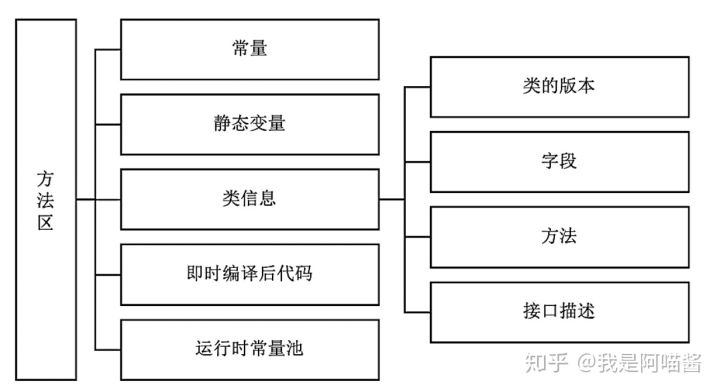

### **4.JVM运行时内存**

- 也叫JVM堆
- GC角度分为新生代（占1/3）、老年代（占2/3）和永久代（占很少）。新生代又分为3个区。

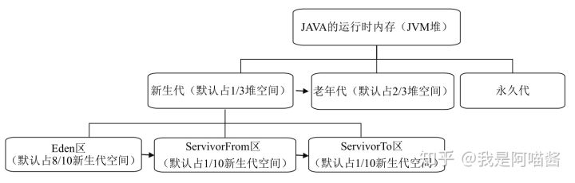

### **4.1.新生代**

**新生代**

- 新建对象存放区域（大对象除外）
- 由于JVM频繁创建对象，新生代会频繁GC
- 新生代GC算法叫做**复制算法**

**Eden区**

新建对象首先存放区，如果是大对象，会放在老年代。

**SurvivorFrom区**

将上次GC幸存者作为这次GC扫描对象

**SurvivorTo区**

保留上次GC幸存者

**新生代GC过程：**

- 将Eden区和SurvivorFrom区存活对象复制到SurvivorTo区中。如果对象年龄太大或SurvivorTo区内存不够或是大对象，则直接复制到老年代中。
- 清空Eden区和SurvivorFrom区对象
- 将SurvivorTo区与SurvivorFrom区互换，原先的SurvivorTo区成为下次GC的SurvivorFrom区

### **4.2.老年代**

- 存储长生命周期对象与大对象

- 对象比较稳定，不会频繁GC

- 老年代GC算法叫做标记清除算法

- - 首先扫描所有对象并标记存活对象，然后回收未标记对象。

- 老年代GC时间长
- 老年代没有内存可分配时，会抛出OOM

### **4.3.永久代**

**永久代**

- 意味内存永久保留区域
- 主要存放Class和元数据
- 运行时不会被GC，因此永久代内存随着Class文件增加而增加，加载过多Class文件会抛出OOM。比如Tomcat引用Jar文件过多导致无法启动
- Java8中，永久代被元数据区取代。

**永久代与元数据区区别**

元数据区没有使用JVM内存，而是使用OS内存。因此元数据内存不再被JVM内存限制，只和OS内存有关

### **5.垃圾回收算法**

### **1.5.1如何确定垃圾**

通过**引用计数法**和**可达性分析**来判断对象是否可回收。

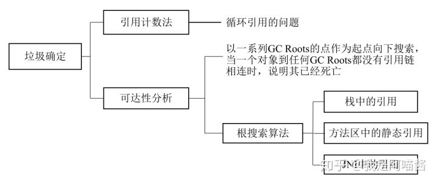

**引用计数法**

- Java如果操作一个对象，就要获得对象的引用。

- - 为对象添加引用时，引用计数+1。
  - 减少一个引用时，引用计数-1。
  - 当引用计数为0，说明对象没有被引用，可被回收。

- 引用计数法会导致循环引用问题，当两个对象相互引用时，就不能被回收。

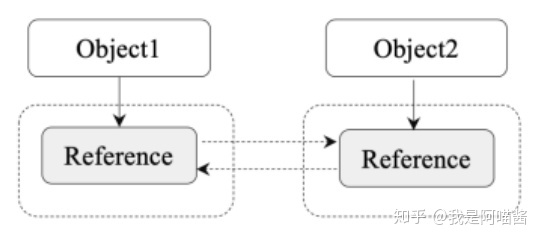

**可达性分析**

- 为解决引用计数的循环引用问题而设计
- 定义一些GC ROOTS对象，以这些GC ROOTS对象作为起点，向下搜索。
- 如果一个对象和GC ROOTS没有可达路径，则称这个对象不可达。
- 不可达对象被两次标记后回收。

### **1.5.2.Java中常用GC算法**

标记清除法、复制法、标记整理法、分代收集法

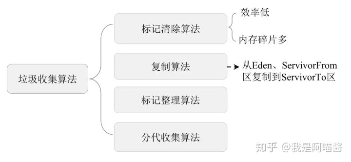

**标记清除法**

- 基础GC算法
- 分为标记和清除两阶段
- 标记阶段标记，清除阶段回收

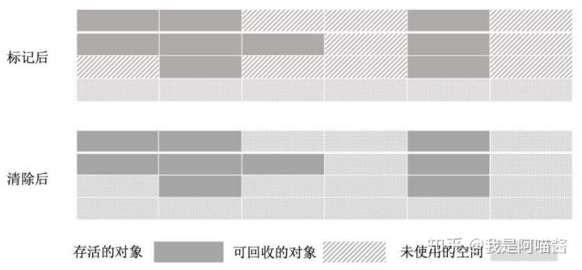

标记清除法的问题：

如果回收小对象过多，会引起内存碎片化，导致大对象无法获取连续可用内存问题。

**复制算法**

为解决标记算法内存碎片问题而设计

将内存划分为相等内存区，即区域1和区域2。

新对象放在区域1中，区域1满了就将区域1对象标记，将标记后存活对象复制到区域2中。清空区域1。

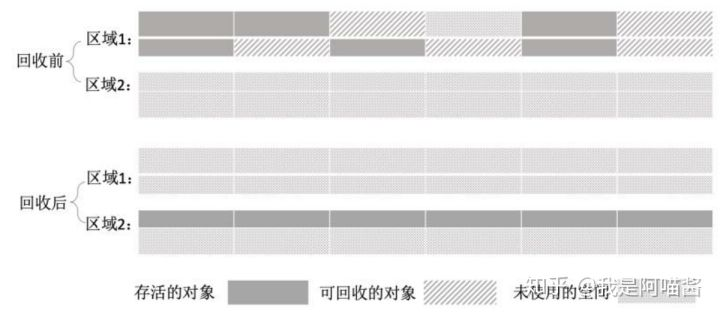

复制算法问题：

每次只用一般内存，浪费空间。

区域1与区域2来回复制影响性能。

**标记整理算法**

- 结合上面两个算法优点。
- 标记阶段和标记清除算法一样。
- 清除阶段和复制算法一样。将存活对象移到内存另一个区域。

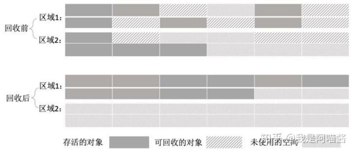

**分代收集算法**

- 上面3个算法都无法对所有类型对象回收（长生命对象、短生命对象、大对象、小对象）。
- 因此针对不同对象，设计了分代收集算法。
- 新生代存放新对象，数量多，生命短，每次GC都大量被回收。采用复制算法。
- 老年代存放大对象，生命长，被GC数量少。采用标记清除算法。

### **6.Java中的4种引用类型**

- 强引用

- - 将一个对象赋值给另一个对象时。强引用一定会为可达性，因此不会被GC。强引用也是造成内存泄漏的主要原因。

- 软引用

- - 通过SoftReference类实现。系统内存不足时会被回收。

- 弱引用

- - 通过WeakReference类实现。GC过程中一定会被回收。

- 虚引用

- - 通过PhantomReference类实现，虚引用和引用队列一起使用，用于追踪对象的垃圾回收状态。

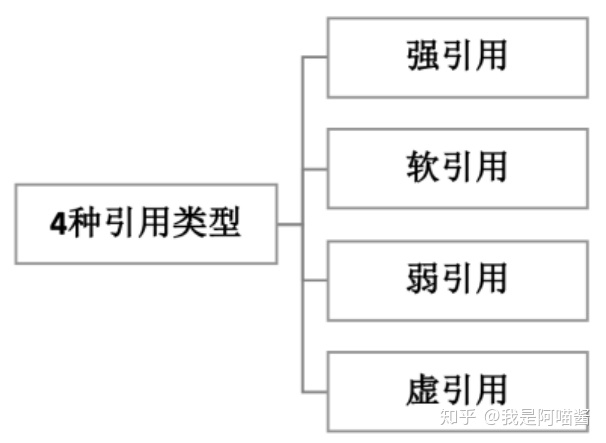

### **7.分代收集算法和分区收集算法**

- 分代收集算法

- - 新生代用复制算法
  - 老年代用标记整理算法

- 分区收集算法

- - 将堆内存划分为连续大小不等的小区域，每个小区域单独运行与GC。
  - 好处是根据每个小区域灵活使用使用和释放内存。

### **8.垃圾收集器**

Java堆内存分为新生代与老年代。新生代用复制算法进行GC。老年代用标记整理进行GC。

因此JVM为新生代和老年代提供了不同的GC器。

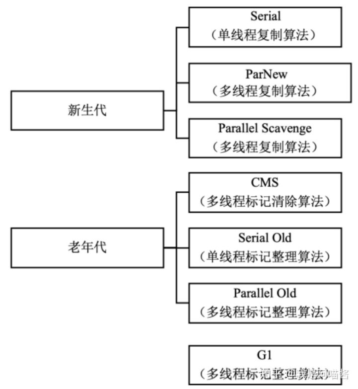

Serial：

新生代，单线程，复制算法

ParNew:

新生代，多线程，复制算法

Parallel Scavenge：

新生代，多线程，复制算法

Serial Old:

老年代，单线程，标记整理算法。配合Serial使用

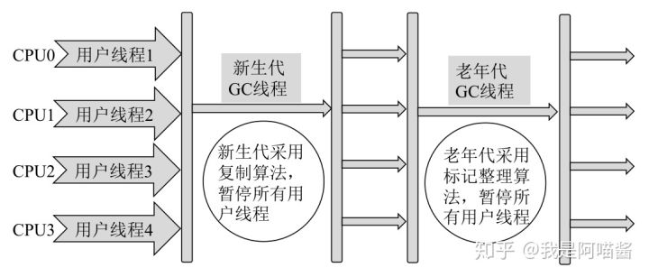

Parallel Old:

老年代，多线程，标记整理算法。配合Parallel Scavenge使用

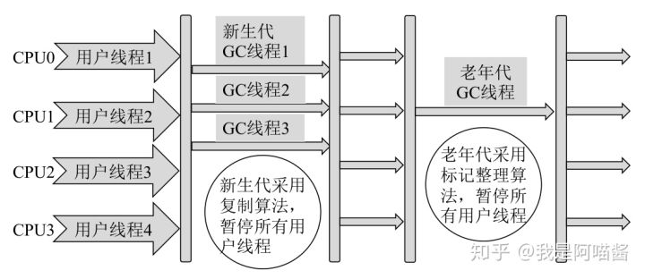

CMS:

老年代，多线程，标记清除算法。

机制复杂：

初始标记：只标记和GC Roots直接关联对象。需要暂停工作线程。

并发标记：用用户线程一起工作，执行GC Roots跟踪标记过程

重新标记：在并发标记过程中，用户线程运行导致对象状态变化，需要暂停工作线程并且重新标记。

并发清除：和用户线程一起工作，执行清除GC Roots不可达对象任务。

G1：

将堆内存划分为大小固定的独立区域，后台维护优先级表。优先回收垃圾最多区域。

相对于CMS改进：

基于标记整理算法，不产生内存碎片

在不牺牲吞吐量前提下实现最短停顿垃圾回收

### **9.网络编程**

### **1.阻塞IO**

读写数据时会发生阻塞。

工作流程：

用户线程发出IO请求，内核检查数据是否就绪，用户线程阻塞等待数据就绪；

数据就绪后，内核将数据复制到用户线程中，返回IO执行结果到用户线程，用户线程解除阻塞开始处理数据。

### **2.非阻塞IO**

用户线程发出IO请求，无须阻塞就可以得到内核返回结果。内核返回false，没准备好，需要稍后发起IO操作。

一旦数据准备好，并且再次收到用户线程请求，内核就将数据复制到用户线程中并将结果通知用户线程。

在非阻塞IO中，用户线程需要不断询问内核数据是否就绪，在未就绪时可以处理其他任务。

### **3.多路复用IO**

Java NIO模型基于此。会有一个Selector线程不断轮询多个Socket状态，在Socket有读写事件时，才通知用户线程进行IO操作。

多路复用IO可以一个线程管理多个Socket，并且只有真正Socket读写事件时才会使用操作系统的IO资源，节约资源。

### **4.信号驱动IO**

用户线程发起IO操作，系统为该请求注册一个信号函数，然后用户线程处理其他任务；

当内核数据就绪时，系统发送信号给用户线程，用户线程会在信号函数中调用对应IO操作。

### **5.异步IO**

用户线程不关心IO操作，只需要发起请求，接收到内核返回成功或失败信号时，说明IO操作完成，直接使用数据。

### **6.Java IO**

5个类

File、OutputStream、InputStream、Writer、Reader

一个接口

Serializable

### **7.NIO**

三个核心：Selector（选择器）、Channel（通道）、Buffer（缓存区）

Selector用于监听多个Channel事件

NIO与传统IO区别：

1. IO面向流。NIO面向缓冲区，方便在缓存中对数据进行前后移动操作。
2. 传统IO阻塞。NIO非阻塞。

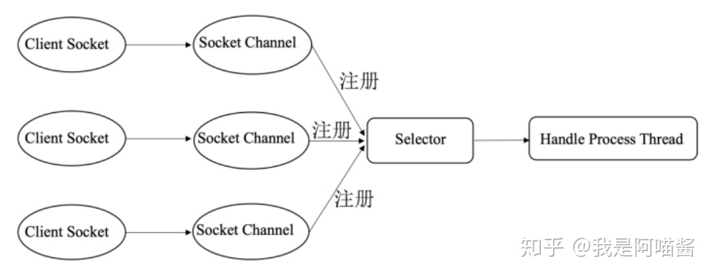

Channel:

和流Stream类似，不同的是Stream单向，Channel双向。

Buffer：

一个容器，读写必须经过Buffer。

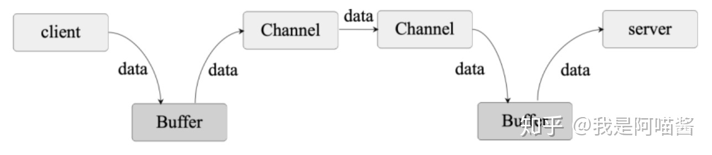

Selector:

选择器，检测多个注册的Channel是否有IO事件。一个Selector管理多个Channel。

### **10.JVM类加载机制**

### **10.1.类加载阶段**

分为：加载、验证、准备、解析、初始化

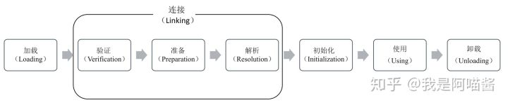

加载：

JVM读取Class文件，创建java.lang.Class对象

验证：

只有通过验证的Class文件才能被JVM加载

准备：

为方法区中的类变量分配内存空间并设置初始值

解析：

JVM将常量池中的符号引用替换为直接引用

初始化：

通过执行类构造器的<client>方法为类初始化。

### **10.2.类加载器**

JVM提供3个：启动类加载器、扩展类加载器、应用程序类加载器

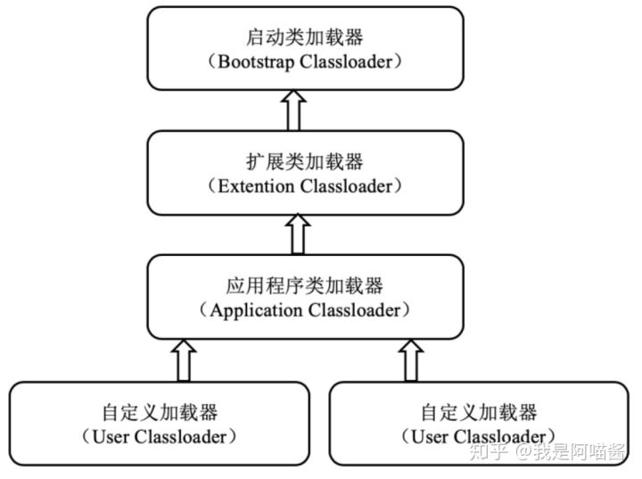

启动类加载器：

加载Java_HOME/lib目录中的类库

扩展类加载器：

加载Java_HOME/lib/ext目录中的类库

应用程序类加载器：

加载用户路径（classpath）中的类库

自定义的类加载器：

用户通过继承java.lang.ClassLoader自定义类加载器

### **10.3.双亲委派机制**

JVM通过双亲委派对类加载。

**双亲委派机制**：类收到加载请求后，自己不会加载，而是委托给父类加载。其父类接收到委派请求后，又会委托给他的父类，依此类推。这样所有类的加载请求都委托给了**启动类加载器**。

若父类收到委派，发现自己也无法加载（通常由于该类的Class文件在父类的类加载路径不存在），会将该信息反馈给子类，向下委托。直到加载成功，否则报ClassNotFound。

**双亲委派核心**：保证类的唯一性与安全性。

双亲委派流程：

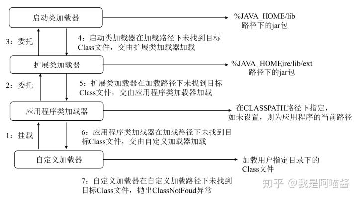

### **11.总结**

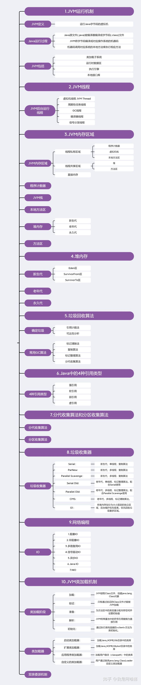