# 第2章 Java基础


### **1.集合**

Java四种集合：List、Queue、Set和Map


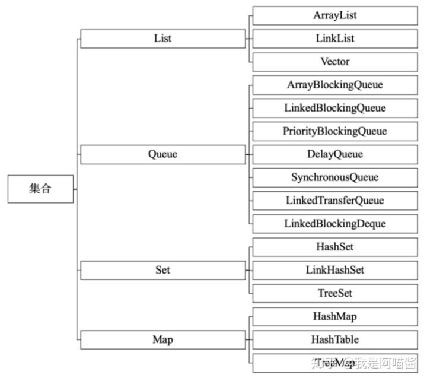


### **1.1.List：可重复**

有序的Collection

### **ArrayList：**

基于数组实现，增删慢，查询快，线程不安全

### **Vector：**

基于数组实现，增删慢，查询快，线程安全

### **LinkedList：**

基于双向链实现，增删快，查询慢，线程不安全


### **1.2.Queue：队列**

### **ArrayBlockingQueue：**

基于数组实现的有界阻塞队列

### **LinkedBlockingQueue：**

基于链表实现的有界阻塞队列

### **PriorityBlockingQueue：**

支持优先级排序的无阻塞队列

### **DelayQueue：**

支持延迟操作的无界阻塞队列

### **SynchronousQueue：**

用于线程同步的阻塞队列

### **LinkedTransferQueue：**

基于链表实现的无界阻塞队列

### **LinkedBlockingDeque：**

基于链表实现的双向阻塞队列


### **1.3.Set：不可重复**

特性独一无二，适合存储无序且值不等的元素。

对象的相等性本质是对象内存地址计算出对象的HashCode值是否相同。

### **HashSet**

HashMap实现，无序。

先判断对象散列值是否相等，相等再通过equals比较，也相等，就视作同一元素。

### **TreeSet**

二叉树实现。

Interger和String基础对象类型可以根据TreeSet默认排序存储。

自定义类型必须实现Comparable接口和覆写compareTo函数。

### **LinkedHashSet**

继承HashSet，HashMap实现数据结构，双向链表记录顺序。

底层使用LinkedHashMap。


### **1.4.Map**

### **HashMap**

数组+链表，线程不安全。

如果要线程安全，可以使用Collections的synchronizedMap方法或者用ConcurrentHashMap数据结构。


**HashMap数据结构：**

内部是数组，数组的每个元素都是一个单向链表。链表中每个元素都是Entry。Entry包含四个属性：key、value、hash值和指向下个链表的next。


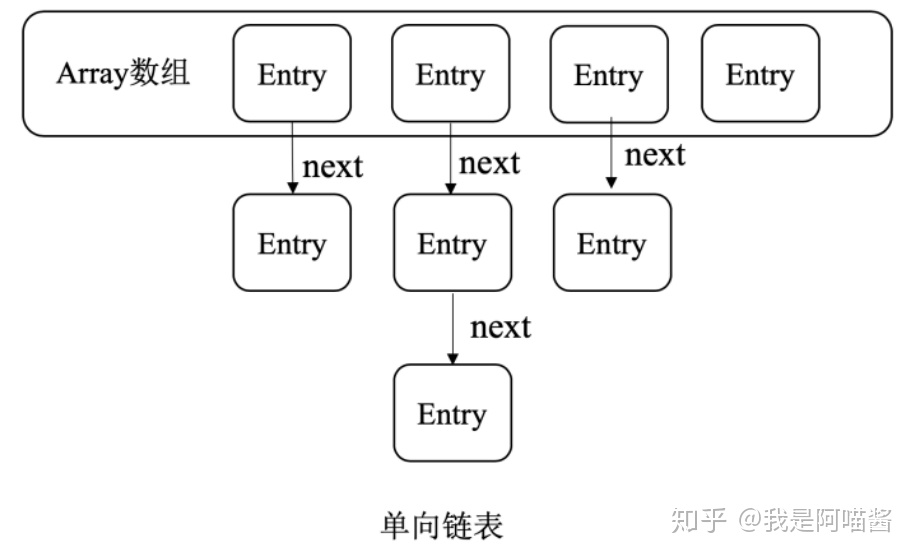


**HashMap常用参数：**

capacity：当前数组容量，默认16。每次扩容是之前两倍。

loadFactor：负载因子，默认0.75。

threhold：扩容阈值，值等于 capacity * loadFactor。


HashMap查找数据，根据Hash值可以快速定位到数组下标，但需要对链表顺序遍历才能找到，时间复杂度O(n)。

Java8对此进行了优化。当链表中的元素超过8个以后，会将链表转化为红黑树调高查询效率，时间复杂度为O(logN)。


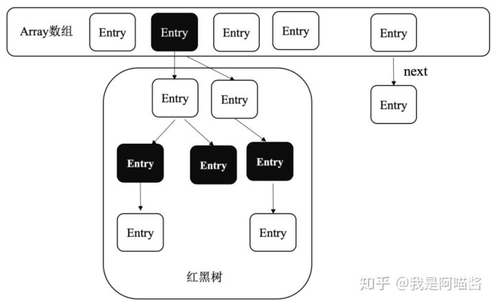


### **ConcurrentHashMap**

分段锁实现，线程安全。

通过分段锁思想实现并发操作。

有多个Segment组成（Segment数量就是锁的并发度，默认16个），每个Segment继承自ReentrantLock并单独加锁。所以每次加锁操作锁住的是一个Segment，保证了每个Segment安全，就实现了整个ConcurrentHashMap的安全。


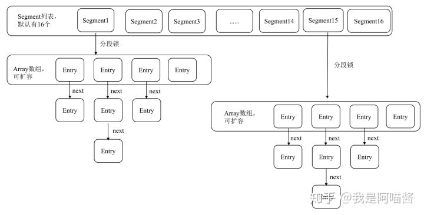


每个Segment内部数据结构和HashMap相同。如上图。


Java8种ConcurrentHashMap引入了红黑树。如下图。


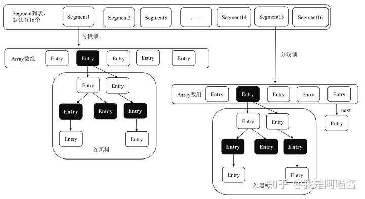


### **HashTable**

线程安全。

遗留类。

同一时刻只能一个线程写HashTable。

并发不如ConcurrentHashMap。


### **TreeMap**

基于二叉树。

同时实现了SortedMap保障元素顺序存取，默认按照键值升序。也可以自定义排序比较器。

适用于实现排序的映射列表。键值必须实现Comparable接口或采用自定义比较器。


### **LinkedHashMap**

HashMap子类，内部使用链表保存元素插入顺序，当通过Iterator遍历时，会按照元素插入顺序访问。


### **2.异常分类及处理**

### **异常定义：**

在方法正常执行时，通过抛异常退出方法。

在异常中封装了错误信息和原因。

调用方可以根据该异常选择处理或者继续往下抛。


### **异常分类：**

Throwable是所有Error和Exception父类。

常见Error有AWTError、ThreadDeath。

Exception可以分为RuntimeException和CheckedExcption。


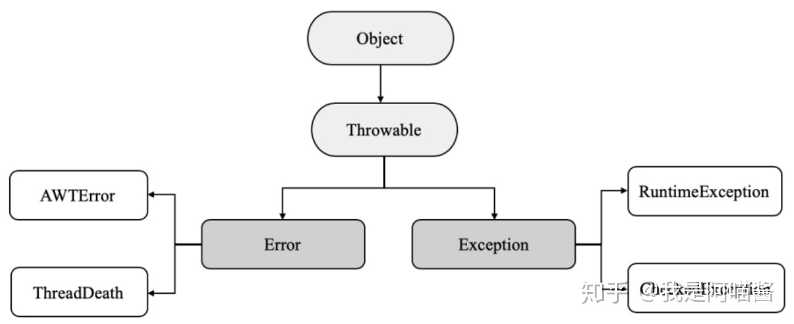


**Error**

出现通常因为系统内部错误或者资源耗尽。

Java不能处理Error。

**Excption**

分为运行异常与检查异常

RuntimeException：指Java运行期间抛出的异常。可以被捕获并处理。常见的有空指针异常、类强转异常、数组越界异常。

CheckedException：指编译阶段对程序的检查。要求对程序可能出现的异常通过try catch捕获处理。常见的包括IO异常、SQL异常、ClassNotFound异常。


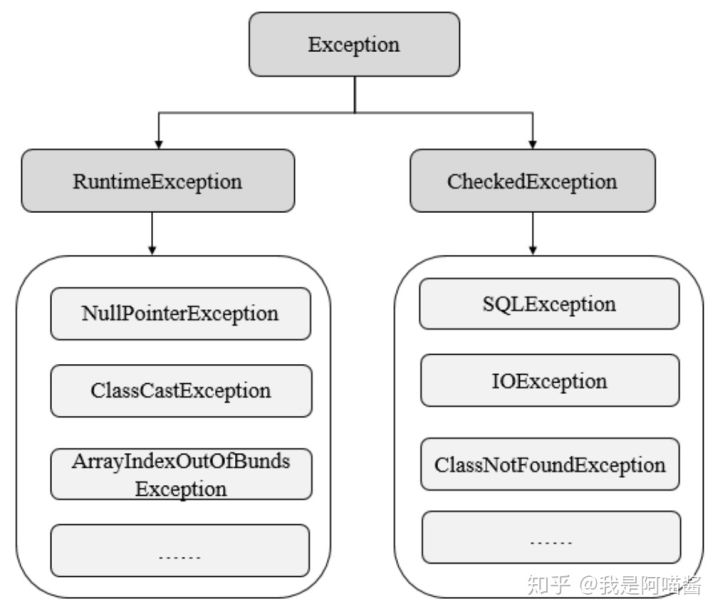


**异常处理方式：**

- 抛出异常

- - throws用于方法定义上，可能抛出的异常
  - throw 作用在方法内，表示明确抛出一个异常


- 捕获异常

- - 通过try catch捕获和处理异常


### **3.反射机制**


### **动态语言的概念**

动态语言指在运行时可以改变结构的语言，比如新的属性、方法的增加、删除。

- JS、Ruby、Python属于动态语言。
- C、C++属于非动态语言。
- Java属于半动态。


### **反射机制的概念**

在程序运行期间，能对一个类都能获取其属性和方法，并能任意调用。


### **反射的应用**

Java对象分为编译时类型与运行时类型。

编译时指声明对象的类型。

运行类型指为对象赋值的类型。无法在编译时获取对象真实信息，只能通过反射获取。这是反射的核心。


### **Java反射API**

常用API

- Class类：用于获取类的属性、方法信息
- Filed类：用于获取和设置类中属性值
- Method类：用于获取方法的描述信息和执行某个方法
- Constructor类：类的构造方法


### **反射步骤**

1.获取想要操作类的Class对象

2.调用Class对象类中的定义方法

3.使用反射API获取并调用类属性和方法信息


### **创建对象的两个方法**

使用Class对象的newInstance方法，要求对应类有无参构造方法

通过Class对象的Constructor对象的newInstance方法创建Class对应类实例


### **Method的invoke方法**

动态调用类对象的方法。

步骤：获取对象的Method，并调用Method的invoke方法。


### **4.注解**

### **注解的概念**

一个接口，Java提供设置程序中元素的关联信息和元数据的方法。


### **标准元注解**

@Target：

说明注解修饰对象的范围。可用于包、类、类成员、方法参数和本地变量。

target类型。


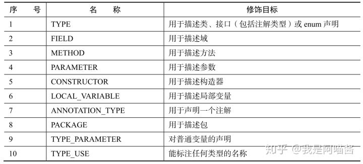


@Retention：

定义注解保留级别，即被描述注解在什么级别有效。

SOURCE：源文件有效

CLASS：Class文件中有效

RUNTIME：运行时有效


@Documented：

表示这个注解应该被javadoc工具记录


@Inherited：

标记注解，表明被标注的类是被继承的。

一个被@Inherited修饰的注解修饰一个类，表明这个注解将对该类的子类生效。


### **5.内部类**

### **静态内部类**

定义在类内部的静态类。

静态内部类可以访问外部类的静态变量与方法。

静态内部类中可以定义静态变量、方法、构造方法。

静态内部类通过 “外部类.静态内部类” 方式调用。


### **成员内部类**

定义在类内部的非静态类。

成员内部类中不能定义静态方法和变量（final修饰的）除外。因为成员内部类时非静态的。


### **局部内部类**

定义在类方法中的类。


### **匿名内部类**

匿名内部类指通过继承一个类或者实现一个接口定义的类。

匿名内部类没有class修饰，因为匿名内部类直接使用new 生成对象引用。


### **6.泛型**

本质是参数化类型，提供了编译时的安全检测。

### **泛型标记E、T、K、V、N、？**


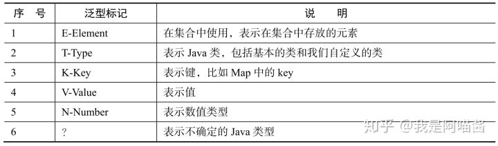


对泛型上限的限定 <? extends T>

对泛型下限的限定 <? super T>

### **泛型方法**

指将方法参数类型定义为泛型，以便接收不同类型参数。比如常见的main方法。

```java
 public static void main(String args[]) {
     
 }
```

### **泛型类**

指在类定义时在类定义了泛型，以便类使用时根据不同参数类型实例化。

```java
 public class Result<T> {
     public T data;
 }
```

### **7.序列化**

Java对象在内存中创建，如果想持久化Java对象到磁盘，需要使用序列化。

除了持久化对象，还用在RPC调用和网络传输中。

### **Java序列化API的使用**

Java序列化API为对象序列化提供了标准机制，有一下注意事项：

- 实现序列化，只要实现java.io.Serializable接口即可
- 序列化与反序列化要保持序列化的ID一致
- 序列化不保存静态变量
- 需要序列化父类的变量，父类也要实现Serializable接口
- 使用Transient关键字可以防止变量被序列化。


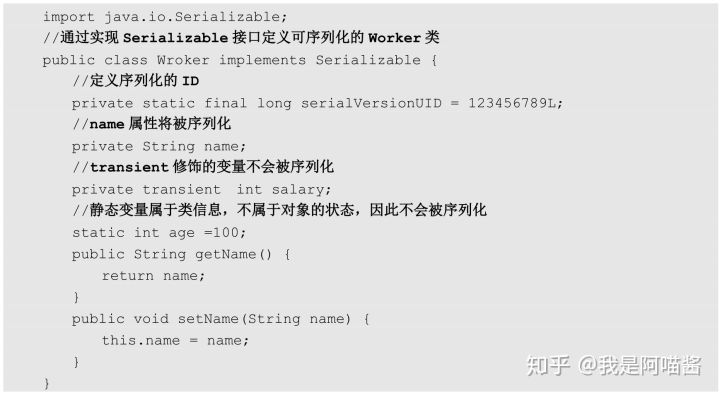


### **序列化与反序列化**


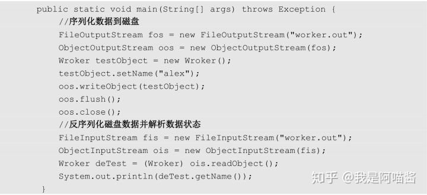


### **8.总结**

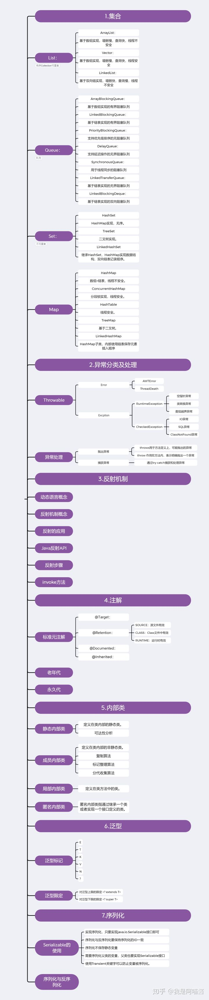