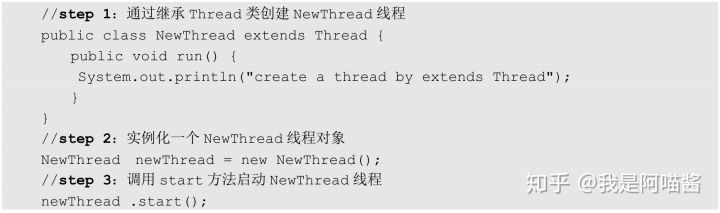
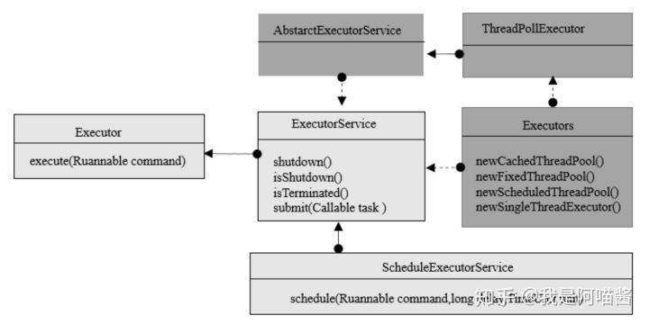
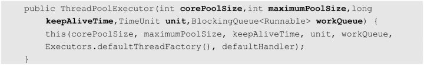
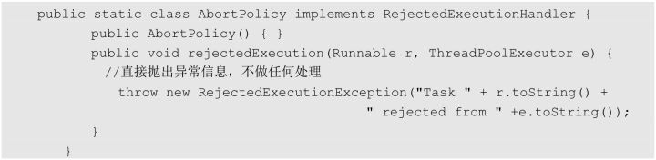
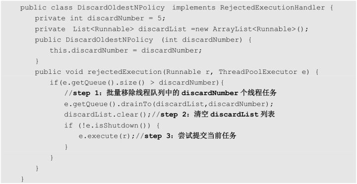
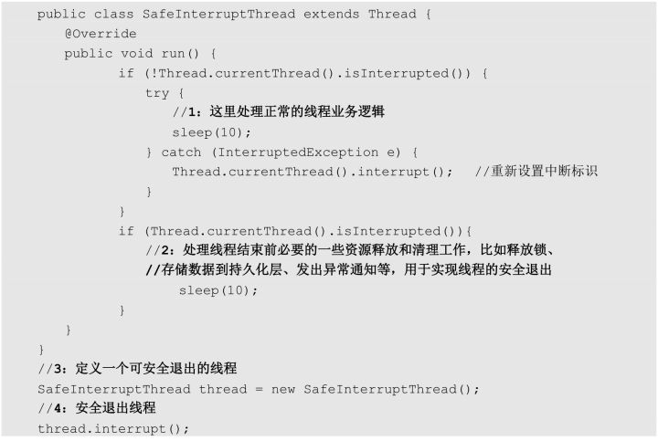
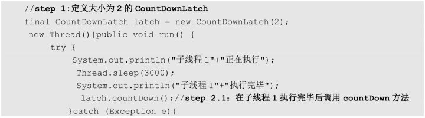
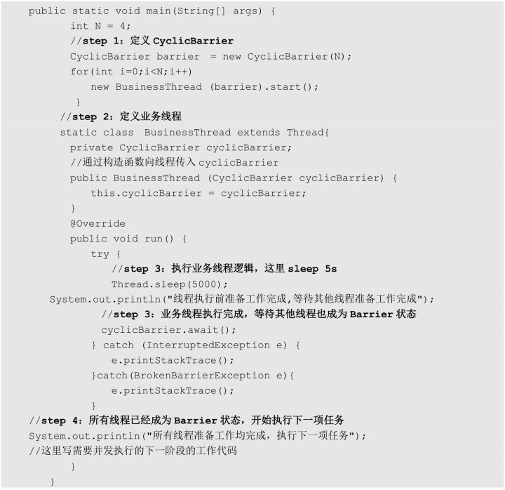
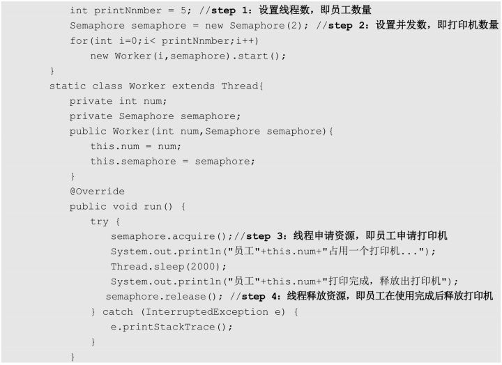
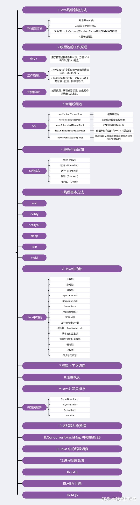

# 第3章 Java并发编程

## **1.Java线程创建方式**

4种创建方式

### **1.1.继承Thread类**

### **1.2.实现Runnable接口**

如果类继承了另一个类，就无法再直接继承Thread类，可以通过实现Runnable接口创建线程。

### **1.3.通过ExectorService和Callable<Class>实现有返回值的线程**

### **1.4.基于线程池**

## **2.线程池的工作原理**

定义：

用于管理线程组及其状态，方便JVM有效利用CPU资源。

工作原理：

JVM根据用户参数创建一定数量线程任务，放入队列中。

线程创建后启动任务，如果运行数量超过最大数量，则等待运行。

主要作用：

线程复用、线程资源管理、控制操作系统最大并发数。

### **2.1.线程复用**

将在循环方法中不断获取的 Runnable 对象存放在 Queue 中，当前线程在获取下一个 Runnable 对象之前可以是阻塞的

### **2.2.线程池的核心组件和核心类**

**4个核心组件：**

◎ 线程池管理器：用于创建并管理线程池。

◎ 工作线程：线程池中执行具体任务的线程。

◎ 任务接口：用于定义工作线程的调度和执行策略，只有线程实现了该接口，线程中的任务才能够被线程池调度。

◎ 任务队列：存放待处理的任务，新的任务将会不断被加入队列中，执行完成的任务将被从队列中移除。

**核心类：**

通过 Executor 框架实现的，在该框架中用到了 Executor、Executors、ExecutorService、ThreadPoolExecutor、Callable、Future、FutureTask 这几个核心类

ThreadPoolExecutor 是构建线程的核心方法

### **2.3.线程池工作流程**

线程池刚被创建时，向系统申请一个用于执行线程队列和管理线程池的线程资源。

在调用 execute()添加一个任务时，线程池会按照以下流程执行任务。

### **2.4.线程池的拒绝策略**

线程池已满时，线程池将通过拒绝策略处理新的线程任务。

AbortPolicy、CallerRunsPolicy、DiscardOldestPolicy、DiscardPolicy 这 4 种

**AbortPolicy**

直接抛出异常

**CallerRunsPolicy**

被丢弃的线程任务没有被关闭，则执行这个线程任务。

**DiscardOldestPolicy**

移除线程队列中最早的任务，并尝试提交当前任务。

**DiscardPolicy**

丢弃当前线程任务不做任务操作。

**自定义拒绝策略**

自己扩展RejectedExecutionHandler接口

## **3.常用线程池**

**newCachedThreadPool**

创建一个缓存线程池。在创建新线程时如果有可重用的线程，则重用它们，否则重新创建一个新的线程并将其添加到线程池中。

适合执行时间短的任务。

默认60秒。

**newFixedThreadPool**

创建一个固定线程数量的线程池，则新提交的任务将在阻塞队列中排队。

**newScheduledThreadPool**

创建可定时调度的线程池，可设置在给定的延迟时间后执行或者定期执行某个线程任务。

**newSingleThreadExecutor**

保证永远有且只有一个可用的线程

**newWorkStealingPool**

创建持有足够线程的线程池来达到快速运算的目的，在内部通过使用多个队列来减少各个线程调度产生的竞争。

## **4.线程生命周期**

分为新建（New）、就绪（Runnable）、运行（Running）、阻塞（Blocked）和死亡（Dead）这 5 种状态

## **5.线程基本方法**

基本方法有 wait、notify、notifyAll、sleep、join、yield

**wait**

线程进入 WAITING 状态，只有等到其他线程的通知或被中断后才会返回。

会释放对象的锁。

**sleep**

使线程休眠。sleep不会释放当前占有的锁，使线程进入 TIMED-WATING。

**yield**

使当前线程让出（释放）CPU 执行时间片，与其他线程一起重新竞争 CPU 时间片。

**interrupt**

向线程发行一个终止通知信号，会影响该线程内部的一个中断标识位，但不会中断正运行线程。

中断状态是线程的一个标识位，通过此标识位来安全终止线程。想终止一个线程时，可以先调用该线程的 interrupt 方法，然后在线程的 run 方法中根据该线程 isInterrupted 方法的返回状态值安全终止线程。

**join**

使当前线程转为阻塞状态，等到另一个线程结束，当前线程再由阻塞状态转为就绪状态，等待获取 CPU 的使用权。

**notify**

唤醒在此对象监视器上等待的一个线程

**setDaemon**

定义守护线程，在后台运行，为用户线程提供公共服务，没有用户线程可服务会自动离开。

**总结**

**终止线程的4种方式**

1.正常运行结束

2.使用退出标志位exitFlag退出

3.使用Interrupt方法

4.使用stop方法：不安全

## **6.Java中的锁**

### **6.1.乐观锁**

读数据时不加锁。写数据时判断别人有没有更新数据。通过版本号和加锁的方法。

Java中的乐观锁是通过CAS操作实现的。

### **6.2.悲观锁**

读写都加锁。

Java中的悲观锁通过AQS实现。

### **6.3.自旋锁**

持有锁的线程在短时间就能释放锁。

其他竞争锁就不需要做内核态和用户态，只要等持有锁线程释放。

### **6.4.synchronized**

独占式悲观锁，属于可重入锁。

### **6.5.ReentrantLock**

继承Lock接口并实现方法。属于可重入的独占锁。

通过自定义AQS实现锁的获取与释放。

独占锁指该锁在同一时刻只能被一个线程获取，而获取锁的其他线程只能在同步队列中等待。

可重入锁指该锁能够支持一个线程对同一个资源执行多次加锁操作。

ReentrantLock 支持公平锁和非公平锁的实现。

公平锁指锁的分配和竞争机制是公平的，即遵循先到先得原则。

非公平锁指 JVM 遵循随机、就近原则分配锁的机制。

ReentrantLock 不但提供了 synchronized 对锁的操作功能，还提供了诸如可响应中断锁、可轮询锁请求、定时锁等避免多线程死锁的方法。

### **6.6. Sychronized vs ReentrantLock**

**SychronizedReentrantLock**相同用于控制多线程对共享对象的访问可重入锁保证了可见性和互斥性不同隐式获取和释放锁。为了避免程序出现异常而无法正常释放锁，在使用 ReentrantLock 时必须在 finally 控制块中进行解锁操作。显式获取和释放锁可响应中断、可轮回，为处理锁提供了更多的灵活性。JVM 级别API 级别可以定义公平锁通过 Condition 可以绑定多个条件同步阻塞，采用的是悲观并发策略同步非阻塞，采用的是乐观并发策略。synchronized 是 Java 中的关键字，synchronized 是由内置的语言实现的。Lock 是一个接口通过 synchronized 却无法做到。通过 Lock 可以知道有没有成功获取锁Lock 可以通过分别定义读写锁提高多个线程读操作的效率。

### **6.7.Semaphore**

基于计数的信号量，在定义信号量对象时可以设定一个阈值，基于该阈值，多个线程竞争获取许可信号，线程竞争到许可信号后开始执行具体的业务逻辑

### **6.8.AtomicInteger**

原子操作的 Integer 的类

### **6.9.可重入锁**

可重入锁也叫作递归锁，指在同一线程中，在外层函数获取到该锁之后，内层的递归函数仍然可以继续获取该锁。在 Java 环境下，ReentrantLock 和 synchronized 都是可重入锁。

### **6.10.公平锁与非公平锁**

**公平锁非公平锁**定义在分配锁前检查是否有线程在排队等待获取该锁，优先将锁分配给排队时间最长的线程。在分配锁时不考虑线程排队等待的情况，直接尝试获取锁，在获取不到锁时再排到队尾等待。效率公平锁需要在多核的情况下维护一个锁线程等待队列，基于该队列进行锁的分配，因此效率比非公平锁低很多。Java 中的 synchronized 是非公平锁，ReentrantLock 默认的 lock 方法采用的是非公平锁。

### **6.11 读写锁：ReadWriteLock**

读写锁分为读锁和写锁两种，多个读锁不互斥，读锁与写锁互斥。在读的地方使用读锁，在写的地方使用写锁，在没有写锁的情况下，读是无阻塞的。

### **6.12.共享锁和独占锁**

◎ 独占锁：也叫互斥锁，每次只允许一个线程持有该锁，ReentrantLock 为独占锁的实现。

◎ 共享锁：允许多个线程同时获取该锁，并发访问共享资源。ReentrantReadWriteLock 中的读锁为共享锁的实现。

### **6.13.重量级锁和轻量级锁**

重量级锁是基于操作系统的互斥量（Mutex Lock）而实现的锁，会导致进程在用户态与内核态之间切换，相对开销较大。

轻量级锁的核心设计是在没有多线程竞争的前提下，减少重量级锁的使用以提高系统性能。轻量级锁适用于线程交替执行同步代码块的情况（即互斥操作），如果同一时刻有多个线程访问同一个锁，则将会导致轻量级锁膨胀为重量级锁。

### **6.14.偏向锁**

轻量级锁用于提高线程交替执行同步块时的性能，偏向锁则在某个线程交替执行同步块时进一步提高性能。

### **6.15.分段锁**

分段锁并非一种实际的锁，而是一种思想，用于将数据分段并在每个分段上都单独加锁，把锁进一步细粒度化，以提高并发效率。ConcurrentHashMap 在内部就是使用分段锁实现的。

### **6.16.同步锁与死锁**

在有多个线程同时被阻塞时，它们之间若相互等待对方释放锁资源，就会出现死锁。为了避免出现死锁，可以为锁操作添加超时时间，在线程持有锁超时后自动释放该锁。

### **6.17.锁优化**

1.减少锁持有时间

2.减少锁粒度

3.锁分离

4.锁粗化

5.锁消除

## **7.线程上下文切换**

CPU 利用时间片轮询来为每个任务都服务一定的时间，然后把当前任务的状态保存下来，继续服务下一个任务。任务的状态保存及再加载就叫作线程的上下文切换。

## **8.阻塞队列**

阻塞队列和一般队列的不同之处在于阻塞队列是「阻塞」的，这里的阻塞指的是操作队列的线程的一种状态。在阻塞队列中，线程阻塞有如下两种情况。

◎ 消费者阻塞：在队列为空时，消费者端的线程都会被自动阻塞（挂起），直到有数据放入队列，消费者线程会被自动唤醒并消费数据

◎ 生产者阻塞：在队列已满且没有可用空间时，生产者端的线程都会被自动阻塞（挂起），直到队列中有空的位置腾出，线程会被自动唤醒并生产数据

## **9.Java并发关键字**

### **9.1.CountDownLatch**

CountDownLatch 类位于 java.util.concurrent 包下，是一个同步工具类，允许一个或多个线程一直等待其他线程的操作执行完后再执行相关操作。

### **9.2.CyclicBarrier**

CyclicBarrier（循环屏障）是一个同步工具，可以实现让一组线程等待至某个状态之后再全部同时执行。

### **9.3.Semaphore**

Semaphore 指信号量，用于控制同时访问某些资源的线程个数，具体做法为通过调用 acquire()获取一个许可，如果没有许可，则等待，在许可使用完毕后通过 release()释放该许可，以便其他线程使用。

### **9.4.volatile 关键字的作用**

Java 除了使用了 synchronized 保证变量的同步，还使用了稍弱的同步机制volatile 变量。volatile 也用于确保将变量的更新操作通知到其他线程。

volatile 变量具备两种特性：一种是保证该变量对所有线程可见，在一个线程修改了变量的值后，新的值对于其他线程是可以立即获取的；一种是 volatile 禁止指令重排，即 volatile 变量不会被缓存在寄存器中或者对其他处理器不可见的地方，因此在读取 volatile 类型的变量时总会返回最新写入的值。

volatile 关键字可以严格保障变量的单次读、写操作的原子性，但并不能保证像 i++ 这种操作的原子性，因为 i++ 在本质上是读、写两次操作。volatile 在某些场景下可以代替 synchronized，但是 volatile 不能完全取代 synchronized 的位置，只有在一些特殊场景下才适合使用 volatile。比如，必须同时满足下面两个条件才能保证并发环境的线程安全。

◎ 对变量的写操作不依赖于当前值（比如 i++），或者说是单纯的变量赋值（boolean flag=true）。

◎ 该变量没有被包含在具有其他变量的不变式中，也就是说在不同的 volatile 变量之间不能互相依赖，只有在状态真正独立于程序内的其他内容时才能使用 volatile。

## **10.多线程共享数据**

将数据抽象成一个类，并将对这个数据的操作封装在类的方法中

将 Runnable 对象作为一个类的内部类，将共享数据作为这个类的成员变量

## **11.ConcurrentHashMap 并发**

### **11.1.减小锁粒度**

ConcurrentHashMap 在内部使用多个 Segment，在操作数据时会给每个 Segment 都加锁，这样就通过减小锁粒度提高了并发度。

### **11.2.ConcurrentHashMap 的实现**

ConcurrentHashMap 是由 Segment 数组和 HashEntry 数组组成的。Segment 继承了可重入锁（ReentrantLock），它在 ConcurrentHashMap 里扮演锁的角色。HashEntry 则用于存储键值对数据。

## **12.Java 中的线程调度**

### **12.1.抢占式调度**

抢占式调度指每个线程都以抢占的方式获取 CPU 资源并快速执行，在执行完毕后立刻释放 CPU 资源，具体哪些线程能抢占到 CPU 资源由操作系统控制，在抢占式调度模式下，每个线程对 CPU 资源的申请地位是相等

### **12.2.协同式调度**

协同式调度指某一个线程在执行完后主动通知操作系统将 CPU 资源切换到另一个线程上执行。

### **12.3.Java 线程调度的实现：抢占式**

Java 采用抢占式调度的方式实现内部的线程调度，Java 会为每个线程都按照优先级高低分配不同的 CPU 时间片，且优先级高的线程优先执行。

### **12.4.线程让出 CPU 的情况**

线程让出 CPU 的情况如下。

◎ 当前运行的线程主动放弃 CPU，例如运行中的线程调用 yield()放弃 CPU 的使用权。

◎ 当前运行的线程进入阻塞状态，例如调用文件读取 I/O 操作、锁等待、Socket 等待。

◎ 当前线程运行结束，即运行完 run()里面的任务。

## **13.进程调度算法**

### **13.1.优先调度算法**

先来先服务调度算法

短作业优先调度算法

### **13.2.高优先权优先调度算法**

非抢占式优先调度算法

抢占式优先调度算法

高响应比优先调度算法

## **13.3.时间片的轮转调度算法**

时间片轮转法

多级反馈队列调度算法

## **14.什么是 CAS**

### **14.1.CAS 的概念：比较并交换**

CAS（Compare And Swap）指比较并交换。CAS 算法 CAS(*V*,*E*,*N*)包含 3 个参数，*V*表示要更新的变量，*E*表示预期的值，*N*表示新值。在且仅在 *V*值等于 *E*值时，才会将*V*值设为 *N*，如果 *V*值和 *E*值不同，则说明已经有其他线程做了更新，当前线程什么都不做。最后，CAS 返回当前*V*的真实值。

### **14.2.CAS 的特性：乐观锁**

CAS 操作采用了乐观锁的思想，总是认为自己可以成功完成操作。在有多个线程同时使用 CAS 操作一个变量时，只有一个会胜出并成功更新，其余均会失败。

## **15.ABA问题**

对 CAS 算法的实现有一个重要的前提：需要取出内存中某时刻的数据，然后在下一时刻进行比较、替换，在这个时间差内可能数据已经发生了变化，导致产生 ABA 问题。

部分乐观锁是通过版本号（version）来解决 ABA 问题

## **16.什么是 AQS**

AQS（Abstract Queued Synchronizer）是一个抽象的队列同步器，通过维护一个共享资源状态（Volatile Int State）和一个先进先出（FIFO）的线程等待队列来实现一个多线程访问共享资源的同步框架。

## **17.总结**

