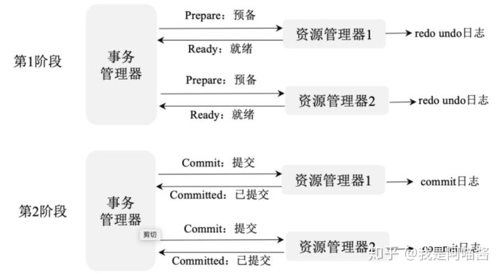

# 第7章 数据库及分布式事务

## **1.数据库的概念**

### **1.1.存储引擎**

常用的存储引擎主要有 MyISAM、InnoDB、Memory、Archive 和 Federated。

**1. MyIASM**

MyIASM 是 MySQL 默认的存储引擎，不支持数据库事务、行级锁和外键，因此在 INSERT（插入）或 UPDATE（更新）数据即写操作时需要锁定整个表，效率较低。

MyIASM 的缺点是更新数据慢且不支持事务处理，优点是查询速度快。

**2. InnoDB**

InnoDB 为 MySQL 提供了事务支持、回滚、崩溃修复能力、多版本并发控制、事务安全的操作。InnoDB 的底层存储结构为 B+ 树，B+ 树的每个节点都对应 InnoDB 的一个 Page，Page 大小是固定的，一般被设为 16KB。其中，非叶子节点只有键值，叶子节点包含完整的数据

InnoDB 适用于有以下需求的场景。

◎ 经常有数据更新的表，适合处理多重并发更新请求。

◎ 支持事务。

◎ 支持灾难恢复。

◎ 支持外键约束

◎ 支持自动增加列属性 auto_increment。

**3. TokuDB**

TokuDB 的底层存储结构为 Fractal Tree。Fractal Tree 的结构与 B+ 树有些类似，只是在 Fractal Tree 中除了每一个指针（key），都需要指向一个 child（孩子）节点，child 节点带一个 Message Buffer，这个 Message Buffer 是一个先进先出队列，用来缓存更新操作

TokuDB 在线添加索引，不影响读写操作，有非常高的写入性能，主要适用于要求写入速度快、访问频率不高的数据或历史数据归档。

**4. Memory**

用内存空间创建。每个 Memory 表实际上都对应一个磁盘文件用于持久化。Memory 表因为数据是存放在内存中的，因此访问速度非常快，通常使用 Hash 索引来实现数据索引。Memory 表的缺点是一旦服务关闭，表中的数据就会丢失。

支持散列索引和 B 树索引。

### **1.2.创建索引原则**

◎ 选择唯一性索引：唯一性索引一般基于 Hash 算法实现，可以快速、唯一地定位某条数据。

◎ 为经常需要排序、分组和联合操作的字段建立索引。

◎ 为常作为查询条件的字段建立索引。

◎ 限制索引的数量：索引越多，数据更新表越慢，因为在数据更新时会不断计算和添加索引。

◎ 尽量使用数据量少的索引：如果索引的值很长，则占用的磁盘变大，查询速度会受到影响。

◎ 尽量使用前缀来索引：如果索引字段的值过长，则不但影响索引的大小，而且会降低索引的执行效率，这时需要使用字段的部分前缀来作为索引。

◎ 删除不再使用或者很少使用的索引。

◎ 尽量选择区分度高的列作为索引：区分度表示字段值不重复的比例。

◎ 索引列不能参与计算：带函数的查询不建议参与索引。

◎ 尽量扩展现有索引：联合索引的查询效率比多个独立索引高。

### **1.3.数据库三范式**

范式是具有最小冗余的表结构，三范式的概念如下所述。

**1.第一范式**

如果每列都是不可再分的最小数据单元（也叫作最小的原子单元），则满足第一范式，第一范式的目标是确保每列的原子性。

如下图，其中的 Address 列违背了第一范式列不可再分的原则，要满足第一范式，就需要将 Address 列拆分为 Country 列和 City 列。

**2.第二范式**

第二范式在第一范式的基础上，规定表中的非主键列不存在对主键的部分依赖，即第二范式要求每个表只描述一件事情。

如下图，Orders 表既包含订单信息，也包含产品信息，需要将其拆分为两个单独的表。

**3.第三范式**

第三范式的定义为：满足第一范式和第二范式，并且表中的列不存在对非主键列的传递依赖。

如下图，除了主键的订单编号，顾客姓名依赖于非主键的顾客编号，因此需要将该列去除。

### **1.4 数据库事务**

数据库事务执行一系列基本操作，要么都执行，要么都不执行。

事务是一个不可分割的工作逻辑单元。必须具备以下 4 个属性 ACID。

◎ 原子性（Atomicity）：事务是一个完整操作，参与事务的逻辑单元要么都执行，要么都不执行。

◎ 一致性（Consistency）：在事务执行完毕时（无论是正常执行完毕还是异常退出），数据都必须处于一致状态。

◎ 隔离性（Isolation）：对数据进行修改的所有并发事务都是彼此隔离的，它不应以任何方式依赖或影响其他事务。

◎ 永久性（Durability）：在事务操作完成后，对数据的修改将被持久化到永久性存储中。

### **1.5.存储过程**

存储过程指一组用于完成特定功能的 SQL 语句集，它被存储在数据库中，经过第一次编译后再次调用时不需要被再次编译，用户通过指定存储过程的名字并给出参数（如果该存储过程带有参数）来执行它。

编写事务需要**遵守原则**：

◎ 尽量利用一些 SQL 语句代替一些小循环，例如聚合函数、求平均函数等。

◎ 中间结果被存放于临时表中，并加索引。

◎ 少使用游标（Cursors）：SQL 是种集合语言，对于集合运算有较高的性能，而游标是过程运算。比如，对一个 50 万行的数据进行查询时，如果使用游标，则需要对表执行 50 万次读取请求，将占用大量的数据库资源，影响数据库的性能。

◎ 事务越短越好：SQL Server 支持并发操作，如果事务过长或者隔离级别过高，则都会造成并发操作的阻塞、死锁，导致查询速度极慢、CPU 占用率高等。

◎ 使用 try-catch 处理异常。

◎ 尽量不要将查找语句放在循环中，防止出现过度消耗系统资源的情况。

### **1.6.触发器**

触发器是一段能自动执行的程序，和普通存储过程的区别是「触发器在对某一个表或者数据进行操作时触发」，例如UPDATE、INSERT、DELETE 操作时，系统会自动调用和执行该表对应的触发器。

触发器一般用于数据变化后需要执行一系列操作的情况，比如对系统核心数据的修改需要通过触发器来存储操作日志的信息等。

## **2.并发与锁**

### **2.1.数据库并发策略**

数据库的并发控制一般采用三种方法实现：

- 乐观锁
- 悲观锁
- 时间戳

**1. 乐观锁**

**乐观锁**在读数据时，认为别人不会去写其所读的数据；

**悲观锁**就刚好相反，觉得自己读数据时，别人可能刚好在写自己刚读的数据，态度比较保守；

**时间戳**在操作数据时不加锁，而是通过时间戳来控制并发出现的问题。

**2. 悲观锁**

**悲观锁**指在其修改某条数据时，不允许别人读取该数据，直到自己的整个事务都提交并释放锁，其他用户才能访问该数据。

悲观锁又可分为**排它锁（写锁）**和**共享锁（读锁）**。

**3. 时间戳**

**时间戳**指在数据库表中额外加一个时间戳列 TimeStamp。每次读数据时，都把时间戳也读出来，在更新数据时把时间戳加 1，在提交之前跟数据库的该字段比较一次，如果比数据库的值大，就允许保存，否则不允许保存。

这种处理方法虽然不使用数据库系统提供的锁机制，但是可以大大提高数据库处理的并发量。

### **2.2.数据库锁**

**1.行级锁**

**行级锁**指对某行数据加锁，防止其他事务修改此行。执行以下操作，自动应用行级锁。

◎ INSERT、UPDATE、DELETE、SELECT … FOR UPDATE [OF columns] [WAIT n|NOWAIT]。

◎ SELECT … FOR UPDATE 语句允许用户一次针对多条记录执行更新。

◎ 使用 COMMIT 或 ROLLBACK 语句释放锁。

**2.表级锁**

**表级锁**指对当前操作的整张表加锁。

常用的 MyISAM 与 InnoDB 都支持表级锁定。

表级锁定分为表共享读锁（共享锁）与表独占写锁（排他锁）。

**3.页级锁**

**页级锁**的锁定粒度介于行级锁和表级锁之间。

表级锁的加锁速度快，但冲突多。

行级冲突少，但加锁速度慢。

页级锁在二者之间做了平衡，一次锁定相邻的一组记录。

**4.基于 Redis 的分布式锁**

数据库锁是基于单个数据库实现的，在我们的业务跨多个数据库时，就要使用分布式锁来保证数据的一致性。

**使用 Redis 实现一个分布式锁的流程：**

Redis 实现的分布式锁以 Redis setnx 命令为中心实现，setnx 是 Redis 的写入操作命令，具体语法为 setnx（key val）。

在且仅在 key 不存在时，则插入一个 key 为 val 的字符串，返回 1；

若 key 存在，则什么都不做，返回 0。

通过 setnx 实现分布式锁的思路如下。

◎ 获取锁：在获取锁时调用 setnx，如果返回 0，则该锁正在被别人使用；如果返回 1，则成功获取锁。

◎ 释放锁：在释放锁时，判断锁是否存在，如果存在，则执行 Redis 的 delete 操作释放锁。

**简单的 Redis 实现分布式锁的代码如下：**

如果**锁并发比较大，则可以设置一个锁的超时时间**，在超时时间到后，Redis 会自动释放锁给其他线程使用：

以上代码定义了 RedisLock 类，在该类中定义了一个 Redis 数据库连接 Jedis，同时定义了 lock 方法来获取一个锁，在获取锁时首先通过 setnx 设置锁 id 获取 Redis 内锁的信息，如果返回信息为 0，则表示锁正在被人使用（锁 id 存在于 Redis 中）；如果不为 0，则表示成功在内存中设置了该锁。同时在 RedisLock 类中定义了 unlock 方法用于释放一个锁，具体做法是在 Redis 中查找该锁并删除。

### **2.3.数据库分表**

垂直切分和水平切分两种。下面是区别。

◎ **垂直切分**：将表**按照功能模块**、关系密切程度划分并部署到不同的库中。例如，我们会创建定义数据库 workDB、商品数据库 payDB、用户数据库 userDB、日志数据库 logDB 等，分别用于存储项目数据定义表、商品定义表、用户数据表、日志数据表等

◎ **水平切分**：在一个表中的数据量过大时，我们可以把该**表的数据按照某种规则如 userID 散列进行划分**，然后将其存储到多个结构相同的表和不同的库上

## **3.数据库分布式事务**

### **3.1.CAP**

**CAP**指的是在一个分布式系统中，一致性（Consistency）、可用性（Availability）和分区容错性（Partition tolerance）三者不可兼得。

◎ **一致性：**在分布式系统的所有数据备份中，在同一时刻是否有同样的值（等同于所有节点都访问同一份最新的数据副本）。

◎ **可用性：**在集群中一部分节点发生故障后，集群整体能否响应客户端的读写请求（对数据更新具备高可用性）。

◎ **分区容错性：**系统如果不能在时限内达成数据的一致性，就意味着发生了分区，必须就当前操作在 C 和 A 之间做出选择。以实际效果而言，分区相当于对通信的时限要求。

### **3.2.两阶段提交协议**

**分布式事务**指涉及操作多个数据库的事务，在分布式系统中，各个节点之间在物理上相互独立，通过网络进行沟通和协调。

**二阶段提交（Two-Phase Commit）**指在计算机网络及数据库领域内，为了使分布式数据库的所有节点在进行事务提交时都保持一致性而设计的一种算法。在**分布式系统**中，**每个节点**只知道自己的操作是否成功，**不知道其他节点的操作是否成功。**

在一个事务跨越多个节点时，为了保持事务的 ACID 特性，**需要引入一个协调者组件**来统一掌控所有节点（称作参与者）的操作结果，并最终指示这些节点是否真正提交操作结果（比如将更新后的数据写入磁盘等）。

**二阶段提交**思路概括为：**参与者将操作成败通知协调者**，再由**协调者根据所有参与者的反馈决定各参与者是提交操作还是中止操作。**

**1.Prepare（准备阶段）**

事务协调者（事务管理器）给每个参与者（源管理器）都发送 Prepare 消息，每个参与者要么直接返回失败（如权限验证失败），要么在本地执行事务，写本地的 redo 和 undo 日志但不提交，是一种「万事俱备，只欠东风」的状态。

**2.Commit（提交阶段）**

如果协调者接收到了参与者的失败消息或者超时，则直接给每个参与者都发送回滚消息，否则发送提交消息，参与者根据协调者的指令执行提交或者回滚操作，释放在所有事务处理过程中使用的锁资源，如图 7-8 所示。

**3.两阶段提交的缺点**

◎ 同步阻塞问题：在执行过程中，**所有参与者的任务都是阻塞执行**的。

◎ 单点故障：所有请求都需要经过协调者，**协调者发生故障时，所有参与者都会被阻塞。**

◎ 数据不一致：在二阶段提交的第 2 阶段，在协调者向参与者发送 Commit（提交）请求后发生了**局部网络异常**，或者在发送 Commit 请求过程中**协调者发生了故障**，导致只有一部分参与者接收到 Commit 请求，于是**整个分布式系统出现了数据不一致的现象**。

◎ 协调者宕机后事务状态丢失：协调者在发出 Commit 消息之后宕机，唯一接收到这条消息的参与者也宕机，即使协调者通过选举协议产生了新的协调者，这条事务的状态也是不确定的，没有人知道事务是否已被提交。

### **3.3.三阶段提交协议**

**三阶段提交（Three-Phase Commit）**，是二阶段提交（2PC）的改进版本。改进如下：

◎ 引入**超时机制**：在协调者和参与者中引入超时机制，如果协调者长时间接收不到参与者的反馈，则认为参与者执行失败。

◎ 在第 1 阶段和第 2 阶段都加入一个**预准备阶段**，以**保证在最后的任务提交之前各参与节点的状态是一致的**。也就是说，除了引入超时机制，三阶段提交协议（3PC）**把两阶段提交协议**（2PC）的**准备阶段再次一分为二**，这样三阶段提交就有 **CanCommit、PreCommit、DoCommit** 三个阶段。

**1.CanCommit 阶段**

协调者向参与者发送 Commit 请求，参与者如果可以提交就返回 Yes 响应，否则返回 No 响应。

**2.PreCommit 阶段**

协调者根据参与者的反应来决定是否继续进行，有两种可能：

◎ 协调者从所有参与者那里获得的反馈都是 Yes 响应，就预执行事务。

◎ 有任意参与者向协调者发送了 No 响应，或者在等待超时之后协调者都没有接收到参与者的响应，则执行事务的中断。

**3.DoCommit 阶段**

该阶段进行真正的事务提交，主要包括：协调者发送提交请求，参与者提交事务，参与者响应反馈（在事务提交完之后向协调者发送 Ack 响应），协调者确定完成事务，如图 ：

### **3.4.分布式事务**

**1.传统事务**

传统事务遵循 ACID 原则

◎ 原子性：事务是包含一系列操作的原子操作，事务的原子性确保这些操作全部完成或者全部失败。

◎ 一致性：事务执行的结果必须使数据库从不一致性状态转为一致性状态。保证数据库的一致性指在事务完成时，必须使所有数据都有一致的状态。

◎ 隔离性：因为可能在相同的数据集上同时有许多事务要处理，所以每个事务都应该与其他事务隔离，避免数据被破坏。

◎ 持久性：一旦事务完成，其结果就应该能够承受任何系统的错误，比如在事务提交过程中服务器的电源被切断等。在通常情况下，事务的结果被写入持续性存储中。

**2.柔性事务**

在分布式数据库领域，基于 CAP 理论及 BASE 理论，**阿里巴巴**提出了**柔性事务概念**。**BASE 理论**是 **CAP 理论的延伸**，包括基本可用（Basically Available）、柔性状态（Soft State）、最终一致性（Eventual Consistency）三个原则，并基于这三个原则设计出了柔性事务。

通常所说的**柔性事务分为**：

- 两阶段型
- 补偿型
- 异步确保型
- 最大努力通知型

**两阶段型事务**指分布式事务的两阶段提交，对应技术上的 XA 和 JTA/JTS，是分布式环境下事务处理的典型模式。

**TCC 型事务**（Try、Confirm、Cancel）为**补偿型事务**，是一种基于补偿的事务处理模型。如下图，服务器 A 发起事务，服务器 B 参与事务，如果服务器 A 的事务和服务器 B 的事务都顺利执行完成并提交，则整个事务执行完成。如果事务 B 执行失败，事务 B 本身就回滚，这时事务 A 已被提交，所以需要执行一个补偿操作，将已经提交的事务 A 执行的操作进行反操作，恢复到未执行前事务 A 的状态。需要注意的是，发起提交的一般是**主业务服务**，而状态补偿的一般是**业务活动管理者**，因为活动日志被存储在业务活动管理中，补偿需要依靠日志进行恢复。TCC 事务模型牺牲了一定的隔离性和一致性，但是提高了事务的可用性。

**异步确保型事务**指将一系列同步的事务操作修改为基于消息队列异步执行的操作，来避免分布式事务中同步阻塞带来的数据操作性能下降。如下图，在写业务数据 A 触发后将执行以下流程。

（1）业务 A 的模块在数据库 A 上执行数据更新操作。

（2）业务 A 调用写消息数据模块。

（3）写消息日志模块将数据库的写操作状态写入数据库 A 中。

（4）写消息日志模块将写操作日志发送给消息服务器。

（5）读消息日志模块接收操作日志。

（6）读消息数据调用写业务 B 的模块。

（7）写业务 B 更新数据到数据库 B。

（8）写业务数据 B 的模块发送异步消息更新数据库 A 中的写消息日志状态，说明自己已经完成了异步数据更新操作。

**最大努力通知型事务**也是**通过消息中间件实现**的，与前面异步确保型操作不同的是：在消息由 MQ 服务器发送到消费者之后，允许在达到最大重试次数之后正常结束事务，因此无法保障数据的最终一致性。如下图，写业务数据 A 在更新数据库后调用写消息日志将数据操作以异步消息的形式发送给读消息日志模块；读消息日志模块在接收到数据操作后调用写业务 B 写数据库。和异步确保型不同的是，数据库 B 在写完之后将不再通知写状态到数据库 A，如果因为网络或其他原因，在如下图所示的第 4 步没有接收到消息，则消息服务器将不断重试发送消息到读消息日志，如果经过 *N*次重试后读消息日志还是没有接收到日志，则消息不再发送，这时会出现数据库 A 和数据库 B 数据不一致的情况。最大努力型通知事务通过消息服务使分布式事务异步解耦，并且模块简单、高效，但是牺牲了数据的一致性，在金融等对事务要求高的业务中不建议使用，但在日志记录类等对数据一致性要求不是很高的应用上执行效率很高。

## **4.总结**

