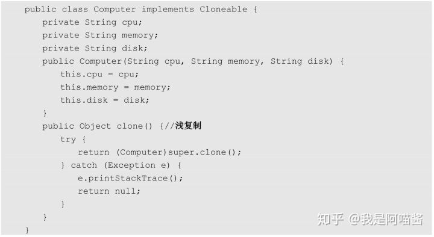
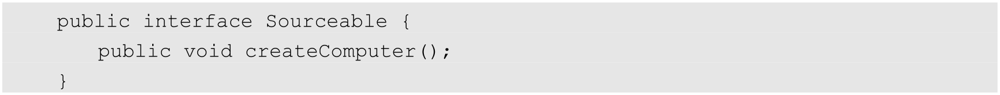
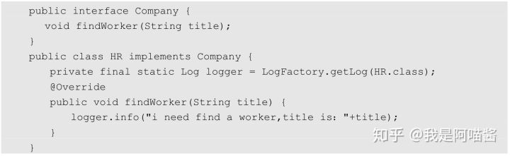
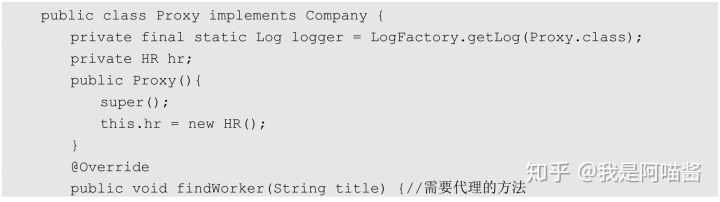
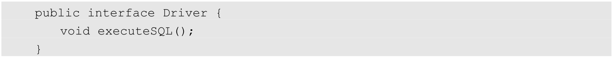
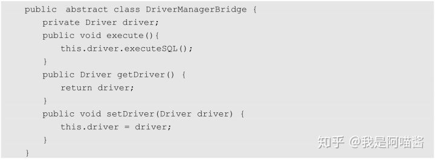
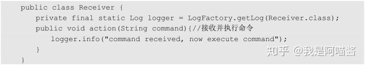
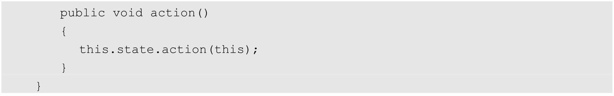
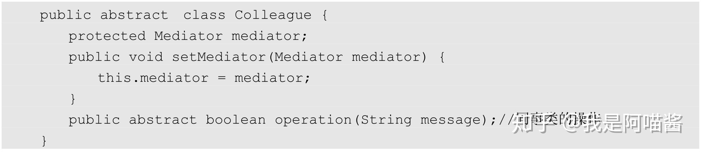

# 第9章 设计模式

设计模式（Design Pattern）是经过高度抽象化的代码设计经验总结。

## **1 设计模式简介**

设计模式有 7 个原则：单一职责原则、开闭原则、里氏代换原则、依赖倒转原则、接口隔离原则、合成/聚合复用原则、迪米特法则

**1.单一职责原则**

规定一个类只有一个职责。

如果多个职责（功能）被设计在一个类中，这个类就违反了单一职责原则。

**2.开闭原则**

开闭原则规定软件中的对象（类、模块、函数等）对扩展开放，对修改封闭，这意味着一个实体允许在不改变其源代码的前提下改变其行为，

该特性在产品化的环境下是特别有价值的，改变源代码需要经过代码审查、单元测试等过程，以确保产品的使用质量。

遵循这个原则的代码在扩展时并不发生改变，因此不需要经历上述过程。

**3.里氏代换原则**

是对开闭原则的补充，规定了在任意父类可以出现的地方，子类都一定可以出现。

实现开闭原则的关键就是抽象化，父类与子类的继承关系就是抽象化的具体表现，所以里氏代换原则是对实现抽象化的具体步骤的规范。

**4.依赖倒转原则**

指程序要依赖于抽象（Java 中的抽象类和接口），而不依赖于具体的实现（Java 中的实现类）。

要求对抽象进行编程，不要求对实现进行编程，这就降低了用户与实现模块之间的耦合度。

**5.接口隔离原则**

接口隔离原则指通过将不同的功能定义在不同的接口中来实现接口的隔离，这样就避免了其他类在依赖该接口（接口上定义的功能）时依赖其不需要的接口，可减少接口之间依赖的冗余性和复杂性。

**6.合成/聚合复用原则**

合成/聚合复用原则指通过在一个新的对象中引入（注入）已有的对象以达到类的功能复用和扩展的目的。

使用合成或聚合而不要使用继承来扩展类的功能。

**7.迪米特法则**

迪米特法则指一个对象尽可能少地与其他对象发生相互作用，即一个对象对其他对象应该有尽可能少的了解或依赖。

其核心思想在于降低模块之间的耦合度，提高模块的内聚性。迪米特法则规定每个模块对其他模块都要有尽可能少的了解和依赖，因此很容易使系统模块之间功能独立，这使得各个模块的独立运行变得更简单，同时使得各个模块之间的组合变得更容易。

**设计模式按照其功能和使用场景可以分为三大类：**

- 创建型模式（Creational Pattern）
- 结构型模式（Structural Pattern）
- 行为型模式（Behavioral Pattern）

## **2 工厂模式**

**创建型**，**简单、快速、高效与安全**地创建对象的方式。

工厂模式**在接口中定义了创建对象的方法**，而将具体的创建对象的过程在子类中实现，用户只需通过接口创建需要的对象即可，**不关注对象的具体创建过程**。

同时不同的子类可根据需求**灵活实现创建对象的不同方法。**

**本质**是**用工厂方法** **代替 new 操作**创建一种实例化对象的方式，**提供一种方便创建有同种类型接口的产品的复杂对象。**

如下代码通过 new 关键字实例化类 Class 的一个实例 class，但如果 Class 类在实例化时需要一些初始化参数，而这些参数需要其他类的信息，则直接通过 new 关键字实例化对象会增加代码的耦合度，不利于维护，因此需要通过工厂模式将创建实例和使用实例分开。将创建实例化对象的过程封装到工厂方法中，我们在使用时直接通过调用工厂来获取，不需要关心具体的负载实现过程：

以创建手机为例，假设手机的品牌有华为和苹果两种类型，我们要实现的是根据不同的传入参数实例化不同的手机

其具体实现如下。

（1）定义接口：

以上代码定义了一个 Phone 接口，并在接口中定义了 brand()，用来返回手机的品牌。

（2）定义实现类：

以上代码定义了两个 Phone 的实现类 Iphone 和 HuaWei 来表示两个品牌的手机，两个品牌的手机通过实现 brand()打印自己的商标。

（3）定义工厂类：

以上代码定义了名为 Factory 的工厂类，工厂类有一个方法 createPhone()，用来根据不同的参数实例化不同品牌的手机类并返回。在 createPhone()的参数为「HuaWei」时，工厂类为我们实例化一个 HuaWei 类的实例并返回；在 createPhone()的参数为「Apple」时，工厂类为我们实例化一个 Iphone 类的实例并返回。这样便实现了工厂类根据不同的参数创建不同的实例，对调用者来说屏蔽了实例化的细节。

（4）使用工厂模式：

以上代码定义了一个 Factory 的实例，并调用 createPhone()根据不同的参数创建了名为 huawei 的实例和名为 iphone 的实例，并分别调用其 brand()打印不同的品牌信息，运行结果如下：

## **3 抽象工厂**

Abstract Factory Pattern，在工厂模式上**添加了一个创建不同工厂的抽象接口**（抽象类或接口实现），该接口可叫作**超级工厂**。

在使用过程中，我们**首先通过抽象接口创建出不同的工厂对象**，**然后根据不同的工厂对象创建不同的对象。**

- 可以将工厂模式理解为针对一个产品维度进行分类，比如上述工厂模式下的苹果手机和华为手机；
- 而抽象工厂模式针对的是多个产品维度分类，比如苹果公司既制造苹果手机也制造苹果笔记本电脑，同样，华为公司既制造华为手机也制造华为笔记本电脑。

在同一个厂商有多个维度的产品时，如果使用工厂模式，则势必会存在多个独立的工厂，这样的话，设计和物理世界是不对应的。正确的做法是通过抽象工厂模式来实现，我们可以将抽象工厂类比成厂商（苹果、华为），将通过抽象工厂创建出来的工厂类比成不同产品的生产线（手机生成线、笔记本电脑生产线），在需要生产产品时根据抽象工厂生产。

工厂模式定义了工厂方法来实现不同厂商手机的制造。可是问题来了，我们知道苹果公司和华为公司不仅制造手机，还制造电脑。如果使用工厂模式，就需要实现两个工厂类，并且这两个工厂类没有多大关系，这样的设计显然不够优雅，那么如何实现呢？

使用抽象工厂就能很好地解决上述问题。我们定义一个抽象工厂，在抽象工厂中定义好要生产的产品（手机或者电脑），然后在抽象工厂的实现类中根据不同类型的产品和产品规格生产不同的产品返回给用户。

**实现**

（1）第 1 类产品的手机接口及实现类的定义如下：

以上代码定义了 Phone 的接口及其实现类 PhoneApple 和 PhoneHwaiWei。在该接口中定义了一个打电话的方法 call()，实现类根据其品牌打印相关信息。

（2）第 1 类产品的手机工厂类的定义如下：

以上代码定义了 PhoneFactory 的手机工厂类，该类继承了 AbstractFactory 并实现了方法 createPhone()，createPhone()根据不同的参数实例化不同品牌的手机类并返回。在 createPhone()的参数为「HuaWei」时，工厂类为我们实例化一个 PhoneHwaiWei 类的实例并返回；在 createPhone()的参数为「Apple」时，工厂类为我们实例化一个 PhoneApple 类的实例并返回，这样便满足了工厂根据不同参数生产不同产品的需求。

（3）第 2 类产品的电脑接口及实现类的定义如下：

以上代码定义了 Computer 的电脑接口及其实现类 ComputerApple 和 ComputerHwaiWei。在该接口中定义了一个上网的方法 internet()，实现类根据其品牌打印相关信息。

（4）第 2 类产品的电脑工厂类的定义如下：

以上代码定义了 ComputerFactory 的电脑工厂类，该类继承了 AbstractFactory 并实现了方法 createComputer()，createComputer()根据不同的参数实例化不同品牌的电脑类并返回。在 createComputer()的参数为「HuaWei」时，工厂类为我们实例化一个 ComputerHwaiWei 类的实例并返回；在 createComputer()的参数为「Apple」时，工厂类为我们实例化一个 ComputerApple 类的实例并返回，这样便实现了工厂根据不同参数生产不同产品的需求。

（5）抽象工厂的定义如下：

以上代码定义了抽象类 AbstractFactory，这个类便是抽象工厂的核心类，它定义了两个方法 createPhone()和 createComputer()，用户在需要手机时调用其 createPhone()构造一个手机（华为或者苹果品牌）即可，用户在需要电脑时调用其 createComputer()构造一个电脑（华为或者苹果品牌）即可。

（6）使用抽象工厂：

以上代码使用了我们定义好的抽象工厂，在需要生产产品时，首先需要定义一个抽象的工厂类 AbstractFactory，然后使用抽象的工厂类生产不同的工厂类，最终根据不同的工厂生产不同的产品。运行结果如下：

## **4 单例**

**保证系统实例唯一性的重要手段。**

单例模式**通过将类的实例化方法私有化**来防止程序通过其他方式创建该类的实例，然后通过**提供一个全局唯一获取该类实例的方法帮助用户获取类的实例**

单例模式的设计保证了一个类在整个系统中同一时刻只有一个实例存在，主要被用于一个全局类的对象在多个地方被使用并且对象的状态是全局变化的场景下。

单例模式为系统资源的优化提供了很好的思路，频繁创建和销毁对象都会增加系统的资源消耗，而单例模式保障了整个系统只有一个对象能被使用，很好地节约了资源。

**实现**很简单，**每次在获取对象前都先判断系统是否已经有这个单例对象，有则返回，没有则创建。**

需要注意的是，单例模型的类构造函数是私有的，只能由自身创建和销毁对象，不允许除了该类的其他程序使用 new 关键字创建对象及破坏单例模式。

**常见写法有**

- 懒汉模式（线程安全）
- 饿汉模式
- 静态内部类
- 双重校验锁

**1.懒汉模式（线程安全）**

定义一个私有的静态对象 instance，定义 instance 为静态，是因为静态属性或方法是属于类的，能够很好地保障单例对象的唯一性；

定义一个加锁的静态方法获取该对象，如果该对象为 null，则定义一个对象实例并将其赋值给 instance，这样下次再获取该对象时便能够直接获取了。

懒汉模式在获取对象实例时做了加锁操作，因此是线程安全的：

**2.饿汉模式**

饿汉模式指在类中**直接定义全局的静态对象的实例并初始化**，然后提供一个方法获取该实例对象。

**懒汉模式和饿汉模式的不同在于**

- 懒汉模式在类中定义了单例但是并未实例化，实例化的过程是在获取单例对象的方法中实现的，也就是说，在第一次调用懒汉模式时，该对象一定为空，然后去实例化对象并赋值，这样下次就能直接获取对象了；
- 饿汉模式是在定义单例对象的同时将其实例化的，直接使用便可。也就是说，在饿汉模式下，在 Class Loader 完成后该类的实例便已经存在于 JVM 中了

**3.静态内部类**

静态内部类通过在类中定义一个静态内部类，将对象实例的定义和初始化放在内部类中完成，我们在获取对象时要通过静态内部类调用其单例对象。因为类的静态内部类在 JVM 中是唯一的，这很好地保障了单例对象的唯一性

**4.双重校验锁**

在懒汉模式的基础上做进一步优化，给静态对象的定义加上 volatile 锁来保障初始化时对象的唯一性，在获取对象时通过 synchronized （Singleton.class）给单例类加锁来保障操作的唯一性。

## **5 建造者**

Builder Pattern，使用多个简单的对象创建一个复杂的对象，用于将一个复杂的构建与其表示分离，使得同样的构建过程可以创建不同的表示，然后通过一个 Builder 类（该 Builder 类是独立于其他对象的）创建最终的对象。

用于**解决软件系统中复杂对象的创建问题**，比如有些复杂对象的创建需要通过各部分的子对象用一定的算法构成，在需求变化时这些复杂对象将面临很大的改变，这十分不利于系统的稳定。但是，使用建造者模式能将它们各部分的算法包装起来，在需求变化后只需调整各个算法的组合方式和顺序，能极大提高系统的稳定性。建造者模式常被用于一些基本部件不会变而其组合经常变化的应用场景下。

**建造者模式与工厂模式的最大区别是**

- 建造者模式更关注产品的组合方式和装配顺序
- 而工厂模式关注产品的生产本身。

**建造者模式在设计时有以下几种角色。**

- Builder：创建一个复杂产品对象的抽象接口。
- ConcreteBuilder：Builder 接口的实现类，用于定义复杂产品各个部件的装配流程。
- Director：构造一个使用 Builder 接口的对象。
- Product：表示被构造的复杂对象。ConcreteBuilder 定义了该复杂对象的装配流程，而 Product 定义了该复杂对象的结构和内部表示。

以生产一个电脑为例，电脑的生产包括 CPU、Memory、Disk 等生产过程，这些生产过程对顺序不敏感，这里的 Product 角色就是电脑。我们还需要定义生产电脑的 Builder、ConcreteBuilder 和 Director。

具体实现如下。

（1）定义需要生产的产品 Computer：

以上代码定义了一个 Computer 类来描述我们要生产的产品，具体的一个 Computer 包括 CPU、内存（memory）和磁盘（disk），当然，还包括显示器、键鼠等，这里作为 demo，为简单起见就不一一列举了。

（2）定义抽象接口 ComputerBuilder 来描述产品构造和装配的过程：

以上代码定义了 ComputerBuilder 接口来描述电脑的组装过程，具体包括组装 CPU 的方法 buildcpu()、组装内存的方法 buildemory()和组装磁盘的方法 buildDisk()，等这些都生产和组装完成后，就可以调用 buildComputer()组装一台完整的电脑了。

（3）定义 ComputerBuilder 接口实现类 ComputerConcreteBuilder 以实现构造和装配该产品的各个组件：

以上代码定义了 ComputerConcreteBuilder 来完成具体电脑的组装，其中 Computer 的实例在构造函数中进行了定义。

（4）定义 ComputerDirector 使用 Builder 接口实现产品的装配：

以上代码定义了 ComputerDirector 来调用 ComputerBuilder 接口实现电脑的组装，具体组装顺序为 buildemory、buildpu、buildDisk 和 buildComputer。该类是建造者模式对产品生产过程的封装，在需求发生变化且需要先装配完磁盘再装配 CPU 时，只需调整 Director 的执行顺序即可，每个组件的装配都稳定不变。

（5）构建 Computer：

以上代码首先定义了一个 ComputerDirector 和 ComputerBuilder，为构建 Computer 做好准备，然后通过调用 ComputerDirector 的 constructComputer()实现产品 Computer 的构建，运行结果如下：

## **6 原型**

**通过调用原型实例的 Clone 方法或其他手段来创建对象。**

原型模式属于**创建型**设计模式，它**以当前对象为原型**（蓝本）来**创建另一个新对象**，而无须知道创建的细节。原型模式在 Java 中通常使用 Clone 技术实现

原型模式的 Java 实现很简单，只需原型类实现 Cloneable 接口并覆写 clone 方法即可。

**Java 中的复制分为浅复制和深复制。**

- 浅复制：Java 中的浅复制是通过实现 Cloneable 接口并覆写其 Clone 方法实现的。在浅复制的过程中，对象的基本数据类型的变量值会重新被复制和创建，而引用数据类型仍指向原对象的引用。也就是说，浅复制不复制对象的引用类型数据。
- 深复制：在深复制的过程中，不论是基本数据类型还是引用数据类型，都会被重新复制和创建。简而言之，深复制彻底复制了对象的数据（包括基本数据类型和引用数据类型），浅复制的复制却并不彻底（忽略了引用数据类型）。

（1）浅复制的代码实现如下：

以上代码定义了 Computer 类，要使该类支持浅复制，只需实现 Cloneable 接口并覆写 clone()即可。

（2）深复制的代码实现如下：

以上代码定义了 ComputerDetail 和 Disk 两个类，其中 ComputerDetail 的 disk 属性是一个引用对象，要实现这种对象的复制，就要使用深复制技术，具体操作是引用对象类需要实现 Cloneable 接口并覆写 clone()，然后在复杂对象中声明式地将引用对象复制出来赋值给引用对象的属性，具体代码如下：

（3）使用原型模型：

以上代码先定义了一个简单对象 computer，并利用浅复制技术复制出一个新的对象 computerClone，然后定义了复制对象 computerDetail，并使用深复制技术复制出一个新的对象 computerDetailClone，最后分别打印出复制前和复制后的对象。注意，这里调用的 toString()鉴于篇幅原因省去了，需要读者补充。运行结果如下：

## **7 适配器**

我们常常在开发中遇到各个系统之间的对接问题，然而每个系统的数据模型或多或少均存在差别，因此可能存在修改现有对象模型的情况，这将影响到系统的稳定。

若想在不修改原有代码结构（类的结构）的情况下完成友好对接，就需要用到适配器模式。

Adapter Pattern，通过定义一个适配器类作为两个不兼容的接口之间的桥梁，将一个类的接口转换成用户期望的另一个接口，使得两个或多个原本不兼容的接口可以基于适配器类一起工作。

适配器模式主要通过适配器类实现各个接口之间的兼容，该类通过依赖注入或者继承实现各个接口的功能并对外统一提供服务，可形象地使用下图表示适配器模式。

在适配器模式的实现中有三种角色：Source、Targetable、Adapter。

Source 是待适配的类，Targetable 是目标接口，Adapter 是适配器。我们在具体应用中通过 Adapter 将 Source 的功能扩展到 Targetable，以实现接口的兼容。适配器的实现主要分为三类：类适配器模式、对象适配器模式、接口适配器模式。

**1.类适配器模式**

在需要不改变（或者由于项目原因无法改变）原有接口或类结构的情况下扩展类的功能以适配不同的接口时，可以使用类的适配器模式。适配器模式通过创建一个继承原有类（需要扩展的类）并实现新接口的适配器类来实现

具体实现如下。

（1）定义 Source 类：

以上代码定义了待适配的 Source 类，在该类中实现了一个编辑文本文件的方法 editTextFile()。

（2）定义 Targetable 接口：

以上代码定义了一个 Targetable 接口，在该接口中定义了两个方法，editTextFile 和 editWordFile，其中 editTextFile 是 Source 中待适配的方法。

（3）定义 Adapter 继承 Source 类并实现 Targetable 接口：

以上代码定义了一个 Adapter 类并继承了 Source 类实现 Targetable 接口，以完成对 Source 类的适配。适配后的类既可以编辑文本文件，也可以编辑 Word 文件。

（4）使用类的适配器：

在使用适配器时只需定义一个实现了 Targetable 接口的 Adapter 类并调用 target 中适配好的方法即可。从运行结果可以看出，我们的适配器不但实现了编辑 Wo r d 文件的功能，还实现了编辑文本文件的功能，具体的执行结果如下：

**2.对象适配器模式**

对象适配器模式的思路和类适配器模式基本相同，只是修改了 Adapter 类。Adapter 不再继承 Source 类，而是持有 Source 类的实例，以解决兼容性问题。

具体实现如下。

（1）适配器类的定义如下：

以上代码定义了一个名为 ObjectAdapter 的适配器，该适配器实现了 Targetable 接口并持有 Source 实例，在适配 editTextFile()的方法时调用 Source 实例提供的方法即可。

（2）使用对象适配器模式：

在使用对象适配器时首先需要定义一个 Source 实例，然后在初始化 ObjectAdapter 时将 Source 实例作为构造函数的参数传递进去，这样就实现了对象的适配。执行结果如下：

**3.接口适配器模式**

在不希望实现一个接口中所有的方法时，可以创建一个抽象类 AbstractAdapter 实现所有方法，在使用时继承该抽象类按需实现方法即可。具体的 UML 设计如图 9-7 所示。

具体实现如下。

（1）定义公共接口 Sourceable：

以上代码定义了 Sourceable 接口，并在接口中定义了两个方法，editTextFile()和 editWordFile()。

（2）定义抽象类 AbstractAdapter 并实现公共接口的方法：

以上代码定义了 Sourceable 的抽象实现类 AbstractAdapter，该类对 Sourceable 进行了重写，但是不做具体实现。

（3）定义 SourceSub1 类按照需求实现 editTextFile()：

以上代码定义了 SourceSub1 类并继承了 AbstractAdapter，由于继承父类的子类可以按需实现自己关心的方法，因此适配起来更加灵活，这里 SourceSub1 类实现了 editTextFile()。

（4）定义 SourceSub2 类按照需求实现 editWordFile()：

以上代码定义了 SourceSub2 类，继承了 AbstractAdapter 并实现了 editWordFile()。（5）使用接口适配器：

使用接口适配器时按照需求实例化不同的子类并调用实现好的方法即可。以上代码的运行结果如下：

## **8 装饰者**

Decorator Pattern，指在无须改变原有类及类的继承关系的情况下，动态扩展一个类的功能。

它通过装饰者来包裹真实的对象，并动态地向对象添加或者撤销功能。

装饰者模式包括 Source 和 Decorator 两种角色，Source 是被装饰者，Decorator 是装饰者。装饰者模式通过装饰者可以为被装饰者 Source 动态添加一些功能。

具体实现如下。

（1）定义 Sourceable 接口：

以上代码定义了一个 Sourceable 接口，该接口定义了一个生产电脑的方法 createComputer()。

（2）定义 Sourceable 接口的实现类 Source：

以上代码定义了 Sourceable 接口的实现类 Source 并实现了其 createComputer()。

（3）定义装饰者类 Decorator：

以上代码定义了装饰者类 Decorator，装饰者类通过构造函数将 Sourceable 实例初始化到内部，并在其方法 createComputer()中调用原方法后加上了装饰者逻辑，这里的装饰指在电脑创建完成后给电脑装上相应的系统。注意，之前的 Sourceable 没有给电脑安装系统的步骤，我们引入装饰者为 Sourceable 扩展了安装系统的功能。

（4）使用装饰者模式：

在使用装饰者模式时，需要先定义一个待装饰的 Source 类的 source 对象，然后初始化构造器 Decorator 并在构造函数中传入 source 对象，最后调用 createComputer()，程序在创建完电脑后还为电脑安装了系统。运行结果如下：

## **9 代理模式**

定义：为对象提供一种通过代理的方式来访问并控制该对象行为的方法。在客户端不适合或者不能够直接引用一个对象时，可以通过该对象的代理对象来实现对该对象的访问，可以将该代理对象理解为客户端和目标对象之间的中介者。

在现实生活也能看到代理模式的身影，比如企业会把五险一金业务交给第三方人力资源公司去做，因为人力资源公司对这方面的业务更加熟悉，等等。

在代理模式下有两种角色，一种是被代理者，一种是代理（Proxy），在被代理者需要做一项工作时，不用自己做，而是交给代理做。比如企业在招人时，不用自己去市场上找，可以通过代理（猎头公司）去找，代理有候选人池，可根据企业的需求筛选出合适的候选人返回给企业

具体实现如下。

（1）定义 Company 接口及其实现类 HR：

以上代码定义了一个名为 Company 的接口，在该接口中定义了方法 findWorker()，然后定义了其实现类 HR，实现 findWorker()以负责公司的具体招聘工作。

（2）定义 Proxy：

以上代码定义了一个代理类 Proxy，用来帮助企业寻找合适的候选人。其中 Proxy 继承了 Company 并持有 HR 对象，在其 HR 发出招人指令（findWorker）后，由代理完成具体的寻找候选人工作并将找到的候选人提供给公司。

（3）使用代理模式：

在使用代理模式时直接定义一个代理对象并调用其代理的方法即可，运行结果如下：

## **10 外观模式**

Facade Pattern，又叫门面模式，通过一个门面（Facade）向客户端提供一个访问系统的统一接口，客户端无须关心和知晓系统内部各子模块（系统）之间的复杂关系，其主要目的是降低访问拥有多个子系统的复杂系统的难度，简化客户端与其之间的接口。外观模式将子系统中的功能抽象成一个统一的接口，客户端通过这个接口访问系统，使得系统使用起来更加容易

外观模式就是将多个子系统及其之间的复杂关系和调用流程封装到一个统一的接口或类中以对外提供服务。这种模式涉及 3 种角色。

- 子系统角色：实现了子系统的功能。
- 门面角色：外观模式的核心，熟悉各子系统的功能和调用关系并根据客户端的需求封装统一的方法来对外提供服务。
- 客户角色：通过调用 Facade 来完成业务功能。

以汽车的启动为例，用户只需按下启动按钮，后台就会自动完成引擎启动、仪表盘启动、车辆自检等过程。我们通过外观模式将汽车启动这一系列流程封装到启动按钮上，对于用户来说只需按下启动按钮即可，不用太关心具体的细节

（1）定义 Dashboard 类：

以上代码定义了 Dashboard 类来代表仪表盘，并定义了 startup()和 shutdown()来控制仪表盘的启动和关闭。

（2）定义 Engine 类：

以上代码定义了 Engine 类来代表发动机，并定义了 startup()和 shutdown()来控制发动机的启动和关闭。

（3）定义 SelfCheck 类：

以上代码定义了 SelfCheck 类来代表汽车自检器，并定义了 startupCheck()和 shutdowncheck()来控制汽车启动后的自检和关闭前的自检。

（4）定义门面类 Starter：

以上代码定义了门面类 Starter，在 Starter 中定义了 startup 方法，该方法先调用 engine 的启动方法启动引擎，再调用 dashboard 的启动方法启动仪表盘，最后调用 selfCheck 的启动自检方法完成启动自检。

（5）使用外观模式：

在使用外观模式时，用户只需定义门面类的实例并调用封装好的方法或接口即可。这里调用 starter 的 startup()完成启动，运行结果如下：

## **11 桥接模式**

Bridge Pattern，通过将抽象及其实现解耦，使二者可以根据需求独立变化。这种类型的设计模式属于结构型模式，通过定义一个抽象和实现之间的桥接者来达到解耦的目的。

桥接模型主要用于解决在需求多变的情况下使用继承造成类爆炸的问题，扩展起来不够灵活。可以通过桥接模式将抽象部分与实现部分分离，使其能够独立变化而相互之间的功能不受影响。具体做法是通过定义一个桥接接口，使得实体类的功能独立于接口实现类，降低它们之间的耦合度。

我们常用的 JDBC 和 DriverManager 就使用了桥接模式，JDBC 在连接数据库时，在各个数据库之间进行切换而不需要修改代码，因为 JDBC 提供了统一的接口，每个数据库都提供了各自的实现，通过一个叫作数据库驱动的程序来桥接即可。下面以数据库连接为例介绍桥接模式

**实现**

（1）定义 Driver 接口：

以上代码定义了 Driver 接口，在该接口中定义了一个执行 SQL 语句的方法，用于处理不同数据库的 SQL 语句。

（2）定义 Driver 接口的 MySQL 实现类 MysqlDriver：

以上代码定义了 Driver 的实现类 MysqlDriver，并基于 MySQL 实现了其执行 SQL 语句的方法。

（3）定义 Driver 接口的 Oracle 实现类 OracleDriver：

以上代码定义了 Driver 的实现类 OracleDriver，并基于 Oracle 实现了其执行 SQL 语句的方法。

（4）定义 DriverManagerBridge：

以上代码定义了抽象类 DriverManagerBridge，用于实现桥接模式，该类定义了 Driver 的注入，用户注入不同的驱动器便能实现不同类型的数据库的切换。

（5）定义 MyDriverBridge：

在以上代码中，MyDriverBridge 用于实现用户自定义的功能，也可以直接使用 DriverManagerBridge 提供的功能。

（6）使用桥接模式：

在以上代码中使用了桥接模式，定义了一个 DriverManagerBridge，然后注入不同的驱动器，以实现在不同类型的数据库中实现驱动的切换和数据库 SQL 语句的执行。具体的执行代码如下：

## **12 组合模式**

Composite Pattern，又叫作部分整体模式，主要用于实现部分和整体操作的一致性。组合模式常根据树形结构来表示部分及整体之间的关系，使得用户对单个对象和组合对象的操作具有一致性。

组合模式通过特定的数据结构简化了部分和整体之间的关系，使得客户端可以像处理单个元素一样来处理整体的数据集，而无须关心单个元素和整体数据集之间的内部复杂结构。

组合模式以类似树形结构的方式实现整体和部分之间关系的组合。下面以实现一个简单的树为例介绍组合模式

**实现**

（1）定义 TreeNode：

以上代码定义了 TreeNode 类来表示一个树形结构，并定义了 children 来存储子类，定义了方法 add()和 remove()来向树中添加数据和从树中删除数据。

（2）使用 TreeNode：

以上代码演示了 TreeNode 的使用过程，定义了 nodeA 和 nodeB，并将 nodeB 作为 nodeA 的子类，具体运行结果如下：

从以上代码中可以看到一棵包含了 nodeA 和 nodeB 的树，其中 nodeB 为 nodeA 的子节点。

## **13 享元模式**

Flyweight Pattern，主要通过对象的复用来减少对象创建的次数和数量，以减少系统内存的使用和降低系统的负载。享元模式属于结构型模式，在系统需要一个对象时享元模式首先在系统中查找并尝试重用现有的对象，如果未找到匹配的对象，则创建新对象并将其缓存在系统中以便下次使用。

享元模式主要用于避免在有大量对象时频繁创建和销毁对象造成系统资源的浪费，把其中共同的部分抽象出来，如果有相同的业务请求，则直接返回内存中已有的对象，避免重新创建。

下面以内存的申请和使用为例介绍享元模式的使用方法，创建一个 MemoryFactory 作为内存管理的工厂，用户通过工厂获取内存，在系统内存池有可用内存时直接获取该内存，如果没有则创建一个内存对象放入内存池，等下次有相同的内存请求过来时直接将该内存分配给用户即可

**实现**

（1）定义 Memory：

（2）定义 MemoryFactory 工厂：

以上代码定义了工厂类 MemoryFactory，在该类中定义了 memoryList 用于存储从系统中申请到的内存，该类定义了 getMemory，用于从 memoryList 列表中获取内存，如果在内存中有空闲的内存，则直接取出来返回，并将该内存的使用状态设置为已使用，如果没有，则创建内存并放入内存列表；还定义了 releaseMemory 来释放内存，具体做法是将内存的使用状态设置为 false。

（3）使用享元模式：

在使用享元模式时，直接从工厂类 MemoryFactory 中获取需要的数据 Memory，在使用完成后释放即可，具体的运行结果如下：

## **14 策略模式**

Strategy Pattern，为同一个行为定义了不同的策略，并为每种策略都实现了不同的方法。在用户使用的时候，系统根据不同的策略自动切换不同的方法来实现策略的改变。同一个策略下的不同方法是对同一功能的不同实现，因此在使用时可以相互替换而不影响用户的使用。

策略模式的实现是在接口中定义不同的策略，在实现类中完成了对不同策略下具体行为的实现，并将用户的策略状态存储在上下文（Context）中来完成策略的存储和状态的改变。

我们在现实生活中常常碰到实现目标有多种可选策略的情况，比如下班后可以通过开车、坐公交、坐地铁、骑自行回家，在旅行时可以选择火车、飞机、汽车等交通工具，在淘宝上购买指定商品时可以选择直接减免部分钱、送赠品、送积分等方式。

对于上述情况，使用多重 if ...else 条件转移语句也可实现，但属于硬编码方式，这样做不但会使代码复杂、难懂，而且在增加、删除、更换算法时都需要修改源代码，不易维护，违背了开闭原则。通过策略模式就能优雅地解决这些问题。

下面以旅游交通工具的选择为例实现策略模式

**实现**

（1）定义 TravelStrategy：

以上代码定义了策略模式接口 TravelStrategy，并在该接口中定义了方法 travelMode()来表示出行方式。

（2）定义 TravelStrategy 的两种实现方式 TravelByAirStrategy 和 TravelByCarStrategy：

以上代码定义了 TravelStrategy 的两个实现类 TravelByAirStrategy 和 TravelByCarStrategy，分别表示基于飞机的出行方式和基于开车自驾的出行方式，并实现了方法 travelMode()。

（3）定义 Context 实现策略模式：

以上代码定义了策略模式实现的核心类 Context，在该类中持有 TravelStrategy 实例并通过 setTravelStrategy()实现了不同策略的切换。

（4）使用策略模式：

在使用策略模式时，首先需要定义一个 Context，然后定义不同的策略实现并将其注入 Context 中实现不同策略的切换。具体的执行结果如下：

## **15 模板方法**

Template Method，定义了一个算法框架，并通过继承的方式将算法的实现延迟到子类中，使得子类可以在不改变算法框架及其流程的前提下重新定义该算法在某些特定环节的实现，是一种类行为型模式。

该模式在抽象类中定义了算法的结构并实现了公共部分算法，在子类中实现可变的部分并根据不同的业务需求实现不同的扩展。模板方法模式的优点在于其在父类（抽象类）中定义了算法的框架以保障算法的稳定性，同时在父类中实现了算法公共部分的方法来保障代码的复用；将部分算法部分延迟到子类中实现，因此子类可以通过继承的方式来扩展或重新定义算法的功能而不影响算法的稳定性，符合开闭原则。

模板方法模式需要注意抽象类与具体子类之间的协作，在具体使用时包含以下主要角色。

- 抽象类（Abstract Class）：定义了算法的框架，由基本方法和模板方法组成。基本方法定义了算法有哪些环节，模板方法定义了算法各个环节执行的流程。
- 具体子类（Concrete Class）：对在抽象类中定义的算法根据需求进行不同的实现。

下面以银行办理业务为例实现一个模板方法模式，我们去银行办理业务都要经过抽号、排队、办理业务和评价，其中的业务流程是固定的，但办理的具体业务比较多，比如取钱、存钱、开卡等。其中，办理业务的固定流程就是模板算法中的框架，它常常是不变的，由抽象类定义和实现，而具体办理的业务是可变的部分，通常交给子类去做具体的实现

**实现**

（1）定义 AbstractTemplate 模板类：

以上代码定义了抽象类 AbstractTemplate，用于实现模板方法模式，其中定义了 checkNumber()表示抽号过程，queueUp()表示排队过程，handleBusiness()表示需要办理的具体业务，serviceEvaluation()表示在业务办理完成后对服务的评价，templateMethod()定义了银行办理业务的核心流程，即取号、排队、办理业务和评价。抽象类实现了取号、排队、办理业务这些公共方法，而将办理业务的具体方法交给具体的业务类实现。

（2）定义 SaveMoney 的业务实现：

以上代码定义了 SaveMoney 并实现了 handleBusiness()，以完成存钱的业务逻辑。

（3）定义 TakeMoney 的业务实现：

以上代码定义了 TakeMoney 并实现了 handleBusiness()，以完成取钱的业务逻辑。

（4）使用模板模式：

在使用模板模式时只需按照需求定义具体的模板类实例并调用其模板方法即可，具体的执行结果如下：

## **16 观察者**

Observer，在被观察者的状态发生变化时，系统基于事件驱动理论将其状态通知到订阅其状态的观察者对象中，以完成状态的修改和事件传播。这种模式有时又叫作发布-订阅模式或者模型-视图模式。

是**对象行为型模式**，观察者和被观察者之间的关系属于抽象耦合关系，主要优点是在观察者与被观察者之间建立了一套事件触发机制，以降低二者之间的耦合度。

**观察者模式的主要角色如下。**

- 抽象主题（Subject）：持有订阅了该主题的观察者对象的集合，同时提供了增加、删除观察者对象的方法和主题状态发生变化后的通知方法。
- 具体主题（Concrete Subject）：实现了抽象主题的通知方法，在主题的内部状态发生变化时，调用该方法通知订阅了主题状态的观察者对象。
- 抽象观察者（Observer）：观察者的抽象类或接口，定义了主题状态发生变化时需要调用的方法。
- 具体观察者（Concrete Observer）：抽象观察者的实现类，在收到主题状态变化的信息后执行具体的触发机制。

**实现**

（1）定义抽象主题 Subject：

以上代码定义了抽象主题 Subject 类，并定义和实现了方法 add()、remove()来向 Subject 添加观察者和删除观察者，定义了抽象方法 notifyObserver()来实现在消息发生变化时将变化后的消息发送给观察者。

（2）定义具体的主题 ConcreteSubject：

以上代码定义了 ConcreteSubject 类，该类继承了 Subject 并实现了 notifyObserver()，用于向观察者发送消息。

（3）定义抽象观察者 Observer：

以上代码定义了观察者 Observer 接口并定义了 messageReceive()，用于接收 ConcreteSubject 发送的通知。

（4）定义具体的观察者 ConcreteObserver：

以上代码定义了具体的观察者 ConcreteObserver 类，用于接收 Observer 发送过来的通知并做具体的消息处理。

（5）使用观察者模式：

在使用观察者模式时首先要定义一个 Subject 主题，然后定义需要接收通知的观察者，接着将观察者加入主题的监控列表中，在有数据发生变化时，Subject（主题）会将变化后的消息发送给观察者，最后调用 subject 的方法 notifyObserver()发送一个数据变化的通知，具体的运行结果如下：

## **17 迭代器**

迭代器（Iterator）模式提供了顺序访问集合对象中的各种元素，而不暴露该对象内部结构的方法。

Java 中的集合就是典型的迭代器模式，比如 HashMap，在我们需要遍历 HashMap 时，通过迭代器不停地获取 Next 元素就可以循环遍历集合中的所有元素。

迭代器模式将遍历集合中所有元素的操作封装成迭代器类，其目的是在不暴露集合对象内部结构的情况下，对外提供统一访问集合的内部数据的方法。迭代器的实现一般包括一个迭代器，用于执行具体的遍历操作；以及一个 Collection，用于存储具体的数据。我们以 Collection 集合的迭代器设计为例介绍迭代器模式的设计思路

**实现**

（1）定义名为 Collection 的集合接口：

以上代码定义了名为 Collection 的接口，用于制定集合操作的规范。在该接口中定义了 iterator()用于集合接口的遍历，定义了 get()用于获取集合中的元素，定义了 add()用于向集合中添加元素，定义了 size()用于获取集合的大小。

（2）定义 Collection 接口实现类 ListCollection：

以上代码定义了 Collection 接口的实现类 ListCollection，ListCollection 类用于存储具体的数据并实现数据操作方法，其中，list 用于存储数据，iterator()用于构造集合迭代器。

（3）定义迭代器接口 Iterator：

以上代码定义了迭代器接口 Iterator，在该接口中规范了迭代器应该实现的方法，其中，previous()用于访问迭代器中的上一个元素，next()用于访问迭代器中的下一个元素，hasNext()用于判断在迭代器中是否还有元素。

（4）定义迭代器接口 Iterator 的实现类 ConcreteIterator：

以上代码定义了迭代器接口 Iterator 的实现类 ConcreteIterator，在 ConcreteIterator 中定义了 Collection 用于访问集合中的数据，pos 用于记录当前迭代器遍历到的元素位置，同时实现了在 Iterator 接口中定义的方法 previous()、next()和 hasNext()，以完成具体的迭代器需要实现的基础功能。

（5）使用迭代器：

迭代器的使用方法比较简单：首先需要定义一个集合并向集合中加入数据，然后获取集合的 Iterator 迭代器并通过循环遍历集合中的数据。

## **18 责任链**

Chain of Responsibility，又叫职责链模式，用于避免请求发送者与多个请求处理者耦合在一起，让所有请求的处理者持有下一个对象的引用，从而将请求串联成一条链，在有请求发生时，可将请求沿着这条链传递，直到遇到该对象的处理器。

在责任链模式下，用户只需将请求发送到责任链上即可，无须关心请求的处理细节和传递过程，所以责任链模式优雅地将请求的发送和处理进行了解耦。

责任链模式在 Web 请求中很常见，比如我们要为客户端提供一个 REST 服务，服务端要针对客户端的请求实现用户鉴权、业务调用、结果反馈流程，就可以使用责任链模式实现。

**责任链模式包含以下三种角色。**

- Handler 接口：用于规定在责任链上具体要执行的方法。
- AbstractHandler 抽象类：持有 Handler 实例并通过 setHandler()和 getHandler()将各个具体的业务 Handler 串联成一个责任链，客户端上的请求在责任链上执行。
- 业务 Handler：用户根据具体的业务需求实现的业务逻辑。

例如，用户鉴权、业务调用、结果反馈流程的责任链

（1）定义 Handler 接口：

以上代码定义了 Handler 接口，该接口用于规定责任链上各个环节的操作，这里定义了 operator()，用于在责任链上各个环节处理任务时进行调用。

（2）定义 AbstractHandler 类：

以上代码定义了抽象类 AbstractHandler 来将责任链上的各个组件连接起来，具体操作是通过 setHandler()设置下一个环节的组件，通过 getHandler()获取下一个环节的组件。

（3）定义用户授权类 AuthHandler：

以上代码定义了用户授权类 AuthHandler 并实现了 operator()，该方法首先调用当前环节的业务流程，即用户授权，然后通过 getHandler()获取下一个组件并调用其 operator()，使其执行下一个责任链流程。

（4）定义业务处理类 BusinessHandler：

以上代码定义了用户授权类 BusinessHandler 并实现了方法 operator()，该方法首先调用当前环节的业务流程，即业务处理流程，然后通过 getHandler()获取下一个组件并调用其 operator()，使其执行责任链的下一个流程。

（5）定义请求反馈类 ResponseHandler：

以上代码定义了用户授权类 ResponseHandler 并实现了 operator()，该方法首先调用当前环节的业务流程，这里的业务流程主要是判断业务流程执行的结果并做出相应的反馈，然后通过 getHandler()获取下一个组件并调用其 operator()，使其执行下一个责任链流程。

（6）使用责任链模式：

在使用责任链模式时，首先要定义各个责任链的组件，然后将各个组件通过 setHandler()串联起来，最后调用第一个责任链上的 operator()，接着程序就像多米诺骨牌一样在责任链上执行下去。具体的执行结果如下：

## **19 命令模式**

Command，将请求封装为命令基于事件驱动异步地执行，以实现命令的发送者和命令的执行者之间的解耦，提高命令发送、执行的效率和灵活度。

命令模式将命令调用者与命令执行者解耦，有效降低系统的耦合度。同时，由于命令调用者和命令执行者进行了解耦，所以增加和删除（回滚）命令变得非常方便。

**命令模式包含以下主要角色。**

- 抽象命令类（Command）：执行命令的接口，定义执行命令的抽象方法 execute()。
- 具体命令类（Concrete Command）：抽象命令类的实现类，持有接收者对象，并在接收到命令后调用命令执行者的方法 action()实现命令的调用和执行。
- 命令执行者（Receiver）：命令的具体执行者，定义了命令执行的具体方法 action()。
- 命令调用者（Invoker）：接收客户端的命令并异步执行。

**实现**

（1）定义 Command 接口：

以上代码定义了 Command 接口，并在该接口中定义了 Command 的执行方法 exe()。

（2）定义 Command 接口的实现类 ConcreteCommand：

以上代码定义了 Command 接口的实现类 ConcreteCommand，该类持有命令接收和执行者 Receiver 的实例，并实现了 Command 接口中的 exe()，具体操作是在 ConcreteCommand 接收到命令后，调用 Receiver 的 action()将命令交给 Receiver 执行。

（3）定义命令调用者类 Invoker：

以上代码定义了命令调用者类 Invoker，该类持有 Command 实例并在 action()中实现了对命令的调用，具体做法是在 action()中执行 Command 的 exe()。

（4）定义命令的接收和执行者类 Receiver：

以上代码定义了命令的接收和执行者类 Receiver，并在 action()中接收和执行命令。

（5）使用命令模式：

在使用命令模式时首先要定义一个命令接收和执行者 Receiver，接着定义一个具体的命令 ConcreteCommand 实例，并将命令接收者实例设置到实例中，然后定义一个命令的调用者 Invoker 实例，并将命令实例设置到实例中，最后调用命令调用者的 action()，将命令发送出去，在命令接收者收到数据后会执行相关命令，这样就完成了命令的调用。具体的执行结果如下：

## **20 备忘录**

Memento，又叫快照模式，该模式将当前对象的内部状态保存到备忘录中，以便在需要时能将该对象的状态恢复到原先保存的状态。

备忘录模式提供了一种保存和恢复状态的机制，常用于快照的记录和状态的存储，在系统发生故障或数据发生不一致时能够方便地将数据恢复到某个历史状态。

**备忘录模式的核心是设计备忘录类及用于管理备忘录的管理者类，其主要角色如下。**

- 发起人（Originator）：记录当前时刻对象的内部状态，定义创建备忘录和恢复备忘录数据的方法。
- 备忘录（Memento）：负责存储对象的内部状态。
- 状态管理者（Storage）：对备忘录的历史状态进行存储，定义了保存和获取备忘录状态的功能。注意，备忘录只能被保存或恢复，不能进行修改。

**实现**

（1）定义原始数据 Original：

以上代码定义了原始数据 Original，在原始数据中定义了 createMemento()和 restoreMemento()分别用于创建备忘录和从备忘录中恢复数据。

（2）定义备忘录 Memento：

以上代码定义了备忘录 Memento，其中 value 为备忘录具体的数据内容。

（3）定义备忘录管理者 Storage：

以上代码定义了备忘录管理者 Storage，持有备忘录实例，并提供了 setMemento()和 getMemento()分别用来设置和获取一个备忘录数据。

（4）使用备忘录：

备忘录的使用方法比较简单：先定义一个原始数据，然后将数据存储到 Storage，这时我们可以修改数据，在我们想把数据回滚到之前的状态时调用 Original 的 restoreMemento()便可将存储在 Storage 中上次数据的状态恢复。其实，备忘录简单来说就是把原始数据的状态在 Storage 中又重新存储一份，在需要时可以恢复数据。

上面的例子只存储了数据的上一次状态，如果想存储多个状态，就可以在 Storage 中使用列表记录多个状态的数据。具体的执行结果如下：

## **21 状态**

给对象定义不同的状态，并为不同的状态定义不同的行为，在对象的状态发生变换时自动切换状态的行为。

状态模式是一种对象行为型模式，它将对象的不同行为封装到不同的状态中，遵循了「单一职责」原则。同时，状态模式基于对象的状态将对象行为进行了明确的界定，减少了对象行为之间的相互依赖，方便系统的扩展和维护。

状态模式在生活中很常见，比如日常生活有工作状态、休假状态；钉钉有出差、会议、工作中等状态。每种状态都对应不同的操作，比如工作状态对应的行为有开会、写 PPT、写代码、做设计等，休假状态对应的行为有旅游、休息、陪孩子等。

状态模式把受环境改变的对象行为包装在不同的状态对象里，用于让一个对象在其内部状态改变时，行为也随之改变。具体的角色如下。

- 环境（Context）：也叫作上下文，用于维护对象当前的状态，并在对象状态发生变化时触发对象行为的变化。
- 抽象状态（AbstractState）：定义了一个接口，用于定义对象中不同状态所对应的行为。
- 具体状态（Concrete State）：实现抽象状态所定义的行为。

下面以工作状态、休假状态及两种状态下不同的行为为例介绍状态模式。具体的 UML 设计如图 9-22 所示。

**实现**

（1）定义 AbstractState：

以上代码定义了 AbstractState 抽象类，在类中定义了 action()用于针对不同的状态执行不同的动作。

（2）定义 AbstractState 的子类 HolidayState：

以上代码定义了 AbstractState 的子类 HolidayState 并实现了 action()，HolidayState 中的 action()的主要动作是旅行（travel）、购物（shopping）、看电视（watch television）等。

（3）定义 AbstractState 的子类 WorkState：

以上代码定义了 AbstractState 的子类 WorkState 并实现了 action()，WorkState 中 action()的主要动作是开会（meeting）、设计（design）、写代码（coding）等。

（4）定义 Context 用于存储状态和执行不同状态下的行为：

以上代码定义了 Context 类，该类用于设置上下文环境中的状态，并根据不同的状态执行不同的 action()。这里状态的设置通过 setState()完成，具体的动作执行通过 action()完成。

（5）使用状态模式：

在使用状态模式时，只需定义一个上下文 Context，并设置 Context 中的状态，然后调用 Context 中的行为方法即可。以上代码首先通过 Context 的构造函数将状态设置为 WorkState，接着通过 setState()将状态设置为 HolidayState，两种不同的状态将对应不同的行为，具体的执行结果如下：

## **22 访问者**

Visitor，将数据结构和对数据的操作分离开来，使其在不改变数据结构的前提下动态添加作用于这些元素上的操作。它将数据结构的定义和数据操作的定义分离开来，符合「单一职责」原则。访问者模式通过定义不同的访问者实现对数据的不同操作，因此在需要给数据添加新的操作时只需为其定义一个新的访问者即可。

访问者模式是一种对象行为型模式，主要特点是将数据结构和作用于结构上的操作解耦，使得集合的操作可自由地演化而不影响其数据结构。它适用于数据结构稳定但是数据操作方式多变的系统中。

**访问者模式实现的关键是将作用于元素的操作分离出来封装成独立的类，包含以下主要角色。**

- 抽象访问者（Visitor）：定义了一个访问元素的接口，为每类元素都定义了一个访问操作 visit()，该操作中的参数类型对应被访问元素的数据类型。
- 具体访问者（ConcreteVisitor）：抽象访问者的实现类，实现了不同访问者访问到元素后具体的操作行为。
- 抽象元素（Element）：元素的抽象表示，定义了访问该元素的入口的 accept()方法，不同的访问者类型代表不同的访问者。
- 具体元素（Concrete Element）：实现抽象元素定义的 accept()操作，并根据访问者的不同类型实现不同的业务逻辑。

比如，我们有个项目计划需要上报，项目计划的数据结构是稳定的，包含项目名称和项目内容，但项目的访问者有多个，比如项目经理、CEO 和 CTO。类似的数据结构稳定但对数据的操作多变的情况很适合只用访问者模式实现。下面以项目的访问为例介绍访问者模式

**实现**

（1）定义抽象 Visitor 接口：

以上代码定义了 Visitor 接口，并在接口中定义了 visit()用于指定要访问的数据。

（2）定义 Visitor 实现类 CEOVisitor：

以上代码定义了 Visitor 实现类 CEOVisitor，并实现了其方法 visit()，该方法在接收到具体的元素时，访问该元素并调用 signature()签名方法表示 CEOVisitor 已经访问和审阅了该项目。

（3）定义 Visitor 实现类 CTOVisitor：

以上代码定义了 Visitor 实现类 CTOVisitor，并实现了其方法 visit()，该方法在接收到具体的元素时，会访问该元素并调用 signature()签名方法表示 CTOVisitor 已经访问和审阅了该项目。

（4）定义抽象元素 Element 的接口：

以上代码定义了抽象元素 Element，并定义了 accept()用于接收访问者对象。

（5）定义具体元素 ProjectElement 的类：

以上代码定义了 ProjectElement 用于表示一个具体的元素，该元素表示一个项目信息，包含项目名称 projectName、项目内容 projectContent、项目访问者 visitorName 和项目访问时间，还定义了 signature()用于记录访问者的签名，以及 accept()用于接收具体的访问者。

（6）使用访问者模式：

在使用访问者模式时，首先需要定义一个具体的元素，然后通过 accept()为元素添加访问者即可。具体的执行结果如下：

## **23 中介者**

Mediator，指对象和对象之间不直接交互，而是通过一个名为中介者的角色来实现对象之间的交互，使原有对象之间的关系变得松散，且可以通过定义不同的中介者来改变它们之间的交互。中介者模式又叫作调停模式，是迪米特法则的典型应用。

中介者模式属于对象行为型模式，其主要特点是将对象与对象之间的关系变为对象和中介者之间的关系，降低了对象之间的耦合性，提高了对象功能的复用性和系统的灵活性，使得系统易于维护和扩展。

**中介者模式包含以下主要角色。**

- 抽象中介者（Mediator）：中介者接口，定义了注册同事对象方法和转发同事对象信息的方法。
- 具体中介者（Concrete Mediator）：中介者接口的实现类，定义了一个 List 来保存同事对象，协调各个同事角色之间的交互关系。
- 抽象同事类（Colleague）：定义同事类的接口，持有中介者对象，并定义同事对象交互的抽象方法，同时实现同事类的公共方法和功能。
- 具体同事类（Concrete Colleague）：抽象同事类的实现者，在需要与其他同事对象交互时，通过中介者对象来完成。

下面以租房场景为例来介绍中介者模式。我们知道，在租房时会找房屋中介，把自己的租房需求告知中介，中介再把需求告知房东，在整个过程中租房者和房东不产生直接关系（也不能产生关系，不然中介就没钱赚了），而是通过中介来完成信息交互，这样就完成了对象之间的解耦，也就是租户和房东的解耦，房东不用关心具体有哪些房客、房客有哪些需求，租房者也不用辛苦寻找房东及房子的信息

**实现**

（1）定义抽象的 Colleague 类：

以上代码定义了抽象同事类 Colleague，该类持有中介者对象并定义了同事类的具体操作方法 operation()。

（2）定义 Colleague 实现类 ColleagueLandlord 以代表房东：

以上代码定义了 Colleague 实现类 ColleagueLandlord 以代表房东，并实现了方法 operation()，该方法用来接收中介者传递的房客需求并做出具体响应。

（3）定义 Colleague 实现类 ColleagueTenant 以代表租户：

以上代码定义了 Colleague 实现类 ColleagueTenant 以代表租户，并实现了方法 operation()，该方法用来接收中介者传递的房东的房源信息并做出具体的响应。

（4）定义抽象中介者 Mediator 类：

以上代码定义了抽象中介者 Mediator 类，该类持有租客和房东类的实例，并定义了 notifyColleagueTenant()和 notifyColleagueLandlord()分别向房客和房东传递信息。

（5）定义 Mediator 实现类 ConcreteMediator 代表一个具体的中介：

以上代码定义了 Mediator 实现类 ConcreteMediator 来代表一个具体的中介，该中介实现了 notifyColleagueTenant()和 notifyColleagueLandlord()来完成房客和房东直接、具体的消息传递。

（6）使用中介者模式：

在使用中介者模式时，首先要定义同事类，然后定义中介者并通过中介者完成对象之间的交互。以上代码首先定义了房客类和房东类，然后定义了中介者，最后通过中介者的 notifyColleagueTenant()和 notifyColleagueLandlord()完成房客和中间者之间的交互。以上代码的流程是中介者首先向房客询问对方对房屋面积的需求，然后将需求反馈给房东。具体的执行结果如下：

## **24 解释器**

Interpreter，给定一种语言，并定义该语言的语法表示，然后设计一个解析器来解释语言中的语法，这种模式常被用于 SQL 解析、符号处理引擎等。

**解释器模式包含以下主要角色。**

- 抽象表达式（Abstract Expression）：定义解释器的接口，约定解释器所包含的操作，比如 interpret()方法。
- 终结符表达式（Terminal Expression）：抽象表达式的子类，用来定义语法中和终结符有关的操作，语法中的每一个终结符都应有一个与之对应的终结表达式。
- 非终结符表达式（Nonterminal Expression）：抽象表达式的子类，用来定义语法中和非终结符有关的操作，语法中的每条规则都有一个非终结符表达式与之对应。
- 环境（Context）：定义各个解释器需要的共享数据或者公共的功能。

解释器模式主要用于和语法及表达式有关的应用场景，例如正则表达式解释器等。

**实现**

（1）定义 Expression 接口：

以上代码定义了 Expression 接口，并定义了解释器方法。

（2）定义 NonterminalExpression 类：

以上代码定义了 Expression 的实现类 NonterminalExpression，NonterminalExpression 类主要用于对非终结元素的处理。NonterminalExpression 定义了 left 和 right 的操作元素。

（3）定义 TerminalExpression：

以上代码定义了 Expression 的实现类 TerminalExpression，TerminalExpression 类主要用于对终结元素的处理，表示该元素是整个语法表达式的最后一个元素。

（4）定义 Context：

以上代码定义了 Context 的全局类用于存储表达式解析出来的值，并提供查询和解析后表达式的结果，以便其他表达式进一步使用。