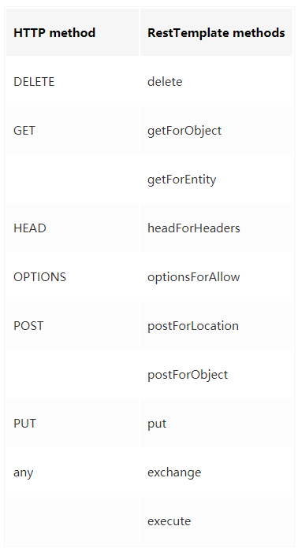

# Springboot — 用更优雅的方式发HTTP请求(RestTemplate详解)


RestTemplate是Spring提供的用于访问Rest服务的客户端，RestTemplate提供了多种便捷访问远程Http服务的方法,能够大大提高客户端的编写效率。(Netflix 已经开源了一个更好地 HTTP Client 工具 - Feign)


本教程将带领大家实现Spring生态内RestTemplate的Get请求和Post请求还有exchange指定请求类型的实践和RestTemplate核心方法源码的分析，看完你就会用优雅的方式来发HTTP请求。

### 1.简述RestTemplate

> 是Spring用于同步client端的核心类，简化了与http服务的通信，并满足RestFul原则，程序代码可以给它提供URL，并提取结果。默认情况下，RestTemplate默认依赖jdk的HTTP连接工具。当然你也可以 通过setRequestFactory属性切换到不同的HTTP源，比如Apache HttpComponents、Netty和OkHttp。

RestTemplate能大幅简化了提交表单数据的难度，并且附带了自动转换JSON数据的功能，但只有理解了HttpEntity的组成结构（header与body），且理解了与uriVariables之间的差异，才能真正掌握其用法。这一点在Post请求更加突出，下面会介绍到。

该类的入口主要是根据HTTP的六个方法制定：



此外，exchange和excute可以通用上述方法。

在内部，RestTemplate默认使用HttpMessageConverter实例将HTTP消息转换成POJO或者从POJO转换成HTTP消息。默认情况下会注册主mime类型的转换器，但也可以通过setMessageConverters注册其他的转换器。

> 其实这点在使用的时候是察觉不到的，很多方法有一个responseType 参数，它让你传入一个响应体所映射成的对象，然后底层用HttpMessageConverter将其做映射

# 一、概述

本文主要介绍 Spring Web 模块中的 RestTemplate 组件的原理、优缺点、以及如何扩展以满足各种需求。

在介绍 RestTemplate 之前，我们先来谈谈 HTTP Client，谈谈选择一个优秀的 HTTP Client 实现的的重要性，以及一个优秀的 HTTP Client 应该具备哪些特性。

在 Java 社区中，HTTP Client 主要有 JDK 的 HttpURLConnection、Apache Commons HttpClient（或被称为 Apache HttpClient 3.x）、Apache HttpComponents Client（或被称为 Apache HttpClient 4.x）、Square 公司开源的 OkHttp。

除了这几个纯粹的 HTTP Client 类库以外，还有 Spring 的 RestTemplate、Square 公司的 Retrofit、Netflix 公司的 Feign，以及像 Apache CXF 中的 client 组件。这些框架和类库主要是针对 Web Service 场景，尤其是 RESTful Web Service。它们往往是基于前面提到的 HTTP Client 实现，并在其基础上提供了消息转换、参数映射等对于 Web Service 来说十分必要的功能。

（当然，像 Netty、Mina 这样的网络 IO 框架，实现 HTTP 自然也不再话下，但这些框架通常过于底层，不会被直接使用）

## 选择一个优秀的 HTTP Client 的重要性

虽然现在服务间的调用越来越多地使用了 RPC 和消息队列，但是 HTTP 依然有适合它的场景。

RPC 的优势在于高效的网络传输模型（常使用 NIO 来实现），以及针对服务调用场景专门设计协议和高效的序列化技术。而 HTTP 的优势在于它的成熟稳定、使用实现简单、被广泛支持、兼容性良好、防火墙友好、消息的可读性高。所以在开放 API、跨平台的服务间调用、对性能要求不苛刻的场景中有着广泛的使用。

正式因为 HTTP 存在着很广泛的应用场景，所以选择一个优秀的 HTTP Client 便是十分重要的。

## 优秀的 HTTP Client 需要具备的特性

- 连接池
- 超时时间设置（连接超时、读取超时等）
- 是否支持异步
- 请求和响应的编解码
- 可扩展性

### 连接池

因为目前 HTTP 1.1 不支持多路复用，只有 HTTP Pipeline 这用半复用的模型支持。所以，在需要频繁发送消息的场景中，连接池使必须支持的，以减少频繁建立连接所带来的不必要的性能损耗。

### 超时时间设置（连接超时、读取超时等）

当对端出现问题的时候，长时间的，甚至是无限的超时等待是绝对不能接受的。所以必须必须能够设置超时时间。

### 是否支持异步

HTTP 相关技术（服务器端和客户端）通常被人认为是性能低下的一个重要原因在于，在很长一段时间里，HTTP 的相关实现缺乏对异步的支持。这不仅指非阻塞 IO，也包括异步的编程模型。缺乏异步编程模型的后果就是，即便 HTTP 协议栈是基于非阻塞 IO 实现的，调用客户端的或者在服务端处理消息的线程有大量时间被浪费在了等待 IO 上面。所以，异步是非常重要的特性。

### 请求和响应的编解码

通常，开发人员希望面向对象使用各种服务（这里面自然也包括基于 HTTP 协议的服务），而不是直接面对原始的消息和响应开发。所以，透明地将 HTTP 请求和响应进行编解码是十分有必要，因为这可以很大程度地降低开发人员的工作量。

### 可扩展性

不论一个框架设计的多好，总有一些特殊场景是它们无法原生支持的。这时可扩展性的好坏便体现出来了。

## 答案

基于上述几点的考虑，RestTemplate 是相对好的选择。原因在于 RestTemplate 本身基于成熟的 HTTP Client 实现（Apache HttpClient、OkHttp 等），并可以灵活地在这些实现中切换，而且具有良好的扩展性。最重要的是提供了前面几个 HTTP Client 不具备的消息编解码能力。

这里要提一句为什么没有自己封装 HTTP Client 的原因。这个原因在于想要基于一种 HTTP Client 去提供消息编解码能力和一定的扩展能力并不难，但是如果要设计出一个通用的，对底层实现透明的，具有优秀如 Spring 的扩展性设计的框架并不是一件容易事。这里的不易并不在于技术有多高深，而是在于优秀的扩展性设计往往源自从众多优秀程序员、社区和软件公司得到的丰富的一线实践经验，再由像 Spring 转换为最终设计。这样的产品不是一朝一夕就能得到的。在我们觉得自己打造自己的工具之前，我们可以先深入了解现有的优秀功能都能做到什么。

# 二、使用 RestTemplate 的缺点

欲扬先抑，我们先来看加入使用 RestTemplate，可能会遇到哪些“坑”。

## 依赖 Spring 其它模块

虽然 spring-web 模块对其它 Spring 模块并没有显式的依赖（Maven dependency 的 scope 为 compile），但是对于一些功能，比如异步版本的 RestTemplate，要求必须有 4.1 以上版本的 spring-core 模块。

所以，要想 RestTemplate 完全发挥其功能，最好能有相近版本的其它的 Spring 模块相配合（spring-core、spring-context、spring-beans、spring-aop）

## 默认情况下 RestTemplate 存在的不足

Spring Web 模块中的 RestTemplate 是一个很不错的面向 RESTful Web 服务的客户端。它提供了很多简化对 RESTful Web 服务调用的功能，例如 Path Parameter 的格式化功能（/hotels/{hotel_id}/books/{book_id}，这里的 hotel_id 和 book_id 就是 Path Paramter）、JSON 或 XML 等格式的数据与实体类之间的透明转换等。

所谓默认情况指的是不去扩展 RestTemplate 所提供的类或接口，而是完全依赖其本身提供的代码。在这种情况下，RestTemplate 还是有一些不便的地方。例如，它的 Path Parameter 格式化功能，对于普通 HTTP 服务的调用来说，反而成为了一个缺点，因为普通的 HTTP 服务的 GET 方法常使用 Query Parameter，而不是 Path Parameter。Query Paramter 的形式是 `an_http_url?name1=value1&name2=value2`。例如 `getOrder.action?order_code=xxx`。如果使用 RestTemplate，作为参数传递给 RestTemplate 的 URL 就必须是 `getOrder.action?order_code={order_code}`。如果是固定的参数还好，如果一个 HTTP 服务的 Query Parameter 是可变的，那就很不方便了。

# 三、扩展 RestTemplate

注意，下面涉及到的代码都是基于 spring-web 4.2.6.RELEASE 版本

## 设置 Query Params

上面提到，RestTemplate 的 `getForEntity`、`getForObject`、`postForEntity` 等方法中的 Map 参数是 `uriVariables`，即我们常说的 Path Param，而非 Query Param（这两个参数的定义可以参照 JAX-RS 中 @PathParam 和 @QueryParam 的定义）。

> Path Param 是 URL 的一部分，RESTful 的 Web Service 会按照其定义的 URL Template 从 URL 中解析出其对应的值

RestTemplate 的这种机制面对 RESTful 的 Web Service 无疑是方便的，但很多情况下我们还是希望 RestTemplate 能够在开发人员不用编写额外代码的情况下将 Map 类型的参数当做 Query Param 发送给对端的服务。

幸好来自 Spring 大家庭的 RestTemplate 也具有良好的可扩展性，其具有一个名为 `UriTemplateHandler` 扩展点。因为不论是 Path Param 还是 Query Param，它们都是 URI 的一部分，所以只需实现自定义的 URI 生成机制即可解决这个问题。

通过扩展 `DefaultUriTemplateHandler`，我们可以将 `Map<String, ?> uriVariables` 也作为 Query Param。具体实现如下：

```
public class QueryParamsUrlTemplateHandler extends DefaultUriTemplateHandler {
    @Override
    public URI expand(String uriTemplate, Map<String, ?> uriVariables) {
        UriComponentsBuilder uriComponentsBuilder = UriComponentsBuilder.fromHttpUrl(uriTemplate);
        for (Map.Entry<String, ?> varEntry : uriVariables.entrySet()) {
            uriComponentsBuilder.queryParam(varEntry.getKey(), varEntry.getValue());
        }
        uriTemplate = uriComponentsBuilder.build().toUriString();
        return super.expand(uriTemplate, uriVariables);
    }
}
```

上面的实现基于 `DefaultUriTemplateHandler`，所以保有了原来设置 Path Param 的功能。

## 设置自定义的 HTTP Header

实现这个需求有多种方法，比如通过拦截器。这里使用另一个方法，通过一个自定义的 `ClientHttpRequestFactory`

```
public class CustomHeadersClientHttpRequestFactoryWrapper extends AbstractClientHttpRequestFactoryWrapper {
    private HttpHeaders customHeaders = new HttpHeaders();

    /**
     * Create a {@code AbstractClientHttpRequestFactoryWrapper} wrapping the given request factory.
     *
     * @param requestFactory the request factory to be wrapped
     */
    protected CustomHeadersClientHttpRequestFactoryWrapper(ClientHttpRequestFactory requestFactory) {
        super(requestFactory);
    }

    @Override
    protected ClientHttpRequest createRequest(URI uri, HttpMethod httpMethod,
            ClientHttpRequestFactory requestFactory) throws IOException {
        ClientHttpRequest request = requestFactory.createRequest(uri, httpMethod);

        for (Map.Entry<String, List<String>> headerEntry : customHeaders.entrySet()) {
            request.getHeaders().put(headerEntry.getKey(), headerEntry.getValue());
        }

        return request;
    }

    public void addHeader(String header, String... values) {
        customHeaders.put(header, Arrays.asList(values));
    }
}
```

## 简化配置

RestTemplate 提供了良好的扩展性，但是有些设置是使用 ``

# 四、RestTemplate 原理解析

## HTTP Client 实现

RestTemplate 本身并没有做 HTTP 底层的实现，而是利用了现有的技术，如 JDK 或 Apache HttpClient 等。

RestTemplate 需要使用一个实现了 `ClientHttpRequestFactory` 接口的类为其提供 `ClientHttpRequest` 实现（另外还有 `AsyncClientHttpRequestFactory` 对应于异步 HTTP 实现，这里暂且不表）。而 `ClientHttpRequest` 则实现封装了组装、发送 HTTP 消息，以及解析响应的的底层细节。

目前（4.2.6.RELEASE）的 RestTemplate 主要有四种 `ClientHttpRequestFactory` 的实现，它们分别是：

1. 基于 JDK `HttpURLConnection` 的 `SimpleClientHttpRequestFactory`
2. 基于 Apache HttpComponents Client 的 `HttpComponentsClientHttpRequestFactory`
3. 基于 OkHttp 2（OkHttp 最新版本为 3，有较大改动，包名有变动，不和老版本兼容）的 `OkHttpClientHttpRequestFactory`
4. 基于 Netty4 的 `Netty4ClientHttpRequestFactory`

另外，还有用于提供拦截器功能的 `InterceptingClientHttpRequestFactory`。

## 写消息

写消息指的是 requestBody 转换为某一种格式，如 JSON、XML 的数据的过程。

spring-web 模块提供了一个 `HttpMessageConverter` 接口，用来读写 HTTP 消息。这个接口不仅被 RestTemplate 使用，也被 Spring MVC 所使用。

spring-web 模块提供了基于 Jackson、GSON 等类库的 `HttpMessageConverter`，用于进行 JSON 或 XML 格式数据的转换。

RestTemplate 在发送消息时，会根据消息的 ContentType 或者 RequestBody 对象本身的一些属性判断究竟是使用哪个 `HttpMessageConverter` 写消息。

具体来说，如果 RequestBody 是一个 `HttpEntity` 的话，会从中读取 ContentType 属性。同时，RequestBody 对象本身也会觉得一个 `HttpMessageConverter` 是否会处理这个对象。例如，`ProtobufHttpMessageConverter` 会要求 RequestBody 对象必须实现 `com.google.protobuf.Message` 接口。

## 读消息

读消息指的是读取 HTTP Response 中的数据，转换为用户指定的格式（通过 Class<T> responseType 参数指定）。类似于写消息的处理，读消息的处理也是通过 ContentType 和 responseType 来选择的相应 `HttpMessageConverter` 来进行的。

## 错误处理

RestTemplate 提供了一个 `ResponseErrorHandler` 的接口，用来处理错误的 Response。可以通过设置自定义的 `ResponseErrorHandler` 来实现扩展。

# 后记

根据我上面表达的思想，一个统一、规范和简化 RestTemplate 使用的工具已经产生，不过暂时由于其代码是公司项目的一部分，所以暂时不便公开。而且我希望是在这个工具经过了更多的实践考验之后再贡献出来会更好。

目前的一个完整使用案例如下：

```
@Configuration
public class SpringConfigurationDemo {

    @Bean
    public RestTemplate myRestTemplate() {
        return RestTemplateBuilder.create()
                .withClientKey("myRestTemplate")
                .implementation(HttpClientImplementation.OK_HTTP)
                .clearMessageConverters()
                .setMessageConverter(new MappingJackson2HttpMessageConverter(), MediaType.TEXT_PLAIN)
                .enableAutoQueryParams()
                .connectTimeout(100)
                .readTimeout(200)
                .header(HttpHeaders.USER_AGENT, "MyAgent")
                .build();
    }
}
```

虽然 RestTemplate 是一个很不错的 HTTP Client，但 Netflix 已经开源了一个更好地 HTTP Client 工具 - Feign。它是一个声明式的 HTTP Client，在易用性、可读性等方面大幅领先于现有的工具。